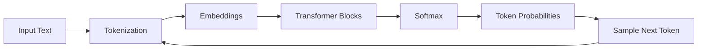
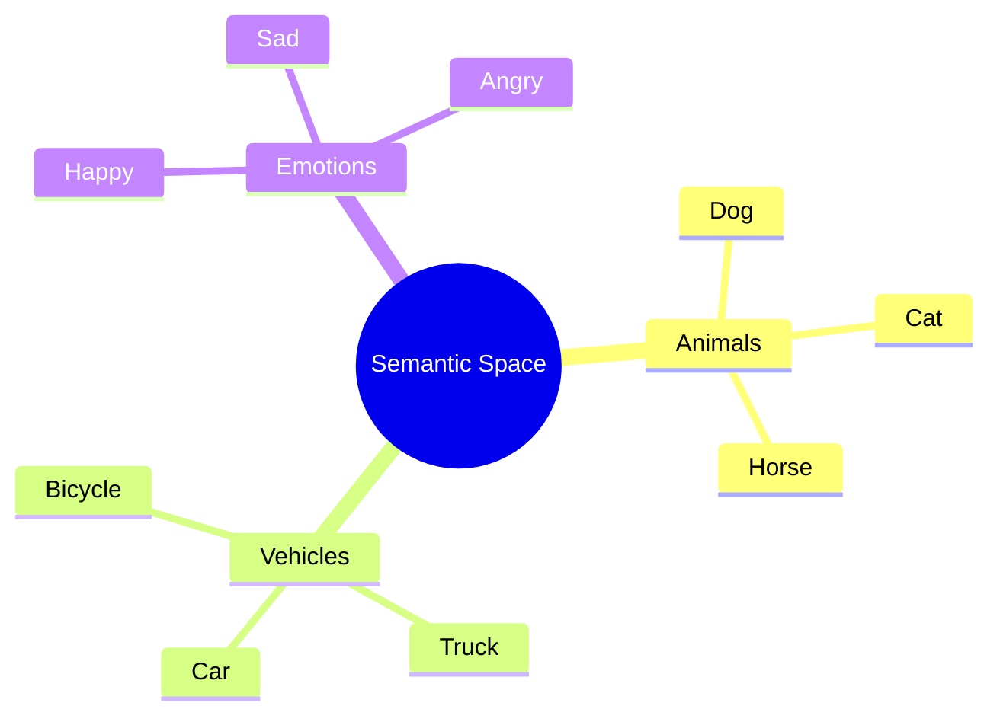
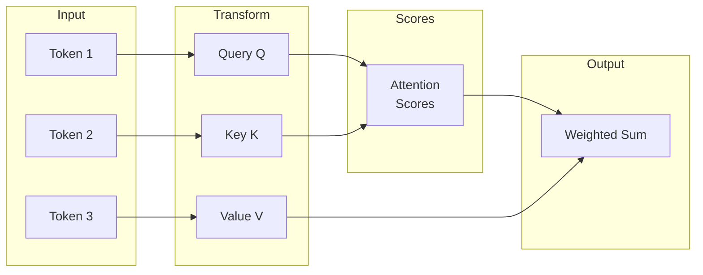
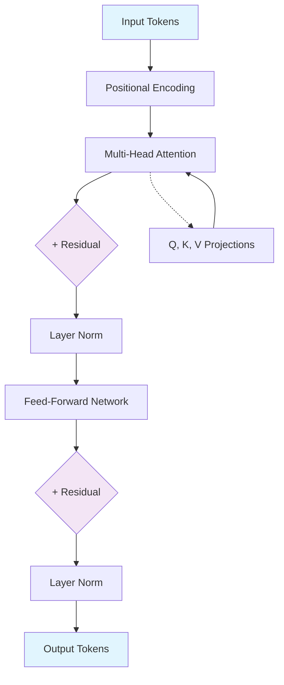
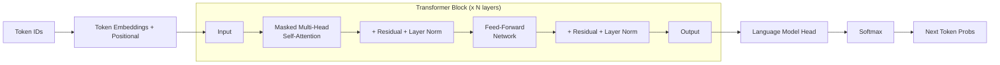
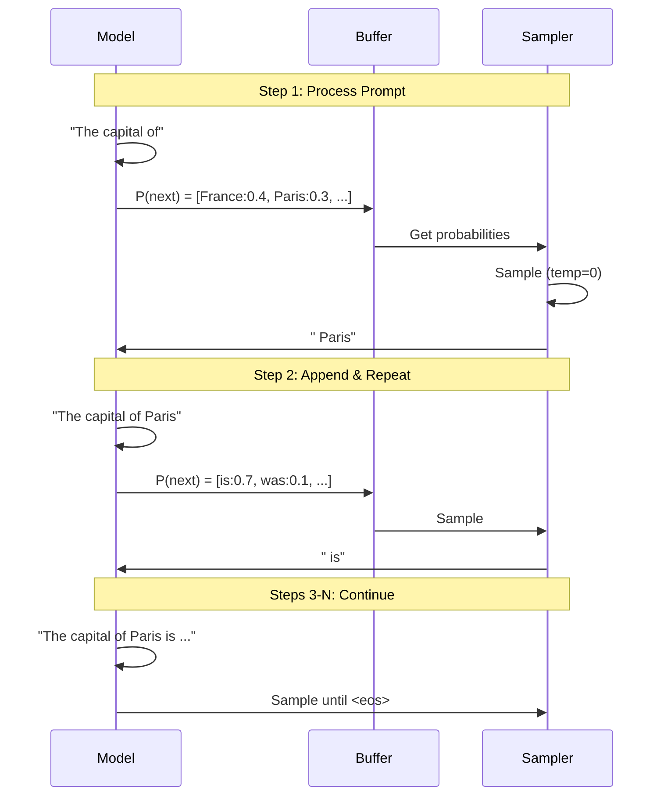
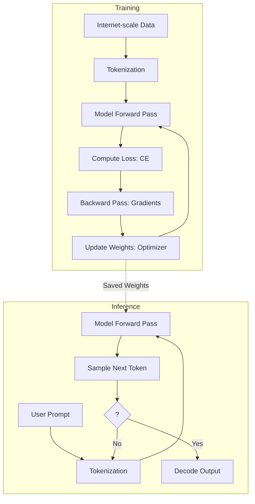
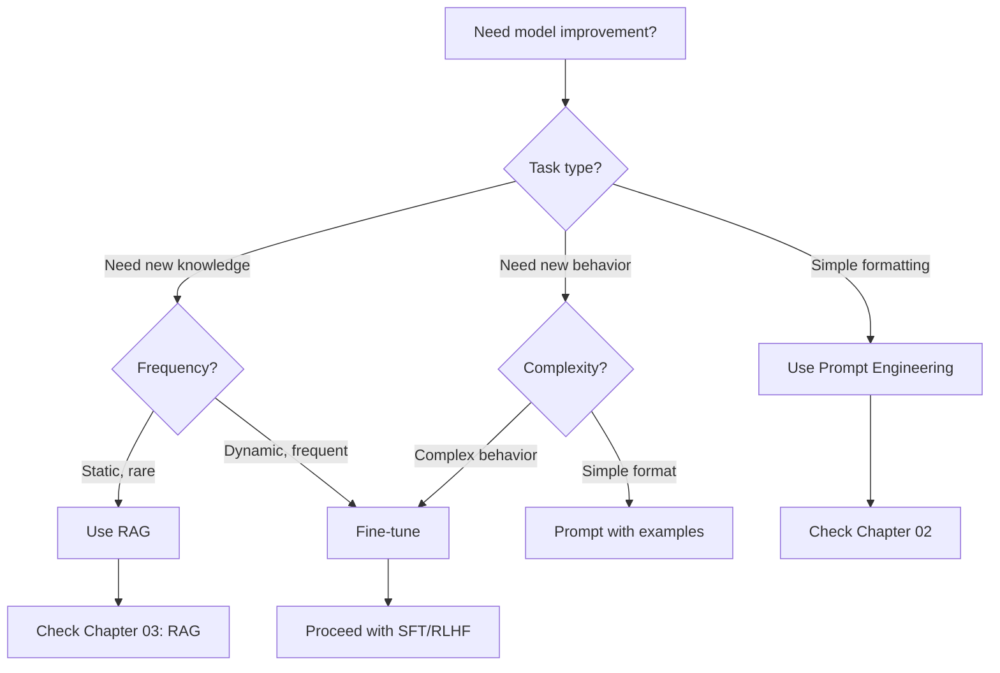
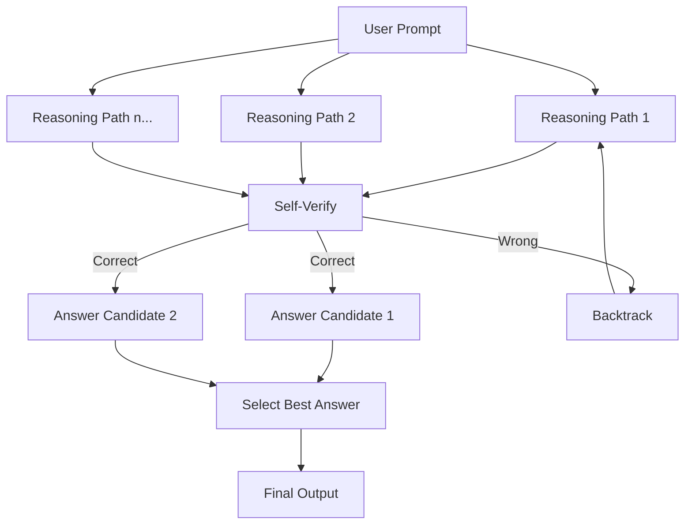
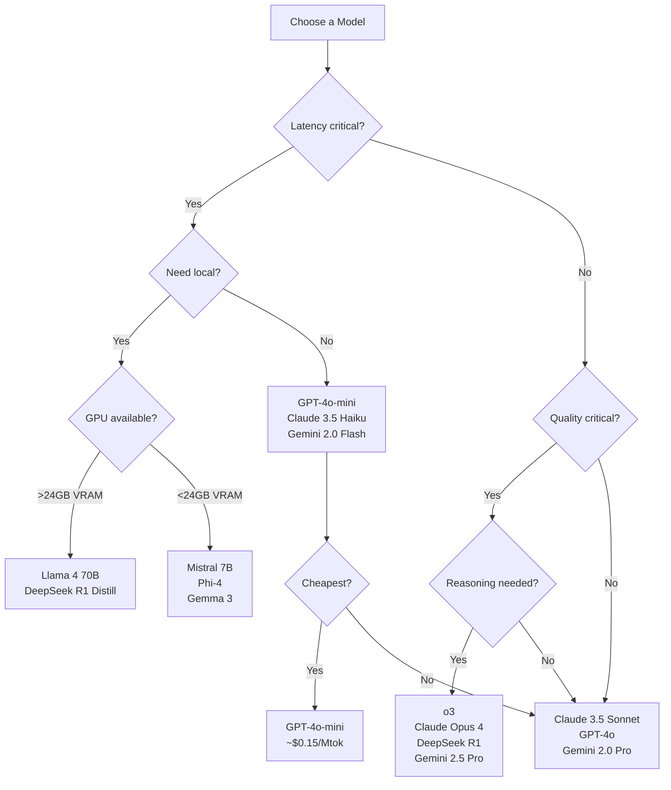

# Chapter 01: LLM Foundations

> **Learning Philosophy**: Problem → Why → Mental Model → Core Idea → Visual → Example → Wrong Example → Correct Example → Advanced → Common Mistakes → Best Practices

---

## 1. What Are LLMs?

### The Problem
Before LLMs, NLP systems were brittle. Sentiment classifiers needed thousands of labeled examples. Translation systems required complex rule pipelines. Every task demanded custom architecture engineering.

### Why This Matters
If you don't understand what LLMs actually *are*, you'll treat them as magic — and magic is unpredictable. You'll blame the model when it's your mental model that's wrong.

### Mental Model
**LLMs are next-token prediction engines.** That's it. They do not think. They do not understand. They do not have beliefs or intentions. They compute a probability distribution over possible next tokens and sample from it.

A helpful analogy: **LLMs are like an infinite text completer.** You've seen your phone suggest the next word as you type. Now imagine that, scaled to 100 billion parameters, trained on most of the public internet, with a context window the size of a novel.

### Core Idea
An LLM takes a sequence of tokens and produces a probability distribution for the next token:

```
P(next_token | context)
```

Given "The capital of France is", the model assigns high probability to "Paris", lower to "London", near-zero to "pineapple."

### Visual



### Example
```
Input:  "The Eiffel Tower is in"
Output: "Paris" (probability 0.89)
```

### Wrong Example
❌ *Asking "What does the model think about this?" implies the model has beliefs, consciousness, or internal reasoning.*

The model does not *think*. It computes. A calculator doesn't "think" 2+2=4. An LLM doesn't "think" Paris is the capital of France. Both are statistical computations.

### Correct Example
✅ *"What token does the model predict as most likely given this context?"*

### Common Mistakes
- Anthropomorphizing the model (it doesn't "know" or "believe")
- Assuming the model is truthful (it's optimized for plausible text, not truth)
- Confusing fluent output with understanding

### Best Practices
- Always treat the model as a statistical text generator
- Validate outputs against ground truth
- Use temperature and sampling to control creativity vs. determinism

---

## 2. Tokenization

### The Problem
Neural networks operate on numbers, not characters or words. We need a bidirectional mapping between text and integers that is efficient, handles any language, and captures subword patterns.

### Why This Matters
Tokenization determines the model's vocabulary, context length limits (in tokens, not words), cost (APIs charge by token), and even biases (word boundaries matter).

### Mental Model
**Tokens are like DNA codons.** Just as DNA is read in triplets (codons) that map to amino acids, text is read in subword units (tokens) that map to integers. A single word may be 1 token, 3 tokens, or split across multiple tokens in ways that feel unintuitive.

### Core Idea
**Byte Pair Encoding (BPE)** builds a vocabulary by iteratively merging the most frequent byte pair in the corpus. Start with individual bytes/characters, then repeatedly replace the most common pair with a new token.

For example, if "th" appears 1000 times, "e" appears 800 times, and "the" appears 700 times — "th" + "e" → "the" becomes a token.

### Visual: Tokenization Flow

```mermaid
flowchart TD
    A[Raw Text] --> B[Normalize: Unicode, lowercase?]
    B --> C[Pre-tokenize: split on whitespace/punctuation]
    C --> D[Map each byte to initial token ID]
    D --> E[Apply BPE merges: replace frequent pairs]
    E --> F[Output: sequence of token IDs]
    F --> G[Special tokens: <|endoftext|>, <|im_start|>, etc.]

    style A fill:#e1f5fe
    style F fill:#fff9c4
    style G fill:#ffccbc
```

### Example

Using `tiktoken` to see how "I love AI" tokenizes:

```
Text:  "I love AI"
GPT-4: [40, 1802, 13834]  → "I" + " love" + " AI"
      "I"        → 1 token
      " love"    → 1 token (space+l)
      " AI"      → 1 token (space+A+I)
```

Tokens often include preceding spaces. This is why "love" and " love" can be different tokens.

### Wrong Example
❌ *Assuming every word is exactly one token.*

```
"unconditionally" → 5 tokens: ["un", "cond", "ition", "ally", "ly"]
```

### Correct Example
✅ *Using `tiktoken` or the model's official tokenizer to verify token counts.*

### Advanced: Special Tokens
Models reserve special tokens for structural purposes:
- `<|endoftext|>` — Marks end of sequence (GPT-2/3)
- `<|im_start|>`, `<|im_end|>` — Chat message boundaries (GPT-4)
- `<s>`, `</s>` — Sentence/sequence boundaries
- `[CLS]`, `[SEP]` — Classification and separator tokens (BERT)
- `<pad>` — Padding token for batching

### Common Mistakes
- Counting tokens by splitting on spaces (use the tokenizer!)
- Not accounting for special tokens in context window budgeting
- Assuming tokens are the same across different models

### Best Practices
- Always use the model's official tokenizer
- Add ~10-20% overhead when estimating tokens from characters (1 token ≈ 4 chars in English)
- Use `tiktoken` for OpenAI models, `AutoTokenizer` from HuggingFace for open models

---

## 3. Embeddings

### The Problem
How do we represent tokens as numbers that capture *meaning*? One-hot vectors are sparse and don't encode relationships. "King" and "Queen" should be closer to each other than "King" and "pancake."

### Why This Matters
Embeddings are the foundation of how LLMs understand relationships between words. They enable arithmetic (vector("King") - vector("Man") + vector("Woman") ≈ vector("Queen")), semantic search, and clustering.

### Mental Model
**Embeddings are like coordinates on a map of meaning.** Just as a GPS coordinate (lat, lon) locates a point in physical space, an embedding vector locates a concept in semantic space. Nearby points have similar meanings. Directions between vectors correspond to semantic relationships.

### Core Idea
An embedding is a dense vector in $\mathbb{R}^d$ (typically $d=768$ for base models, $d=1536$ for `text-embedding-3-small`) where each dimension captures some latent feature of meaning — not individually interpretable, but collectively meaningful.

### Visual: Embeddings in 2D (PCA-reduced)



### Example

```python
# Conceptual: cosine similarity between embeddings
similarity("king", "queen")   # 0.85
similarity("king", "man")     # 0.72
similarity("king", "pancake") # 0.12
```

The classic embedding algebra:
- `"king" - "man" + "woman" ≈ "queen"`
- `"Paris" - "France" + "Italy" ≈ "Rome"`

### Wrong Example
❌ *Using raw dot products without normalization for similarity.*

Embedding vectors may have different magnitudes. Always use cosine similarity (normalized dot product) or normalize vectors first.

### Correct Example
✅ *Normalize embeddings and use cosine similarity:*

```python
import numpy as np
cos_sim = np.dot(a, b) / (np.linalg.norm(a) * np.linalg.norm(b))
```

### Advanced: Matryoshka Embeddings
OpenAI's `text-embedding-3-small` supports **Matryoshka Representation Learning** — the embedding vector is structured so that prefixes of the vector are still useful. You can truncate to 256 dimensions from 1536 and retain ~95% of performance. This enables massive speed/memory tradeoffs for retrieval.

### Common Mistakes
- Using embeddings from the last token vs. mean pooling (depends on model)
- Not normalizing before indexing for vector search
- Assuming pre-trained embeddings work well for domain-specific tasks without fine-tuning

### Best Practices
- Normalize all embeddings before computing similarity
- For retrieval, use vector databases (Pinecone, Weaviate, pgvector)
- Consider dimension reduction for large-scale systems
- Test multiple embedding models on your specific data

---

## 4. Attention

### The Problem
Recurrent neural networks (RNNs) process tokens one at a time, carrying a hidden state forward. They struggle with long-range dependencies — by the time you reach word 100, information from word 1 is mostly forgotten. They also can't parallelize.

### Why This Matters
Attention is **the** breakthrough that made modern LLMs possible. It's not just a component of Transformers — it's the core innovation. Understanding attention is understanding how LLMs "look at" context.

### Mental Model
**Attention is like a search engine.** For each token, the model formulates a Query and searches over all previous tokens (Keys). It retriechttps://github.com/anomalyco/opencode/issueses the Values weighted by relevance (attention scores). The output is a blend of information from all tokens, weighted by importance.

### Core Idea

**Scaled Dot-Product Attention** computes a weighted sum of Values, where weights are determined by the compatibility between a Query and Keys:

```
Attention(Q, K, V) = softmax(QK^T / √d_k) V
```

- **Q (Query)**: What am I looking for?
- **K (Key)**: What do I contain?
- **V (Value)**: What information do I pass along?

### Visual: Attention Mechanism



### Example

For the sentence "The cat sat on the mat because it was tired":

When processing "it," the model needs to figure out what "it" refers to. The Query from "it" will have high attention scores with "cat" (the subject). The Value from "cat" gets weighted heavily in the output for "it."

### Wrong Example
❌ *Treating attention as interpretable importance.*

Attention weights tell you what the model *looked at*, not what it *used*. High attention doesn't mean high importance. Models can learn to attend to tokens they don't actually use for prediction.

### Correct Example
✅ *Use attention weights as one signal among many, not as ground-truth explanations.*

### Advanced: Multi-Head Attention

Instead of one attention function, Transformer uses **multiple heads** in parallel:

```
MultiHead(Q, K, V) = Concat(head_1, ..., head_h) W_O
head_i = Attention(QW_Q_i, KW_K_i, VW_V_i)
```

Each head learns different patterns:
- Some heads track syntax (subject-verb agreement)
- Some heads track positional relationships
- Some heads track semantic relationships

### Common Mistakes
- Confusing causal (masked) attention with bidirectional attention
- Assuming attention captures all relevant context (residual connections matter too)
- Overlooking the scaling factor $1/\sqrt{d_k}$ (it prevents softmax saturation)

### Best Practices
- Use causal masking for decoder models (prevent looking at future tokens)
- For interpretability, combine attention analysis with feature attribution methods
- Multi-head attention is where parallelization shines — batch the heads

---

## 5. Transformers

### The Problem
RNNs are sequential (slow), LSTMs help but still suffer from vanishing gradients, and CNNs struggle with long-range dependencies. We need an architecture that: (1) processes all tokens in parallel, (2) captures arbitrary-length dependencies, (3) scales to billions of parameters.

### Why This Matters
The Transformer architecture (Vaswani et al., 2017) is the default for every major LLM. Variations exist (GPT is decoder-only, BERT is encoder-only, T5 is encoder-decoder), but the core building blocks are universal.

### Mental Model
**Think of a Transformer as a factory assembly line.** Each token's representation moves through a series of stations: attention mixes information between tokens, feed-forward processes each token independently, and residual connections act as conveyor belts ensuring information flows smoothly even if a station fails.

### Core Idea

The Transformer block is a **sandwich** of two sub-layers:

1. **Multi-Head Self-Attention** — Tokens communicate with each other
2. **Feed-Forward Network** — Each token processes its aggregated information

With:
- **Residual connections** (skip connections): add input to output of each sub-layer
- **Layer normalization**: stabilize training by normalizing activations
- **Positional encodings**: inject position information since attention is permutation-invariant

### Visual: Transformer Block Architecture



### Decoder-Only Architecture (GPT)



### Example

GPT-3 has 96 transformer layers, each with:
- 96 attention heads
- Hidden dimension of 12,288
- FFN intermediate dimension of 49,152

That's 175 billion parameters moving through 96 assembly-line stations per token.

### Wrong Example
❌ *Thinking more layers always means better performance.*

Deeper models are harder to optimize. Residual connections and layer norm are essential — without them, a 100-layer Transformer would fail to train. Deeper ≠ better without the right training setup.

### Correct Example
✅ *Match architecture depth to training data scale. Chinchilla scaling laws suggest optimal model size depends on data size.*

### Advanced: Key Architectural Innovations
- **GPT-3**: 175B params, 96 layers, 12288 hidden dim
- **LLaMA**: Uses SwiGLU activation, RoPE positional encoding, no bias terms
- **PaLM**: Uses parallel attention+FFN (slightly faster)
- **RWKV**: Linear attention variant (not a full Transformer, but competitive)

### Common Mistakes
- Confusing "Transformer" (the architecture) with "transformer" (the component of a power grid)
- Assuming all Transformers are decoder-only (BERT is encoder-only, T5 is encoder-decoder)
- Overlooking the role of layer norm placement (pre-norm vs post-norm)

### Best Practices
- Use pre-norm (LayerNorm before sub-layer) for training stability in deep models
- Flash Attention is the standard implementation (much faster, memory-efficient)
- For inference, fuse attention and FFN computations where possible

---

## 6. Inference

### The Problem
A trained model is just a set of weights. How do we actually *use* it to generate text? What controls whether the output is creative or deterministic? How do we make it fast enough for real-time applications?

### Why This Matters
Inference is where the rubber meets the road. Understanding inference means you can control output quality, optimize latency, and manage costs.

### Mental Model
**Inference is like improv comedy.** The model starts with a prompt (the setup) and generates one word at a time, each word influenced by everything said before. A "temperature" dial controls whether it plays it safe (always the obvious next word) or gets creative (sometimes surprising choices).

### Core Idea
**Autoregressive decoding** generates tokens one at a time, each conditioned on all previous tokens:

```
t_1 = argmax P(t | prompt)
t_2 = argmax P(t | prompt, t_1)
t_3 = argmax P(t | prompt, t_1, t_2)
...
```

Stop when generating the `<eos>` (end-of-sequence) token or reaching the maximum length.

### Visual: Autoregressive Generation



### Sampling Parameters

**Temperature** controls the sharpness of the probability distribution:

```
T=0:   argmax (deterministic, always highest probability)
T=0.7: moderate randomness
T=1.0: sampling according to learned distribution
T>1.0: more uniform (almost random)
```

**Top-P (nucleus sampling):** Only sample from the smallest set of tokens whose cumulative probability exceeds P. If top tokens have [0.5, 0.3, 0.15, 0.05] and P=0.9, we sample only from the first three.

**Top-K sampling:** Only sample from the K highest-probability tokens.

### Example

```
Prompt: "Once upon a"
Temperature 0.0: "time" (most likely)
Temperature 0.7: "time" (75%) or "there" (20%) or "more" (5%)
Temperature 1.5: "banana" (unlikely, but possible!)
```

### Wrong Example
❌ *Using temperature=0 and expecting creative outputs.*

Temperature 0 is deterministic — you'll get the same output every time for the same prompt. If you want variation, you need temperature > 0.

### Correct Example
✅ *Use temperature=0 for factual tasks (summarization, extraction), temperature=0.7-0.9 for creative tasks (storytelling, brainstorming).*

### Advanced: KV Cache
In autoregressive generation, each step recomputes keys and values for the full sequence. The **KV cache** stores these from previous steps, avoiding redundant computation:

```
Step 1: Compute Q, K, V for all tokens → store K, V
Step 2: Compute Q for new token, reuse cached K, V
         → compute attention only for new Q × all K
```

This speeds up generation from O(n²) to O(n) per step (but total is still O(n²) overall).

### Common Mistakes
- Not using KV cache caching (slows inference by 10-100x)
- Setting max_tokens too low, truncating responses
- Using temperature > 2 (distribution becomes nearly uniform, gibberish output)
- Not handling stop sequences properly

### Best Practices
- Use temperature=0 for reproducible outputs, temperature=0.7-1.0 for creativity
- Combine temperature with top-p (they work well together)
- Set appropriate max_tokens based on expected output length
- Use streaming for better user experience
- [We'll cover inference optimization in Chapter 05: Deployment]

---

## 7. Training

### The Problem
We have an architecture (Transformer) and an objective (predict next token). How do we actually train a model with billions of parameters on trillions of tokens?

### Why This Matters
Training is where the model learns everything it "knows." The data, compute, and training recipe determine the model's capabilities more than the architecture does.

### Mental Model
**Training is like learning a language by reading the entire internet.** The model sees trillions of examples (every Reddit thread, Wikipedia article, GitHub repo, research paper). Each time it predicts the wrong next token, it adjusts its parameters slightly to be less wrong next time.

### Core Idea
**Pre-training** uses the next-token prediction objective:

```
Loss = -∑ log P(token_i | context_{<i})
```

This is **cross-entropy loss** on each token. The model sees the correct next token, computes how wrong its prediction was, and backpropagates the error through all parameters.

### Visual: Training vs Inference Pipeline



### Compute Requirements

| Model | Parameters | Training Tokens | GPU-Hours |
|-------|-----------|----------------|-----------|
| GPT-3 | 175B | 300B | ~3.14M GPU-hours |
| LLaMA 2 70B | 70B | 2T | ~1.7M GPU-hours |
| GPT-4 | ~1.8T* | ~13T* | Unknown |

\* Estimated, not officially disclosed

### Wrong Example
❌ *Training a 7B model for longer can match a 70B model.*

Scaling laws (Kaplan et al., 2020) show that model size, data size, and compute budget follow predictable power-law relationships. A small model trained on infinite data will plateau below a larger model's performance.

### Correct Example
✅ *Use Chinchilla scaling laws: for a given compute budget, the optimal model size and data size are roughly equal in terms of parameter-to-token ratio.*

### Loss Functions

Pre-training uses **cross-entropy loss**:
```
L = -1/N ∑ ∑ y_i,j log(p_i,j)
```

- **Perplexity** = exp(L): "How surprised is the model?"
  - Perplexity 1: perfect prediction
  - Perplexity 50: as uncertain as choosing among 50 equally likely tokens

### Common Mistakes
- Over-training (too many epochs on same data → memorization, not generalization)
- Under-training (not enough compute for model size)
- Ignoring data quality (more data ≠ better data)

### Best Practices
- Filter training data for quality, deduplication, and safety
- Use mixed-precision training (FP16/BF16) for memory efficiency
- Apply gradient checkpointing to trade compute for memory
- [Chapter 06: LLMOps covers distributed training strategies]

---

## 8. Fine-Tuning

### The Problem
Pre-trained models are generalists. They can complete sentences but don't follow instructions well, may not know your domain, and can't handle your specific format. A base GPT-3 (davinci) doesn't understand chat.

### Why This Matters
Fine-tuning bridges the gap between a raw language model and a useful assistant. It's how GPT-3 became ChatGPT, how Llama became Llama-Chat.

### Mental Model
**Pre-training is like medical school (general knowledge). Fine-tuning is like residency (specialization).** The model already knows medicine — now it learns how to talk to patients, write prescriptions, and follow hospital protocols.

### Core Idea

**Supervised Fine-Tuning (SFT):** Train on (instruction, response) pairs:

```
Input: "Explain what an LLM is"
Target: "An LLM is a type of neural network..."
Loss: Cross-entropy on the target tokens
```

**Instruction Tuning:** Fine-tune on thousands of diverse instructions to teach the model to follow directions.

**RLHF (Reinforcement Learning from Human Feedback):**
1. Train a reward model on human preferences
2. Fine-tune the LLM to maximize reward while staying close to the original (KL penalty)

**DPO (Direct Preference Optimization):** Skip the reward model — directly optimize preferences using a binary loss function.

### When to Fine-Tune vs. When to Prompt



### Example

```
Base model completion: "Explain quantum computing to a 5-year-old"
→ "Quantum computing is a type of computation that exploits quantum mechanical phenomena..."

Fine-tuned (instruct) model:
→ "Imagine you have a magic coin. While it's spinning, it's both heads AND tails at the same time! Quantum computers use this kind of 'being in two places at once' magic to solve really hard puzzles super fast."
```

### Wrong Example
❌ *Fine-tuning to add factual knowledge that changes frequently.*

Fine-tuning is expensive and can cause catastrophic forgetting. For facts, use RAG (Retrieval-Augmented Generation).

### Correct Example
✅ *Fine-tune for task format and style. Use RAG for specific factual knowledge. Use prompting for behavior adjustments.*

### Advanced: Parameter-Efficient Fine-Tuning (PEFT)

**LoRA (Low-Rank Adaptation):** Instead of updating all 7B parameters, train small rank-decomposition matrices inserted into attention layers. Reduces trainable parameters by 10,000x.

- Full fine-tune: update 7B params → 14GB gradients
- LoRA: update ~4M params → 8MB gradients

### Common Mistakes
- Fine-tuning on too few examples (< 100)
- Catastrophic forgetting (model loses general capabilities)
- Not evaluating on a held-out set
- Overfitting to response style (model becomes a template-filler)

### Best Practices
- Start with prompting → try few-shot → try RAG → fine-tune last
- Use LoRA/QLoRA for cost-effective fine-tuning
- Include diverse data from the original pre-training distribution to prevent forgetting
- Evaluate on multiple benchmarks, not just the target task

---

## 9. Reasoning Models

### The Problem
Standard LLMs generate the first plausible token. For math, logic, or multi-step problems, the first plausible answer is often wrong. The model doesn't "think before speaking."

### Why This Matters
Reasoning models represent a paradigm shift: they use test-time compute to explore solutions, verify steps, and backtrack. This is how models now achieve PhD-level performance on benchmarks.

### Mental Model
**Standard LLMs are like students who blurt out the first answer. Reasoning models are like students who show their work.** They generate internal monologue, try different approaches, catch their own mistakes, and only then produce the final answer.

### Core Idea

**Chain-of-Thought (CoT) Reasoning:** The model generates intermediate reasoning steps before the final answer:

```
Q: "If a shirt costs $30 after 20% off, what was the original price?"

Standard: "$24" ✗
CoT: "20% off means the shirt costs 80% of original.
      0.8 * original = $30
      original = $30 / 0.8 = $37.50"
      ✓
```

**Test-Time Compute:** Instead of spending all compute during training, reasoning models spend extra compute during inference to explore multiple reasoning paths, verify answers, and refine responses.

### Visual: Reasoning Process



### Examples: Reasoning Models

**OpenAI o1 / o3:**
- Uses internal "thinking" tokens before responding
- Trained with reinforcement learning to reason step-by-step
- o3 achieves PhD-level on GPQA Diamond benchmark
- Trade-off: slower but more accurate

**Claude Opus / Claude 3.5 Sonnet (extended thinking):**
- Uses "thinking" mode that shows reasoning process
- Particularly strong at math, physics, coding challenges

**DeepSeek R1:**
- Open-weight reasoning model
- Uses reinforcement learning to discover reasoning patterns
- Distills reasoning into smaller models (R1-Distill)

### Wrong Example
❌ *Using a reasoning model for simple lookup tasks.*

"If the sky is blue, what color is the sky?" — A standard model answers instantly. A reasoning model burns tokens and latency verifying that the sky is indeed blue. Use the right tool.

### Correct Example
✅ *Use reasoning models for: math, coding, logic puzzles, planning, multi-step analysis. Use standard models for: translation, summarization, simple Q&A, creative writing.*

### Advanced: Scaling Test-Time Compute

Recent research shows that test-time compute can be scaled similarly to training compute:

- **Small budget (1-2x):** Simple CoT, self-consistency
- **Medium budget (5-10x):** Tree-of-Thoughts, process supervision
- **Large budget (50-100x):** Monte Carlo Tree Search, iterative refinement

### Common Mistakes
- Using reasoning mode when not needed (wastes tokens and latency)
- Confusing "thinking" tokens with actual consciousness
- Expecting reasoning models to be correct 100% of the time (they still hallucinate)

### Best Practices
- Use reasoning models for problems requiring step-by-step verification
- Consider cost: reasoning models are 5-50x more expensive per token
- Monitor for overthinking (model goes in circles, never answers)
- [Chapter 07: Advanced Reasoning covers tree-of-thought, MCTS, and tool use]

---

## 10. Model Comparison

### The Problem
There are hundreds of models. GPT-4o, Claude 4, Gemini 2.5, Llama 4, DeepSeek V3, Qwen 3, Mistral Large, Phi-4 — which do you use for which task?

### Why This Matters
Choosing the wrong model costs you in performance, latency, and money. A $50/Mtok model is overkill for sentiment classification. A 7B local model won't produce professional-grade code.

### Decision Tree



### Comparative Table

| Model | Context | Cost (Input/Output) per 1M tokens | Strengths | Weaknesses |
|-------|---------|-----------------------------------|-----------|------------|
| **GPT-4o** | 128K | $2.50 / $10.00 | Best all-around, multimodal, fast | Expensive, no reasoning mode |
| **GPT-4o-mini** | 128K | $0.15 / $0.60 | Cheap, fast, good quality | Worse at complex reasoning |
| **o3** | 200K | $10.00 / $40.00 | Best reasoning, PhD-level | Slow, expensive |
| **Claude 3.5 Sonnet** | 200K | $3.00 / $15.00 | Excellent coding, long context | More verbose |
| **Claude 3.5 Haiku** | 200K | $0.25 / $1.25 | Fast, cheap, good quality | Limited creative writing |
| **Claude Opus 4** | 200K | $15.00 / $75.00 | Best for complex analysis | Very expensive |
| **Gemini 2.0 Flash** | 1M | $0.10 / $0.40 | Ultra-cheap, huge context | Sometimes less reliable |
| **Gemini 2.5 Pro** | 1M | $1.25 / $10.00 | Strong reasoning, huge context | Newer, less proven |
| **Llama 4 70B** | 128K | Free (local) | Open-weight, good performance | Needs 80GB+ VRAM |
| **Llama 4 8B** | 128K | Free (local) | Runs on consumer GPU | Lower quality |
| **DeepSeek V3** | 128K | $0.50 / $2.00 | Cheapest high-quality, open | Policy/regional concerns |
| **DeepSeek R1** | 128K | $0.55 / $2.19 | Best open reasoning model | Slow, verbose |
| **Mistral Large** | 128K | $2.00 / $6.00 | Strong multilingual, open | Smaller ecosystem |
| **Mistral 7B** | 32K | Free (local) | Best small model | Limited capabilities |
| **Phi-4** | 16K | Free (local) | Best for CPU inference | Small context window |
| **Qwen 3 72B** | 131K | $0.90 / $2.70 | Strong multilingual, open | Middle of pack quality |

### Selection Guidelines

| Use Case | Recommended Model | Runner-Up |
|----------|------------------|-----------|
| Chatbot / Customer Support | GPT-4o-mini | Claude 3.5 Haiku |
| Coding Assistant | Claude 3.5 Sonnet | GPT-4o |
| Complex Reasoning / Math | o3 / DeepSeek R1 | Gemini 2.5 Pro |
| Document Analysis (long) | Gemini 2.0 Flash | Claude 3.5 Sonnet |
| Local / Privacy-Sensitive | Llama 4 70B / Mistral 7B | Phi-4 |
| Cost-Sensitive Production | DeepSeek V3 | GPT-4o-mini |
| Multilingual | Mistral Large / Qwen 3 | GPT-4o |
| Research / Experimentation | DeepSeek R1 / Llama 4 | — |

### Common Mistakes
- Using the most expensive model for everything
- Not testing smaller/cheaper alternatives
- Ignoring vendor lock-in (API dependency)
- Assuming "bigger is always better" (overkill for simple tasks)

### Best Practices
- Start with a strong mid-tier model (GPT-4o-mini, Claude Haiku)
- Benchmark multiple models on your actual task
- Use routing: cheap model for simple queries, expensive model for complex ones
- Keep an escape hatch: design your system to swap models

---

## Summary

| Concept | Core Idea | Mental Model |
|---------|-----------|--------------|
| LLMs | Next-token prediction | Text completer |
| Tokenization | Subword encoding | DNA codons |
| Embeddings | Semantic vectors | Map coordinates |
| Attention | Weighted information mixing | Search engine |
| Transformers | Parallel attention + FFN | Factory assembly line |
| Inference | Autoregressive sampling | Improv comedy |
| Training | Cross-entropy minimization | Reading the internet |
| Fine-tuning | Task adaptation | Medical residency |
| Reasoning | Test-time compute | Showing your work |

---

## Next Steps

- **[Chapter 02: Prompt Engineering]** — Learn to communicate with LLMs effectively
- **[Chapter 03: RAG]** — Connect LLMs to external knowledge
- **[Chapter 07: Advanced Reasoning]** — Tree-of-thought, agentic reasoning

> "The best way to predict the next token is to understand the tokens before it." — Every LLM, secretly
