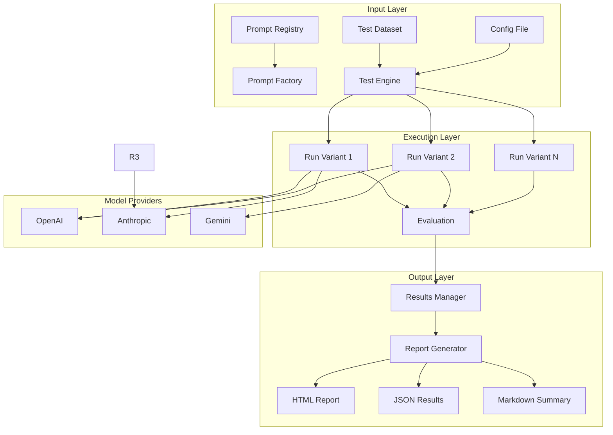

# Project: Building a Prompt Testing Framework

> Design and build a system to systematically test prompts across multiple models, parameters, and inputs. Generate comparison reports to identify the best-performing prompt variants.

**Difficulty:** Advanced
**Estimated time:** 8-16 hours
**Prerequisites:** Chapter 02 (this chapter), Python, familiarity with at least one LLM API

---

## Problem Statement

Prompt engineering is iterative. You write a prompt, test it, see issues, fix them, test again. But "testing" is usually manual — you eyeball a few outputs and decide if it's good enough. This doesn't scale.

Your task: Build a **Prompt Testing Framework** that:

1. Loads prompt templates from a structured registry
2. Runs each prompt variant against a test dataset
3. Evaluates outputs against expected results
4. Reports performance metrics (accuracy, latency, cost)
5. Generates a comparison report across all variants

---

## System Architecture



---

## Specification

### 1. Prompt Registry

Load prompts from a structured directory:

```
prompts/
├── experiment_01/
│   ├── variant_a.yaml
│   ├── variant_b.yaml
│   └── variant_c.yaml
└── experiment_02/
    ├── default.yaml
    └── optimized.yaml
```

Each YAML file defines:
```yaml
name: sentiment_classifier_v1
model: gpt-4o
parameters:
  temperature: 0
  max_tokens: 10
messages:
  - role: system
    content: "You are a sentiment classifier. Categories: positive, negative, neutral."
  - role: user
    content: "Text: {{input}}"
```

**Requirements:**
- Support `{{variable}}` syntax for dynamic content
- Support multiple message roles (system, user, assistant, tool)
- Support model-specific parameters (temperature, top_p, etc.)
- Optional: runtime support for multiple providers (OpenAI, Anthropic, Gemini)

### 2. Test Dataset

```yaml
# test_dataset.yaml
name: sentiment_50
description: 50 labeled sentiment examples
tests:
  - input: "Absolutely love this product!"
    expected: positive
    metadata:
      difficulty: easy
      length: short
  - input: "The customer service was unhelpful and rude."
    expected: negative
    metadata:
      difficulty: easy
      length: medium
  - input: "The package arrived on time."
    expected: neutral
    metadata:
      difficulty: medium
      length: short
  # ... 47 more test cases
```

**Requirements:**
- Minimum 20 test cases
- Cover diverse inputs: short/long, simple/complex, edge cases
- Include expected output per test
- Optional: metadata tags for filtering (difficulty, category, etc.)

### 3. Test Runner

```python
class TestRunner:
    def __init__(self, prompts, test_dataset, config):
        self.prompts = prompts  # list of loaded prompt templates
        self.tests = test_dataset
        self.config = config  # global config (model routing, retry, etc.)

    def run_all(self):
        results = []
        for prompt in self.prompts:
            for test in self.tests:
                result = self.run_single(prompt, test)
                results.append(result)
        return results

    def run_single(self, prompt, test):
        # Render prompt template with test input
        messages = self.render_prompt(prompt, test.input)

        # Execute
        start = time.time()
        response = self.call_model(prompt.model, messages, prompt.parameters)
        latency = time.time() - start

        return {
            "prompt_name": prompt.name,
            "test_input": test.input,
            "expected": test.expected,
            "actual": response,
            "latency_ms": latency * 1000,
            "tokens_used": self.count_tokens(response),
            "cost": self.calculate_cost(prompt.model, messages, response),
            "correct": self.matches_expected(response, test.expected)
        }
```

**Execution modes:**
- **Sequential** — Run tests one at a time (safe, slow)
- **Parallel** — Run multiple tests concurrently (fast, need rate limiting)
- **Dry run** — Render templates without calling APIs (validate syntax)

**Rate limiting:**
```python
class RateLimiter:
    def __init__(self, rpm=60):
        self.rpm = rpm
        self.tokens = rpm
        self.last_refill = time.time()

    def acquire(self):
        """Block until a token is available."""
        while self.tokens <= 0:
            self.refill()
            time.sleep(0.1)
        self.tokens -= 1

    def refill(self):
        elapsed = time.time() - self.last_refill
        self.tokens = min(self.rpm, self.tokens + elapsed * (self.rpm / 60))
        self.last_refill = time.time()
```

### 4. Evaluation

Support multiple evaluation strategies:

```python
class Evaluator:
    @staticmethod
    def exact_match(actual, expected):
        """Strict string match (case-insensitive, stripped)."""
        return actual.strip().lower() == expected.strip().lower()

    @staticmethod
    def contains(actual, expected):
        """Expected string appears in actual output."""
        return expected.lower() in actual.lower()

    @staticmethod
    def f1_score(actual, expected):
        """Token-level F1 score for classification."""
        actual_tokens = set(actual.lower().split())
        expected_tokens = set(expected.lower().split())
        intersection = actual_tokens & expected_tokens
        if not intersection:
            return 0.0
        precision = len(intersection) / len(actual_tokens)
        recall = len(intersection) / len(expected_tokens)
        return 2 * precision * recall / (precision + recall)

    @staticmethod
    def json_match(actual_json, expected_json):
        """Compare parsed JSON objects."""
        import json
        try:
            actual = json.loads(actual_json)
            expected = json.loads(expected_json)
            return actual == expected
        except:
            return False

    @staticmethod
    def semantic_similarity(actual, expected, model="text-embedding-3-small"):
        """Embedding cosine similarity (requires embedding model)."""
        # Implementation depends on embedding provider
        pass
```

### 5. Results & Reporting

Generate structured results:

```python
class ResultsManager:
    def __init__(self, results):
        self.results = results

    def summary(self):
        """Aggregate statistics per prompt variant."""
        summary = {}
        for result in self.results:
            name = result["prompt_name"]
            if name not in summary:
                summary[name] = {
                    "total": 0,
                    "correct": 0,
                    "latencies": [],
                    "tokens": [],
                    "costs": []
                }
            s = summary[name]
            s["total"] += 1
            s["correct"] += 1 if result["correct"] else 0
            s["latencies"].append(result["latency_ms"])
            s["tokens"].append(result["tokens_used"])
            s["costs"].append(result["cost"])

        for name, s in summary.items():
            s["accuracy"] = s["correct"] / s["total"]
            s["avg_latency"] = statistics.mean(s["latencies"])
            s["p95_latency"] = percentile(s["latencies"], 95)
            s["avg_tokens"] = statistics.mean(s["tokens"])
            s["total_cost"] = sum(s["costs"])
            s["cost_per_call"] = statistics.mean(s["costs"])

        return summary

    def confusion_matrix(self, prompt_name):
        """Generate confusion matrix for classification tasks."""
        prompt_results = [r for r in self.results if r["prompt_name"] == prompt_name]
        labels = set(r["expected"] for r in prompt_results) | set(r["actual"].strip().lower() for r in prompt_results)
        matrix = {e: {a: 0 for a in labels} for e in labels}
        for r in prompt_results:
            expected = r["expected"]
            actual = r["actual"].strip().lower()
            if actual in matrix[expected]:
                matrix[expected][actual] += 1
        return matrix

    def failure_analysis(self, prompt_name):
        """List all failures with their inputs."""
        return [
            r for r in self.results
            if r["prompt_name"] == prompt_name and not r["correct"]
        ]
```

### 6. Report Generation

Generate a comprehensive HTML report:

```python
class ReportGenerator:
    def __init__(self, results, output_dir="reports/"):
        self.results = results
        self.output_dir = output_dir
        os.makedirs(output_dir, exist_ok=True)

    def generate_html(self):
        summary = self.results.summary()
        timestamp = datetime.now().strftime("%Y%m%d_%H%M%S")

        # Build HTML with:
        # - Header: experiment name, date, total tests
        # - Overview table: variant_name, accuracy, avg_latency, p95_latency, avg_tokens, cost_per_call
        # - Per-variant detail: accuracy bar chart, latency distribution, confusion matrix
        # - Failure analysis: table of failed cases with input, expected, actual
        # - Recommendations: which variant performed best and why

        html = f"""<!DOCTYPE html>
<html>
<head>
    <title>Prompt Test Report</title>
    <style>
        body {{ font-family: -apple-system, sans-serif; margin: 40px; }}
        table {{ border-collapse: collapse; width: 100%; }}
        th, td {{ border: 1px solid #ddd; padding: 8px; text-align: left; }}
        th {{ background-color: #f5f5f5; }}
        .pass {{ color: green; }}
        .fail {{ color: red; }}
        .summary {{ margin: 20px 0; }}
        .best {{ background-color: #e6ffe6; }}
    </style>
</head>
<body>
    <h1>Prompt Test Report</h1>
    <p>Generated: {timestamp}</p>
    <p>Total tests: {summary['total_tests']}</p>
    ...proceed with full table...
</body>
</html>"""
        path = os.path.join(self.output_dir, f"report_{timestamp}.html")
        with open(path, "w") as f:
            f.write(html)
        return path

    def generate_json(self):
        path = os.path.join(self.output_dir, f"results_{datetime.now().strftime('%Y%m%d_%H%M%S')}.json")
        with open(path, "w") as f:
            json.dump({
                "summary": self.results.summary(),
                "results": self.results.results
            }, f, indent=2)
        return path

    def generate_markdown(self):
        summary = self.results.summary()
        lines = ["# Prompt Test Results\n"]
        lines.append(f"| Variant | Accuracy | Avg Latency | P95 Latency | Avg Tokens | Cost/Call |")
        lines.append(f"|---------|----------|-------------|-------------|------------|-----------|")
        for name, s in sorted(summary.items(), key=lambda x: -x[1]["accuracy"]):
            lines.append(
                f"| {name} | {s['accuracy']:.1%} | {s['avg_latency']:.0f}ms | "
                f"{s['p95_latency']:.0f}ms | {s['avg_tokens']:.0f} | ${s['cost_per_call']:.5f} |"
            )
        lines.append(f"\n**Best variant:** {max(summary.items(), key=lambda x: x[1]['accuracy'])[0]}")
        path = os.path.join(self.output_dir, f"summary_{datetime.now().strftime('%Y%m%d_%H%M%S')}.md")
        with open(path, "w") as f:
            f.write("\n".join(lines))
        return path
```

---

## Implementation Guide

### Step 1: Project Structure

```
prompt-test-framework/
├── framework/
│   ├── __init__.py
│   ├── prompt_registry.py    # Load and manage prompt templates
│   ├── test_dataset.py       # Load and manage test datasets
│   ├── test_runner.py        # Execute prompt variants against tests
│   ├── evaluator.py          # Compare outputs to expected results
│   ├── results_manager.py    # Aggregate and analyze results
│   ├── report_generator.py   # Generate HTML, JSON, Markdown reports
│   ├── rate_limiter.py       # API rate limiting
│   └── cost_calculator.py    # Token cost estimation
├── experiments/
│   └── sentiment/
│       ├── prompts/
│       │   ├── zero_shot.yaml
│       │   ├── few_shot.yaml
│       │   ├── role_prompt.yaml
│       │   └── cot_prompt.yaml
│       └── test_dataset.yaml
├── run_experiment.py         # CLI entry point
├── requirements.txt
└── README.md
```

### Step 2: CLI Interface

```python
# run_experiment.py
import argparse
from framework import *

def main():
    parser = argparse.ArgumentParser(description="Prompt Testing Framework")
    parser.add_argument("--experiment", required=True, help="Path to experiment directory")
    parser.add_argument("--prompts", nargs="+", help="Specific prompts to test (default: all)")
    parser.add_argument("--mode", choices=["sequential", "parallel", "dry-run"], default="sequential")
    parser.add_argument("--models", nargs="+", default=["gpt-4o"], help="Models to test")
    parser.add_argument("--output", default="reports/", help="Output directory")
    parser.add_argument("--rpm", type=int, default=60, help="Rate limit: requests per minute")
    parser.add_argument("--temperature", type=float, nargs="+", help="Temperature values to sweep")
    args = parser.parse_args()

    # Load
    registry = PromptRegistry(os.path.join(args.experiment, "prompts"))
    dataset = TestDataset(os.path.join(args.experiment, "test_dataset.yaml"))

    # Filter prompts
    prompts = registry.load_all()
    if args.prompts:
        prompts = [p for p in prompts if p.name in args.prompts]

    # Temperature sweep
    if args.temperature:
        expanded = []
        for prompt in prompts:
            for temp in args.temperature:
                variant = deepcopy(prompt)
                variant.parameters["temperature"] = temp
                variant.name = f"{prompt.name}_t{temp}"
                expanded.append(variant)
        prompts = expanded

    # Run
    runner = TestRunner(prompts, dataset, {
        "mode": args.mode,
        "models": args.models,
        "rpm": args.rpm
    })
    results = runner.run_all()

    # Report
    manager = ResultsManager(results)
    generator = ReportGenerator(manager, args.output)
    html_path = generator.generate_html()
    json_path = generator.generate_json()
    md_path = generator.generate_markdown()

    print(f"\nResults saved to:")
    print(f"  HTML: {html_path}")
    print(f"  JSON: {json_path}")
    print(f"  MD:   {md_path}")

    # Print summary
    summary = manager.summary()
    for name, s in sorted(summary.items(), key=lambda x: -x[1]["accuracy"]):
        marker = "⭐" if s == max(summary.values(), key=lambda x: x["accuracy"]) else " "
        print(f"{marker} {name}: {s['accuracy']:.1%} acc, {s['avg_latency']:.0f}ms, ${s['cost_per_call']:.5f}/call")

if __name__ == "__main__":
    main()
```

### Step 3: Usage Examples

```bash
# Run all prompts in an experiment
python run_experiment.py --experiment experiments/sentiment/

# Test specific prompts only
python run_experiment.py --experiment experiments/sentiment/ --prompts zero_shot few_shot

# Test across multiple models
python run_experiment.py --experiment experiments/sentiment/ --models gpt-4o gpt-4o-mini claude-3-sonnet

# Temperature sweep
python run_experiment.py --experiment experiments/sentiment/ --temperature 0 0.3 0.7

# Parallel execution
python run_experiment.py --experiment experiments/sentiment/ --mode parallel --rpm 120

# Dry run (validate templates without API calls)
python run_experiment.py --experiment experiments/sentiment/ --mode dry-run
```

### Step 4: Example Experiment

```yaml
# experiments/sentiment/prompts/zero_shot.yaml
name: zero_shot
model: gpt-4o
parameters:
  temperature: 0
  max_tokens: 10
messages:
  - role: system
    content: "Classify the sentiment as positive, negative, or neutral. Output one word."
  - role: user
    content: "{{input}}"
---
# experiments/sentiment/prompts/few_shot.yaml
name: few_shot
model: gpt-4o
parameters:
  temperature: 0
  max_tokens: 10
messages:
  - role: system
    content: "Classify sentiment as positive, negative, or neutral. Follow the examples."
  - role: user
    content: |
      Text: This is the best purchase I've ever made!
      Sentiment: positive

      Text: The product broke after one use. Very disappointed.
      Sentiment: negative

      Text: It arrived in standard packaging.
      Sentiment: neutral

      Text: {{input}}
      Sentiment:
---
# experiments/sentiment/prompts/role_prompt.yaml
name: role_prompt
model: gpt-4o
parameters:
  temperature: 0
  max_tokens: 10
messages:
  - role: system
    content: "You are an expert sentiment analyst with 15 years of experience in consumer behavior analysis. Classify the sentiment as positive, negative, or neutral. Output one word."
  - role: user
    content: "{{input}}"
```

### Step 5: Running at Scale

```bash
# Automated sweep across all parameters
python run_experiment.py \
  --experiment experiments/sentiment/ \
  --models gpt-4o gpt-4o-mini claude-3-5-sonnet gemini-1.5-pro \
  --temperature 0 0.3 0.5 0.7 \
  --mode parallel \
  --rpm 200 \
  --output reports/sentiment_full/
```

---

## Expected Output Example

```
=== Prompt Test Results ===
⭐ role_prompt: 92.0% acc, 340ms avg, $0.0023/call
  few_shot: 88.0% acc, 312ms avg, $0.0025/call
  zero_shot: 76.0% acc, 298ms avg, $0.0020/call

Best variant: role_prompt (92.0% accuracy)

Failure analysis for zero_shot:
  1. "Not bad at all." → expected: positive, got: neutral
  2. "Could be better." → expected: negative, got: neutral
  3. "The quality is okay." → expected: neutral, got: positive
```

HTML report includes:
- Summary comparison table
- Accuracy bar chart (CSS-based)
- Confusion matrix per variant
- Latency distribution
- Cost comparison
- Full failure log

---

## Extension Ideas

### Beginner Extensions
1. **Add CSV export** for results
2. **Add console output with color coding** (green for pass, red for fail)
3. **Add test filtering** (run only tests with specific metadata tags)

### Intermediate Extensions
4. **Parallel execution** with `concurrent.futures.ThreadPoolExecutor`
5. **Multi-model comparison** — same prompts across OpenAI, Anthropic, Gemini
6. **Regression detection** — compare results against a previous run's baseline
7. **Prompt variant diff** — show what changed between variants in the report
8. **Temperature sweep** — automatically test temperature 0, 0.3, 0.7, 1.0

### Advanced Extensions
9. **Automated optimizer** — use meta-prompting to generate improved variants from failure analysis
10. **Regression test suite** — run against a known-good snapshot weekly
11. **DSPy integration** — use DSPy to automatically optimize the prompt, compare against manual variants
12. **LLMLingua integration** — test compressed vs uncompressed prompt quality
13. **Online evaluation** — collect real user feedback and correlate with offline test results
14. **CI/CD integration** — GitHub Action that runs prompt tests on PRs and blocks if accuracy drops
15. **Adversarial testing** — automatically generate hard test cases that fool the current best prompt

---

## Evaluation Rubric

| Criteria | Failing | Passing | Excellent |
|----------|---------|---------|-----------|
| Prompt loading | Hardcoded prompts | YAML registry with variables | Versioned, supports multiple providers |
| Test execution | Manual | Automated runner | Parallel, rate-limited, error-resilient |
| Evaluation | Eyeball check | Exact match + F1 | Multiple strategies including semantic |
| Reporting | Console print | HTML report with tables | Interactive dashboard with charts |
| Code quality | Single script | Modular, documented | Tested, typed, CI-integrated |
| Extensions | None | 1-2 extensions | 3+ extensions with documentation |

---

## Submission

Submit your framework as a GitHub repository with:
1. Complete source code in `framework/`
2. At least one experiment in `experiments/` with 4+ prompt variants
3. Test dataset with 20+ labeled examples
4. Generated report in `reports/`
5. `README.md` explaining architecture and usage

**Bonus:** Include a CI/CD configuration (`.github/workflows/`) that runs prompt tests automatically.
