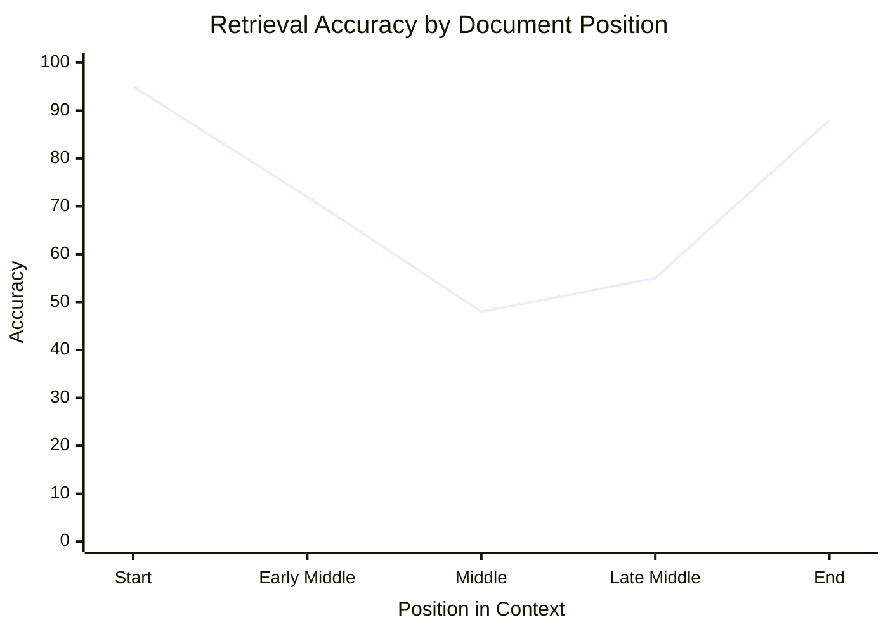
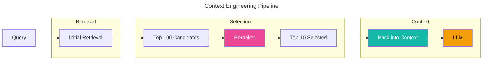
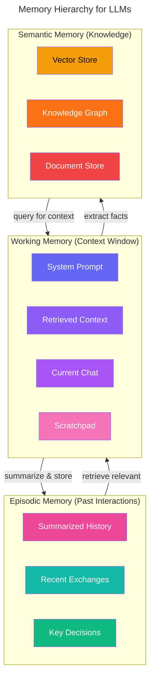
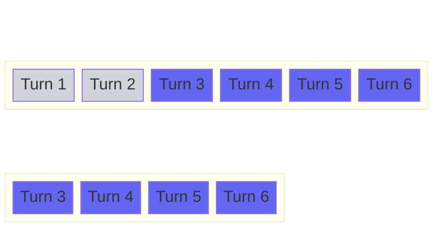
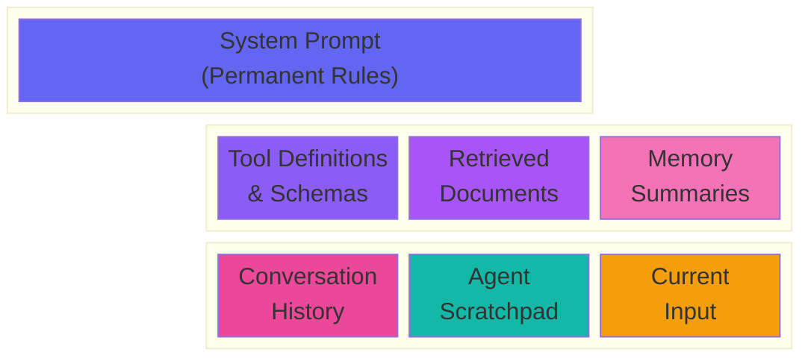
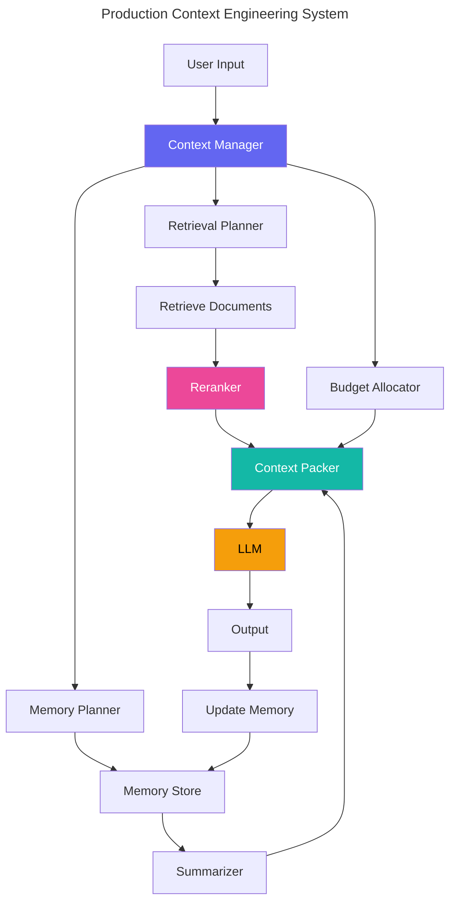

# Chapter 03: Context Engineering

> *"Context is all the model sees. Everything else is hallucination."*

## Prerequisites

This chapter assumes you understand tokens and tokenization (Chapter 01) and prompt engineering fundamentals (Chapter 02). We reference GraphRAG (Chapter 05) for advanced retrieval patterns. Review those chapters if terms like "token limits," "system prompts," or "graph-based retrieval" are unfamiliar.

---

## 1. What Is Context Engineering?

Context Engineering is the discipline of managing *what* information goes into an LLM's context window and *how* it is structured. It sits at the intersection of information retrieval, memory systems, and prompt design.

### The Mental Model

Think of the context window as the model's **working memory**.

```
┌─────────────────────────────────────────────────────┐
│                 CONTEXT WINDOW                       │
│                                                      │
│  ┌──────────┐  ┌──────────┐  ┌──────────────────┐  │
│  │ System   │  │ Retrieved│  │ Conversation     │  │
│  │ Prompt   │  │ Docs     │  │ History          │  │
│  └──────────┘  └──────────┘  └──────────────────┘  │
│                                                      │
│  Everything here → Model can see and reason about    │
│                                                      │
├─────────────────────────────────────────────────────┤
│                                                      │
│              OUTSIDE CONTEXT (Invisible)              │
│                                                      │
│  Databases, Vector Stores, Files, APIs, Tools        │
│  → Model cannot see this information                 │
│                                                      │
└─────────────────────────────────────────────────────┘
```

**Everything inside the context window is visible to the model. Everything outside is invisible.** The model cannot "remember" what it cannot see. This is the fundamental constraint that Context Engineering exists to solve.

### Why This Matters

As models grow more capable (Claude 3.5 with 200K tokens, Gemini 1.5 Pro with 2M tokens), naive practitioners assume "large context windows solve everything." They don't. Research consistently shows:

1. **Longer contexts degrade precision.** Performance on retrieval tasks drops as context length increases (Liu et al., 2023).
2. **Cost scales linearly.** Every token you add costs inference compute (both time and money).
3. **Latency increases.** Longer contexts mean longer attention computations.

Context Engineering is the practice of maximizing *useful information per token*.

---

## 2. Context Windows

### What Is a Context Window?

A context window is the maximum number of tokens a model can process in a single forward pass. It includes every token in the input — system instructions, user messages, retrieved documents, tool outputs, and the model's generated response.

### Current Context Window Limits (2024-2025)

| Model | Context Window | Effective Range |
|-------|---------------|-----------------|
| GPT-4o | 128K tokens | Best at 4K-32K |
| GPT-4 Turbo | 128K tokens | Best at <64K |
| Claude 3 Haiku | 200K tokens | Best at <100K |
| Claude 3.5 Sonnet | 200K tokens | Best at <100K |
| Claude 3 Opus | 200K tokens | Best at <100K |
| Gemini 1.5 Pro | 2M tokens | Best at <500K |
| Gemini 1.5 Flash | 1M tokens | Best at <250K |
| Llama 3 70B | 8K tokens | Best at <8K |
| Llama 3.1 405B | 128K tokens | Best at <32K |
| Mistral Large | 128K tokens | Best at <32K |
| DeepSeek-V2 | 128K tokens | Best at <32K |
| Qwen 2.5 72B | 128K tokens | Best at <32K |

### Context Window Anatomy

```mermaid
---
title: Context Window Anatomy
---
block-beta
  columns 3

  space block1:3

  block1 space

  block1
    blockgroup:3
      columns 3
      S["System 
      Instructions"] T["Task 
      Context"] H["History"]
    end
  end

  block1 space

  block1
    blockgroup2:3
      columns 3
      R["Retrieved
      Docs"] Q["User 
      Query"] A["Model
      Output"]
    end
  end

  style S fill:#6366f1,color:#fff
  style T fill:#8b5cf6,color:#fff
  style H fill:#a855f7,color:#fff
  style R fill:#ec4899,color:#fff
  style Q fill:#14b8a6,color:#fff
  style A fill:#f59e0b,color:#000
```

### The Problem with Large Context Windows

The assumption "larger context = better performance" is false. Research reveals three key problems:

1. **Lost in the Middle** (Liu et al., 2023): Models perform best on information at the *start* and *end* of context. Information in the middle is substantially degraded.

2. **Attention Dilution**: As the number of tokens grows, attention scores spread thinner. The model cannot focus on any single piece of information as effectively.

3. **Positional Encoding Decay**: For models with absolute positional encodings, information at extreme positions is less effectively processed.



*Source: Liu et al. (2023), "Lost in the Middle: How Language Models Use Long Contexts"*

---

## 3. Information Retrieval for Context

When the information you need exceeds the context window, you must retrieve. Retrieval for context is different from general search — you're not finding *all* relevant documents, you're finding the *most useful subset* that fits within your token budget.

### Sparse Retrieval (BM25)

BM25 is a bag-of-words ranking function. It scores documents based on term frequency (TF) and inverse document frequency (IDF), with document length normalization.

**When to use:** Exact keyword matching, short queries, low-resource settings.

**Pros:** Fast, interpretable, no training needed, no embeddings to store.

**Cons:** Misses semantic similarity, struggles with synonyms, assumes term independence.

```
BM25 Score = Σ (IDF(q_i) × TF(q_i, d) × (k₁ + 1)) / (TF(q_i, d) + k₁ × (1 - b + b × |d| / avgdl))
```

### Dense Retrieval (Embeddings)

Dense retrieval maps documents and queries into a shared embedding space. Documents are ranked by cosine similarity to the query embedding.

**When to use:** Semantic matching, paraphrased queries, conceptual search.

**Pros:** Captures semantics, handles synonyms, high recall.

**Cons:** Requires embedding infrastructure, higher latency, less interpretable.

```python
# Conceptual: Dense retrieval flow
query_embedding = embed("What is context engineering?")
doc_embeddings = embed_documents(all_docs)
scores = cosine_similarity(query_embedding, doc_embeddings)
top_k = docs[argsort(scores)[-10:]]
```

### Hybrid Retrieval

Hybrid retrieval combines sparse and dense scores, typically via weighted summation or reciprocal rank fusion (RRF).

```
RRF Score(d) = Σ 1 / (k + rank_sparse(d)) + Σ 1 / (k + rank_dense(d))
```

**When to use:** Production systems where both keyword precision and semantic recall matter.

### Reranking

After initial retrieval (top-50 or top-100), a *cross-encoder* reranker scores each document *paired with the query*. This is more accurate but too slow for large candidate sets.

```
Initial retrieval (BM25 or dense) → Top 100
Cross-encoder reranker → Top 10 (into context)
```



**Key insight:** Reranking is more important than retrieval. A mediocre retriever + good reranker beats a good retriever + no reranker.

---

## 4. Chunking

Chunking is the process of breaking documents into pieces small enough for retrieval. The chunk is the unit of retrieval — if a chunk is too small, it lacks context; if too large, it wastes tokens.

### Naive Chunking (Fixed Size)

Split text every N characters or tokens, with optional overlap.

```python
chunks = [text[i:i+chunk_size] for i in range(0, len(text), chunk_size - overlap)]
```

**Drawbacks:** Splits in the middle of sentences, loses semantic boundaries, creates incoherent chunks.

### Semantic Chunking

Split at semantic boundaries — paragraph breaks, section headers, natural topic transitions.

**Approach 1: Recursive character splitting** — Try different separators (double newline, single newline, period, etc.) in order.

**Approach 2: Embedding-based splitting** — Split where cosine similarity between consecutive sentences drops below a threshold.

**Approach 3: Model-based splitting** — Use an LLM to identify coherent sections.

### Chunk Overlap

Overlap ensures no information is lost at chunk boundaries. A 10-20% overlap is standard.

**Tradeoff:** Higher overlap → better recall, lower precision, more tokens stored.

### Chunk Size Tradeoffs

| Size | Recall | Precision | Token Waste | Use Case |
|------|--------|-----------|-------------|----------|
| 128 tokens | High | Low | High | Fine-grained Q&A |
| 512 tokens | Medium | Medium | Medium | General RAG |
| 1024 tokens | Low | High | Low | Document summarization |
| 2048+ tokens | Very Low | Very High | Very Low | Full-document analysis |

```mermaid
---
title: Chunking Strategy Comparison
---
block-beta
  columns 3

  block:fixed:3
    columns 3
    F1["Chunk 1"] F2["Chunk 2"] F3["Chunk 3"]
  end

  space

  block:semantic:3
    columns 3
    S1["Paragraph 1"] S2["Paragraph 2"] S3["Paragraph 3"]
  end

  space

  block:overlap:3
    columns 3
    O1["Chunk 1"] O2["Chunk 2"] O3["Chunk 3"]
  end

  space

  block:overlapV:3
    columns 3
    OV1["Overlap 1→2"] OV2["Overlap 2→3"] OV3[" "]

  style F1 fill:#6366f1,color:#fff
  style F2 fill:#6366f1,color:#fff
  style F3 fill:#6366f1,color:#fff
  style S1 fill:#8b5cf6,color:#fff
  style S2 fill:#8b5cf6,color:#fff
  style S3 fill:#8b5cf6,color:#fff
  style O1 fill:#a855f7,color:#fff
  style O2 fill:#a855f7,color:#fff
  style O3 fill:#a855f7,color:#fff
  style OV1 fill:#f472b6,color:#fff
  style OV2 fill:#f472b6,color:#fff
  style OV3 fill:#f472b6,color:#fff
```

---

## 5. Context Packing

Once you have retrieved the most relevant information, you must pack it into the limited context window. Packing is not just concatenation — ordering matters.

### Document Ordering Strategies

**Most important first (inverted pyramid):** Put the single most important document at the start. This works because models process initial tokens with the highest attention fidelity.

**Recency-weighted:** For conversation history, put recent messages near the end (closest to the query).

**Structured interleaving:** For complex reasoning tasks, alternate between evidence types.

### Best Practices

1. **Put critical information at the start or end.** Avoid the middle for your most important content.
2. **Use structured formats.** XML tags, JSON, or markdown headers make information more scannable for the model.
3. **Label your documents.** Each retrieved chunk should have a source label (e.g., `<document source="chapter3.pdf">`).
4. **Remove redundancy.** If two documents say the same thing, include only one.
5. **Prioritize actionable information.** Information the model needs to *act on* should come before background context.

### The "Useful" Budget

Not all tokens are equally valuable. A framework:

```
Context Budget = Model Limit - System Prompt - Output Reservation

Useful Budget = Context Budget - Conversation History - Query

Available for Retrieval = Useful Budget - (Reserved for Instructions)
```

---

## 6. Memory Systems

Context windows are ephemeral. Each new interaction can rewrite the entire context. Memory systems provide persistence across turns.

### The Memory Hierarchy



### Working Memory (Current Context)

This is the context window — everything the model can see right now. Content is actively maintained and can be modified each turn.

**Capacity:** Model-dependent (8K to 2M tokens).

**Eviction policy:** Oldest or least relevant content is removed when budget is exceeded.

### Episodic Memory (Past Interactions)

Compressed representations of what happened in previous conversations or turns.

**Storage format:** Summaries, key decisions extracted, important facts mentioned.

**Retrieval:** Lucene/BM25 over summaries, embedding similarity for semantic recall.

**Update policy:** When would you rewrite a summary vs. append? Rewrite when the conversation shifts topic; append for linear progression.

### Semantic Memory (Knowledge)

Persistent knowledge extracted from interactions and documents. This is your knowledge base — vector store, knowledge graph, or document database.

**Storage format:** Embeddings + metadata, graph nodes + edges, raw documents.

**Retrieval:** Dense retrieval, SPARQL/graph queries, keyword search.

### Memory Summarization

```
Full conversation (5000 tokens)
    ↓
Summarize to working memory entry (300 tokens)
    ↓
Archive to episodic memory
    ↓
When relevant → retrieve and expand
```

**Strategies:**

1. **Rolling summary** — Update a single summary after each turn, appending new information.
2. **Chunked summary** — Keep the last N turns verbatim, summarize everything older.
3. **Hierarchical summary** — Summarize at multiple time scales (hourly → daily → weekly).

---

## 7. Context Compression

Context compression reduces the number of tokens required to represent information. This is distinct from chunking (which divides) — compression *condenses*.

### Summarization-Based Compression

Use an LLM to rewrite a document as a shorter version.

**Pros:** High compression ratio (5-10x), preserves key information.

**Cons:** Expensive, may lose details, introduces latency.

**Best for:** Conversation history compression, document preprocessing.

### Extraction-Based Compression

Extract the most important sentences or phrases without rewriting.

**Methods:** Sentence scoring (textrank), entity extraction, query relevance scoring.

**Pros:** Fast, preserves exact facts.

**Cons:** Lower compression ratio (2-3x), may lack coherence.

### Learned Compression

**AutoCompressors** (Chevalier et al., 2023): Train a model to produce summary vectors (summary tokens) that compress longer texts.

**LLMLingua** (Jiang et al., 2023): Train a small model to predict which tokens are important and can be removed.

**Selective Context:** Use perplexity-based scoring to remove low-information tokens from the context.

```python
# Conceptual: LLMLingua-style compression
perplexities = small_model.get_perplexity(context_tokens)
mask = perplexities < threshold  # Keep low-perplexity tokens
compressed = context_tokens[mask]
```

### Selective Context Inclusion

Instead of compressing *all* of context, selectively include only the parts relevant to the current query.

This is what retrieval-augmented generation (RAG) does — but at a finer granularity. Query-based sentence filtering, dynamic document selection.

---

## 8. Sliding Windows

When a conversation exceeds the context limit, you need a strategy for what to keep.

### The Basic Sliding Window



As new turns arrive, old turns are evicted. The simplest policy: **FIFO** (first in, first out).

### Beyond FIFO: Prioritized Eviction

Simple FIFO discards useful information. Better strategies:

1. **Relevance-weighted** — Score each message by relevance to the current query. Retain the top N.
2. **Role-weighted** — Always keep system messages and instructions. Evict user or assistant messages first.
3. **Summary-buffer** — Keep the last K turns verbatim; summarize everything older.
4. **Importance-scored** — After each turn, score its importance. Low-importance messages are evicted first.

### Hybrid Approach

```
┌─────────────────────────────────────────────┐
│          CONTEXT WINDOW                      │
│                                              │
│  System Prompt (always kept)                 │
│  Summarized History (compressed)             │
│  Last 5 Turns (verbatim)                     │
│  Retrieved Documents (query-dependent)       │
│  Current Query                               │
└─────────────────────────────────────────────┘
```

---

## 9. The Lost in the Middle Problem

### Original Research

Liu et al. (2023) tested LLMs on multi-document question answering. They placed relevant documents at different positions in the context and measured accuracy.

**Findings:**

- Accuracy is highest when the relevant document is at the **start** (position 1) or **end** (position N).
- Accuracy drops by 20-50% when the relevant document is in the **middle**.
- This holds across model sizes and model families.
- The effect is *worse* for larger context windows — more documents means more "middle."

### Why It Happens

Two competing explanations:

1. **Attention bias.** Models naturally attend more to early and late tokens due to positional encoding.
2. **Interference.** Middle documents interfere with each other. Early documents have no preceding interference; late documents have no following interference.

### Mitigations

1. **Strategic positioning.** Place the most important document at position 1. Place the second most important at the last position.
2. **Structured formats.** XML/JSON wrappers around each document help the model find boundaries.
3. **Explicit labeling.** "Document 1: [title]" — the model can learn to search for specific labels.
4. **Recency weighting.** In conversation history, recent messages are naturally at the end — which helps.
5. **Reinforcement.** Remind the model to "search through all documents carefully" — this helps slightly.
6. **Chunking.** Smaller chunks reduce the amount of text in the middle, improving overall accuracy.

### Structured Formatting Example

```xml
<documents>
  <doc id="1" source="chapter2.md" relevance="0.95">
    Content about prompt engineering...
  </doc>
  <doc id="2" source="chapter1.md" relevance="0.88">
    Content about tokenization...
  </doc>
  <doc id="3" source="chapter4.md" relevance="0.72">
    Content about fine-tuning...
  </doc>
</documents>
```

---

## 10. Conversation Memory

Managing chat history is one of the most common Context Engineering tasks in production.

### Token Budgets for History

System prompt: 500 tokens (fixed)
Task instruction: 200 tokens (fixed)
Retrieved documents: ~3000 tokens (variable)
Conversation history: remaining budget

If the model limit is 128K tokens and system + instruction + retrieval = 5K, you have ~123K tokens for history.

### Summarization Strategies

**Turn-level summarization:** After each turn, append a one-sentence summary.

```
User: What is RAG?
Assistant: RAG stands for Retrieval-Augmented Generation...
Summary: User asked about RAG definition. Assistant explained RAG is a technique combining retrieval with generation.
```

**Session-level summarization:** After N turns (or when budget is low), summarize the entire session.

```
Session summary:
- User is building an AI engineering handbook.
- They want chapters on context engineering, prompt engineering, and RAG.
- They asked detailed questions about chunking strategies.
```

### Retrieval from History

For long-running agents, you may need to retrieve from *past sessions*, not just the current one.

**Strategy:** Embed each message or summary → store in a session-specific vector store → query on demand.

---

## 11. Working Memory Architecture

The most effective pattern for agent context is a structured working memory.



### The Core Context Pattern

```
1. System Instructions (persistent, always included)
2. Tool/Function Definitions (persistent)
3. Retrieved Context (dynamic, query-dependent)
4. Episodic Memory Summary (persistent across turns)
5. Conversation History (last N turns verbatim)
6. Agent Scratchpad (model's own reasoning)
7. Current User Input
```

### Slots and Allocation

Treat context as a set of slots with fixed budgets:

| Slot | Budget | Refresh Rate |
|------|--------|-------------|
| System Prompt | 500 tokens | Never |
| Tool Definitions | 1000 tokens | When tools change |
| Retrieved Documents | 3000 tokens | Per query |
| Memory Summary | 500 tokens | Per turn |
| Conversation History | Remaining | Per turn |
| Agent Scratchpad | 500 tokens | Per reasoning step |
| Current Input | Variable | Per turn |

---

## 12. Production Context Engineering

### Context Budget Planning

Before deploying any system, calculate your context budget:

```
Model Limit: 128,000 tokens (GPT-4o)
Reserved for Output: 4,000 tokens  
Available for Input: 124,000 tokens

System:      500 tokens   (0.4%)
Tools:     1,000 tokens   (0.8%)
Retrieval:  5,000 tokens   (4.0%)
Memory:      500 tokens   (0.4%)
History: 117,000 tokens  (94.4%)
```

Is 94% of our budget going to history optimal? Probably not. Adjust the budget based on your use case.

### Adaptive Context Management

In production, context needs change over time:

- **Early in session:** More history budget, less retrieval budget.
- **Late in session:** More retrieval budget, compressed history.
- **After tool calls:** Include tool outputs, reduce history.
- **On error:** Include debugging context, reduce everything else.

### Performance Monitoring

Key metrics to track:

1. **Context utilization rate** — What % of the window is filled?
2. **Retrieval precision** — What % of retrieved docs are actually used?
3. **Memory hit rate** — How often does memory retrieval surface useful information?
4. **Token efficiency** — How many tokens consumed per successful response?

### System Architecture



### Common Pitfalls

1. **Assuming context is free.** Every token costs compute. Measure and optimize.
2. **Ignoring the middle.** Most context management systems stuff everything in the middle. You're wasting your best positions.
3. **Over-retrieving.** Retrieving 20 documents when you can only fit 3. Rerank aggressively.
4. **Memory as dumpster.** Memory systems that grow unboundedly without summarization or eviction.
5. **One-size-fits-all budgets.** Different queries need different context compositions.

---

## Cross-References

- **Chapter 01: Tokenization** — Understanding token limits and how tokenizers affect context budgets.
- **Chapter 02: Prompt Engineering** — How system prompts and few-shot examples consume context.
- **Chapter 05: GraphRAG** — Graph-based retrieval for structured knowledge in context.

---

## Summary

Context Engineering is the practice of managing what the model sees. It bridges information retrieval, memory systems, and prompt design. The key insights:

1. **Context is limited** — even 2M tokens, because quality degrades.
2. **Position matters** — the start and end of context are prime real estate.
3. **Retrieve, don't stuff** — use retrieval to select, not to dump.
4. **Memory tiering** — working, episodic, semantic — each with different access patterns.
5. **Measure everything** — token efficiency, retrieval precision, memory hit rate.

Master Context Engineering and you can make a 128K model outperform someone using 2M tokens naively.
