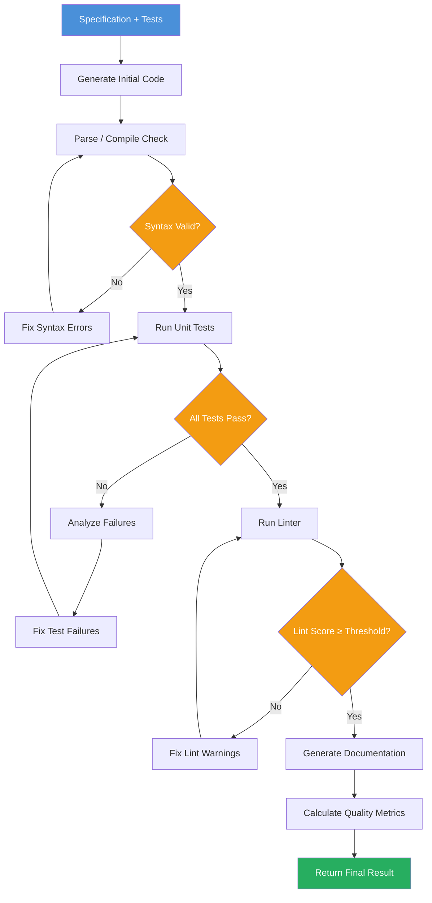

# Project: Build a Production Code Generation Loop

> **Duration:** 6-8 hours
>
> **Difficulty:** 🔴 Advanced
>
> **Prerequisites:** Chapter 02 (Prompting), Chapter 03 (Context), Chapter 04 (Loops)

---

## Overview

Build a complete code generation system where an LLM generates code, runs it, captures feedback (compile errors, test failures, lint warnings), and refines the code until all tests pass or max iterations are reached.

This project mirrors real production systems used by companies like GitHub Copilot, Cursor, and Replit.

---

## System Architecture



---

## Requirements

### Core Requirements

1. **Code Generation:** Given a specification and unit tests, generate a Python function
2. **Compile Checking:** Validate syntax by attempting to parse the generated code
3. **Test Execution:** Run provided unit tests, capture pass/fail results
4. **Error Analysis:** Parse error messages, identify failing tests, extract line numbers
5. **Code Refinement:** Feed errors back to LLM for correction
6. **Lint Checking:** Run a linter (pyflakes, pycodestyle, or similar) to check code quality
7. **Documentation Generation:** Once code passes all checks, generate docstrings
8. **Progress Tracking:** Log each iteration's results, errors, and improvements

### Quality Requirements

9. **Quality Metrics:** Calculate composite quality score per iteration
10. **Best-So-Far Tracking:** Always track the best version seen (for graceful degradation)
11. **Cost Tracking:** Track token usage and cost per iteration

### Safety Requirements

12. **Max Iterations:** Hard limit on total iterations
13. **Time Budget:** Per-iteration timeout
14. **Cost Budget:** Maximum total cost
15. **Sandbox Execution:** Run code in isolated environment
16. **Safe Evaluation:** Prevent infinite loops in test execution

---

## Implementation Guide

### Phase 1: Core Loop Structure

Build the main loop class:

```python
class CodeGenLoop:
    def __init__(self, max_iterations=10, max_cost=0.50, verbose=True):
        self.max_iterations = max_iterations
        self.max_cost = max_cost
        self.verbose = verbose
        self.total_cost = 0.0
        self.best_code = None
        self.best_score = -1.0
        self.history = []
    
    def run(self, specification, test_cases):
        """
        Main entry point.
        
        Args:
            specification: String describing the function to implement
            test_cases: List of (call_expression, expected_result) tuples
        
        Returns:
            dict with keys: code, iterations, quality_score, cost, history
        """
        # Your implementation here
        pass
    
    def generate_code(self, specification, errors=None, lint_issues=None):
        """
        Generate or refine code based on specification and feedback.
        """
        pass
    
    def run_tests(self, code, test_cases):
        """
        Execute test cases against the code.
        Returns list of test results.
        """
        pass
    
    def run_linter(self, code):
        """
        Run linter on code and return issues.
        """
        pass
    
    def calculate_quality(self, test_results, lint_issues, iteration):
        """
        Calculate composite quality score.
        """
        pass
    
    def generate_documentation(self, code, specification):
        """
        Generate docstring for the function.
        """
        pass
```

### Phase 2: Code Generation Module

Design prompts for different stages:

**Initial Generation Prompt:**
```python
def build_generation_prompt(specification):
    return f"""
Write a Python function that satisfies this specification:

{specification}

Requirements:
- Function must handle edge cases
- Use type hints
- Return ONLY the function code, no explanations
- Wrap in ```python ... ``` tags
"""
```

**Error-Fixing Prompt:**
```python
def build_fix_prompt(code, errors):
    return f"""
The following function has errors:

```python
{code}
```

Error messages:
{errors}

Fix ALL errors. Return ONLY the corrected function code.
Think step by step about what each error means and how to fix it.
"""
```

### Phase 3: Test Execution Module

```python
import sys
import io
import traceback
import ast
import contextlib

def execute_tests(code, test_cases, timeout_seconds=5):
    """
    Execute test cases against code in a sandboxed environment.
    """
    results = []
    
    # Check syntax first
    try:
        ast.parse(code)
    except SyntaxError as e:
        return [{"test": "syntax_check", "passed": False, "error": str(e)}]
    
    # Create namespace
    namespace = {}
    
    try:
        exec(code, namespace)
    except Exception as e:
        return [{"test": "execution", "passed": False, "error": traceback.format_exc()}]
    
    # Run tests
    for expr, expected in test_cases:
        try:
            result = eval(expr, namespace)
            passed = result == expected
            results.append({
                "test": expr,
                "passed": passed,
                "expected": expected,
                "got": result,
                "error": None if passed else f"Expected {expected}, got {result}"
            })
        except Exception as e:
            results.append({
                "test": expr,
                "passed": False,
                "expected": expected,
                "got": None,
                "error": traceback.format_exc()
            })
    
    return results
```

### Phase 4: Lint Checking Module

```python
import subprocess
import tempfile
import os

def run_linter(code):
    """
    Run pyflakes or pycodestyle on code and return issues.
    Falls back to simple heuristic checks if linter not installed.
    """
    issues = []
    
    # Try pyflakes first
    try:
        with tempfile.NamedTemporaryFile(mode='w', suffix='.py', delete=False) as f:
            f.write(code)
            f.flush()
            result = subprocess.run(
                ['pyflakes', f.name],
                capture_output=True, text=True, timeout=10
            )
            if result.stdout:
                for line in result.stdout.strip().split('\n'):
                    issues.append({
                        "type": "error",
                        "message": line,
                        "source": "pyflakes"
                    })
        os.unlink(f.name)
    except FileNotFoundError:
        pass
    
    # Basic heuristic checks (fallback)
    if 'TODO' in code:
        issues.append({
            "type": "warning",
            "message": "Code contains TODO comments",
            "source": "heuristic"
        })
    
    if len(code.split('\n')) > 200:
        issues.append({
            "type": "warning",
            "message": "Function is too long (>200 lines)",
            "source": "heuristic"
        })
    
    return issues
```

### Phase 5: Quality Metrics Module

```python
def calculate_quality_score(test_results, lint_issues, iteration, cost):
    """
    Calculate a composite quality score (0.0 to 1.0).
    
    Weights:
    - Test passing: 50%
    - Lint quality: 25%
    - Iteration efficiency: 15%
    - Cost efficiency: 10%
    """
    if not test_results:
        return 0.0
    
    # Test score (0-1)
    passed = sum(1 for t in test_results if t["passed"])
    test_score = passed / len(test_results) * 0.50
    
    # Lint score (0-1)
    if lint_issues:
        lint_severity = sum(
            2 if i["type"] == "error" else 1
            for i in lint_issues
        )
        lint_penalty = min(lint_severity * 0.1, 0.25)
        lint_score = 0.25 - lint_penalty
    else:
        lint_score = 0.25
    
    # Iteration efficiency
    if iteration == 0:
        iter_score = 0.15  # Perfect on first try
    else:
        iter_score = max(0, 0.15 - (iteration * 0.02))
    
    # Cost efficiency
    cost_score = max(0, 0.10 - (cost * 0.05))
    
    return min(test_score + lint_score + iter_score + cost_score, 1.0)
```

### Phase 6: Documentation Generation

```python
def generate_docstring(code, specification):
    """
    Generate Google-style docstring for the function.
    Only called when code passes all checks.
    """
    prompt = f"""
Add a comprehensive Google-style docstring to this function:

```python
{code}
```

Specification: {specification}

Return ONLY the function with the docstring added.
The docstring must include: Args, Returns, Raises, Examples.
"""
    
    # Call LLM and extract code
    response = call_llm(prompt)
    return extract_code(response)
```

### Phase 7: Orchestration

```python
def run(self, specification, test_cases):
    """Main loop orchestration."""
    
    state = {
        "spec": specification,
        "code": None,
        "test_cases": test_cases,
        "errors": [],
        "lint_issues": [],
        "iteration": 0,
        "total_cost": 0.0,
        "history": [],
        "best_code": None,
        "best_score": -1.0
    }
    
    while state["iteration"] < self.max_iterations:
        iter_start = time.time()
        
        # 1. Generate code
        if state["iteration"] == 0:
            state["code"] = self.generate_code(specification)
        else:
            state["code"] = self.generate_code(
                specification, 
                errors=state["errors"],
                lint_issues=state["lint_issues"]
            )
        
        # 2. Check syntax
        try:
            ast.parse(state["code"])
        except SyntaxError as e:
            state["errors"] = [f"SyntaxError: {e}"]
            state["lint_issues"] = []
            self._log_iteration(state)
            state["iteration"] += 1
            continue
        
        # 3. Run tests
        test_results = self.run_tests(state["code"], test_cases)
        all_tests_pass = all(t["passed"] for t in test_results)
        
        state["errors"] = [
            t["error"] for t in test_results 
            if not t["passed"] and t["error"]
        ]
        
        # 4. Run linter (only if tests pass)
        lint_issues = []
        if all_tests_pass:
            lint_issues = self.run_linter(state["code"])
        
        state["lint_issues"] = lint_issues
        
        # 5. Calculate quality
        quality = self.calculate_quality(
            test_results, lint_issues, 
            state["iteration"], state["total_cost"]
        )
        
        # 6. Track best
        if quality > state["best_score"]:
            state["best_code"] = state["code"]
            state["best_score"] = quality
        
        # 7. Generate documentation if all checks pass
        docs = None
        if all_tests_pass and not lint_issues:
            docs = self.generate_documentation(state["code"], specification)
        
        # 8. Log iteration
        self._log_iteration(state, quality, test_results)
        
        # 9. Check stopping conditions
        if all_tests_pass and not lint_issues:
            return self._build_result(state, docs, quality)
        
        if self.total_cost >= self.max_cost:
            break
        
        state["iteration"] += 1
    
    # Graceful degradation
    return self._build_result(state, docs=None, quality=state["best_score"])
```

---

## Test Specifications

### Test Case 1: Simple Function

```python
spec = """
Write a function called `is_prime(n)` that returns True if n is a prime number,
False otherwise. Handle edge cases: n <= 1 returns False.
"""

tests = [
    ("is_prime(2)", True),
    ("is_prime(3)", True),
    ("is_prime(4)", False),
    ("is_prime(17)", True),
    ("is_prime(1)", False),
    ("is_prime(0)", False),
    ("is_prime(-5)", False),
    ("is_prime(97)", True),
]
```

### Test Case 2: String Processing

```python
spec = """
Write a function called `count_words(text)` that returns a dictionary
mapping each word to its count. Ignore case and punctuation.
Words are separated by spaces.
"""

tests = [
    ("count_words('hello world')", {"hello": 1, "world": 1}),
    ("count_words('Hello hello HELLO')", {"hello": 3}),
    ("count_words('')", {}),
    ("count_words('hello, world!')", {"hello": 1, "world": 1}),
    ("count_words('the quick brown fox jumps over the lazy dog')", 
     {"the": 2, "quick": 1, "brown": 1, "fox": 1, "jumps": 1, "over": 1, "lazy": 1, "dog": 1}),
]
```

### Test Case 3: Data Processing

```python
spec = """
Write a function called `analyze_temperatures(temps)` that takes a list of
temperature readings (floats) and returns a dictionary with:
- 'mean': average temperature
- 'median': median temperature
- 'min': minimum temperature
- 'max': maximum temperature
- 'range': max - min
- 'std': population standard deviation
"""

tests = [
    ("analyze_temperatures([0.0, 10.0, 20.0])", 
     {"mean": 10.0, "median": 10.0, "min": 0.0, "max": 20.0, "range": 20.0, "std": 8.164965809277661}),
    ("analyze_temperatures([5.0])",
     {"mean": 5.0, "median": 5.0, "min": 5.0, "max": 5.0, "range": 0.0, "std": 0.0}),
]
```

### Test Case 4: Algorithm (Add your own)

```python
spec = """
Write a function called `merge_intervals(intervals)` that takes a list of
intervals [start, end] and returns a new list with overlapping intervals merged.
"""

# Write 6+ test cases for this specification
tests = []
```

---

## Evaluation Rubric

Your project will be evaluated on:

| Category | Weight | Criteria |
|---|---|---|
| **Correctness** | 30% | All provided test cases pass on final output |
| **Robustness** | 20% | Handles all test specifications, including edge cases |
| **Quality** | 15% | Generates clean, well-documented code with proper lint scores |
| **Cost Efficiency** | 15% | Minimizes iterations and token usage |
| **Architecture** | 10% | Clean separation of concerns, modular design |
| **Safety** | 10% | Proper sandboxing, budgets, graceful degradation |

### Scoring Guidelines

| Score | Meaning |
|---|---|
| 90-100% | Production-ready. Can handle real-world code generation tasks. |
| 75-89% | Solid implementation. Works on most cases but has room for optimization. |
| 60-74% | Functional but needs improvement in robustness or efficiency. |
| Below 60% | Core loop works but significant gaps in error handling or edge cases. |

---

## Extensions & Challenge Tasks

### 🔵 Easy Extensions

1. **Multi-file output:** Generate multiple functions/files that work together
2. **Custom linter rules:** Add project-specific lint rules
3. **Progress bar:** Visual progress indicator showing iteration status

### 🟡 Medium Extensions

4. **Parallel test execution:** Run tests in parallel for faster feedback
5. **Test generation:** Have the LLM generate tests from the specification
6. **Performance profiling:** Track execution time per iteration
7. **Model comparison:** Run the same loop with different models and compare

### 🔴 Hard Extensions

8. **Multi-language support:** Support Python, JavaScript, TypeScript, Go
9. **Context-aware fixing:** When fixing errors, preserve working code, only change broken parts
10. **Learning across tasks:** Cache fix patterns and reuse them in similar contexts
11. **Regression testing:** After fixing new issues, re-run all previous tests
12. **Semantic diffing:** Show what changed between iterations (not just line-level diff but semantic changes)

### 💎 Expert Extensions

13. **Adaptive loop parameters:** Dynamically adjust temperature, model, max iterations based on task difficulty
14. **Tree search:** Generate multiple candidate fixes, evaluate in parallel, explore the best path
15. **Self-improvement:** The loop analyzes its own performance and adjusts prompts/strategies

---

## Deliverables

Submit the following:

1. **`code_gen_loop.py`** — Complete implementation
2. **`test_runner.py`** — Test harness with all test cases
3. **`run_experiments.py`** — Script that runs the loop on all test cases and generates a report
4. **`report.md`** — Analysis report covering:
   - Performance on each test case (iterations, cost, quality)
   - Examples of interesting error-fixing trajectories
   - Cost breakdown per specification
   - What failed and why (honest analysis)
   - Recommendations for production use

### Report Template

```markdown
# Code Generation Loop Report

## Summary
- Total specifications tested: 4
- Fully passed: 3/4
- Average iterations: 2.5
- Average cost: $0.042
- Average quality score: 0.87

## Per-Specification Results

### 1. is_prime(n)
- Iterations: 2
- Tests passed: 8/8
- Cost: $0.035
- Quality: 0.92
- Key trajectory: First attempt had off-by-one error in loop range.
  Feedback provided line number and expected behavior. Second attempt passed all.

### 2. count_words(text)
...

## Error Analysis
- Most common error type: Off-by-one in loop bounds (40%)
- Most common fix: Adding edge case handling (35%)
- Iterations to fix syntax errors: 1.2 avg
- Iterations to fix logic errors: 2.8 avg

## Cost Analysis
- Average cost per iteration: $0.017
- Average iterations per spec: 2.5
- Cost range: $0.021 - $0.068

## Recommendations
1. Add early stopping when quality plateaus (save ~15% cost)
2. Use GPT-4o-mini for first iteration, GPT-4o for refinement (save ~40% cost)
3. Cache successful fix patterns across tasks
```
