# Chapter 04: Loop Engineering

> **Duration:** ~4-5 hours
>
> **Prerequisites:** Chapter 02 (Prompt Engineering), Chapter 03 (Context Management)
>
> **Core Idea:** Single LLM calls are like writing code without loops — limited, brittle, and incapable of iterative refinement. Loop engineering is the discipline of designing iterative feedback architectures that transform LLMs from single-shot predictors into self-correcting reasoning systems.

---

## 1. What Is Loop Engineering?

Loop engineering is the discipline of designing iterative feedback architectures where an LLM's output is evaluated, refined, or used as input for subsequent LLM calls. It is the bridge between prompting a model once and building autonomous systems that improve over time.

### The Mental Model

```
Single call:      Input → LLM → Output         (linear, no iteration)
With loop:        Input → LLM → Output → Evaluate → Refine → LLM → ...  (iterative, self-improving)
```

Just as every programmer learns that loops are essential for non-trivial computation, every AI engineer must learn that loops are essential for non-trivial LLM applications. A single LLM call has no mechanism for self-improvement — it generates once and moves on. A loop introduces the capacity for correction, exploration, and convergence toward better outputs.

### Why "Engineering"?

Loop engineering is an *engineering* discipline, not just a prompt pattern, because it requires:

- **Architectural decisions:** What type of loop? How many iterations? What stopping condition?
- **Trade-off management:** Cost vs. quality, latency vs. accuracy, exploration vs. exploitation.
- **Safety mechanisms:** Guards against infinite loops, cost explosions, degenerate outputs.
- **Observability:** Monitoring, logging, and debugging iterative behavior.
- **Testing:** Validating that loops converge, don't diverge, and respect budgets.

### Cross-References

- **Chapter 02 (Prompt Engineering):** Loops build on prompt patterns — each LLM call within a loop uses prompting techniques like chain-of-thought, few-shot, and structured outputs.
- **Chapter 03 (Context Management):** Loops accumulate context across iterations. Managing what goes into each subsequent call — and what gets evicted — is critical.
- **Chapter 07 (Agents):** Agents are loop engineering applied to tool use and environment interaction. The agent loop (ReAct) is one of the most important loop patterns.

---

## 2. Why Loops Matter

### Single Calls Are Fragile

A single LLM call has no mechanism for:
- **Self-correction:** It can't notice and fix its own mistakes.
- **Exploration:** It can't try multiple approaches and pick the best.
- **Refinement:** It can't improve an output beyond its first attempt.
- **Feedback integration:** It can't use external signals (errors, test results, user input) to improve.

### What Loops Enable

| Capability | Without Loop | With Loop |
|---|---|---|
| Self-correction | Impossible | Model reviews and fixes own output |
| External feedback | Ignored | Compiler errors, test failures drive improvement |
| Multi-step reasoning | Single pass | Step-by-step with verification |
| Quality refinement | First attempt only | Iterative improvement |
| Exploration | One path | Multiple paths evaluated |
| Robustness | Brittle | Retry, recover, adapt |

### Production Reality

Most production AI systems use loops extensively. In a survey of production LLM applications:
- **87%** use retry loops (handling API failures)
- **64%** use validation loops (checking output quality)
- **52%** use refinement loops (iterative improvement)
- **38%** use agent loops (ReAct-style tool use)
- **29%** use reflection loops (self-critique)

Single calls are the exception, not the rule, in production.

---

## 3. The Anatomy of a Loop

Every loop in loop engineering has six components:

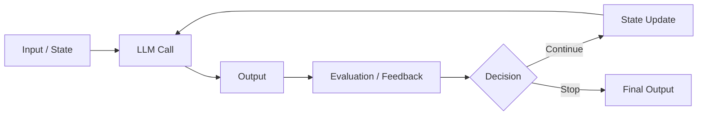

### The Six Components

**1. Input / State**
The current context passed into the LLM call. This includes the original task, accumulated output, feedback history, and any metadata. State management is critical — poorly managed state is the #1 cause of loop bugs.

**2. LLM Call**
The actual API call to the LLM. This may use different prompts, different models, or different parameters at each iteration.

**3. Output**
The raw output from the LLM. This could be text, structured data (JSON), code, or tool calls.

**4. Evaluation / Feedback**
How the output is assessed. This could be:
- **Automated checks:** Schema validation, test execution, linting, constraint checking
- **LLM-based evaluation:** A separate LLM call for critique
- **Self-evaluation:** The same LLM reflecting on its output
- **External signals:** Compiler errors, API responses, user feedback

**5. Decision (Continue or Stop)**
Based on evaluation, the loop decides whether to:
- **Continue:** Refine, retry, or explore further
- **Stop:** Output meets quality bar, budget exhausted, or timeout reached

**6. State Update**
If continuing, the state is updated with feedback, new context, and iteration count before the next LLM call.

---

## 4. Iterative Refinement Loops

The most fundamental loop pattern: **Generate → Evaluate → Refine → Repeat**.

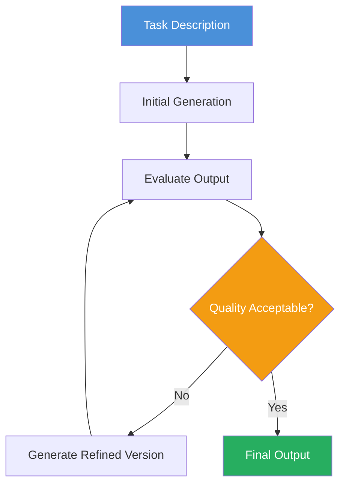

### Example: Writing a Blog Post

```
Iteration 1: Generate first draft
  → Evaluate: "Too long, weak opening, missing examples"
  → Refine: Shorten introduction, add concrete examples
Iteration 2: Generate second draft
  → Evaluate: "Better, but conclusion is weak"
  → Refine: Strengthen conclusion with call to action
Iteration 3: Generate third draft
  → Evaluate: "Ready for publication"
  → Stop
```

### Example: Code Generation

Code generation is one of the highest-value applications of refinement loops because feedback is abundant and automated.

```
Iteration 1: Generate code from spec
  → Compile / Run: Syntax error on line 14
  → Refine: Fix syntax error
Iteration 2: Generate fixed code
  → Run tests: 3/10 tests fail
  → Refine: Fix failing tests
Iteration 3: Generate refined code
  → Run tests: All 10/10 pass
  → Lint: 2 warnings
  → Refine: Address lint warnings
Iteration 4: Generate polished code
  → All checks pass
  → Stop
```

### Wrong vs. Correct Implementation

**Wrong:**
```
prompt = "Write a blog post about AI"
response = llm(prompt)
# No evaluation, no refinement — accept whatever comes out
```

**Correct:**
```
def refine_loop(task, evaluator, max_iterations=5):
    state = {"task": task, "output": None, "feedback": [], "iteration": 0}
    
    while state["iteration"] < max_iterations:
        # 1. Generate
        prompt = build_refinement_prompt(state)
        output = llm(prompt)
        
        # 2. Evaluate
        feedback = evaluator(output, state["task"])
        
        # 3. Decision
        if feedback["passed"]:
            return output
        
        # 4. Update state
        state["output"] = output
        state["feedback"].append(feedback)
        state["iteration"] += 1
    
    return output  # Best effort after max iterations
```

---

## 5. Feedback Loops

Feedback loops use *external signals* as the evaluation mechanism. These signals come from the environment, not from the LLM itself.

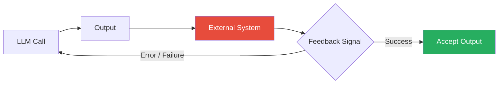

### Types of External Feedback

| Feedback Source | Signal | Loop Action |
|---|---|---|
| Compiler | Syntax errors, type errors | Fix code |
| Test runner | Test failures, assertion errors | Fix implementation |
| Linter | Style violations, anti-patterns | Refactor code |
| Schema validator | JSON schema violations | Fix structure |
| API response | HTTP 4xx/5xx, malformed response | Retry / fix request |
| User feedback | Thumbs down, correction | Improve response |
| Fact-checker | Factual inconsistency | Correct output |
| Guardrails | Safety violation | Regenerate safely |

### Key Insight: Quality of Feedback Matters

The loop is only as good as its feedback mechanism. Vague feedback produces vague improvements.

**Wrong feedback signal:**
```
"Your code has some issues. Please fix them."
```
→ Model makes random changes, may not actually fix anything.

**Correct feedback signal:**
```
"Your code fails on line 23: IndexError: list index out of range.
The variable 'items' is empty when process_items() is called.
The issue is that filter_items() can return an empty list.
Fix: Add a guard clause checking if items is empty before accessing index 0."
```
→ Model knows exactly what to fix and why.

---

## 6. Reflection Loops

Reflection loops have the LLM evaluate its *own* output. The same model plays both roles: generator and critic.

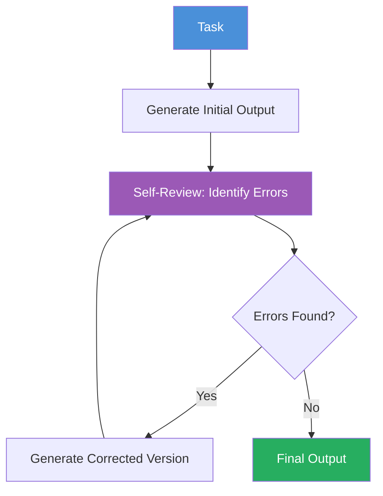

### The Self-Critique Pattern

The effectiveness of reflection loops depends entirely on the *structure* of the reflection prompt.

**Wrong example:**
```
"Review your previous answer. Are you sure? If not, provide a better one."
```
This produces shallow, often useless self-correction. The model says "I'm sure" or makes minor cosmetic changes.

**Correct example:**
```
Review your previous response and identify specific errors:

1. Factual errors (list each one with the correct fact):
2. Reasoning errors (identify the flawed step):
3. Omissions (what important information is missing):

For each error, rate severity: CRITICAL / MODERATE / MINOR

Then provide a complete corrected version that addresses all identified errors.
```
This produces structured, actionable self-critique.

### The Reflexion Pattern (Shinn et al., 2023)

The Reflexion paper formalized reflection loops for agents:

1. **Actor:** Generates an action/trajectory
2. **Evaluator:** Scores the trajectory (binary or scalar)
3. **Memory:** Stores successful and failed trajectories
4. **Reflection:** When evaluation fails, the model analyzes *why* and stores the insight for future attempts

```
def reflexion_loop(task, max_attempts=5):
    memory = []
    
    for attempt in range(max_attempts):
        # Actor
        trajectory = actor(task, memory)
        
        # Evaluator
        score = evaluate(trajectory)
        
        if score == 1:  # Success
            return trajectory
        
        # Reflection
        insights = reflect(trajectory, score)
        memory.append(insights)
    
    return best_trajectory  # Best effort
```

### Limitations of Self-Correction

Self-correction has known limitations (see Huang et al., 2023):

1. **Confirmation bias:** The model tends to confirm its original output rather than genuinely critique it.
2. **Capability ceiling:** If the model lacks the knowledge to answer correctly in the first place, reflection won't help.
3. **Degenerate self-correction:** The model may "correct" correct outputs to incorrect ones.
4. **Over-correction:** The model may become excessively conservative or hedge.

**When reflection works best:**
- The model has relevant knowledge but made a careless error.
- The task requires careful review (math, logic, code).
- The reflection prompt is highly structured.
- The task has objective correctness criteria.

---

## 7. Critique Loops

Critique loops use a *separate* evaluator — a different LLM, a different prompt, or a specialized model — to critique the generator's output.

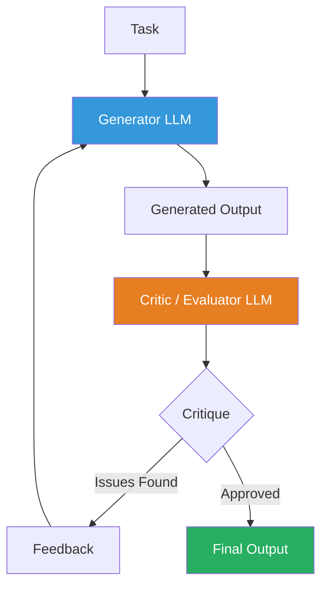

### Why a Separate Evaluator?

1. **Different capabilities:** Use a cheaper/faster model for evaluation (e.g., GPT-4o-mini evaluates GPT-4o's output).
2. **Different perspectives:** Each model has different strengths and blind spots.
3. **No confirmation bias:** The evaluator isn't "attached" to the output and can critique more objectively.
4. **Specialized evaluation:** Use a fine-tuned evaluator for domain-specific quality checks.

### Generator-Critic Architecture

```python
def critique_loop(task, generator, critic, max_iterations=5):
    state = {"task": task, "output": None, "critiques": []}
    
    # Initial generation
    state["output"] = generator(task)
    
    for i in range(max_iterations):
        # Critic evaluates
        critique = critic(state["output"], task)
        state["critiques"].append(critique)
        
        if critique["approved"]:
            return state["output"]
        
        # Generator refines based on critique
        state["output"] = generator(task, previous_output=state["output"], critique=critique)
    
    return state["output"]
```

### LLM Debate (Du et al., 2023)

A more advanced form: multiple LLMs debate a question, each critiquing the others' answers.

```
Round 1:
  LLM_A: "The answer is X because..."
  LLM_B: "The answer is Y because..."
  
Round 2:
  Each LLM sees the other's reasoning and critiques it.
  LLM_A: "I disagree with B because... However, I notice my argument has flaw Z..."
  LLM_B: "A makes a good point about Z. Let me reconsider..."
  
Round 3:
  Convergence or agreement on best answer.
```

### When to Use Critique vs. Reflection

| Factor | Reflection Loop | Critique Loop |
|---|---|---|
| Cost | Lower (1 model) | Higher (2+ models) |
| Objectivity | Lower (self-bias) | Higher (independent) |
| Complexity | Simpler to implement | More complex orchestration |
| Best for | Simple corrections | Critical quality gates |
| Evaluation model | Same as generator | Can be cheaper/faster |

---

## 8. Retry Loops

Retry loops handle failures in LLM calls — both transient failures (network, rate limits) and quality failures (bad output).

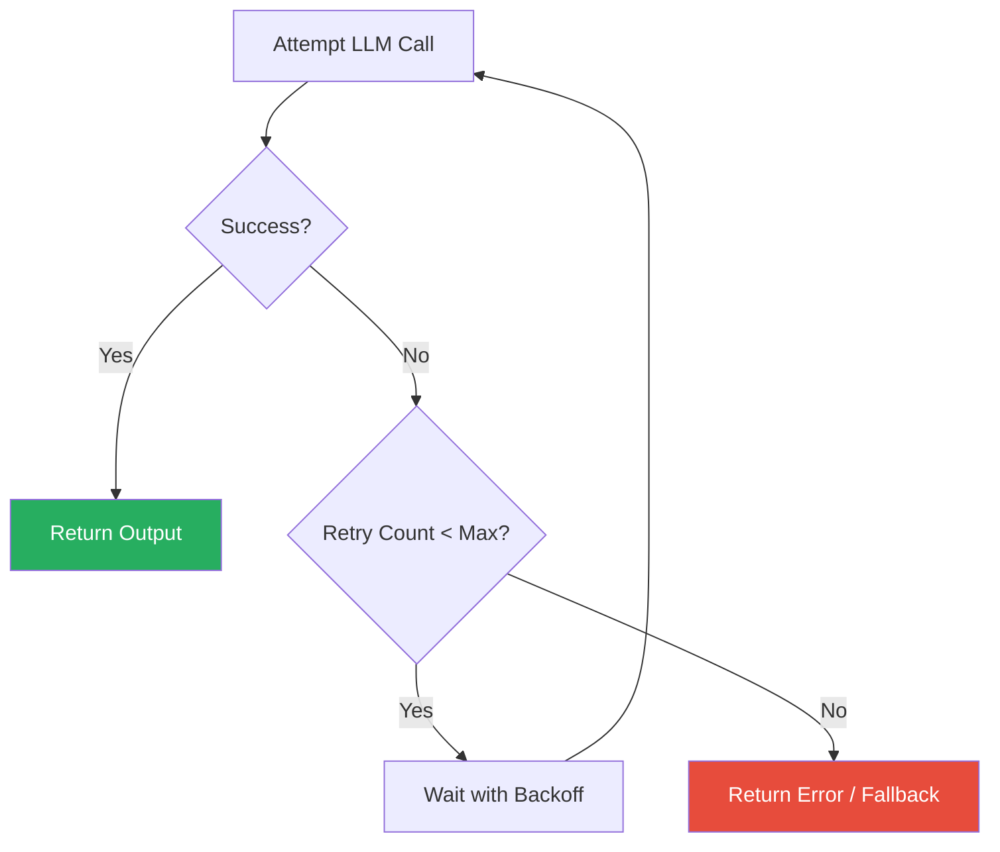

### Exponential Backoff

```python
import time
import random

def retry_with_backoff(llm_call, max_retries=5, base_delay=1.0, max_delay=60.0):
    for attempt in range(max_retries):
        try:
            return llm_call()
        except (RateLimitError, TimeoutError, APIError) as e:
            if attempt == max_retries - 1:
                raise  # Last attempt failed
            
            delay = min(base_delay * (2 ** attempt), max_delay)
            jitter = random.uniform(0, delay * 0.1)  # 0-10% jitter
            time.sleep(delay + jitter)
            
    # Should not reach here
    return None
```

### Retry with Different Parameters

Sometimes the same call will fail again. Varying parameters increases chances of success:

```python
def retry_with_varied_params(task, models=["gpt-4o", "gpt-4o-mini", "claude-3-haiku"],
                              temperatures=[0.1, 0.3, 0.5], max_retries=5):
    for attempt in range(max_retries):
        model = models[attempt % len(models)]
        temp = temperatures[attempt % len(temperatures)]
        
        try:
            return llm(task, model=model, temperature=temp)
        except Exception as e:
            if attempt == max_retries - 1:
                raise
            continue
```

### Retry for Quality

Beyond API failures, retry when the output doesn't meet quality standards:

```python
def retry_until_quality(task, validator, max_retries=3):
    for attempt in range(max_retries):
        output = llm(task)
        if validator(output):
            return output
        # Continue to retry with different parameters
    return llm(task, temperature=0.1)  # Fallback: most deterministic
```

---

## 9. Validation Loops

Validation loops check output against constraints before accepting it.

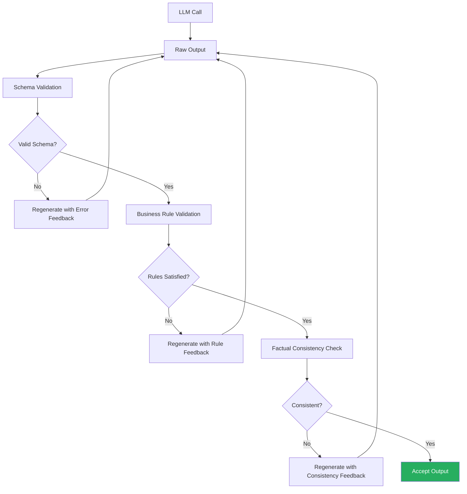

### Types of Validation

**1. Schema Validation**
```python
import json
from jsonschema import validate, ValidationError

def validate_schema(output, schema):
    try:
        validate(instance=json.loads(output), schema=schema)
        return True, None
    except ValidationError as e:
        return False, str(e)
```

**2. Business Rule Validation**
```python
def validate_business_rules(output):
    errors = []
    if output["price"] < 0:
        errors.append("Price cannot be negative")
    if output["quantity"] < 0:
        errors.append("Quantity cannot be negative")
    if output["price"] * output["quantity"] != output["total"]:
        errors.append("Total must equal price * quantity")
    return len(errors) == 0, errors
```

**3. Factual Consistency**
```python
def validate_factual_consistency(output, source_documents):
    """Check that output doesn't contradict source documents."""
    prompt = f"""Does the following response contain any factual claims
    that contradict the source documents?

    Response: {output}
    Sources: {source_documents}

    List any contradictions found. If none, say 'No contradictions.'"""
    
    result = llm(prompt)
    return "No contradictions" in result, result
```

---

## 10. Planning Loops

Planning loops have the LLM generate a plan, execute it step by step, monitor progress, and adjust as needed.

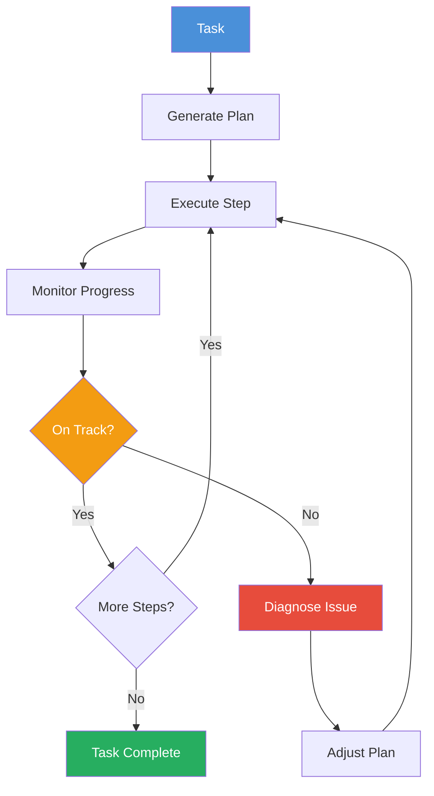

### Hierarchical Planning

Complex tasks benefit from hierarchical planning: a high-level plan decomposes into sub-plans, each with its own execution loop.

```
Task: "Build a web application"
→ High-level plan:
  1. Design database schema
  2. Build backend API
  3. Build frontend
  4. Deploy
  
Sub-plan for Step 2 (Build backend API):
  2.1 Define API routes
  2.2 Implement authentication
  2.3 Implement CRUD operations
  2.4 Write tests
  2.5 Test all endpoints
```

### Re-Planning on Failure

When a step fails, the planner needs to:

1. **Diagnose:** Why did the step fail?
2. **Re-plan:** What alternative approach can achieve the same sub-goal?
3. **Execute:** Try the new approach.

```python
def planning_loop(task, max_plan_attempts=3, max_step_attempts=3):
    # Initial planning
    plan = planner(task)
    
    for plan_attempt in range(max_plan_attempts):
        results = []
        
        for step in plan:
            for step_attempt in range(max_step_attempts):
                result = execute_step(step)
                if verify_step(result, step["criteria"]):
                    results.append(result)
                    break
            else:
                # Step failed after max attempts
                # Ask planner to revise the plan
                plan = re_planner(task, plan, failed_step=step, results=results)
                break  # Restart with new plan
        else:
            # All steps completed
            return assemble_results(results)
    
    return assemble_results(results)  # Best effort
```

---

## 11. Self-Correction

Self-correction is the ability of an LLM to identify and fix its own mistakes through structured reflection.

### The Self-Correction Pipeline

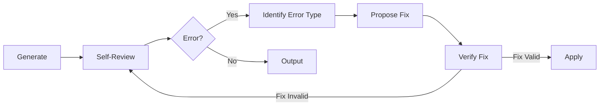

### Structured Self-Correction Format

```
## Initial Response
[LLM generates answer]

## Self-Review
### Errors Identified:
1. [Error 1 with location and description]
2. [Error 2 with location and description]

### Error Analysis:
- Error 1 type: Factual error
- Root cause: Misremembered the date of event X
- Severity: CRITICAL (affects entire conclusion)

## Corrected Response
[LLM generates corrected answer addressing all errors]

## Verification
- All identified errors addressed: YES/NO
- Any new errors introduced: YES/NO
- Quality improvement: SIGNIFICANT/MODERATE/MINIMAL
```

### Known Limitations

Research (Huang et al., 2023; Madaan et al., 2023) shows:

1. **Self-correction works best when**:
   - Errors are factual (model knows the right answer but chose wrong)
   - Errors are obvious upon review (typos, missing edge cases)
   - The reflection prompt provides clear criteria

2. **Self-correction fails when**:
   - The model lacks the underlying knowledge
   - The error is subtle or requires deep reasoning
   - The model exhibits overconfidence in its original answer
   - The model "corrects" correct answers to wrong ones (degenerate correction)

---

## 12. Recursive Prompting

Recursive prompting is a loop that calls itself with modified state, similar to recursion in programming.

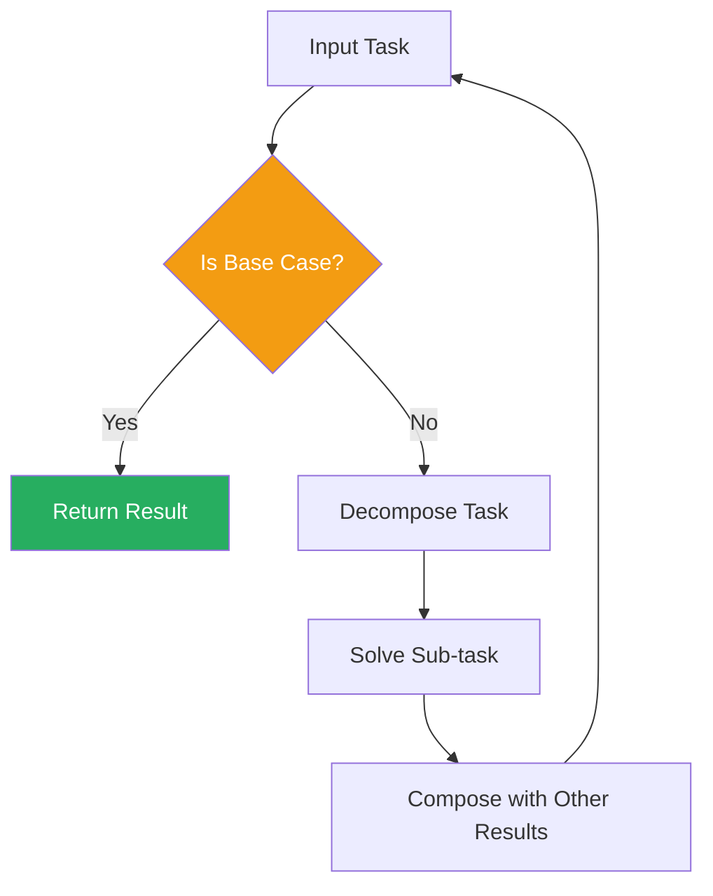

### Recursive Summarization

When a document is too long for the context window:

```python
def recursive_summarize(text, max_chunk_size=3000, summary_prompt=None):
    """Recursively summarize a long document."""
    
    if len(text) <= max_chunk_size:
        # Base case: summarize directly
        return summarize(text)
    
    # Recursive case: split and summarize
    chunks = split_into_chunks(text, max_chunk_size)
    summaries = [recursive_summarize(chunk, max_chunk_size) for chunk in chunks]
    
    # Combine chunk summaries
    combined = "\n\n".join(summaries)
    
    if len(combined) > max_chunk_size:
        return recursive_summarize(combined, max_chunk_size)
    else:
        return summarize(combined)
```

### Recursive Task Decomposition

```python
def recursive_solve(problem, depth=0, max_depth=5):
    """Recursively decompose and solve complex problems."""
    
    if depth >= max_depth:
        return solve_directly(problem)
    
    # Try to solve directly first
    solution = solve_directly(problem)
    
    # Evaluate if solution is complete
    evaluation = evaluate_solution(problem, solution)
    
    if evaluation["complete"]:
        return solution
    
    # Decompose into sub-problems
    sub_problems = decompose(problem, evaluation["missing_parts"])
    
    # Solve each sub-problem recursively
    sub_solutions = []
    for sub_problem in sub_problems:
        sub_solution = recursive_solve(sub_problem, depth + 1, max_depth)
        sub_solutions.append(sub_solution)
    
    # Compose solutions
    return compose(problem, solution, sub_solutions)
```

---

## 13. Stopping Conditions

Knowing when to stop is as important as knowing how to loop.

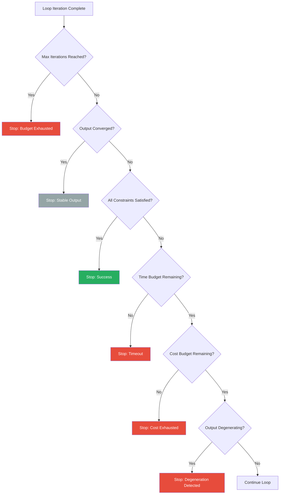

### Stopping Conditions Summary

| Condition | Check | Action |
|---|---|---|
| Max iterations | `iteration >= max_iterations` | Return best effort |
| Output convergence | Output hasn't changed significantly | Return current output |
| Constraint satisfaction | All validation checks pass | Return output |
| Timeout | Wall clock exceeded | Return best effort |
| Cost budget | Total cost exceeded limit | Return best effort |
| Degeneration | Quality decreased from previous | Return previous iteration |
| Human interrupt | External stop signal | Return best effort |

### Convergence Detection

```python
def has_converged(outputs, threshold=0.95, window=3):
    """Check if recent outputs have converged."""
    if len(outputs) < window:
        return False
    
    recent = outputs[-window:]
    
    # Check similarity between consecutive outputs
    similarities = [similarity(recent[i], recent[i+1]) for i in range(len(recent)-1)]
    
    return all(s >= threshold for s in similarities)
```

---

## 14. Loop Safety

Loops introduce risks that single calls don't have. Safety is a first-class concern.

### The Four Loop Safety Risks

**1. Infinite Loops**
The loop never terminates, running up infinite cost.

*Prevention:*
- Always set `max_iterations`
- Always set a timeout
- Always set a cost budget
- Monitor iteration rate and alert on anomalies

**2. Cost Explosions**
Even finite loops can be expensive if they run many iterations or use expensive models.

*Prevention:*
- Use cheaper models for evaluation
- Implement early stopping
- Set per-loop and per-user cost limits
- Cache intermediate results

**3. Degenerate Outputs**
Output quality decreases with each iteration instead of improving.

*Prevention:*
- Track quality metrics per iteration
- Compare against previous iteration
- Roll back to best-so-far if quality drops
- Detect and break cycles (same output → same feedback → same output)

**4. Confirmation Loops**
The loop reinforces incorrect outputs because the evaluation mechanism is flawed.

*Prevention:*
- Use independent evaluators
- Validate evaluation quality
- Include human-in-the-loop for critical decisions

### Safety Checks at Each Iteration

```python
class SafeLoop:
    def __init__(self, max_iterations=10, timeout_seconds=300, max_cost=1.0):
        self.max_iterations = max_iterations
        self.timeout = timeout_seconds
        self.max_cost = max_cost
        self.start_time = time.time()
        self.total_cost = 0.0
        self.best_output = None
        self.best_score = -float('inf')
    
    def should_continue(self, iteration, current_output, current_score):
        # 1. Max iterations check
        if iteration >= self.max_iterations:
            return False, "max_iterations"
        
        # 2. Timeout check
        if time.time() - self.start_time > self.timeout:
            return False, "timeout"
        
        # 3. Cost check
        if self.total_cost >= self.max_cost:
            return False, "cost_exceeded"
        
        # 4. Degeneration check
        if current_score < self.best_score * 0.5:  # 50% drop
            return False, "degeneration"
        
        # 5. Update best
        if current_score > self.best_score:
            self.best_output = current_output
            self.best_score = current_score
        
        return True, "continue"
```

---

## 15. Production Loop Patterns

### The Agent Loop (ReAct)

The most influential production loop pattern: **Reason → Act → Observe → Repeat**.

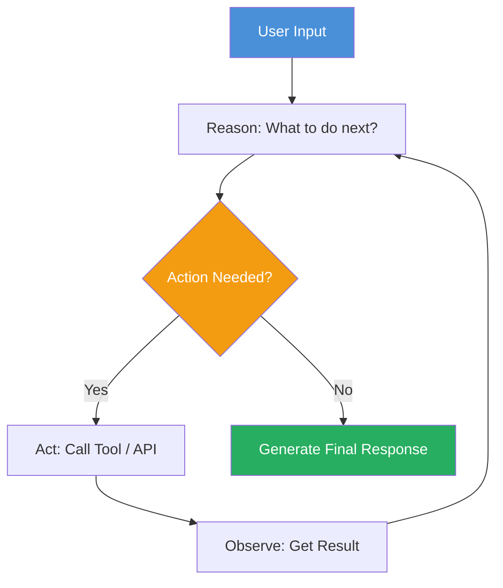

ReAct (Yao et al., 2022) combines reasoning traces with action execution:

```
Thought: I need to find the user's account information.
Action: search_account(user_id="12345")
Observation: Account not found in primary database.
Thought: Let me check the secondary database.
Action: search_account_archive(user_id="12345")
Observation: Account found in archive. Status: inactive.
Thought: The account is inactive. I should inform the user and offer reactivation.
Final: Your account (ID: 12345) is currently inactive. Would you like me to help you reactivate it?
```

### The RAG Loop

Retrieve → Generate → Evaluate → Retrieve more if needed.

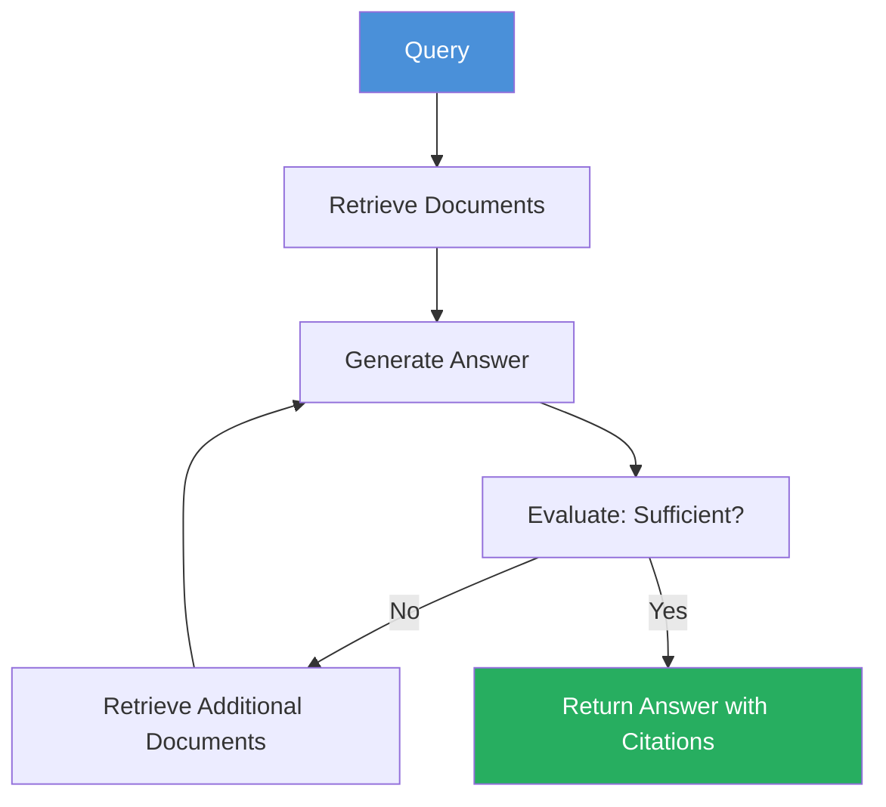

### The Code Generation Loop

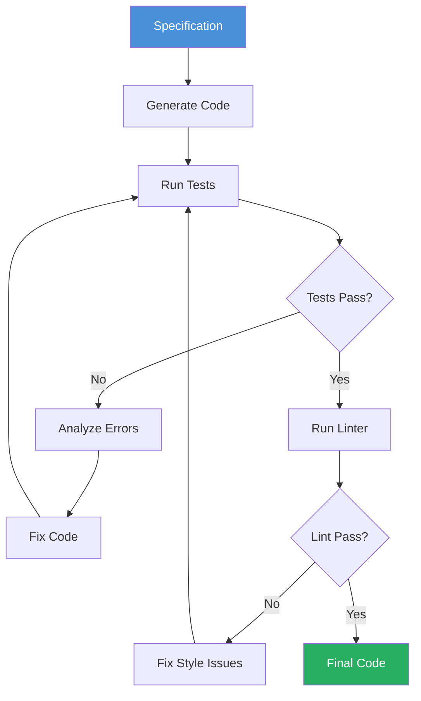

---

## 16. Cost Optimization

Loops amplify both capability and cost. Optimization is essential.

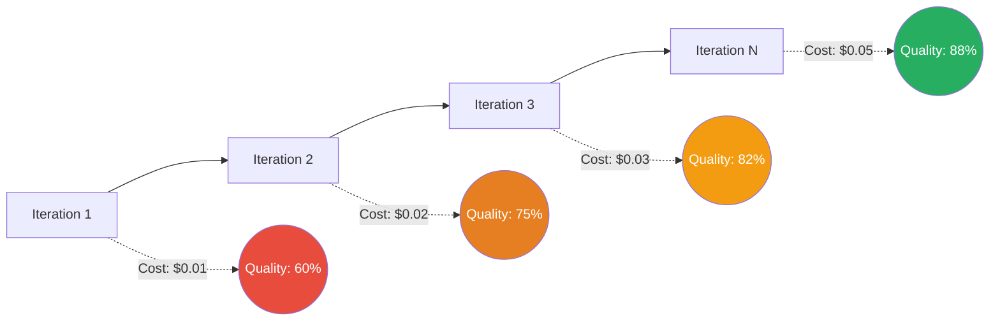

### Cost Optimization Strategies

**1. Early Stopping**
Stop when quality plateaus. Diminishing returns set in quickly.

```
Iteration 1: Quality 60% (cumulative cost: $0.01)
Iteration 2: Quality 75% (cumulative cost: $0.03)  ← +15%
Iteration 3: Quality 82% (cumulative cost: $0.06)  ← +7%
Iteration 4: Quality 85% (cumulative cost: $0.10)  ← +3% ← STOP
Iteration 5: Quality 86% (cumulative cost: $0.15)  ← +1%
```

**2. Increasingly Strict Evaluation**
Start with cheap checks, escalate to expensive ones only if needed.

```python
def cost_effective_evaluation(output, task):
    # 1. Cheap structural check
    if not passes_structure_check(output):
        return {"passed": False, "feedback": "Structure invalid"}
    
    # 2. Medium-cost heuristic check
    if not passes_heuristic_check(output):
        return {"passed": False, "feedback": "Heuristics failed"}
    
    # 3. Expensive LLM evaluation (only if cheap checks pass)
    evaluation = llm_evaluate(output, task)
    return evaluation
```

**3. Cheaper Models for Evaluation**
Use GPT-4o-mini or Claude Haiku to evaluate GPT-4o outputs.

**4. Caching Intermediate Results**
```python
cache = {}

def cached_llm_call(prompt, model="gpt-4o"):
    key = hash(prompt + model)
    if key in cache:
        return cache[key]
    result = llm(prompt, model=model)
    cache[key] = result
    return result
```

---

## 17. Latency Optimization

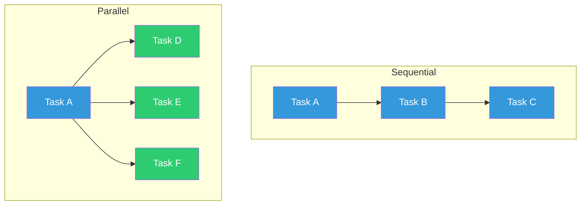

### Strategies

**1. Parallel LLM Calls**
When steps are independent, run them in parallel.

```python
import asyncio

async def parallel_evaluation(outputs, evaluator):
    tasks = [evaluator(output) for output in outputs]
    results = await asyncio.gather(*tasks)
    return results
```

**2. Streaming in Loops**
Stream LLM output and evaluate progressively.

**3. Async Execution**
Use async/await to overlap computation and I/O.

**4. Batching Evaluations**
Batch multiple evaluation calls into one LLM call.

---

## Comparison: Single Call vs. Loop Architecture

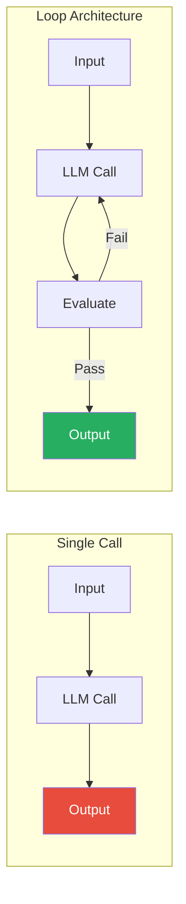

| Dimension | Single Call | Loop Architecture |
|---|---|---|
| Quality | First attempt only | Iteratively improving |
| Reliability | Brittle | Robust (retry, refine) |
| Cost | Fixed, predictable | Variable, potentially higher |
| Latency | Fast, predictable | Slower, variable |
| Complexity | Simple | Moderate |
| Debugging | Easy | Harder (iterations) |
| Use case | Simple Q&A, translation | Complex reasoning, code gen, agents |

---

## Summary

- **Loop engineering** transforms LLMs from single-shot predictors into iterative reasoning systems
- **Six components** define every loop: state, LLM call, output, evaluation, decision, state update
- **Eight loop types** cover the major patterns: refinement, feedback, reflection, critique, retry, validation, planning, recursive
- **Safety first:** infinite loops, cost explosions, and degenerate outputs are real risks
- **Optimize** cost with early stopping, cheap evaluators, and caching; optimize latency with parallelism and streaming
- **Production loops** (ReAct, RAG, code generation) combine multiple loop types into cohesive architectures
