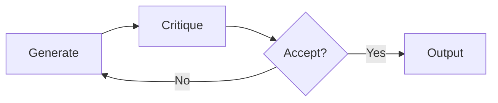

# Exercises — Graph Engineering

> 15+ hands-on exercises to build, query, and reason over knowledge graphs for AI systems.

---

## Foundation Exercises

### Exercise 1: Build a Mini Knowledge Graph

Create a property graph representing the AI research ecosystem:

- **Entities:** OpenAI, Google DeepMind, Anthropic, GPT-4, Gemini, Claude, Sam Altman, Demis Hassabis, Dario Amodei
- **Relationships:** developed, CEO_of, founded, competitor_of, partnered_with
- **Properties:** founded_date, headquarters, parameter_count

**Tasks:**
1. Design the schema (node labels, relationship types, properties)
2. Insert the data using Cypher (or Kuzu's syntax)
3. Query all competitors of OpenAI
4. Find all people who founded AI companies

### Exercise 2: RDF Triple Conversion

Convert the following sentences to RDF triples:

1. "Marie Curie discovered radium in 1898."
2. "Radium is a radioactive element."
3. "Marie Curie won the Nobel Prize in Physics in 1903."
4. "The Nobel Prize was established by Alfred Nobel."

**Tasks:**
1. Write each sentence as subject-predicate-object triples
2. Define a simple ontology (classes, properties, domains/ranges)
3. Write the triples in Turtle format
4. Write a SPARQL query to find all Nobel laureates

### Exercise 3: Graph Database Comparison

Set up the same small graph (10 nodes, 15 edges) in:

1. Neo4j (local or AuraDB free tier)
2. Kuzu (embedded, Python)
3. NetworkX (in-memory, Python)

**Tasks:**
1. Time the insertion of 100 nodes and 200 edges
2. Run a 2-hop traversal query 100 times and measure average latency
3. Compute PageRank on the graph
4. Compare developer experience (setup, query syntax, documentation)

---

## Entity Extraction Exercises

### Exercise 4: Extraction Pipeline

Build an entity extraction pipeline for news articles:

```python
def extract_from_article(text, llm):
    # Your implementation here
    pass
```

Use this article:

```
"Microsoft announced a $3 billion investment in OpenAI, the creator of ChatGPT.
The partnership, which began in 2019, has deepened significantly. Satya Nadella,
CEO of Microsoft, stated that AI is the most transformative technology of our time.
OpenAI, led by Sam Altman, recently launched GPT-4o, their most advanced model."
```

**Tasks:**
1. Extract entities (Person, Organization, Technology, Event)
2. Extract relationships with types
3. Resolve "OpenAI" vs "the creator of ChatGPT" to the same entity
4. Insert into a graph database
5. Query "What organizations are involved with GPT-4o?"

### Exercise 5: Schema Design Challenge

Design a schema for each domain:

**A. Healthcare Knowledge Graph**
- Patients, doctors, hospitals, diagnoses, treatments, medications
- What are the entity types? Relationship types? Properties?
- How do you model temporal data (e.g., a patient's diagnosis history)?

**B. Financial Transaction Graph**
- Accounts, transactions, customers, branches, merchants
- How do you model a transaction between two accounts?
- What properties are critical for fraud detection?

**C. Scientific Literature Graph**
- Papers, authors, institutions, citations, topics, datasets
- How do you model authorship ordering?
- How do you track dataset provenance?

### Exercise 6: Entity Resolution

Given these extracted entities from 5 different documents:

```json
[
  {"name": "Apple Inc.", "type": "Organization"},
  {"name": "Apple", "type": "Organization"},
  {"name": "Apple Computer Company", "type": "Organization"},
  {"name": "Apple Corps", "type": "Organization"},
  {"name": "Apple Inc", "type": "Organization"},
  {"name": "Tim Cook's Apple", "type": "Organization"}
]
```

**Tasks:**
1. Identify which entities refer to the same real-world entity
2. Design a resolution algorithm using string similarity (Levenshtein, Jaccard)
3. Design a resolution algorithm using embedding similarity
4. Design a resolution algorithm using graph neighborhood overlap
5. Implement a voting-based resolver that combines all three

---

## GraphRAG Exercises

### Exercise 7: Build a Mini GraphRAG

Implement a minimal GraphRAG system:

```python
class MiniGraphRAG:
    def __init__(self, llm):
        self.graph = nx.MultiDiGraph()
        self.llm = llm

    def index(self, text, doc_id):
        # 1. Chunk text
        # 2. Extract entities and relations using LLM
        # 3. Add to NetworkX graph
        pass

    def query(self, question):
        # 1. Extract query entities
        # 2. Find in graph
        # 3. Traverse 2 hops
        # 4. Format as context
        # 5. Generate answer with LLM
        pass
```

**Tasks:**
1. Index 3 Wikipedia articles of your choice
2. Ask 5 multi-hop questions
3. Compare answers with and without graph context
4. Measure the number of correct vs incorrect facts in each case

### Exercise 8: Community Detection

Using the graph from Exercise 7:

**Tasks:**
1. Run the Leiden community detection algorithm
2. For each community, compute:
   - Community size (number of nodes)
   - Internal edge density
   - Top 5 most central nodes
3. Use an LLM to generate a summary of each community
4. Implement a community-aware query: given a question, identify the relevant community and use its summary

### Exercise 9: Hierarchical Summarization

Implement hierarchical summarization for communities:

```python
def hierarchical_summarize(graph, llm, levels=3):
    """Create summaries at multiple levels of community granularity."""
    # Level 0: Fine-grained (small communities)
    # Level 1: Mid-level (merged communities)
    # Level 2: Coarse (large regions)
    pass
```

**Tasks:**
1. Run the Leiden algorithm at different resolution parameters
2. Summarize each level
3. For a query, determine the optimal summarization level
4. Implement map-reduce: summarize each community, then summarize the summaries

---

## Hybrid Search Exercises

### Exercise 10: Implement RRF

Implement Reciprocal Rank Fusion and compare with other fusion methods:

```python
def rrf(results_lists, k=60):
    pass

def weighted_sum(results_lists, weights):
    pass

def borda_count(results_lists):
    pass
```

**Tasks:**
1. Create 3 ranked lists from vector, keyword, and graph search
2. Fuse using RRF, weighted sum, and Borda count
3. Evaluate which fusion method gives the best results for 10 test queries
4. Tune the k parameter in RRF — what value works best?

### Exercise 11: Build a Hybrid Retriever

```python
class HybridRetriever:
    def __init__(self, vector_db, graph_db, bm25_index):
        pass

    def retrieve(self, query, top_k=10):
        # 1. Vector search
        # 2. BM25 keyword search
        # 3. Graph traversal
        # 4. RRF fusion
        # 5. Context assembly
        pass
```

Test with these query types:
- **Semantic:** "What are the latest advances in AI safety?"
- **Keyword-heavy:** "GPT-4 vs Claude 3 benchmark results 2024"
- **Multi-hop:** "Who founded the company that developed GPT-4?"
- **Ambiguous:** "What is Apple working on?"

---

## Graph Memory Exercises

### Exercise 12: Agent Memory System

Build a graph-based memory system for a conversational agent:

```python
class GraphMemory:
    def remember(self, user_input, agent_response):
        """Extract and store facts from conversation."""
        pass

    def recall(self, query):
        """Retrieve relevant facts for context."""
        pass

    def update(self, entity, new_fact):
        """Update existing entity with new information."""
        pass

    def consolidate(self):
        """Merge duplicate entities, prune old facts."""
        pass
```

**Tasks:**
1. Simulate 5 conversation turns about a user's project
2. Store entities (project name, tech stack, deadlines, team members)
3. In turn 3, change a deadline — ensure the update works
4. In turn 5, ask about the project — verify correct recall
5. Add temporal tracking (when was each fact stated?)

### Exercise 13: Temporal Graph Queries

```cypher
// Your task: Write queries for:
// 1. "What was Sam Altman's position at OpenAI in 2022?"
// 2. "List all CEOs of OpenAI in chronological order"
// 3. "Find all entities that changed during 2023"
```

**Tasks:**
1. Design a temporal graph schema (with valid_from/valid_to on relationships)
2. Insert historical data for 5 entities with time-bound relationships
3. Write queries for point-in-time facts
4. Write queries for time-range facts
5. Visualize entity state changes over time

---

## Reasoning Exercises

### Exercise 14: Multi-hop Reasoning

Given this graph:

```
[Einstein] -born_in-> [Ulm]
[Einstein] -developed-> [Relativity]
[Einstein] -worked_at-> [Patent Office, Bern]
[Einstein] -studied_at-> [ETH Zurich]
[ETH Zurich] -located_in-> [Zurich]
[Zurich] -located_in-> [Switzerland]
[Ulm] -located_in-> [Germany]
```

Answer these by writing traversal queries:
1. "Where was Einstein born?"
2. "What did Einstein develop and where did he study?"
3. "Which countries are associated with Einstein?"
4. "Find all paths between Einstein and Switzerland"
5. "What is the shortest path between the Patent Office and ETH Zurich?"

Then, implement a generic multi-hop reasoning function that takes a natural language question, extracts the start and end entities, and finds connecting paths.

### Exercise 15: Graph Algorithms

Using the AI Research graph from Exercise 1:

**Tasks:**
1. Compute **PageRank** — which entities are most important?
2. Compute **Betweenness Centrality** — which entities are bridges?
3. Run **Community Detection** — what clusters exist?
4. Find the **Shortest Path** between any two entities
5. Find all entities within 2 hops of "AI Safety"
6. Detect cycles in the graph (e.g., competing companies that also partner)

### Exercise 16: Path-Based Reasoning for QA

Implement a reasoning system that answers questions by finding paths:

```python
def reason_over_graph(question, graph):
    # 1. Parse question to extract entities and target type
    # 2. Find seed entities in graph
    # 3. Enumerate paths of length 1-3
    # 4. Score paths by relevance to the question
    # 5. Return top paths as reasoning chains
    pass
```

Test questions:
- "Why might a company that partners with Microsoft also compete with Google?"
- "What technologies connect AI research to medical applications?"

---

## Agent Graph Exercises

### Exercise 17: Build a State Machine Agent

Implement an agent orchestration graph:

```python
class AgentGraph:
    def add_node(self, name, function):
        pass

    def add_edge(self, from_node, to_node, condition=None):
        pass

    def run(self, initial_state):
        pass
```

**Tasks:**
1. Build a customer support agent with these nodes:
   - `classify`: Determine the issue type
   - `billing_handler`: Handle billing issues
   - `tech_support`: Handle technical issues
   - `general_handler`: Handle general inquiries
   - `escalate`: Escalate to human
2. Add conditional edges based on state
3. Add a max iteration limit to prevent infinite loops
4. Implement state validation at each node

### Exercise 18: Reflection Pattern

Implement the reflection pattern as a graph:



**Tasks:**
1. Build a code generation agent that writes and reviews its own code
2. The critique node should check: correctness, style, security
3. Add a max iterations limit (e.g., 3 attempts)
4. Log each iteration for debugging
5. Test it on: "Write a Python function to merge two sorted lists"

---

## Advanced Exercises

### Exercise 19: Production Monitoring

Design a monitoring system for a production GraphRAG pipeline:

**Tasks:**
1. Track extraction quality (entity count, relation count per document)
2. Monitor graph growth (nodes, edges, density over time)
3. Measure retrieval latency (vector, keyword, graph, fusion)
4. Set up alerts for: empty results, high latency, schema violations
5. Design an A/B testing framework for extraction prompts

### Exercise 20: GraphRAG Evaluation

Design evaluation metrics for GraphRAG systems:

**Tasks:**
1. **Retrieval metrics:** Recall@K, MRR, NDCG for subgraph retrieval
2. **Generation metrics:** Factuality (correct facts in answer), completeness (what's missing)
3. **Graph metrics:** Graph density, community separation, entity resolution accuracy
4. **End-to-end:** Human evaluation of answer quality with and without graph context
5. Implement an evaluation harness that runs 50 test queries and computes all metrics

---

## Submission Checklist

For each exercise, ensure you have:

- [ ] Code runs without errors
- [ ] Queries return expected results
- [ ] Edge cases handled (empty input, missing entities, ambiguous queries)
- [ ] Performance measured (for exercises 3, 7, 10, 15)
- [ ] Documentation of design decisions and trade-offs
