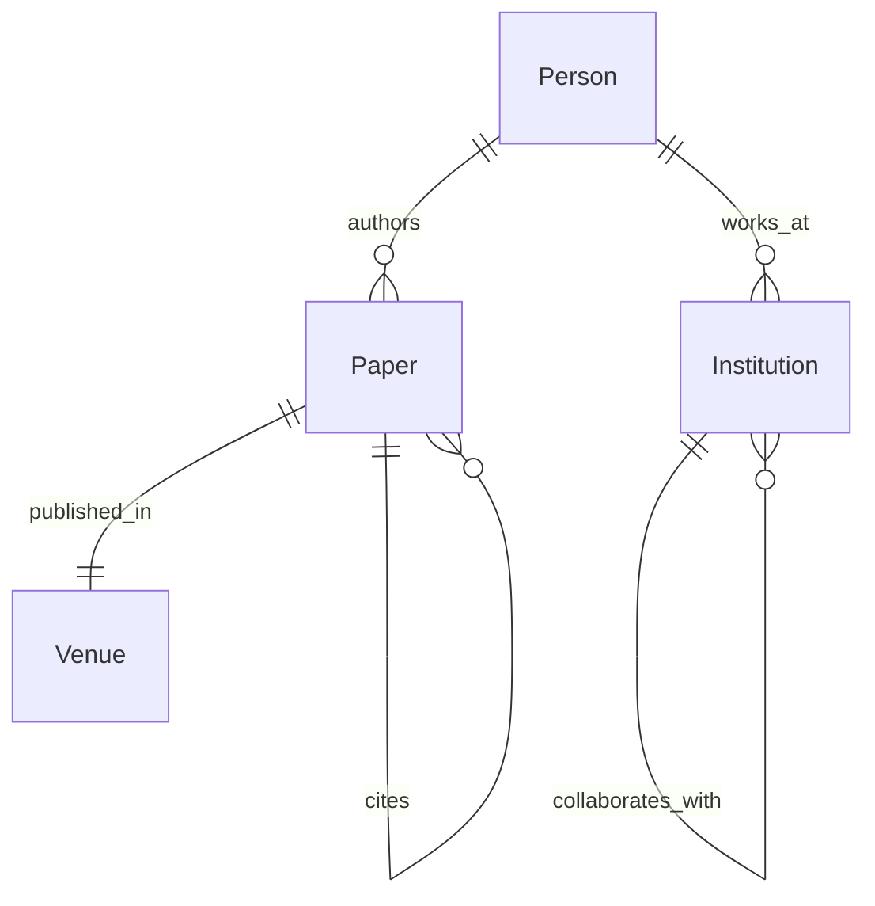

# Project: Build a GraphRAG System

> Build a production-ready GraphRAG system that indexes documents, constructs a knowledge graph, and answers multi-hop questions with structured reasoning.

---

## Overview

In this project, you will build a complete GraphRAG system from scratch:

1. Design a knowledge graph schema for a domain of your choice
2. Build an entity extraction pipeline using LLMs
3. Construct a knowledge graph in Neo4j (or Kuzu)
4. Implement community detection with hierarchical summarization
5. Build a hybrid retrieval system combining vector, keyword, and graph search
6. Create a query interface that answers complex multi-hop questions
7. Evaluate and optimize the system

**Time estimate:** 40-60 hours | **Difficulty:** Advanced

---

## Domain Selection

Choose one of the following domains for your GraphRAG system:

### Option A: AI Research Literature
Index 50-100 AI research papers (use arXiv API). Answer questions about papers, authors, institutions, methods, and results.

**Example queries:**
- "What papers on LLM safety were published in 2024 by researchers at Stanford?"
- "Which institutions collaborate with Google DeepMind on reinforcement learning?"
- "Find all papers that cite both the Transformer paper and the GPT-3 paper."

### Option B: Biomedical Knowledge
Index 20-30 biomedical articles or drug databases. Answer questions about drugs, diseases, genes, and treatments.

**Example queries:**
- "What drugs target the EGFR gene for lung cancer treatment?"
- "Which side effects are shared between drugs that treat hypertension?"
- "Find all genes associated with both Alzheimer's and type 2 diabetes."

### Option C: Company & Product Knowledge
Index 50-100 news articles about tech companies and their products.

**Example queries:**
- "What AI models have been developed by companies founded by former Google employees?"
- "Which companies partnered with Microsoft in 2023-2024?"
- "Find all acquisitions in the AI chip space."

---

## Phase 1: Schema Design

### Step 1.1: Define Entity Types

List 5-10 entity types for your domain with properties:

```json
{
  "entity_type": "Person",
  "description": "A person mentioned in the domain",
  "properties": [
    {"name": "name", "type": "string", "required": true},
    {"name": "affiliation", "type": "string", "required": false}
  ]
}
```

### Step 1.2: Define Relationship Types

```json
{
  "relationship": "AUTHORED",
  "description": "A person authored a paper",
  "source_types": ["Person"],
  "target_types": ["Paper"],
  "properties": [
    {"name": "year", "type": "integer", "required": false}
  ]
}
```

### Step 1.3: Create Schema Diagram



**Deliverable:** Schema document with entity types, relationship types, properties, and a schema diagram.

---

## Phase 2: Document Collection & Preparation

### Step 2.1: Collect Documents

| Domain | Source | Method |
|---|---|---|
| AI Research | arXiv API | `pip install arxiv` |
| Biomedical | PubMed API | `pip install biopython` |
| Tech News | NewsAPI, RSS | `pip install feedparser` |

Collect at least 20 documents. Aim for 50-100.

### Step 2.2: Preprocess Documents

```python
import re, hashlib, json, sqlite3

def preprocess(text, metadata):
    text = re.sub(r'\s+', ' ', text).strip()
    text = text.encode('utf-8', 'ignore').decode('utf-8')
    return {"text": text, "metadata": metadata, "hash": hashlib.md5(text.encode()).hexdigest()}
```

### Step 2.3: Create Document Store

```python
class DocumentStore:
    def __init__(self, path="documents.db"):
        self.conn = sqlite3.connect(path)
        self.conn.execute("""
            CREATE TABLE IF NOT EXISTS documents (
                id TEXT PRIMARY KEY, title TEXT, text TEXT,
                metadata TEXT, hash TEXT, indexed INTEGER DEFAULT 0
            )
        """)

    def add(self, doc_id, title, text, metadata):
        self.conn.execute(
            "INSERT OR REPLACE INTO documents VALUES (?, ?, ?, ?, ?, 0)",
            (doc_id, title, text, json.dumps(metadata), hashlib.md5(text.encode()).hexdigest())
        )
        self.conn.commit()

    def get_unindexed(self):
        return self.conn.execute("SELECT * FROM documents WHERE indexed = 0").fetchall()
```

**Deliverable:** 20+ collected and preprocessed documents in a document store.

---

## Phase 3: Entity Extraction Pipeline

### Step 3.1: Implement Chunking

```python
def chunk_document(text, chunk_size=500, overlap=50):
    chunks = []
    start = 0
    while start < len(text):
        end = min(start + chunk_size, len(text))
        if end < len(text):
            last_period = text.rfind(". ", start, end)
            if last_period > start + chunk_size // 2:
                end = last_period + 1
        chunks.append({"text": text[start:end], "start": start, "end": end})
        start = end - overlap
    return chunks
```

### Step 3.2: Build Extraction Function

```python
from openai import OpenAI
import json

class EntityExtractor:
    def __init__(self, api_key, schema):
        self.client = OpenAI(api_key=api_key)
        self.schema = schema

    def extract(self, text):
        types = "\n".join([f"- {t}" for t in self.schema["entities"]])
        rels = "\n".join([f"- {r}: {v['source_types']} -> {v['target_types']}" for r, v in self.schema["relationships"].items()])
        prompt = f"""Extract entities and relationships from text.

Entity Types:\n{types}\n
Relationship Types:\n{rels}\n
Return JSON:
{{"entities": [{{"name": str, "type": str, "properties": {{}}}}],
  "relationships": [{{"source": str, "target": str, "type": str}}]}}"""

        response = self.client.chat.completions.create(
            model="gpt-4",
            messages=[{"role": "system", "content": prompt}, {"role": "user", "content": text}],
            response_format={"type": "json_object"}, temperature=0
        )
        return json.loads(response.choices[0].message.content)
```

### Step 3.3: Implement Entity Resolution

```python
from rapidfuzz import fuzz

class EntityResolver:
    def __init__(self, threshold=0.85):
        self.entities = {}
        self.threshold = threshold

    def resolve(self, extracted):
        resolved = []
        for entity in extracted:
            match = self._find_match(entity["name"])
            if match:
                self.entities[match]["mention_count"] += 1
                resolved.append(self.entities[match])
            else:
                self.entities[entity["name"]] = {
                    "name": entity["name"], "type": entity["type"],
                    "mention_count": 1, "sources": [entity.get("source")]
                }
                resolved.append(self.entities[entity["name"]])
        return resolved

    def _find_match(self, name):
        best, best_score = None, 0
        for canon in self.entities:
            score = fuzz.token_sort_ratio(name.lower(), canon.lower()) / 100.0
            if score > best_score:
                best_score, best = score, canon
        return best if best_score >= self.threshold else None
```

### Step 3.4: Run Extraction Pipeline

```python
class ExtractionPipeline:
    def __init__(self, api_key, schema):
        self.extractor = EntityExtractor(api_key, schema)
        self.resolver = EntityResolver()

    def process(self, doc_id, text):
        chunks = chunk_document(text)
        all_entities, all_rels = [], []
        for i, chunk in enumerate(chunks):
            result = self.extractor.extract(chunk["text"])
            for e in result.get("entities", []):
                e["source"] = {"doc_id": doc_id, "chunk": i}
            all_entities.extend(result.get("entities", []))
            all_rels.extend(result.get("relationships", []))
        return self.resolver.resolve(all_entities), all_rels
```

**Deliverable:** Working extraction pipeline that processes all documents and produces entities + relationships.

---

## Phase 4: Graph Construction

### Step 4.1: Set Up Graph Database

**Option A: Neo4j** (recommended for production)

```python
from neo4j import GraphDatabase

class GraphDB:
    def __init__(self, uri="bolt://localhost:7687", user="neo4j", password="password"):
        self.driver = GraphDatabase.driver(uri, auth=(user, password))
        self._init_schema()

    def _init_schema(self):
        with self.driver.session() as session:
            session.run("CREATE CONSTRAINT IF NOT EXISTS FOR (e:Entity) REQUIRE e.name IS UNIQUE")
            session.run("CREATE INDEX IF NOT EXISTS FOR (e:Entity) ON (e.type)")

    def insert_entity(self, entity):
        with self.driver.session() as session:
            session.run("""
                MERGE (e:Entity {name: $name})
                ON CREATE SET e.type = $type, e.mention_count = 1
                ON MATCH SET e.mention_count = e.mention_count + 1
            """, {"name": entity["name"], "type": entity["type"]})

    def insert_relationship(self, source, target, rel_type):
        with self.driver.session() as session:
            session.run("""
                MATCH (s:Entity {name: $source})
                MATCH (t:Entity {name: $target})
                MERGE (s)-[r:RELATED {type: $type}]->(t)
            """, {"source": source, "target": target, "type": rel_type})

    def close(self):
        self.driver.close()
```

**Option B: Kuzu** (recommended for local/embedded)

```python
import kuzu

class KuzuGraphDB:
    def __init__(self, path="graphrag_db"):
        self.db = kuzu.Database(path)
        self.conn = kuzu.Connection(self.db)
        self._init_schema()

    def _init_schema(self):
        self.conn.execute("CREATE NODE TABLE IF NOT EXISTS Entity (name STRING, type STRING, PRIMARY KEY (name))")
        self.conn.execute("CREATE REL TABLE IF NOT EXISTS RELATED (FROM Entity TO Entity, type STRING)")

    def insert_entity(self, entity):
        self.conn.execute(
            "MERGE (e:Entity {name: $name}) ON CREATE SET e.type = $type",
            {"name": entity["name"], "type": entity["type"]}
        )

    def insert_relationship(self, source, target, rel_type):
        self.conn.execute("""
            MATCH (s:Entity {name: $source}), (t:Entity {name: $target})
            MERGE (s)-[:RELATED {type: $type}]->(t)
        """, {"source": source, "target": target, "type": rel_type})
```

### Step 4.2: Insert All Data

```python
def build_graph(pipeline, store, graph_db):
    docs = store.get_unindexed()
    for doc in docs:
        doc_id, title, text, metadata, _, _ = doc
        entities, rels = pipeline.process(doc_id, text)
        for e in entities:
            graph_db.insert_entity(e)
        for r in rels:
            graph_db.insert_relationship(r["source"], r["target"], r["type"])
        store.conn.execute("UPDATE documents SET indexed = 1 WHERE id = ?", (doc_id,))
        store.conn.commit()
        print(f"Indexed {doc_id}: {len(entities)} entities, {len(rels)} relationships")
```

**Deliverable:** A populated knowledge graph with entities, relationships, and unique constraints.

---

## Phase 5: Community Detection & Summarization

### Step 5.1: Export Graph to NetworkX

```python
import networkx as nx
from collections import defaultdict

def export_to_networkx(graph_db):
    G = nx.Graph()
    if isinstance(graph_db, KuzuGraphDB):
        result = graph_db.conn.execute("MATCH (s:Entity)-[r:RELATED]->(t:Entity) RETURN s.name, t.name, r.type")
        while result.has_next():
            row = result.get_next()
            G.add_edge(row[0], row[1], type=row[2])
    else:  # Neo4j
        with graph_db.driver.session() as session:
            result = session.run("MATCH (s)-[r:RELATED]->(t) RETURN s.name, t.name, r.type")
            for record in result:
                G.add_edge(record["s.name"], record["t.name"], type=record["r.type"])
    return G
```

### Step 5.2: Run Community Detection

```python
from community import community_louvain
from openai import OpenAI

def detect_communities(G):
    partition = community_louvain.best_partition(G)
    communities = defaultdict(list)
    for node, community_id in partition.items():
        communities[community_id].append(node)
    return communities

def summarize_communities(communities, G, llm_client):
    summaries = {}
    for cid, nodes in communities.items():
        subgraph = G.subgraph(nodes)
        edges = list(subgraph.edges(data=True))
        edge_text = "\n".join([
            f"{s} --{d.get('type', 'RELATED')}--> {t}" for s, t, d in edges[:30]
        ])
        prompt = f"""Summarize this community of entities:

Nodes ({len(nodes)}): {', '.join(nodes[:15])}
Relationships:\n{edge_text}

Provide a 2-3 sentence summary."""
        response = llm_client.chat.completions.create(
            model="gpt-4",
            messages=[{"role": "user", "content": prompt}], temperature=0
        )
        summaries[cid] = response.choices[0].message.content
    return summaries
```

### Step 5.3: Build Hierarchical Summaries

```python
def hierarchical_summaries(communities, G, llm_client, levels=2):
    """Build summaries at multiple levels of granularity."""
    all_summaries = {}

    # Level 0: individual community summaries
    all_summaries[0] = summarize_communities(communities, G, llm_client)

    if levels > 1:
        # Level 1: merge related communities
        community_graph = nx.Graph()
        for cid, nodes in communities.items():
            community_graph.add_node(cid, size=len(nodes))
        for u, v in G.edges():
            cu = [c for c, nodes in communities.items() if u in nodes][0]
            cv = [c for c, nodes in communities.items() if v in nodes][0]
            if cu != cv:
                community_graph.add_edge(cu, cv)

        l1_partition = community_louvain.best_partition(community_graph)
        l1_communities = defaultdict(list)
        for cid, group in l1_partition.items():
            l1_communities[group].extend(communities[cid])

        all_summaries[1] = summarize_communities(l1_communities, G, llm_client)

    return all_summaries
```

**Deliverable:** Community hierarchy with LLM-generated summaries at each level.

---

## Phase 6: Hybrid Retrieval

### Step 6.1: Implement Vector Search

```python
import numpy as np
from openai import OpenAI

class VectorSearch:
    def __init__(self, api_key):
        self.client = OpenAI(api_key=api_key)
        self.embeddings = {}

    def add_entity(self, name, text):
        response = self.client.embeddings.create(model="text-embedding-3-small", input=text)
        self.embeddings[name] = np.array(response.data[0].embedding)

    def search(self, query, k=10):
        q_emb = np.array(self.client.embeddings.create(
            model="text-embedding-3-small", input=query
        ).data[0].embedding)

        scores = [(name, np.dot(q_emb, emb) / (np.linalg.norm(q_emb) * np.linalg.norm(emb)))
                  for name, emb in self.embeddings.items()]
        return sorted(scores, key=lambda x: x[1], reverse=True)[:k]
```

### Step 6.2: Implement Graph Search

```python
class GraphSearch:
    def __init__(self, graph_db):
        self.graph = graph_db

    def search_by_entity(self, entity_name, hops=2):
        if isinstance(self.graph, KuzuGraphDB):
            result = self.graph.conn.execute("""
                MATCH (s:Entity {name: $name})-[r:RELATED*1..$hops]-(connected)
                RETURN DISTINCT connected.name AS name, connected.type AS type
            """, {"name": entity_name, "hops": hops})
            items = []
            while result.has_next():
                row = result.get_next()
                items.append({"name": row[0], "type": row[1]})
            return items
        return []

    def search(self, query, k=10):
        # Simple implementation: extract entities from query, find in graph
        # For proper implementation, integrate with entity extraction
        entities = [q.strip() for q in query.split() if q[0].isupper()]
        results = []
        for entity in entities:
            results.extend(self.search_by_entity(entity, hops=2))
        return results[:k]
```

### Step 6.3: Implement RRF Fusion

```python
def rrf_fusion(results_lists, k=60):
    scores = {}
    for results in results_lists:
        for rank, item in enumerate(results):
            item_id = item[0] if isinstance(item, tuple) else item.get("name", str(item))
            scores[item_id] = scores.get(item_id, 0) + 1.0 / (k + rank + 1)
    return sorted(scores.items(), key=lambda x: x[1], reverse=True)
```

### Step 6.4: Build Hybrid Retriever

```python
class HybridRetriever:
    def __init__(self, vector_search, graph_search, keyword_search=None):
        self.vector = vector_search
        self.graph = graph_search
        self.keyword = keyword_search

    def retrieve(self, query, top_k=10):
        vector_results = self.vector.search(query, k=top_k * 2)
        graph_results = self.graph.search(query, k=top_k * 2)
        keyword_results = self.keyword.search(query, k=top_k * 2) if self.keyword else []

        fused = rrf_fusion([vector_results, graph_results, keyword_results])
        return fused[:top_k]
```

**Deliverable:** Hybrid retriever that combines vector, keyword, and graph search with RRF fusion.

---

## Phase 7: Query Interface

### Step 7.1: Build the GraphRAG Query Engine

```python
class GraphRAGQueryEngine:
    def __init__(self, graph_db, retriever, llm_client, community_summaries):
        self.graph = graph_db
        self.retriever = retriever
        self.llm = llm_client
        self.community_summaries = community_summaries

    def query(self, question):
        # 1. Retrieve relevant context
        results = self.retriever.retrieve(question, top_k=15)

        # 2. Get community context for top results
        community_context = ""
        if self.community_summaries:
            # Map top entities to their communities
            top_entities = [name for name, _ in results[:5]]
            for entity in top_entities:
                for level, summaries in self.community_summaries.items():
                    for cid, summary in summaries.items():
                        if any(entity in s for s in [[e] for e in summary.split()]):
                            community_context += f"\n[Community] {summary[:200]}...\n"

        # 3. Get subgraph facts
        subgraph_facts = []
        for name, _ in results[:10]:
            if isinstance(self.graph, KuzuGraphDB):
                result = self.graph.conn.execute("""
                    MATCH (s:Entity {name: $name})-[r:RELATED]->(t)
                    RETURN s.name, r.type, t.name LIMIT 5
                """, {"name": name})
                while result.has_next():
                    row = result.get_next()
                    subgraph_facts.append(f"{row[0]} -[{row[1]}]-> {row[2]}")

        # 4. Format context
        context = "\n".join(subgraph_facts[:30])
        if community_context:
            context += "\n\nCommunity Context:\n" + community_context

        # 5. Generate answer
        prompt = f"""Answer the question using the knowledge graph context below.
If the context is insufficient, say so.

Knowledge Graph Context:
{context}

Question: {question}
Answer:"""

        response = self.llm.chat.completions.create(
            model="gpt-4",
            messages=[{"role": "user", "content": prompt}],
            temperature=0
        )
        return response.choices[0].message.content
```

### Step 7.2: Create a Simple CLI

```python
def main():
    import os
    from openai import OpenAI

    # Init components
    api_key = os.environ.get("OPENAI_API_KEY")
    llm = OpenAI(api_key=api_key)
    graph = KuzuGraphDB("graphrag_db")
    vec = VectorSearch(api_key)

    # Load entities into vector search
    result = graph.conn.execute("MATCH (e:Entity) RETURN e.name, e.type")
    while result.has_next():
        row = result.get_next()
        vec.add_entity(row[0], f"{row[0]} is a {row[1]}")

    retriever = HybridRetriever(vec, GraphSearch(graph))
    engine = GraphRAGQueryEngine(graph, retriever, llm, {})

    print("GraphRAG Query Engine Ready. Type 'quit' to exit.")
    while True:
        q = input("\nQuery: ").strip()
        if q.lower() == "quit":
            break
        answer = engine.query(q)
        print(f"\nAnswer: {answer}")

if __name__ == "__main__":
    main()
```

### Step 7.3: Test with Multi-Hop Queries

Create a test suite of 10 queries that require multi-hop reasoning:

```python
TEST_QUERIES = [
    "What papers did researchers at companies founded by Stanford alumni publish?",
    "Which organizations partnered with companies that developed AI models?",
    "Find all people who work at organizations that collaborate with Google.",
    # Add 7 more domain-specific multi-hop queries
]

def evaluate(engine, queries):
    for q in queries:
        answer = engine.query(q)
        print(f"Q: {q}\nA: {answer}\n---")
```

**Deliverable:** Working query interface that answers multi-hop questions using the knowledge graph.

---

## Phase 8: Evaluation

### Step 8.1: Define Metrics

```python
def evaluate_retrieval(engine, test_queries_with_relevant):
    """Evaluate retrieval quality using Recall@K and MRR."""
    recalls = []
    mrrs = []

    for query, relevant_set in test_queries_with_relevant:
        results = engine.retriever.retrieve(query, top_k=10)
        retrieved = set(name for name, _ in results)

        # Recall@K
        recall = len(retrieved & relevant_set) / len(relevant_set) if relevant_set else 0
        recalls.append(recall)

        # MRR
        for rank, (name, _) in enumerate(results):
            if name in relevant_set:
                mrrs.append(1.0 / (rank + 1))
                break
        else:
            mrrs.append(0)

    return {
        "avg_recall_at_10": sum(recalls) / len(recalls),
        "avg_mrr": sum(mrrs) / len(mrrs)
    }
```

### Step 8.2: Evaluate Answer Quality

```python
def evaluate_answer_quality(engine, test_queries_with_expected):
    """Evaluate generation quality."""
    scores = []
    for query, expected_facts in test_queries_with_expected:
        answer = engine.query(query)
        # Check how many expected facts appear in the answer
        facts_found = sum(1 for fact in expected_facts if fact.lower() in answer.lower())
        completeness = facts_found / len(expected_facts) if expected_facts else 0
        scores.append(completeness)

    return {"avg_completeness": sum(scores) / len(scores)}
```

### Step 8.3: A/B Test Against Traditional RAG

Build a simple vector RAG system and compare:

```python
def compare_rag_vs_graphrag(vector_rag, graphrag, test_queries):
    results = []
    for q in test_queries:
        v_answer = vector_rag.query(q)
        g_answer = graphrag.query(q)
        results.append({
            "query": q,
            "vector_length": len(v_answer),
            "graph_length": len(g_answer),
            "vector_has_citations": "[" in v_answer,
            "graph_has_citations": "[" in g_answer
        })
    return results
```

**Deliverable:** Evaluation results with retrieval metrics and answer quality scores.

---

## Phase 9: Optimization & Production Readiness

### Step 9.1: Add Caching

```python
import redis
import json

class Cache:
    def __init__(self, host="localhost", port=6379, ttl=3600):
        self.client = redis.Redis(host=host, port=port, decode_responses=True)
        self.ttl = ttl

    def get(self, key):
        val = self.client.get(f"graphrag:{key}")
        return json.loads(val) if val else None

    def set(self, key, value):
        self.client.setex(f"graphrag:{key}", self.ttl, json.dumps(value))
```

### Step 9.2: Add Monitoring

```python
import time
from collections import defaultdict

class Metrics:
    def __init__(self):
        self.latencies = defaultdict(list)
        self.counts = defaultdict(int)
        self.errors = defaultdict(int)

    def track(self, operation):
        def decorator(func):
            def wrapper(*args, **kwargs):
                start = time.time()
                try:
                    result = func(*args, **kwargs)
                    self.latencies[operation].append(time.time() - start)
                    self.counts[operation] += 1
                    return result
                except Exception as e:
                    self.errors[operation] += 1
                    raise
            return wrapper
        return decorator

    def report(self):
        return {
            op: {
                "count": self.counts[op],
                "p50": sorted(vals)[len(vals)//2] if vals else 0,
                "p95": sorted(vals)[int(len(vals)*0.95)] if vals else 0,
                "errors": self.errors[op]
            }
            for op, vals in self.latencies.items()
        }
```

### Step 9.3: Implement Graceful Fallbacks

```python
def robust_query(engine, question):
    try:
        return engine.query(question)
    except Exception as e:
        print(f"GraphRAG query failed: {e}")
        # Fallback to vector-only
        try:
            results = engine.retriever.vector.search(question, k=5)
            context = "\n".join([f"{name}" for name, _ in results])
            prompt = f"Context:\n{context}\n\nQuestion: {question}\nAnswer:"
            return engine.llm.chat.completions.create(
                model="gpt-4",
                messages=[{"role": "user", "content": prompt}]
            ).choices[0].message.content
        except:
            # Final fallback: LLM only
            return engine.llm.chat.completions.create(
                model="gpt-4",
                messages=[{"role": "user", "content": question}]
            ).choices[0].message.content
```

**Deliverable:** Production-ready GraphRAG with caching, monitoring, and fallback chains.

---

## Deliverables Summary

| Phase | Deliverable | Check |
|---|---|---|
| 1 | Schema document with entity types, relationship types, diagram | [] |
| 2 | 20+ documents in document store | [] |
| 3 | Working extraction pipeline | [] |
| 4 | Populated knowledge graph (Neo4j or Kuzu) | [] |
| 5 | Community hierarchy with summaries | [] |
| 6 | Hybrid retriever (vector + keyword + graph + RRF) | [] |
| 7 | Query interface answering multi-hop questions | [] |
| 8 | Evaluation metrics and comparison | [] |
| 9 | Caching, monitoring, and fallback chains | [] |

---

## Extension Ideas

- **Web UI:** Build a Streamlit or Gradio interface for your GraphRAG system
- **Real-time updates:** Add streaming ingestion for new documents
- **Multi-modal:** Incorporate images and tables into the knowledge graph
- **Federated graphs:** Connect multiple knowledge graphs across domains
- **Fine-tuned extraction:** Train a smaller NER model on your extraction data
- **Graph visualization:** Add interactive graph exploration (D3.js, PyVis)
- **Agent integration:** Connect your GraphRAG to an agent framework (LangGraph)

---

## Grading Rubric

| Criteria | Excellent | Good | Needs Work |
|---|---|---|---|
| **Schema Design** | 5+ entity types, 5+ relationship types, clear rationale | 3-4 types, basic relationships | < 3 types or no schema |
| **Extraction Quality** | > 80% accuracy on test set | > 60% accuracy | < 60% or not evaluated |
| **Graph Size** | 100+ nodes, 200+ edges | 50+ nodes, 100+ edges | < 50 nodes |
| **Community Detection** | Hierarchical with summaries | Flat communities | Not implemented |
| **Hybrid Retrieval** | Vector + keyword + graph + RRF | Two of three | One or none |
| **Multi-hop Queries** | Answers 5+ complex queries | Answers 2-4 | Answers 0-1 |
| **Evaluation** | Comprehensive metrics + A/B test | Basic metrics | No evaluation |
| **Production Features** | Caching + monitoring + fallbacks | One feature | None |
