# 05 — Graph Engineering

> *"Graphs are the natural way to represent structured knowledge. Unlike flat text, graphs show relationships explicitly."*

---

## Table of Contents

1. [What Is Graph Engineering?](#1-what-is-graph-engineering)
2. [Knowledge Graph Fundamentals](#2-knowledge-graph-fundamentals)
3. [Graph Databases](#3-graph-databases)
4. [GraphRAG](#4-graphrag)
5. [Entity Extraction](#5-entity-extraction)
6. [Graph Indexing](#6-graph-indexing)
7. [Hybrid Search](#7-hybrid-search)
8. [Graph Memory](#8-graph-memory)
9. [Reasoning Over Graphs](#9-reasoning-over-graphs)
10. [Agent Graphs](#10-agent-graphs)

---

## 1. What Is Graph Engineering?

Graph engineering is the discipline of designing, building, and operating graph-based data structures and retrieval systems for AI applications. It sits at the intersection of knowledge representation, database engineering, and AI system design.

### Why Graphs Matter for AI

Large language models (LLMs) have a fundamental limitation: they reason over flat sequences of tokens. The world, however, is not flat — it is richly connected. Entities have relationships, facts have context, and knowledge has structure.

| Flat Text | Graph |
|---|---|
| "Einstein developed relativity" | `[Einstein] —developed→ [Theory of Relativity]` |
| Implicit relationships | Explicit edges |
| Linear retrieval | Multi-hop traversal |
| No structure validation | Schema-enforced integrity |

Graphs solve three critical problems in AI systems:

**1. Factual Grounding** — Graphs store verified facts. When an LLM retrieves from a graph, it retrieves grounded triples, not probabilistic token sequences.

**2. Multi-hop Reasoning** — A question like "What companies founded by alumni of Stanford are based in Berlin?" requires joining multiple facts. Graphs make this natural via path traversal.

**3. Structured Memory** — Agents that operate over long periods need structured memory. Graphs provide a schema for storing, updating, and querying entity state over time.

### Mental Model: The Knowledge Layer

Think of graph engineering as building a **structured knowledge layer** between your data and your AI:

```
Raw Documents → Entity Extraction → Knowledge Graph → Retrieval → LLM Context
     ↓                ↓                  ↓               ↓              ↓
  Unstructured    Structure        Relationships    Relevant       Augmented
    Text          Extraction       + Facts          Subgraphs      Generation
```

### Core Concepts

- **Nodes** — Entities (people, places, concepts, events)
- **Edges** — Relationships (works_at, located_in, founded_by)
- **Properties** — Attributes on nodes or edges (age, date, weight)
- **Traversal** — Walking the graph along edges to find connected information
- **Subgraph** — A subset of the graph relevant to a query or context

### The Graph Engineering Stack

```
┌─────────────────────────────────────────┐
│           Application Layer              │
│  (Agents, RAG, Analytics, Search)        │
├─────────────────────────────────────────┤
│           GraphRAG Layer                 │
│  (Retrieval, Community Detection,        │
│   Hierarchical Summarization)            │
├─────────────────────────────────────────┤
│           Graph Database / Store         │
│  (Neo4j, Kuzu, Memgraph, NetworkX)       │
├─────────────────────────────────────────┤
│           Extraction Pipeline            │
│  (LLM-based NER, Relation Extraction,    │
│   Schema Mapping)                        │
├─────────────────────────────────────────┤
│           Source Data Layer              │
│  (Documents, Databases, APIs, Logs)      │
└─────────────────────────────────────────┘
```

---

## 2. Knowledge Graph Fundamentals

### What Is a Knowledge Graph?

A knowledge graph (KG) is a structured representation of facts where entities are nodes and relationships are edges. Unlike a flat database table, a knowledge graph explicitly models how things connect.

### RDF Triples

The atomic unit of a knowledge graph is the triple: **subject → predicate → object**.

```
[Albert Einstein] ─── [developed] ─── [Theory of Relativity]
     │                                        │
     │                                        │
     ▼                                        ▼
  [Physicist]                              [Scientific Theory]
```

```turtle
@prefix ex: <http://example.org/> .

ex:Einstein    ex:developed    ex:Relativity .
ex:Einstein    ex:type         ex:Physicist .
ex:Relativity  ex:type         ex:ScientificTheory .
```

RDF (Resource Description Framework) is the W3C standard for representing this. Each triple forms a directed edge labeled with the predicate.

### Property Graphs vs RDF

| Aspect | Property Graph | RDF |
|---|---|---|
| **Data Model** | Nodes + Relationships + Properties | Triples (subject-predicate-object) |
| **Schema** | Optional, label-based | Ontology-based (OWL, RDFS) |
| **Query Language** | Cypher, Gremlin, GQL | SPARQL |
| **Storage** | Adjacency lists, native graph | Triple stores |
| **Use Case** | Applications, analytics | Linked data, semantic web |
| **Performance** | Fast traversals, good for paths | Good for inference, SPARQL joins |
| **Example Systems** | Neo4j, Kuzu, Memgraph | Apache Jena, Virtuoso, GraphDB |

**When to use Property Graphs:**
- Building AI/ML applications
- Real-time traversal and path finding
- GraphRAG and agent memory
- Analytics on densely connected data

**When to use RDF:**
- Semantic web integration
- Data interoperability across organizations
- Logical inference and reasoning
- Schema evolution and ontology management

### Graph Schema Design

A good graph schema is the foundation of a performant knowledge graph.

```cypher
// Node labels with properties
(:Person {name, birthDate, nationality})
(:Organization {name, founded, headquarters})
(:Paper {title, year, venue})
(:Concept {name, definition})

// Relationship types
(:Person)-[:AUTHORED]->(:Paper)
(:Person)-[:AFFILIATED_WITH]->(:Organization)
(:Paper)-[:INTRODUCES]->(:Concept)
(:Paper)-[:CITES]->(:Paper)
(:Person)-[:STUDIED_AT]->(:Organization {field, degree, year})
```

### Graph Structure Diagram

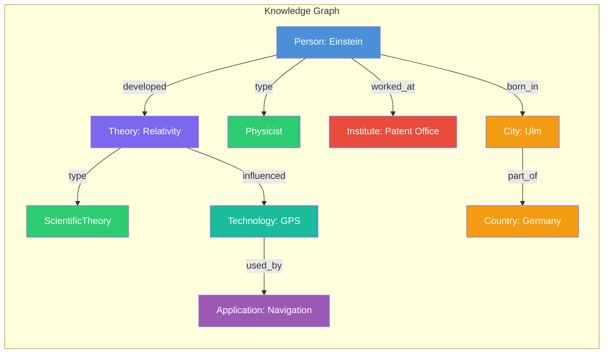

### Property Graph Model

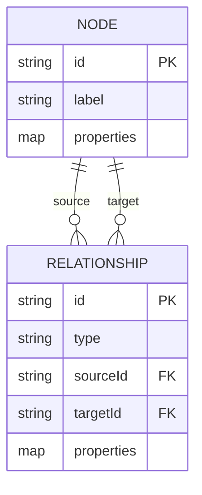

---

## 3. Graph Databases

### Neo4j

Neo4j is the most mature graph database. It uses a native graph storage engine with index-free adjacency, meaning each node stores direct pointers to its neighbors — enabling O(1) traversals.

**Strengths:**
- Mature ecosystem (20+ years)
- Rich Cypher query language
- Full ACID transactions
- Built-in graph algorithms (PageRank, community detection, shortest path)
- Vector index support (5.11+)
- Cloud and self-hosted options

**When to use:** Production GraphRAG, large-scale knowledge graphs, applications needing ACID compliance, teams needing enterprise support.

**Connection example:**
```python
from neo4j import GraphDatabase

driver = GraphDatabase.driver(
    "bolt://localhost:7687",
    auth=("neo4j", "password")
)

with driver.session() as session:
    result = session.run(
        """
        MATCH (p:Person)-[r]->(t)
        WHERE p.name = $name
        RETURN p, r, t
        """,
        name="Einstein"
    )
```

### Kuzu

Kuzu is an embeddable property graph database designed for analytics and AI workloads. It stores data columnarly on disk with vectorized execution.

**Strengths:**
- Embeddable (no server needed, single-file storage)
- Columnar storage for fast analytics
- Cypher-compatible query language
- Zero-copy data sharing
- Ideal for data science workflows
- Small footprint (~50MB)

**When to use:** Local/desktop apps, CI/CD pipelines, research workflows, when you want a database that ships with your application.

**Connection example:**
```python
import kuzu

db = kuzu.Database("knowledge_graph_db")
conn = kuzu.Connection(db)

conn.execute(
    "CREATE NODE TABLE Person (name STRING, age INT64, PRIMARY KEY (name))"
)
conn.execute(
    "CREATE REL TABLE KNOWS (FROM Person TO Person)"
)

conn.execute(
    "CREATE (p:Person {name: 'Alice', age: 30})"
)
conn.execute(
    "CREATE (p:Person {name: 'Bob', age: 25})"
)
conn.execute(
    "MATCH (a:Person), (b:Person) WHERE a.name='Alice' AND b.name='Bob' CREATE (a)-[:KNOWS]->(b)"
)
```

### Memgraph

Memgraph is an in-memory graph database built for real-time streaming and high-performance analytics.

**Strengths:**
- In-memory architecture (microsecond latencies)
- Cypher-compatible
- Built-in streaming ingestion (Kafka, Pulsar)
- Graph algorithms in Cypher via custom procedures
- Temporal graph support

**When to use:** Real-time applications, streaming data, fraud detection, low-latency requirements.

**Comparison table:**

| Feature | Neo4j | Kuzu | Memgraph |
|---|---|---|---|
| **Storage** | Native graph on disk | Columnar on disk | In-memory |
| **Deployment** | Server/Cloud | Embedded | Server |
| **Query Language** | Cypher | Cypher (subset) | Cypher + extensions |
| **ACID** | Yes | Yes | Yes |
| **Graph Algorithms** | GDS library | Built-in (limited) | MAGE library |
| **Streaming** | CDC only | No | Kafka, Pulsar, Redis |
| **Vector Search** | Yes (5.11+) | No | Yes |
| **License** | Community/Commercial | MIT | Community/Commercial |
| **Best For** | Production systems | Local/analytics | Real-time/streaming |

### Choosing a Graph Database

```
Question: What is your primary constraint?
├── Production reliability, ACID, ecosystem → Neo4j
├── Embeddable, lightweight, analytical → Kuzu
├── Real-time, streaming, low-latency → Memgraph
└── Research, prototyping, small data → NetworkX (in-memory Python)
```

---

## 4. GraphRAG

### What Is GraphRAG?

GraphRAG is a retrieval-augmented generation pattern where the retrieval corpus is a knowledge graph. Instead of retrieving chunks of text by vector similarity, GraphRAG extracts relevant subgraphs — structured facts connected to the query entities — and feeds them into the LLM context.

Microsoft Research formalized this pattern in 2024 with their paper *"From Local to Global: A Graph RAG Approach to Query-Focused Summarization."*

### RAG vs GraphRAG

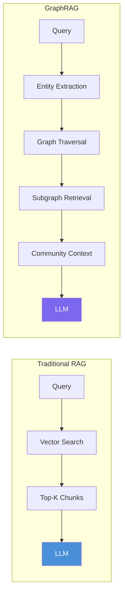

| Capability | RAG | GraphRAG |
|---|---|---|
| **Retrieval unit** | Text chunks | Entities + relationships |
| **Structure** | Flat list | Graph subgraph |
| **Multi-hop queries** | Difficult (needs Chunk A → Chunk B) | Natural (edge hops) |
| **Summarization** | Per-chunk | Hierarchical (communities) |
| **Query-focused** | Top-K similarity | Subgraph + community |
| **Entity resolution** | Not built-in | Built-in |
| **Scalability** | Good (vector DB) | Good (community indexing) |

### GraphRAG Pipeline

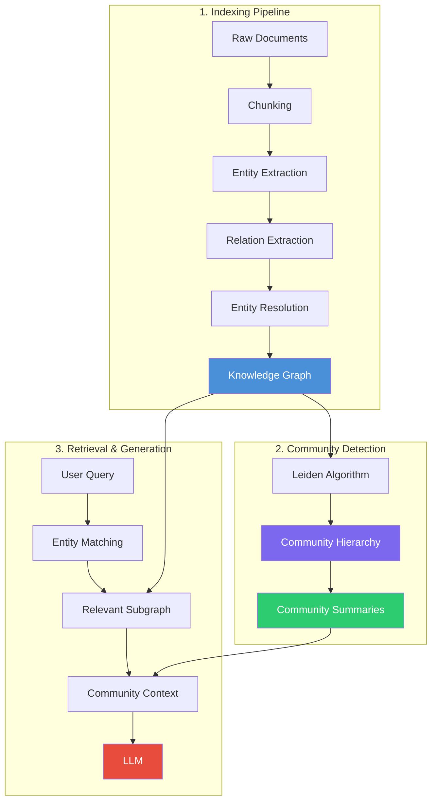

### Step 1: Indexing Pipeline

**Chunking:** Documents are split into chunks (typically 300-600 tokens with overlap).

**Entity Extraction:** An LLM extracts entities and relationships from each chunk.

```json
{
  "chunk_id": "doc1_chunk3",
  "entities": [
    {"name": "OpenAI", "type": "Organization"},
    {"name": "GPT-4", "type": "Model"},
    {"name": "Sam Altman", "type": "Person"}
  ],
  "relationships": [
    {"source": "OpenAI", "target": "GPT-4", "type": "developed"},
    {"source": "Sam Altman", "target": "OpenAI", "type": "CEO_of"}
  ]
}
```

**Entity Resolution:** Different mentions of the same entity are merged (e.g., "OpenAI" and "OpenAI Inc.").

### Step 2: Community Detection

The Leiden algorithm (improved Louvain) detects communities in the graph — groups of densely connected nodes.

```
Original Graph → Leiden Algorithm → Community Hierarchy
                                        ↓
                              Level 0: Fine-grained communities
                              Level 1: Mid-level communities
                              Level 2: Coarse communities
```

Each community is summarized by an LLM, creating a **community summary** — a natural language description of what that community represents.

**Community Summary Example:**
```json
{
  "community_id": 42,
  "level": 1,
  "summary": "This community covers the AI research ecosystem centered on large language models. Key entities include OpenAI, Google DeepMind, and Anthropic. Major relationships involve model development, funding, and safety research. The community shows strong collaboration patterns between academic institutions and industry labs."
}
```

### Step 3: Retrieval & Generation

**Local Search:**
1. Extract entities from the user query
2. Find matching entities in the graph
3. Traverse 1-2 hops to get the relevant subgraph
4. Include community summaries for the entities' communities
5. Build context and generate answer

**Global Search:**
1. Map query to relevant communities
2. Retrieve community summaries at appropriate hierarchy level
3. Use a map-reduce pattern to synthesize answers across communities

### Implementation Sketch

```python
class GraphRAG:
    def __init__(self, graph_db, llm):
        self.graph = graph_db
        self.llm = llm

    def index_document(self, text, doc_id):
        chunks = self.chunk_text(text)
        for i, chunk in enumerate(chunks):
            entities, relations = self.extract_entities(chunk)
            self.insert_entities(entities, doc_id, i)
            self.insert_relations(relations)

    def extract_entities(self, text):
        prompt = f"""Extract entities and relationships from:
{text}

Return as JSON: {{"entities": [{{"name", "type"}}],
  "relationships": [{{"source", "target", "type"}}]}}"""
        return self.llm.parse_json(prompt)

    def query(self, question):
        entities = self.extract_query_entities(question)
        subgraph = self.traverse_subgraph(entities, hops=2)
        communities = self.get_community_context(entities)
        context = self.format_context(subgraph, communities)
        prompt = f"""Answer using this knowledge graph context:
{context}

Question: {question}"""
        return self.llm.generate(prompt)
```

---

## 5. Entity Extraction

Entity extraction is the process of identifying entities (people, organizations, concepts, events) and their relationships from unstructured text. In GraphRAG, this is the critical first step that transforms raw documents into structured triples.

### The Extraction Pipeline

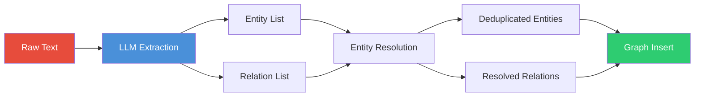

### Schema Design

A schema defines what types of entities and relationships your knowledge graph will contain.

```python
ENTITY_SCHEMA = {
    "Person": {
        "properties": ["name", "birth_date", "nationality", "occupation"],
        "required": ["name"]
    },
    "Organization": {
        "properties": ["name", "founded", "headquarters", "industry"],
        "required": ["name"]
    },
    "Model": {
        "properties": ["name", "version", "release_date", "creator"],
        "required": ["name"]
    },
    "Paper": {
        "properties": ["title", "year", "venue", "authors"],
        "required": ["title"]
    }
}

RELATION_SCHEMA = {
    "developed": {"source": ["Person", "Organization"], "target": ["Model", "Paper", "Technology"]},
    "cited": {"source": ["Paper"], "target": ["Paper"]},
    "works_at": {"source": ["Person"], "target": ["Organization"]},
    "located_in": {"source": ["Organization", "Person"], "target": ["Location"]},
    "part_of": {"source": ["Model", "Technology"], "target": ["Organization"]}
}
```

### Prompt Patterns for Extraction

**Pattern 1: Structured JSON Output**

```python
EXTRACTION_PROMPT = """Extract entities and relationships from the text below.

Entity Types: Person, Organization, Location, Technology, Event, Concept
Relationship Types: works_at, developed, founded, located_in, acquired, partnered_with

Text: {text}

Respond ONLY with JSON:
{{
  "entities": [
    {{"name": "<name>", "type": "<type>", "properties": {{}}}}
  ],
  "relationships": [
    {{"source": "<entity_name>", "target": "<entity_name>", "type": "<relationship>"}}
  ]
}}"""
```

**Pattern 2: Schema-Constrained Extraction**

When documents are large, extract entities first, then relationships:

```python
# Pass 1: Extract entities
ENTITY_PROMPT = """Find all named entities in this text.
Schema: {entity_schema}

Text: {text}

Return a JSON array of {{"name", "type", "properties"}}."""

# Pass 2: Extract relationships
RELATION_PROMPT = """Given these entities:
{entities}

Find relationships between them in this text:
{text}

Relationship types allowed: {relation_types}

Return a JSON array of {{"source", "target", "type", "properties"}}."""
```

**Pattern 3: Few-shot Extraction**

```python
FEW_SHOT_PROMPT = """Extract entities and relationships. Follow the examples.

Example 1:
Text: "OpenAI released GPT-4 in March 2023. Sam Altman is the CEO."
Entities: [{"name": "OpenAI", "type": "Organization"}, {"name": "GPT-4", "type": "Model"}, {"name": "Sam Altman", "type": "Person"}]
Relationships: [{"source": "OpenAI", "target": "GPT-4", "type": "developed"}, {"source": "Sam Altman", "target": "OpenAI", "type": "CEO_of"}]

Example 2:
Text: "Researchers at Stanford published a paper on graph neural networks."
Entities: [{"name": "Stanford", "type": "Organization"}, {"name": "Graph Neural Networks", "type": "Concept"}]
Relationships: [{"source": "Stanford", "target": "Graph Neural Networks", "type": "research_on"}]

Now extract from:
Text: {text}"""
```

### Entity Resolution

Different mentions may refer to the same entity:

| Mention | Normalized Entity |
|---|---|
| "OpenAI" | OpenAI |
| "OpenAI Inc." | OpenAI |
| "OpenAI, Inc." | OpenAI |
| "GPT-4" | GPT-4 |
| "GPT 4" | GPT-4 |
| "GPT4" | GPT-4 |

Resolution strategies:
1. **String normalization** — Lowercase, strip punctuation, expand abbreviations
2. **LLM-based resolution** — Ask the LLM if two entities refer to the same thing
3. **Embedding similarity** — Compare entity name embeddings
4. **Graph-based resolution** — Entities with similar neighborhoods are likely the same

```python
def resolve_entities(entities, threshold=0.85):
    resolved = []
    for entity in entities:
        match = find_best_match(entity.name, resolved, threshold)
        if match:
            match.mentions.append(entity.name)
        else:
            resolved.append(EntityCluster(entity.name, [entity.name]))
    return resolved
```

---

## 6. Graph Indexing

Graph indexing makes retrieval efficient. Without indexes, every query would need a full graph scan.

### Types of Graph Indexes

**1. Node Property Indexes**

```cypher
// Neo4j
CREATE INDEX person_name FOR (p:Person) ON (p.name);

// Kuzu
CREATE INDEX person_name ON Person(name);
```

**2. Full-text Indexes**

```cypher
// Neo4j
CREATE FULLTEXT INDEX entity_text FOR (n:Person|Organization|Model) ON EACH [n.name, n.description];
```

**3. Vector Indexes** (Neo4j 5.11+)

```cypher
CREATE VECTOR INDEX entity_embeddings FOR (n:Entity) ON (n.embedding)
OPTIONS {indexConfig: {
  `vector.dimensions`: 1536,
  `vector.similarity_function`: 'cosine'
}};
```

**4. Composite Indexes**

```cypher
CREATE INDEX person_org FOR (p:Person) ON (p.name, p.nationality);
```

### Combining Vector Search with Graph Traversal

The most powerful pattern is **hybrid retrieval**: use vector search to find relevant starting nodes, then traverse the graph to expand context.

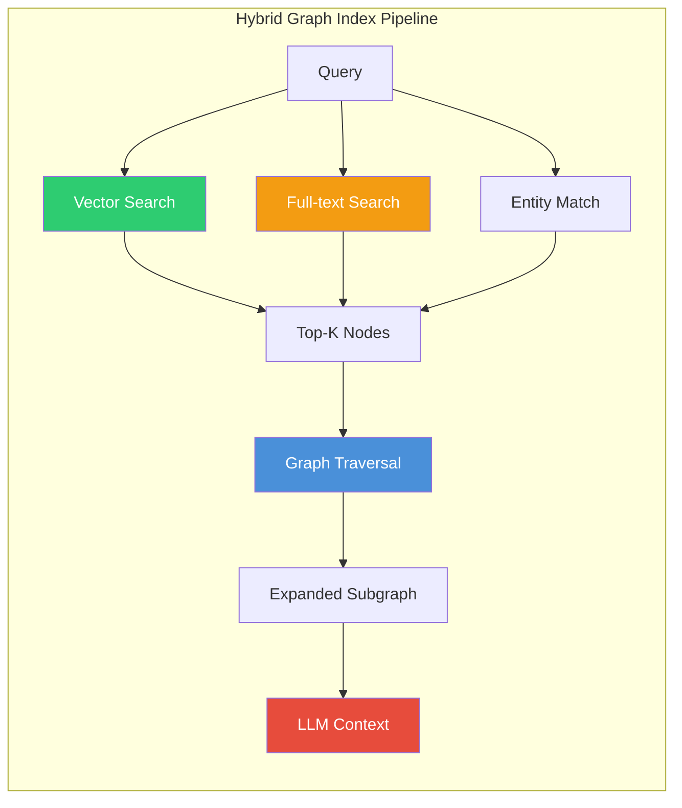

### Indexing Pipeline

```python
class GraphIndexer:
    def __init__(self, graph_db, embedder):
        self.graph = graph_db
        self.embedder = embedder

    def index_node(self, node_id, label, properties):
        text = self._node_to_text(label, properties)
        embedding = self.embedder.embed(text)

        self.graph.execute("""
            MATCH (n) WHERE id(n) = $node_id
            SET n.embedding = $embedding,
                n.search_text = $text
        """, {"node_id": node_id, "embedding": embedding, "text": text})

        self.graph.execute("""
            CREATE INDEX IF NOT EXISTS FOR (n:Entity) ON (n.embedding)
        """)

    def hybrid_search(self, query, top_k=10, hops=2):
        query_embedding = self.embedder.embed(query)

        # Vector search
        vector_results = self.graph.execute("""
            CALL db.index.vector.queryNodes('entity_embeddings', $top_k, $embedding)
            YIELD node, score
            RETURN node, score
        """, {"top_k": top_k, "embedding": query_embedding})

        # Full-text search
        ft_results = self.graph.execute("""
            CALL db.index.fulltext.queryNodes('entity_text', $query)
            YIELD node, score
            RETURN node, score
        """, {"query": query})

        # Merge and traverse
        seed_nodes = self._fuse_results(vector_results, ft_results)
        subgraph = self._expand_subgraph(seed_nodes, hops)
        return subgraph
```

---

## 7. Hybrid Search

Hybrid search combines multiple retrieval strategies to overcome the limitations of any single approach.

### Why Hybrid?

| Strategy | Good At | Bad At |
|---|---|---|
| **Vector Search** | Semantic similarity, synonyms | Exact matches, rare terms |
| **Keyword Search** | Exact terms, IDs, codes | Synonyms, conceptual queries |
| **Graph Traversal** | Relationships, multi-hop | Standalone facts |
| **Hybrid** | All of the above | Complex to implement |

### Architecture

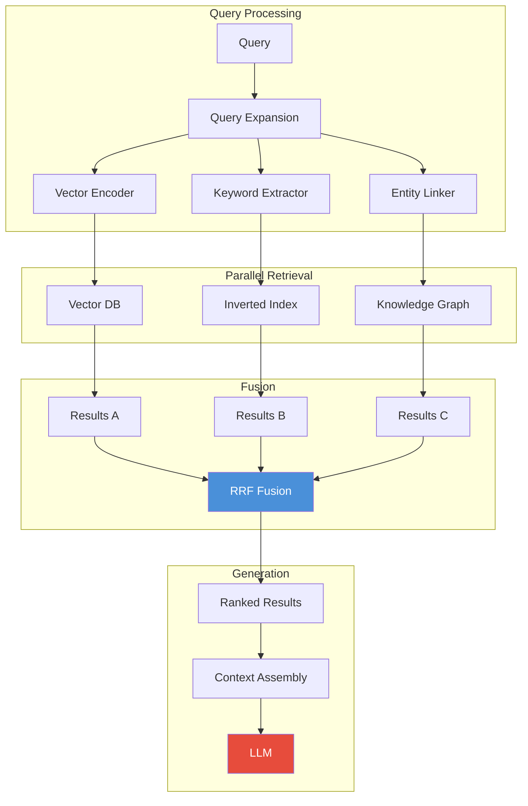

### Reciprocal Rank Fusion (RRF)

RRF combines ranked lists from multiple retrieval strategies:

```
Score(item) = Σ(1 / (k + rank_strategy(item)))

Where k is a constant (typically 60)
```

```python
def reciprocal_rank_fusion(results_lists, k=60):
    scores = {}
    for results in results_lists:
        for rank, item in enumerate(results):
            if item.id not in scores:
                scores[item.id] = 0
            scores[item.id] += 1.0 / (k + rank + 1)

    ranked = sorted(scores.items(), key=lambda x: x[1], reverse=True)
    return [item_id for item_id, _ in ranked]
```

### Three-Pronged Retriever

```python
class HybridRetriever:
    def __init__(self, vector_db, graph_db, keyword_index):
        self.vector = vector_db
        self.graph = graph_db
        self.keyword = keyword_index

    def retrieve(self, query, top_k=10):
        # 1. Vector search
        vector_results = self.vector.similarity_search(query, k=top_k)

        # 2. Keyword search (BM25)
        keyword_results = self.keyword.search(query, k=top_k)

        # 3. Graph search
        entities = self._extract_entities(query)
        graph_results = self.graph.traverse_subgraph(entities, hops=2)

        # 4. Fuse results
        fused = reciprocal_rank_fusion(
            [vector_results, keyword_results, graph_results],
            k=60
        )

        # 5. Build hybrid context
        context = []
        for item_id in fused[:top_k]:
            item = self._fetch_item(item_id)
            context.append(item)
            # Add graph neighbors for graph-sourced items
            if item_id in graph_results:
                neighbors = self.graph.get_neighbors(item_id, hops=1)
                context.extend(neighbors)

        return context
```

---

## 8. Graph Memory

Graph memory uses knowledge graphs as the persistent, structured memory for AI agents. Unlike traditional memory (conversation history, vector stores), graph memory preserves entity state and relationships.

### Why Graph Memory?

| Memory Type | Structure | Retrieval | Update |
|---|---|---|---|
| Conversation History | Flat list | Linear | Append only |
| Vector Store | Embedding space | Similarity | Re-embed |
| **Graph Memory** | Entity-relation graph | Traversal + query | Merge/update nodes |

### Architecture

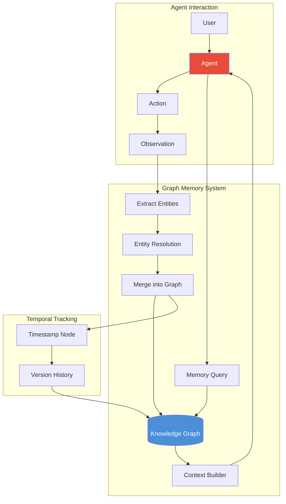

### Core Operations

**Writing Memory:**

```python
class GraphMemory:
    def __init__(self, graph_db):
        self.graph = graph_db

    def remember(self, text, source="agent_observation"):
        """Extract entities and relationships from text and merge into graph."""
        entities, relations = self.extract(text)
        for entity in entities:
            self._merge_entity(entity, source)
        for rel in relations:
            self._merge_relation(rel, source)
        self._add_temporal_metadata(text, source)

    def _merge_entity(self, entity, source):
        self.graph.execute("""
            MERGE (e:Entity {name: $name})
            ON CREATE SET e.type = $type,
                          e.first_seen = timestamp(),
                          e.source = $source,
                          e.mention_count = 1
            ON MATCH SET e.mention_count = e.mention_count + 1,
                         e.last_seen = timestamp()
            SET e.embedding = $embedding
        """, {"name": entity.name, "type": entity.type,
              "source": source, "embedding": entity.embedding})
```

**Reading Memory:**

```python
    def recall(self, query, hops=2):
        """Retrieve relevant subgraph from memory."""
        entities = self._extract_query_entities(query)
        if not entities:
            return "No relevant memories found."

        subgraph = self.graph.execute("""
            MATCH (e:Entity)
            WHERE e.name IN $names
            CALL {
                MATCH (e)-[r]-(connected)
                RETURN e, r, connected
                LIMIT 50
            }
            RETURN e, r, connected
        """, {"names": entities})
        return self._format_memory(subgraph)

    def forget(self, entity_name):
        """Remove entity and its relationships from graph."""
        self.graph.execute("""
            MATCH (e:Entity {name: $name})
            DETACH DELETE e
        """, {"name": entity_name})
```

### Temporal Graphs

Temporal graphs track how entities and relationships change over time:

```cypher
// Entity with versioned properties
CREATE (e:Entity:Versioned {
    name: "GPT-4",
    current_version: "gpt-4-turbo",
    versions: [
        {version: "gpt-4", date: "2023-03-14", parameters: "1.7T"},
        {version: "gpt-4-turbo", date: "2023-11-06", parameters: "unknown"}
    ]
})

// Time-bound relationships
CREATE (o:Organization {name: "OpenAI"})
CREATE (p:Person {name: "Sam Altman"})
CREATE (p)-[:EMPLOYED {from: "2019-03", to: "2023-11"}]->(o)
CREATE (p)-[:EMPLOYED {from: "2023-11", to: "present"}]->(o)
```

**Querying Temporal Facts:**

```python
def query_at_time(entity, timestamp):
    return graph.execute("""
        MATCH (e:Entity {name: $name})-[r]->(target)
        WHERE r.from <= $timestamp
        AND (r.to IS NULL OR r.to >= $timestamp)
        RETURN target, r
    """, {"name": entity, "timestamp": timestamp})
```

---

## 9. Reasoning Over Graphs

Graphs enable structured reasoning that is difficult or impossible with flat text retrieval alone.

### Multi-hop Reasoning

Multi-hop reasoning traverses multiple edges to answer questions that require joining facts.

```
Query: "What papers did researchers at companies founded by Stanford alumni publish?"

Hop 1: [Stanford] ──alumni──→ [Person]
Hop 2: [Person] ──founded──→ [Company]
Hop 3: [Company] ──employs──→ [Researcher]
Hop 4: [Researcher] ──authored──→ [Paper]
```

```cypher
MATCH (stanford:Organization {name: "Stanford University"})
MATCH (stanford)<-[:GRADUATED_FROM]-(alumnus:Person)
MATCH (alumnus)-[:FOUNDED]->(company:Organization)
MATCH (company)<-[:WORKS_AT]-(researcher:Person)
MATCH (researcher)-[:AUTHORED]->(paper:Paper)
RETURN DISTINCT paper.title, researcher.name, company.name
```

### Graph Algorithms

**Shortest Path:**

```python
def shortest_path_knowledge(start_entity, end_entity):
    """Find the shortest path between two entities in the graph."""
    result = graph.execute("""
        MATCH path = shortestPath(
            (start:Entity {name: $start})-[*]-(end:Entity {name: $end})
        )
        RETURN [node IN nodes(path) | node.name] AS path,
               [rel IN relationships(path) | type(rel)] AS relations
    """, {"start": start_entity, "end": end_entity})
    return result
```

**PageRank (Node Importance):**

```cypher
// Neo4j GDS
CALL gds.pageRank.stream('knowledge_graph')
YIELD nodeId, score
RETURN gds.util.asNode(nodeId).name AS entity, score
ORDER BY score DESC
LIMIT 10;
```

**Community Detection:**

```cypher
// Leiden algorithm for community detection
CALL gds.leiden.stream('knowledge_graph')
YIELD nodeId, communityId
RETURN gds.util.asNode(nodeId).name AS entity, communityId
ORDER BY communityId;
```

**Betweenness Centrality (Bridge Entities):**

```cypher
CALL gds.betweenness.stream('knowledge_graph')
YIELD nodeId, score
RETURN gds.util.asNode(nodeId).name AS entity, score
ORDER BY score DESC
LIMIT 10;
```

### Path Traversal for Context Building

```python
def build_reasoning_context(query, graph, max_hops=3):
    """Traverse the graph to build a reasoning context for an LLM."""
    seed_entities = extract_entities_from_query(query, graph)

    context_parts = []
    visited = set()

    for entity in seed_entities:
        # BFS traversal
        queue = [(entity, 0)]
        while queue:
            current, depth = queue.pop(0)
            if current.id in visited or depth > max_hops:
                continue
            visited.add(current.id)

            neighbors = graph.get_neighbors(current)
            for neighbor, rel in neighbors:
                context_parts.append(
                    f"{current.name} -[{rel.type}]→ {neighbor.name}"
                )
                queue.append((neighbor, depth + 1))

    return "\n".join(context_parts)
```

---

## 10. Agent Graphs

Agent graphs use graph structures to orchestrate AI agent workflows. This is the foundation of frameworks like LangGraph.

### What Is an Agent Graph?

An agent graph is a directed graph where:
- **Nodes** are steps in the agent's workflow (LLM calls, tool executions, decision points)
- **Edges** are transitions between steps (conditional or unconditional)
- **State** flows through the graph, being modified at each node

### Execution Graph Model

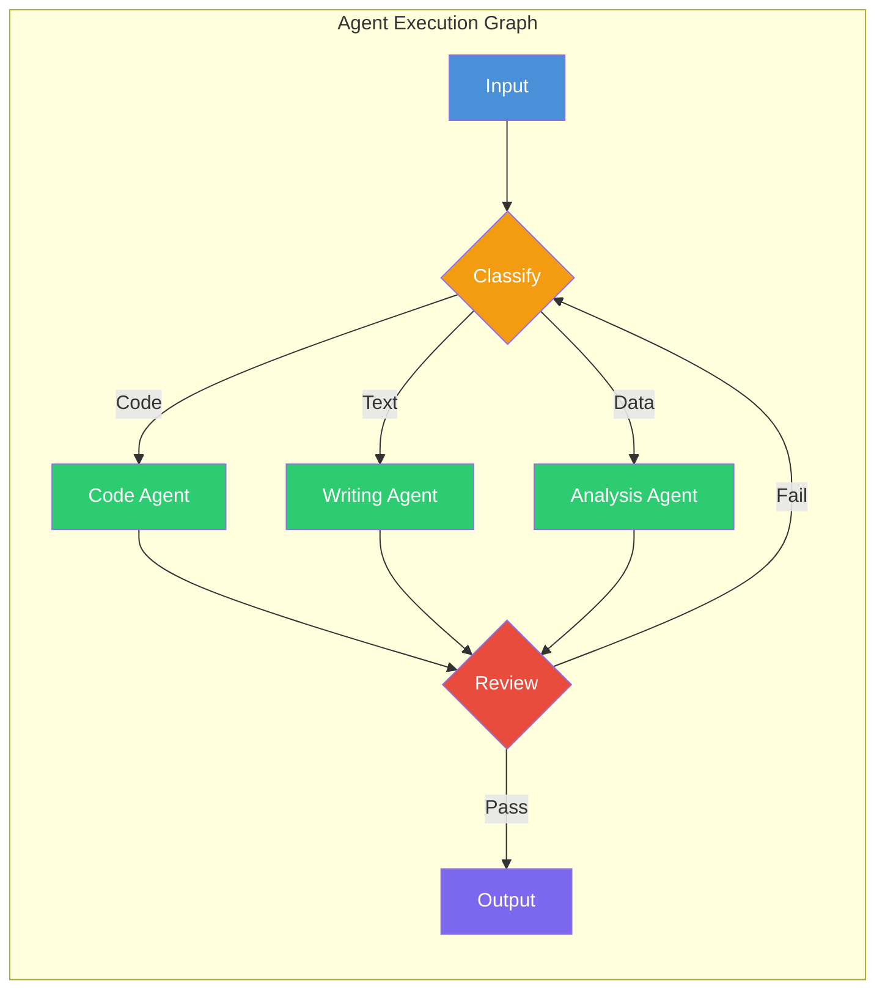

### LangGraph-Style State Machine

```python
from typing import TypedDict, List, Literal
import json

class AgentState(TypedDict):
    messages: List[dict]
    next_agent: str
    context: dict
    iteration: int

class AgentGraph:
    def __init__(self):
        self.nodes = {}
        self.edges = []
        self.state = {}

    def add_node(self, name, fn):
        self.nodes[name] = fn

    def add_edge(self, from_node, to_node, condition=None):
        self.edges.append((from_node, to_node, condition))

    def run(self, initial_state):
        self.state = initial_state
        current = "__start__"

        while current != "__end__":
            if current in self.nodes:
                self.state = self.nodes[current](self.state)
            current = self._next_node(current)

        return self.state

    def _next_node(self, current):
        for from_node, to_node, condition in self.edges:
            if from_node == current:
                if condition is None or condition(self.state):
                    return to_node
        return "__end__"
```

### Planning Graphs

Planning graphs decompose complex tasks into sub-tasks and execute them:

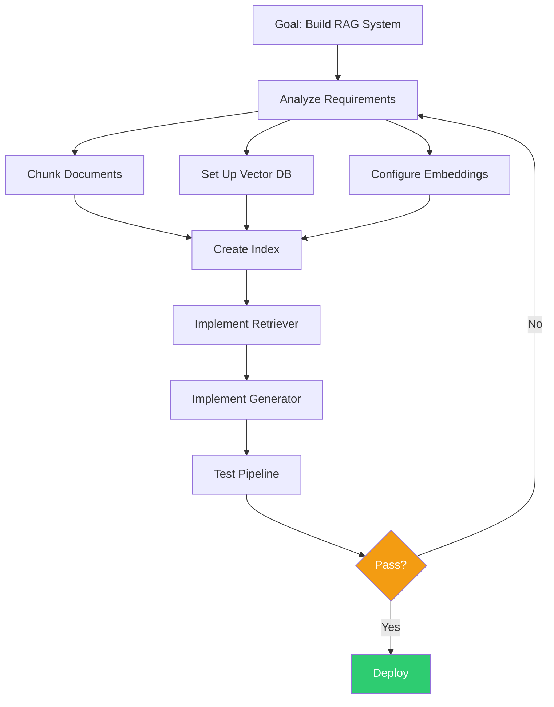

### Orchestration Patterns

**1. Sequential Pipeline:**

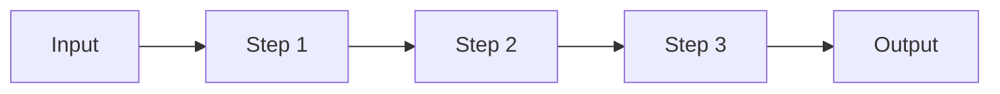

**2. Router Pattern:**

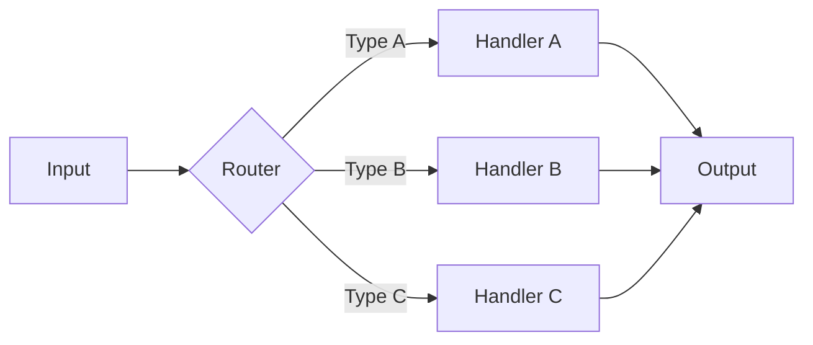

**3. Supervisor Pattern:**

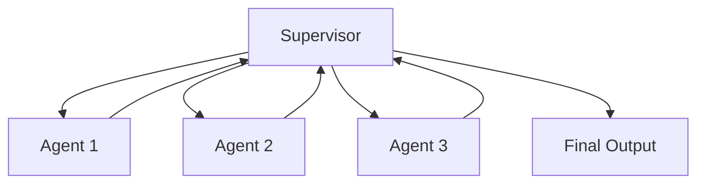

**4. Reflection Pattern:**

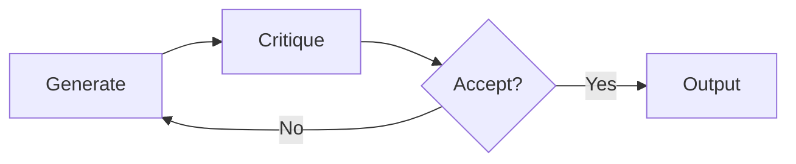

---

## Putting It All Together: Production GraphRAG

A production GraphRAG system combines all the concepts above:

```python
class ProductionGraphRAG:
    def __init__(self, config):
        self.graph_db = self._init_database(config)
        self.embedder = self._init_embedder(config)
        self.llm = self._init_llm(config)
        self.indexer = GraphIndexer(self.graph_db, self.embedder)
        self.retriever = HybridRetriever(
            vector_db=self._init_vector_db(config),
            graph_db=self.graph_db,
            keyword_index=self._init_keyword_index(config)
        )
        self.memory = GraphMemory(self.graph_db)
        self.community_detector = CommunityDetector(self.graph_db)

    def ingest(self, documents):
        for doc in documents:
            chunks = chunk_document(doc, chunk_size=512, overlap=50)
            for chunk in chunks:
                entities, relations = extract_entities_llm(chunk, self.llm)
                resolved = resolve_entities(entities)
                self.graph_db.insert_entities(resolved)
                self.graph_db.insert_relations(relations)
                self.indexer.index_text(chunk, resolved)

        self.community_detector.detect_and_summarize()

    def query(self, question):
        return self.retriever.hybrid_retrieve(question)
```

---

## Summary

Graph engineering transforms AI systems from flat-text processors into structured-knowledge reasoners. By building knowledge graphs from documents, indexing them for efficient retrieval, and using graph traversal for context building, you enable:

- **Factual grounding** through structured, verified triples
- **Multi-hop reasoning** across connected entities
- **Structured agent memory** that persists across sessions
- **Community-aware summarization** for global understanding
- **Hybrid retrieval** combining the strengths of vector, keyword, and graph search

The field is evolving rapidly. Microsoft's GraphRAG, LangGraph for agent orchestration, and embeddable databases like Kuzu are making graph engineering accessible to every AI engineer.

---

*Next: Chapter 06 — Vector Search & Embeddings*
