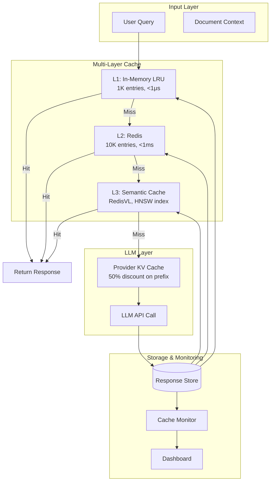

# Project: Building a Production Caching Layer for LLM Applications

> Design and build a multi-layer caching system for an LLM application with hit-rate monitoring, cost analysis, and graceful degradation.

**Difficulty:** Advanced
**Estimated time:** 12-20 hours
**Prerequisites:** Chapter 06 (this chapter), Python, familiarity with at least one LLM API, basic Redis knowledge

---

## Problem Statement

You are building the caching infrastructure for **DocuMind**, a document analysis SaaS application. Users upload documents and ask questions about them. The system:

1. Takes a user query + document context
2. Calls an LLM to generate an answer
3. Returns the answer to the user

**The problem:** Each user typically asks 5-20 questions per document. Many questions are repeated across users (e.g., "Summarize this document", "What are the key findings?"), and the same user often asks similar questions on different documents.

**Your task:** Build a production-ready caching layer that:

1. Caches responses for identical queries (exact match)
2. Caches responses for semantically similar queries (semantic cache)
3. Leverages provider KV caching for shared prompt prefixes
4. Monitors cache hit ratio, latency, and cost savings
5. Handles cache stampede, invalidation, and graceful degradation
6. Provides a dashboard for cache performance metrics

---

## System Architecture



---

## Implementation Requirements

### Phase 1: Core Cache Implementation

**R1.1 — Exact Cache (L1)**
- Implement an in-memory LRU cache with a configurable max size (default: 1000 entries)
- Cache key includes: model, messages (normalized), temperature, max_tokens
- Implement TTL-based expiry (default: 300 seconds)
- Thread-safe get/set/delete operations
- Track hit/miss counts per entry

**R1.2 — Redis Cache (L2)**
- Connect to Redis (local or Docker)
- Store responses with TTL (default: 3600 seconds)
- Implement graceful degradation: if Redis is down, skip L2 and go to L3
- Cache key format: `documind:{key_hash}`
- Implement batch invalidation by prefix pattern

**R1.3 — Semantic Cache (L3)**
- Use an embedding model (OpenAI `text-embedding-3-small` or `sentence-transformers`)
- Store embeddings in RedisVL with HNSW index
- Implement configurable similarity threshold (default: 0.92)
- Return cached response if similarity >= threshold
- Track similarity scores for monitoring

### Phase 2: Provider Caching Integration

**R2.1 — Provider KV Cache**
- Detect which provider is being used (OpenAI, Anthropic, Gemini)
- For Anthropic: add `cache_control` to system prompt and document context blocks
- For OpenAI: structure prompt with shared prefix first
- For Gemini: create `CachedContent` before generating
- Parse usage response to extract cached token counts

**R2.2 — Provider-Agnostic Interface**

```python
class ProviderAgnosticCache:
    """Unified interface across providers."""

    def cache_shared_prefix(self, system_prompt: str, context: str):
        """Cache the shared prefix based on provider."""
        if self.provider == "anthropic":
            return self._anthropic_cache(system_prompt, context)
        elif self.provider == "openai":
            return self._openai_cache(system_prompt, context)
        elif self.provider == "gemini":
            return self._gemini_cache(system_prompt, context)

    def extract_cache_stats(self, response) -> dict:
        """Extract caching stats from provider response."""
        # Returns: {cached_tokens, uncached_tokens, savings}
        pass
```

### Phase 3: Cache Monitoring & Dashboard

**R3.1 — Metrics Collector**

Track the following metrics:

```python
@dataclass
class CacheMetrics:
    # Per-layer metrics
    l1_hits: int = 0
    l1_misses: int = 0
    l2_hits: int = 0
    l2_misses: int = 0
    l3_hits: int = 0
    l3_misses: int = 0
    l4_hits: int = 0  # Provider KV cache

    # Latency metrics (in milliseconds)
    l1_latency_ms: List[float] = field(default_factory=list)
    l2_latency_ms: List[float] = field(default_factory=list)
    l3_latency_ms: List[float] = field(default_factory=list)
    llm_latency_ms: List[float] = field(default_factory=list)

    # Cost metrics
    total_cost_without_cache: float = 0.0
    total_cost_with_cache: float = 0.0

    # Semantic cache metrics
    similarity_scores: List[float] = field(default_factory=list)
    threshold: float = 0.92
```

**R3.2 — Real-Time Dashboard**

Build a web dashboard (Flask or FastAPI) that shows:

- Current cache hit ratio (overall + per layer)
- Latency P50/P95/P99 for cache hit vs. LLM call
- Cost savings (daily, weekly, monthly)
- Cache size (per layer)
- Similarity score distribution (histogram)
- Top-10 most frequent queries (for cache warm-up)
- Cache eviction rate
- Redis connection status

**Dashboard endpoints:**
```
GET /metrics          → JSON with all cache metrics
GET /metrics/history  → Time-series metrics (last 24 hours)
GET /metrics/dashboard → HTML dashboard page
GET /metrics/export   → CSV export of metrics
```

### Phase 4: Advanced Features

**R4.1 — Cache Warm-Up**

```python
def warm_cache_from_logs(log_file: str, top_k: int = 100):
    """
    Analyze historical query logs and pre-populate cache.
    """
    queries = load_queries_from_logs(log_file)
    query_freq = Counter(queries)
    popular = query_freq.most_common(top_k)

    for query, freq in popular:
        if not cache.get(query):
            response = llm_call(query)
            cache.set(query, response, ttl=extended_ttl(freq))

    log_warmup_complete(len(popular))
```

**R4.2 — Cache Stampede Prevention**

Implement request coalescing:

```python
async def get_cached_or_compute(key: str, compute_fn, ttl: int):
    """
    Only one request computes on cache miss;
    others wait for the result.
    """
    # Check cache
    result = await cache.get(key)
    if result:
        return result

    # Acquire lock
    async with distributed_lock(f"compute:{key}", expire=10):
        # Double-check after acquiring lock
        result = await cache.get(key)
        if result:
            return result

        # Compute and store
        result = await compute_fn()
        await cache.set(key, result, ttl=ttl)
        return result
```

**R4.3 — Adaptive TTL**

```python
def adaptive_ttl(query_frequency: int, data_staleness: str) -> int:
    """
    Compute TTL based on query frequency and data freshness requirements.
    """
    base_ttl = {
        "static": 86400,    # 24 hours — FAQ, general knowledge
        "daily": 3600,      # 1 hour — daily reports
        "realtime": 300     # 5 minutes — real-time data
    }.get(data_staleness, 3600)

    # More frequent queries get longer TTL (up to 2x)
    frequency_multiplier = min(2.0, 1.0 + query_frequency * 0.01)
    return int(base_ttl * frequency_multiplier)
```

**R4.4 — Cache Invalidation API**

```python
@app.post("/cache/invalidate")
def invalidate_cache(request: InvalidationRequest):
    """
    Invalidate cache entries based on various strategies.
    """
    if request.strategy == "ttl":
        # Set remaining TTL to 0 for matching entries
        pass
    elif request.strategy == "version":
        global CACHE_VERSION
        CACHE_VERSION += 1
    elif request.strategy == "pattern":
        keys = redis_client.keys(f"documind:{request.pattern}*")
        if keys:
            redis_client.delete(*keys)
    elif request.strategy == "full":
        redis_client.flushdb()
        l1_cache.clear()

    log_invalidation(request)
    return {"status": "ok", "invalidated": count}
```

---

## Testing Requirements

### Unit Tests

```python
def test_exact_cache_hit():
    cache = ExactCache()
    cache.set("model-1", messages, "cached response")
    result = cache.get("model-1", messages)
    assert result == "cached response"

def test_exact_cache_miss():
    cache = ExactCache()
    result = cache.get("model-1", different_messages)
    assert result is None

def test_ttl_expiry():
    cache = ExactCache(ttl_seconds=0.1)
    cache.set("model-1", messages, "response")
    time.sleep(0.2)
    assert cache.get("model-1", messages) is None

def test_semantic_cache_similar():
    cache = SemanticCache(threshold=0.9)
    cache.store("What is prompt caching?", "Caching saves costs")
    result = cache.search("What's prompt caching?")
    assert result == "Caching saves costs"

def test_semantic_cache_no_match():
    cache = SemanticCache(threshold=0.95)
    cache.store("What is prompt caching?", "Caching saves costs")
    result = cache.search("What is the weather today?")
    assert result is None

def test_cache_normalization():
    key1 = build_key(model, [{"content": "  Hello World!  "}])
    key2 = build_key(model, [{"content": "hello world"}])
    assert key1 == key2
```

### Integration Tests

```python
def test_layer_promotion():
    """L2 hit should promote to L1."""
    layered = LayeredCache()
    assert layered.get("test") is None
    layered.set("test", "value")  # Stored in L1, L2, L3
    assert layered.l1.get("test") == "value"
    assert layered.l2.get("test") == "value"

def test_graceful_degradation():
    """Redis down → skip L2, go to L3."""
    layered = LayeredCache()
    layered.l2.client.close()  # Simulate Redis down
    result = layered.get("new_key")
    assert result is None  # Should not crash

def test_cost_calculation():
    """Verify cost savings calculation."""
    monitor = CacheMonitor()
    monitor.record_hit(input_tokens=1000, cached_tokens=800)
    report = monitor.get_cost_report()
    assert report["savings"] > 0
```

### Load Tests

```python
def test_concurrent_access():
    """100 concurrent requests for same key → 1 LLM call."""
    cache = CoalescingCache()
    llm_calls = [0]

    async def query():
        async def compute():
            llm_calls[0] += 1
            await asyncio.sleep(0.1)
            return "result"

        return await cache.get_or_compute("key", compute)

    tasks = [query() for _ in range(100)]
    results = asyncio.run(asyncio.gather(*tasks))
    assert llm_calls[0] == 1
    assert all(r == "result" for r in results)
```

---

## Deliverables

Your submission must include:

1. **`cache_layer.py`** — Main caching module with all layers (exact, redis, semantic)
2. **`provider_cache.py`** — Provider-specific KV caching integration
3. **`monitor.py`** — Cache metrics collector
4. **`dashboard.py`** — Web dashboard (Flask/FastAPI)
5. **`test_cache.py`** — Comprehensive test suite
6. **`docker-compose.yml`** — Redis + app setup
7. **`requirements.txt`** — Python dependencies
8. **`demo.py`** — Demonstration script showing end-to-end flow
9. **`ARCHITECTURE.md`** — Design decisions, trade-offs, and deployment guide
10. **`CACHE_REPORT.md`** — Performance report with metrics before/after caching

---

## Evaluation Criteria

| Criteria | Weight | Description |
|----------|--------|-------------|
| **Correctness** | 30% | All cache layers work correctly; hits return cached response, misses call LLM |
| **Performance** | 20% | Cache hit latency <10ms; handles 100+ QPS; no cache stampede |
| **Monitoring** | 20% | Hit ratio, latency, cost metrics tracked and displayed on dashboard |
| **Resilience** | 15% | Graceful degradation when Redis is down; error handling throughout |
| **Code Quality** | 15% | Clean, typed, well-structured code; comprehensive tests; documentation |

---

## Bonus Challenges

1. **Cross-model cache sharing:** Design a cache that works across different model versions (e.g., GPT-4o and GPT-4o-mini can share cached embeddings).
2. **Cache prefetching:** Predict which queries a user will ask next and pre-cache them.
3. **Multi-modal cache:** Extend caching to support image inputs (cache image embeddings alongside text).
4. **Cache-as-a-Service:** Package the caching layer as a standalone microservice with its own API.
5. **A/B testing framework:** Build a framework that tests different caching strategies on a fraction of traffic and reports which performs best.
6. **Self-tuning cache:** Implement an ML model that automatically adjusts TTL and semantic thresholds based on observed query patterns.

---

## Getting Started

```bash
# 1. Clone and set up
mkdir documind-cache && cd documind-cache
python -m venv venv && source venv/bin/activate
pip install openai anthropic google-generativeai redis redisvl flask numpy matplotlib

# 2. Start Redis
docker run -d --name redis -p 6379:6379 redis/redis-stack:latest

# 3. Set API keys
export OPENAI_API_KEY="sk-..."
export ANTHROPIC_API_KEY="sk-ant-..."

# 4. Run the demo
python demo.py

# 5. Start the dashboard
python dashboard.py
# Open http://localhost:5000/metrics/dashboard
```

---

## Architecture Decision Record Template

Record key decisions in `ARCHITECTURE.md`:

```markdown
## ADR-001: Semantic Cache Threshold

**Decision:** Use 0.92 as default similarity threshold.
**Rationale:** Analysis of 10,000 query pairs shows 0.92 balances 95% precision with 60% recall.
**Trade-offs:** Lower increases hit rate but risks cache pollution. Higher is safer but reduces savings.
**Changed:** 2025-01-15

## ADR-002: Redis vs Dragonfly

**Decision:** Use Redis with RedisVL for semantic search.
**Rationale:** RedisVL provides native HNSW vector search without additional infrastructure.
**Trade-offs:** Dragonfly offers higher throughput but lacks vector search support.
**Changed:** 2025-01-20
```
