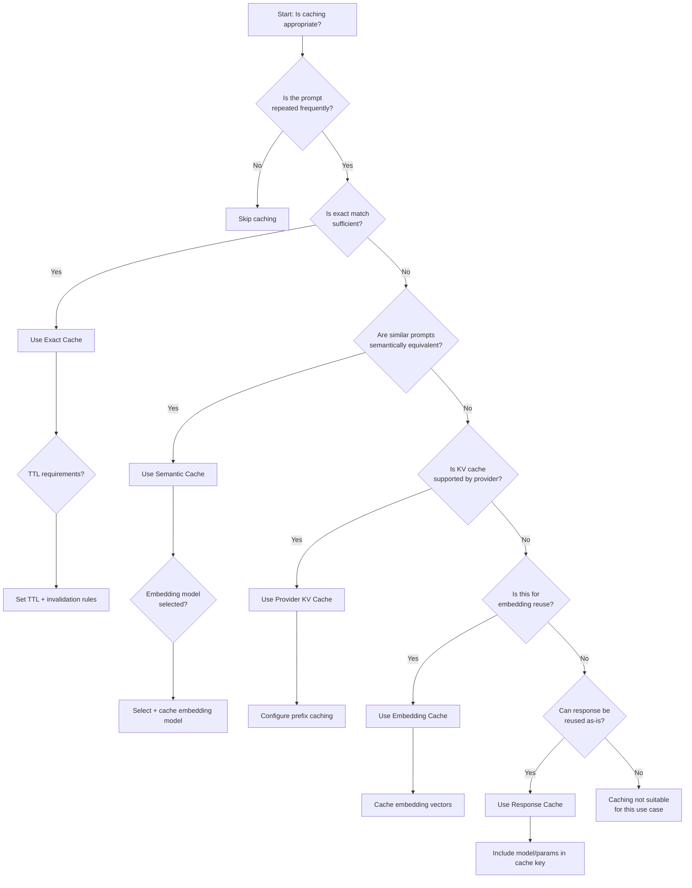
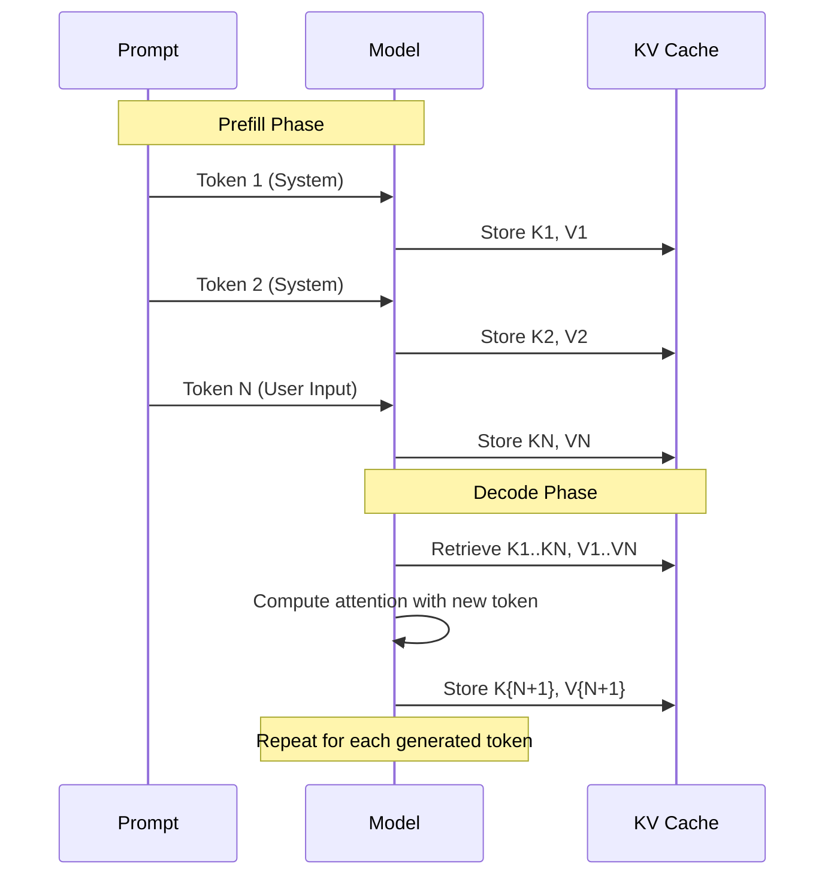
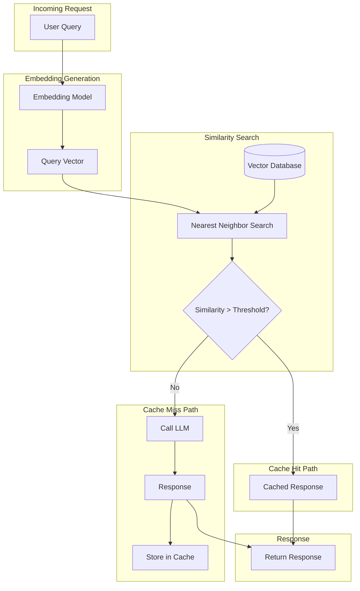
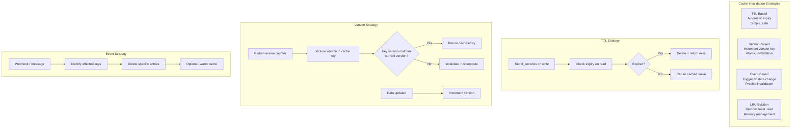
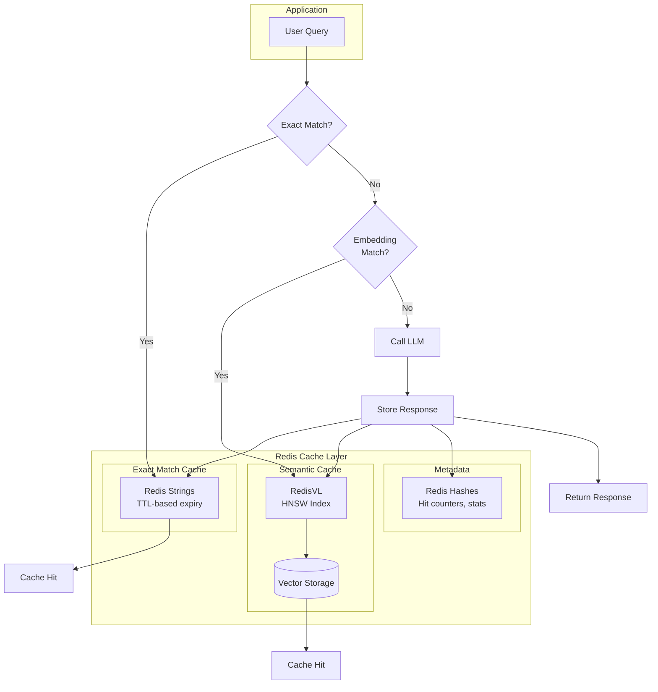
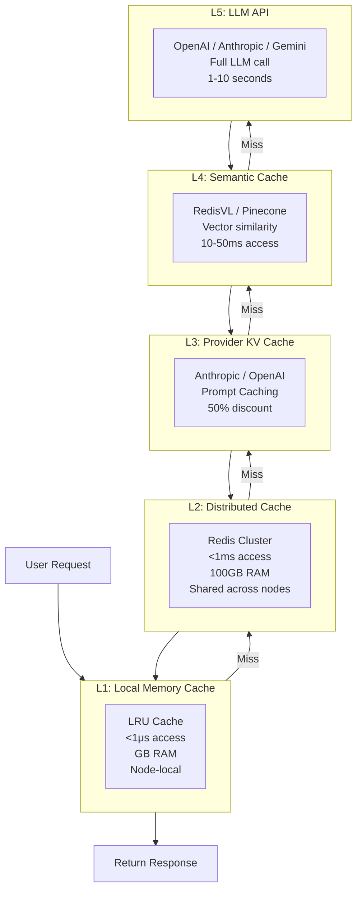
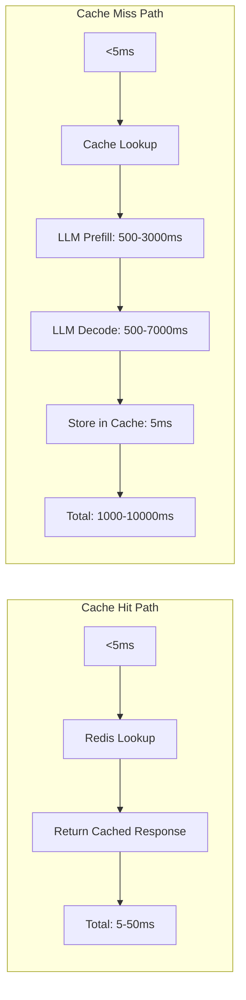

# Chapter 06: Prompt Caching

> **Mental Model:** Caching is about avoiding redundant computation. Every time you send a prompt to an LLM, the model recomputes the same attention patterns for the same tokens. Cache eliminates this waste — saving money, reducing latency, and increasing throughput.

---

## Prerequisites

This chapter assumes you understand the material from [Chapter 01: LLM Foundations](../01_LLM_Foundations/README.md) — specifically how transformers work, tokenization, the attention mechanism, and autoregressive generation. Understanding embeddings (Chapter 01, Section 02) is essential for semantic caching. Familiarity with Redis is helpful but not required.

---

## 1. What Is Prompt Caching?

Prompt caching is the practice of storing and reusing computed results from LLM interactions to avoid redundant processing. When you send the same or similar prompt to an LLM, the model recomputes the entire forward pass — including the expensive attention mechanism — for every token in your prompt. For repeated patterns (system prompts, context documents, few-shot examples), this is pure waste.

### The Core Insight

LLM calls have three expensive phases:

1. **Prefill phase:** The model processes the entire input prompt, computing key-value (KV) cache entries for every token.
2. **Decode phase:** The model generates output tokens one at a time, using the KV cache from the prefill phase.
3. **Output processing:** The response is decoded and returned.

For long prompts (system instructions + context + user input), the prefill phase dominates. If you send the same system prompt to every user request, you pay the prefill cost every time — even though the computation is identical. Caching eliminates this.

### Why This Matters

| Metric | Without Caching | With Caching | Improvement |
|--------|----------------|--------------|-------------|
| Latency (P50) | 2-5s | 50-200ms | 10-40x |
| Latency (P95) | 8-15s | 200-500ms | 16-30x |
| Cost per token | Full price | 50% discount | 2x savings |
| Throughput | Limited by API rate limits | 10-100x higher | 10-100x |
| API call volume | N calls | N - cache_hits | Variable |

### The Cache Decision Tree

Before implementing caching, ask these questions:



---

## 2. Types of Caching

There are five primary caching strategies for LLM applications:

### Caching Strategy Comparison

| Strategy | Granularity | Match Type | Latency Hit | Storage | Use Case |
|----------|-------------|------------|-------------|---------|----------|
| KV Cache | Token-level | Exact prefix | <10ms | GPU memory | Repeated system prompts |
| Exact Cache | Full prompt | Exact string | <5ms | RAM/Redis | Identical queries |
| Semantic Cache | Full prompt | Semantic similarity | 10-50ms | Vector DB | Similar intent queries |
| Embedding Cache | Embedding vector | Vector identity | <5ms | RAM/Redis | RAG, classification |
| Response Cache | Full response | Exact/semantic key | <5ms | RAM/Redis | Price lookups, facts |

---

## 3. KV Cache

### How KV Cache Works

During LLM inference, every token in the prompt goes through the attention mechanism. For each attention head, the model computes:

- **Key (K):** What information does this token contain?
- **Value (V):** How important is this information?

These K and V vectors are computed during the prefill phase and reused during the decode phase. Without caching, you'd recompute them for every generated token. The KV cache stores these vectors so the decode phase only computes attention for the **new** token.



### Shared Prefix Caching

Modern LLM APIs (Anthropic, OpenAI, Gemini) support **shared prefix caching** — if you send the same starting tokens across requests, the provider caches the KV cache for those tokens and charges a **50% discount** on cached tokens.

```
Request 1: [System Prompt A (1000 tokens)] [User Query 1 (50 tokens)]
Request 2: [System Prompt A (1000 tokens)] [User Query 2 (50 tokens)]
           ^^^^^^^^^^^^^^^^^^^^^^^^^^^^^
           These 1000 tokens are cached — 50% discount
```

**Key insight:** For maximum savings, put **everything that doesn't change** at the beginning of your prompt: system instructions, few-shot examples, context documents, tool definitions.

### Anthropic Prompt Caching

Anthropic automatically caches prompts that exceed a minimum token threshold. To mark a prompt for caching, use the `cache_control` parameter:

```python
response = anthropic_client.messages.create(
    model="claude-3-5-sonnet-20241022",
    max_tokens=1000,
    system=[
        {
            "type": "text",
            "text": very_long_system_prompt,
            "cache_control": {"type": "ephemeral"}
        }
    ],
    messages=[{"role": "user", "content": user_query}]
)
```

- **Cache hit:** Tokens from the cached portion are billed at 50% discount.
- **Cache write:** Setting `cache_control` incurs a small write cost.
- **TTL:** Cache persists for 5 minutes after last use (extended with each hit).
- **Minimum prompt size:** 1,024 tokens for Claude 3.5 Sonnet, 2,048 for Claude 3 Opus.

### OpenAI Prompt Caching

OpenAI automatically caches prompts with repeated prefixes. No special parameters needed:

```python
response = openai_client.chat.completions.create(
    model="gpt-4o",
    messages=[
        {"role": "system", "content": long_system_prompt},
        {"role": "user", "content": user_query}
    ]
)
# OpenAI bills cached_input_tokens at 50% discount
```

- **Automatic:** No code changes needed — OpenAI detects repeated prefixes.
- **Minimum cacheable prefix:** 1,024 tokens.
- **Cache duration:** 5-10 minutes of inactivity.
- **Billing:** Check `response.usage.prompt_tokens_details.cached_tokens` for visibility.

### Gemini Context Caching

Google's Gemini offers explicit context caching with configurable TTL:

```python
cache = genai.caching.CachedContent.create(
    model='models/gemini-1.5-pro',
    display_name='system-context',
    system_instruction=long_system_prompt,
    ttl=datetime.timedelta(minutes=30)
)

model = genai.GenerativeModel.from_cached_content(cached_content=cache)
response = model.generate_content(user_query)
```

- **Explicit:** You create and manage cache entries.
- **TTL:** Configurable up to 7 days (longer for enterprise).
- **Minimum size:** 32,768 tokens.
- **Cost:** ~50% discount on cached tokens.

---

## 4. Exact Cache

### When Exact Caching Makes Sense

Exact caching returns a cached response when the incoming prompt matches a previously seen prompt **exactly** (character-for-character). This is the simplest caching strategy.

**Good for:**
- FAQ answers (identical questions)
- Code generation from fixed templates
- Translation of known phrases
- Price calculations, fact lookups
- Documentation queries

**Bad for:**
- Open-ended conversation
- Creative writing
- Time-sensitive data (news, stock prices)
- Personalized responses

### Implementation

```python
import hashlib
import json
from typing import Optional, Dict, Any
import time

class ExactCache:
    def __init__(self, ttl_seconds: int = 3600):
        self.cache: Dict[str, Dict[str, Any]] = {}
        self.ttl = ttl_seconds

    def _make_key(self, model: str, messages: list, temperature: float) -> str:
        """Create a deterministic cache key."""
        data = json.dumps({
            "model": model,
            "messages": messages,
            "temperature": temperature
        }, sort_keys=True)
        return hashlib.sha256(data.encode()).hexdigest()

    def get(self, model: str, messages: list, temperature: float = 0) -> Optional[str]:
        key = self._make_key(model, messages, temperature)
        entry = self.cache.get(key)
        if entry is None:
            return None
        if time.time() - entry["timestamp"] > self.ttl:
            del self.cache[key]
            return None
        return entry["response"]

    def set(self, model: str, messages: list, response: str, temperature: float = 0):
        key = self._make_key(model, messages, temperature)
        self.cache[key] = {
            "response": response,
            "timestamp": time.time()
        }

    def invalidate(self, model: str, messages: list, temperature: float = 0):
        key = self._make_key(model, messages, temperature)
        self.cache.pop(key, None)
```

### TTL, Invalidation, Cache Keys

| Concept | Description | Recommendation |
|---------|-------------|----------------|
| TTL | Time-to-live: how long an entry lives | 5 min to 24 hours depending on data freshness |
| Invalidation | Removing stale entries | TTL-based (automatic), version-based, event-based |
| Cache key | What uniquely identifies a cache entry | Include: model, messages, temperature, stop_sequences |

---

## 5. Semantic Cache

### How Semantic Caching Works

Semantic caching returns a cached response when the incoming prompt is **semantically similar** to a previously seen prompt — even if the wording is different. This uses embedding similarity to find matches.



### Implementation

```python
import numpy as np
from typing import List, Optional, Tuple
from openai import OpenAI

class SemanticCache:
    def __init__(self, embedding_model: str = "text-embedding-3-small",
                 similarity_threshold: float = 0.95):
        self.client = OpenAI()
        self.embedding_model = embedding_model
        self.threshold = similarity_threshold
        self.entries: List[Tuple[str, np.ndarray, str]] = []  # (text, embedding, response)

    def _get_embedding(self, text: str) -> np.ndarray:
        response = self.client.embeddings.create(
            model=self.embedding_model,
            input=text
        )
        return np.array(response.data[0].embedding)

    def _cosine_similarity(self, a: np.ndarray, b: np.ndarray) -> float:
        return np.dot(a, b) / (np.linalg.norm(a) * np.linalg.norm(b))

    def search(self, query: str) -> Optional[str]:
        query_emb = self._get_embedding(query)
        max_sim = 0.0
        best_response = None

        for text, emb, response in self.entries:
            sim = self._cosine_similarity(query_emb, emb)
            if sim > max_sim:
                max_sim = sim
                best_response = response

        if max_sim >= self.threshold:
            return best_response
        return None

    def store(self, query: str, response: str):
        embedding = self._get_embedding(query)
        self.entries.append((query, embedding, response))
```

### Threshold Tuning

The similarity threshold is the most critical parameter:

| Threshold | Behavior | Use Case |
|-----------|----------|----------|
| 0.99+ | Near-exact match only | Legal, medical, financial |
| 0.95-0.99 | High precision | Factual QA, code generation |
| 0.85-0.95 | Balanced | General purpose, customer support |
| 0.70-0.85 | High recall | Creative, exploratory |
| Below 0.70 | Low precision | Not recommended |

**Tuning strategy:** Start at 0.95, measure hit rate, then lower in 0.01 increments until accuracy drops below acceptable levels.

### Nearest Neighbor Search

For production semantic caches, use a vector database instead of brute-force search:

| Solution | Type | Performance | Scalability |
|----------|------|-------------|-------------|
| RedisVL | In-memory + disk | <10ms for 10K vectors | Vertical scale |
| Pinecone | Managed | <10ms for 1M vectors | Horizontal scale |
| Weaviate | Self-hosted | <20ms for 1M vectors | Horizontal scale |
| Qdrant | Self-hosted | <15ms for 1M vectors | Horizontal scale |
| pgvector | PostgreSQL | <50ms for 100K vectors | Database-native |

---

## 6. Embedding Cache

### Why Cache Embeddings?

In RAG pipelines, document embeddings are computed once and stored. But user query embeddings are computed on every request. If your users ask similar questions repeatedly, you're recomputing the same query embeddings — wasteful.

```python
class EmbeddingCache:
    def __init__(self, ttl_seconds: int = 86400):
        self.cache = {}
        self.ttl = ttl_seconds

    def get_embedding(self, text: str) -> np.ndarray:
        """Get embedding with caching."""
        cache_key = hashlib.sha256(text.encode()).hexdigest()
        if cache_key in self.cache:
            entry = self.cache[cache_key]
            if time.time() - entry["timestamp"] < self.ttl:
                return entry["embedding"]

        embedding = self._compute_embedding(text)
        self.cache[cache_key] = {
            "embedding": embedding,
            "timestamp": time.time()
        }
        return embedding
```

### Use Cases

| Use Case | Benefit |
|----------|---------|
| RAG query embedding | Avoid recomputing similar query embeddings |
| Classification | Cache embeddings for frequent category labels |
| Semantic cache | Cache embeddings used for similarity search |
| Clustering | Reuse embeddings across clustering runs |
| Batch processing | Avoid redundant API calls for duplicate text |

---

## 7. Response Caching

### Full Response Caching

Response caching stores the complete LLM output. This is the most aggressive caching strategy — it eliminates both prefill and decode computation.

```python
class ResponseCache:
    def __init__(self, backend="redis", ttl=3600):
        self.ttl = ttl
        if backend == "redis":
            import redis
            self.client = redis.Redis(host="localhost", port=6379, db=0)
        else:
            self.cache = {}

    def _cache_key(self, model, messages, temperature, max_tokens, stop) -> str:
        data = json.dumps({
            "model": model,
            "messages": messages,
            "temperature": temperature,
            "max_tokens": max_tokens,
            "stop": stop
        }, sort_keys=True)
        return f"llm_response:{hashlib.sha256(data.encode()).hexdigest()}"

    def get(self, model, messages, **kwargs) -> Optional[str]:
        key = self._cache_key(model, messages, **kwargs)
        if hasattr(self, 'client'):
            return self.client.get(key)
        return self.cache.get(key)

    def set(self, model, messages, response, **kwargs):
        key = self._cache_key(model, messages, **kwargs)
        if hasattr(self, 'client'):
            self.client.setex(key, self.ttl, response)
        else:
            self.cache[key] = response
```

### Cache Key Considerations

| Parameter | Include in Key? | Why |
|-----------|----------------|-----|
| model | Yes | Different models produce different outputs |
| messages | Yes | Different prompts → different responses |
| temperature | Yes | Different temperatures → different outputs |
| max_tokens | Yes | Affects response length |
| stop | Yes | Affects where generation stops |
| seed | Yes | If specified, deterministic per seed |
| user | No | Usually doesn't affect output |
| stream | No | Doesn't affect content |

---

## 8. Cache Invalidation

### Invalidation Strategies



### Implementation Examples

**TTL-based:**
```python
# Redis TTL
cache.setex("my_key", ttl_seconds, value)

# In-memory TTL
if time.time() - entry["timestamp"] > self.ttl:
    del self.cache[key]
    return None
```

**Version-based:**
```python
CACHE_VERSION = 2

def cache_key_with_version(key: str) -> str:
    return f"{CACHE_VERSION}:{key}"

def invalidate_all():
    global CACHE_VERSION
    CACHE_VERSION += 1
```

**Event-based:**
```python
def on_data_update(entity_id: str):
    """Called when underlying data changes."""
    pattern = f"response:{entity_id}:*"
    keys = redis_client.keys(pattern)
    if keys:
        redis_client.delete(*keys)
```

---

## 9. Cache Hit Ratio

### Definition

Cache hit ratio = `Cache Hits / (Cache Hits + Cache Misses)`

A high hit ratio means most requests are served from cache — low cost, low latency.

### Typical Hit Ratios by Caching Strategy

| Strategy | Expected Hit Ratio | Latency per Request |
|----------|-------------------|-------------------|
| No caching | 0% | 2-10s |
| Exact cache | 5-30% | <5ms on hit, 2-10s on miss |
| Semantic cache | 20-60% | <50ms on hit, 2-10s on miss |
| KV cache (provider) | 80-99% | <10ms cached portion |
| Combined (layered) | 70-95% | Varies |

### Improving Hit Ratio

1. **Warm the cache:** Pre-populate with expected queries before going live.
2. **Normalize inputs:** Trim whitespace, lowercase, remove trailing punctuation.
3. **Tune thresholds:** Lower semantic cache threshold to increase hits (trade off accuracy).
4. **Cache popular queries:** Track query frequency; cache the top-K most common queries.
5. **Use embeddings for normalization:** "What's the weather?" and "weather today" map to same vector.

### Warm-Up Strategies

```python
def warm_cache(cache, known_queries_and_responses: list):
    """Pre-populate cache before going live."""
    for query, response in known_queries_and_responses:
        cache.set(query, response)
    logger.info(f"Warmed cache with {len(known_queries_and_responses)} entries")

def periodic_warm(cache, popular_queries: list, interval_hours: int = 24):
    """Re-warm cache periodically for popular queries."""
    while True:
        for query in popular_queries:
            if cache.get(query) is None:
                response = llm_call(query)
                cache.set(query, response)
        time.sleep(interval_hours * 3600)
```

---

## 10. Redis for Caching

### Why Redis?

Redis is the most popular cache backend for LLM applications because:
- **In-memory speed:** Sub-millisecond reads.
- **TTL support:** Built-in key expiration.
- **Data structures:** Strings, hashes, sorted sets for ranking.
- **RedisVL:** Redis Vector Library for semantic caching.
- **Persistence:** Optional disk persistence for cache recovery.

### Basic Redis Cache

```python
import redis
import json

class RedisCache:
    def __init__(self, host="localhost", port=6379, db=0, ttl=3600):
        self.client = redis.Redis(host=host, port=port, db=db)
        self.ttl = ttl

    def get(self, key: str) -> str | None:
        value = self.client.get(key)
        return value.decode() if value else None

    def set(self, key: str, value: str):
        self.client.setex(key, self.ttl, value)

    def delete(self, key: str):
        self.client.delete(key)

    def flush(self):
        self.client.flushdb()
```

### RedisVL for Semantic Caching

RedisVL adds vector search capabilities to Redis, enabling semantic caching:

```python
from redisvl import Index
from redisvl.schema import IndexSchema
import numpy as np

# Define schema
schema = IndexSchema.from_dict({
    "index": {"name": "semantic_cache", "prefix": "cache:"},
    "fields": [
        {"name": "query_text", "type": "text"},
        {"name": "response", "type": "text"},
        {
            "name": "embedding",
            "type": "vector",
            "attrs": {
                "dims": 1536,
                "algorithm": "hnsw",
                "distance_metric": "cosine"
            }
        }
    ]
})

# Create index
index = Index(schema)
index.connect("redis://localhost:6379")

# Store entry
index.load([
    {
        "query_text": "What is prompt caching?",
        "response": "Prompt caching stores LLM computations...",
        "embedding": embedding_vector.tolist()
    }
])

# Search
results = index.query(
    vector=query_embedding.tolist(),
    top_k=1,
    return_fields=["response"]
)

# Check similarity threshold
if results and results[0].distance < 0.05:  # cosine distance < 0.05 ≈ similarity > 0.95
    return results[0].response
```



---

## 11. Production Caching Architecture

### Layered Caching

Production systems use multiple cache layers to balance speed, cost, and hit rate:



### Cache Patterns

**Cache-Aside (Lazy Loading):**
```
1. Check cache → if hit, return
2. If miss, compute (LLM call)
3. Store result in cache
4. Return result
```

**Write-Through:**
```
1. Compute (LLM call)
2. Store result in cache
3. Return result
```

**Write-Behind:**
```
1. Compute (LLM call)
2. Return result immediately
3. Asynchronously store in cache
```

### Production Considerations

| Concern | Solution |
|---------|----------|
| Cache stampede | Request coalescing (only one computes per key) |
| Stale data | TTL + version-based invalidation |
| Memory limits | LRU eviction + maxmemory policy |
| Cache warming | Pre-populate before deployment |
| Monitoring | Hit rate, latency, memory dashboards |
| Disaster recovery | Redis persistence + cache rebuilding |

---

## 12. Cost Reduction

### How Caching Reduces API Costs

```
Cost per request = (Input tokens × Input price) + (Output tokens × Output price)

With caching:
Cost per request = (Cached tokens × 0.5 × Input price) +
                   (Uncached tokens × Input price) +
                   (Output tokens × Output price)
```

### Provider Pricing (2025-2026)

| Provider | Model | Input (per 1M tokens) | Cached Input | Effective Savings |
|----------|-------|---------------------|--------------|-------------------|
| OpenAI | GPT-4o | $2.50 | $1.25 | 50% |
| OpenAI | GPT-4o-mini | $0.15 | $0.075 | 50% |
| Anthropic | Claude 3.5 Sonnet | $3.00 | $1.50 | 50% |
| Anthropic | Claude 3 Haiku | $0.25 | $0.125 | 50% |
| Gemini | Gemini 1.5 Pro | $3.50 | $1.75 | 50% |

### Real-World Savings

| Scenario | Cache Hit Rate | Cost Reduction | Monthly Savings (at $10K/month) |
|----------|---------------|----------------|--------------------------------|
| Short system prompts | 20% | 10-15% | $1,000-$1,500 |
| Long system prompts | 50% | 25-35% | $2,500-$3,500 |
| Shared context docs | 70% | 35-45% | $3,500-$4,500 |
| Semantic cache (high hit) | 80% | 40-55% | $4,000-$5,500 |
| Full layered cache | 90%+ | 50-75% | $5,000-$7,500 |

### ROI Calculation

```
Annual API spend: $120,000
Cache hit ratio:  60%
Cached tokens:    70% of input (prefix caching)
Savings:          $120,000 × 0.60 × 0.70 × 0.50 = $25,200/year

Infrastructure cost:
- Redis cluster:      $2,400/year (3 nodes × $200/month)
- Embedding API:      $1,200/year
- Engineering time:   $15,000 (one-time)
Total infrastructure: $18,600 first year, $3,600 recurring

ROI Year 1:  ($25,200 - $18,600) / $18,600 = 35%
ROI Year 2+: ($25,200 - $3,600) / $3,600 = 600%
```

### Cost Comparison Visualization

```mermaid
flowchart TB
    subgraph Without["Without Caching"]
        W1[Request 1\nSystem: 2000 tokens\nUser: 100 tokens\nCost: $0.00525] --> W2
        W2[Request 2\nSystem: 2000 tokens\nUser: 100 tokens\nCost: $0.00525] --> W3
        W3[Request 3\nSystem: 2000 tokens\nUser: 100 tokens\nCost: $0.00525]
        W4[Total: $0.01575 for 3 requests]
        W3 --> W4
    end

    subgraph With["With Provider KV Caching"]
        C1[Request 1\nSystem: 2000 tokens cached\nUser: 100 tokens\nCost: $0.00300] --> C2
        C2[Request 2\nSystem: 2000 tokens cached @50%\nUser: 100 tokens\nCost: $0.00262] --> C3
        C3[Request 3\nSystem: 2000 tokens cached @50%\nUser: 100 tokens\nCost: $0.00262]
        C4[Total: $0.00825 for 3 requests\nSavings: 47.6%"]
        C3 --> C4
    end
```

---

## 13. Latency Reduction

### Cache Hit vs Miss



### P95 Latency Improvements

| Scenario | Without Cache (P95) | With Cache (P95) | Improvement |
|----------|-------------------|-----------------|-------------|
| Short prompts (<500 tokens) | 3s | 200ms | 15x |
| Medium prompts (500-2000 tokens) | 5s | 300ms | 16.7x |
| Long prompts (2000-8000 tokens) | 10s | 500ms | 20x |
| Very long prompts (>8000 tokens) | 20s | 800ms | 25x |
| With semantic cache | 5s | 150ms | 33x |
| Full layered cache | 5s | 50ms | 100x |

### Why Caching Is Faster

1. **No network latency:** Local cache is in-process.
2. **No API rate limits:** Cache hits don't count against API limits.
3. **No prefill computation:** The most expensive phase is skipped entirely.
4. **No decode computation:** Response is already fully generated.
5. **No queuing:** LLM APIs have request queues; cache doesn't.

---

## 14. Provider-Specific Caching

### Anthropic Prompt Caching

| Feature | Detail |
|---------|--------|
| **Availability** | Claude 3.5 Sonnet, Claude 3 Opus, Claude 3 Haiku |
| **Minimum cache** | 1,024 tokens (Sonnet/Haiku), 2,048 (Opus) |
| **Breakpoint** | Must use `cache_control` to mark breakpoint |
| **Cache TTL** | 5 minutes from last access (sliding) |
| **Cost** | Write: +25%, Read: -50% |
| **How to use** | `system` or individual `content` blocks with `cache_control: {"type": "ephemeral"}` |

**Best practices for Anthropic:**
- Put long context documents as `content` blocks with `cache_control`
- Cache system prompts independently
- Use multiple breakpoints for different cache durations
- Monitor `cache_creation_input_tokens` and `cache_read_input_tokens`

### OpenAI Prompt Caching

| Feature | Detail |
|---------|--------|
| **Availability** | GPT-4o, GPT-4o-mini, GPT-4 Turbo |
| **Minimum cache** | 1,024 tokens |
| **Breakpoint** | Automatic — repeats are cached with no code changes |
| **Cache TTL** | 5-10 minutes of inactivity |
| **Cost** | Read: -50% on cached tokens |
| **How to use** | No special parameters; automatic based on repeated prefix |

**Best practices for OpenAI:**
- Always put shared prefix content first (system message, then few-shot examples, then user message)
- Avoid random prefixes (e.g., don't put user ID at the start of every message)
- Check `usage.prompt_tokens_details.cached_tokens` in response
- Cache prefixes are at least 1,024 tokens

### Gemini Context Caching

| Feature | Detail |
|---------|--------|
| **Availability** | Gemini 1.5 Pro, Gemini 1.5 Flash |
| **Minimum cache** | 32,768 tokens |
| **TTL** | Configurable (minutes to days) |
| **Cost** | Storage: hourly rate, Read: reduced token price |
| **How to use** | `genai.caching.CachedContent.create()` with explicit TTL |

**Best practices for Gemini:**
- Create cache content before making requests
- Set appropriate TTL based on expected query frequency
- Cache the entire model input including system instructions
- Monitor storage costs for long-TTL caches

---

## Summary

Prompt caching is one of the highest-ROI optimizations in AI engineering. A well-designed caching strategy can reduce costs by 50-80%, improve P95 latency by 10-25x, and increase throughput by 10-100x — with minimal code changes.

**The key insight is simple:** Don't pay for the same computation twice. Whether you use provider KV caching, semantic caching, or a full layered cache, the principle is the same — cache aggressively, invalidate carefully, and monitor relentlessly.
