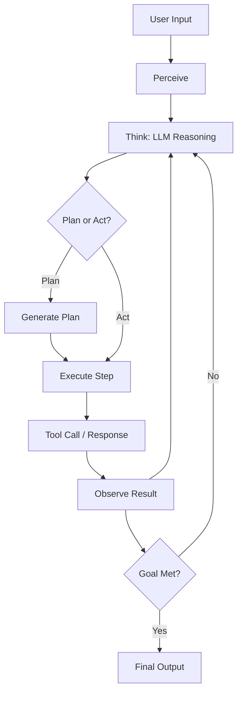
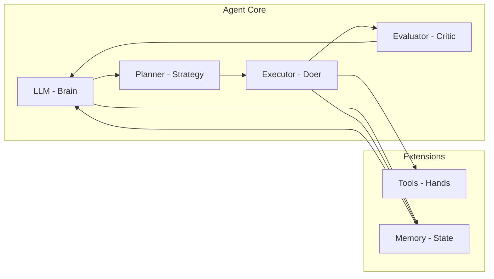
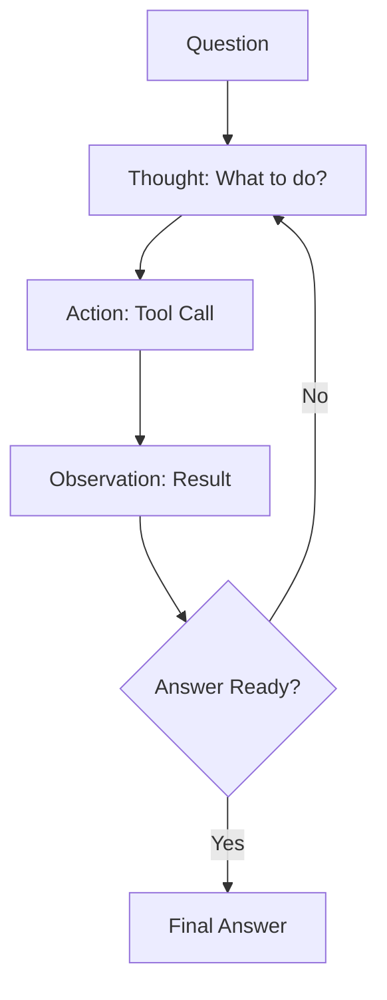
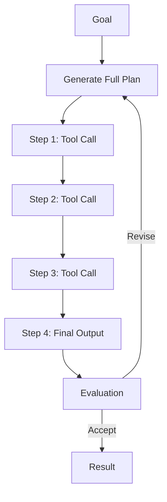
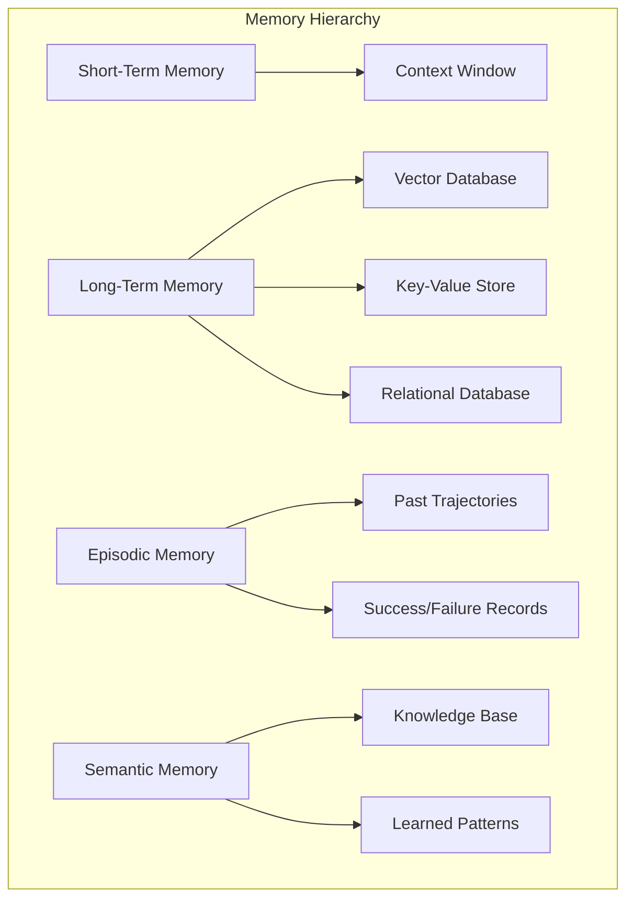
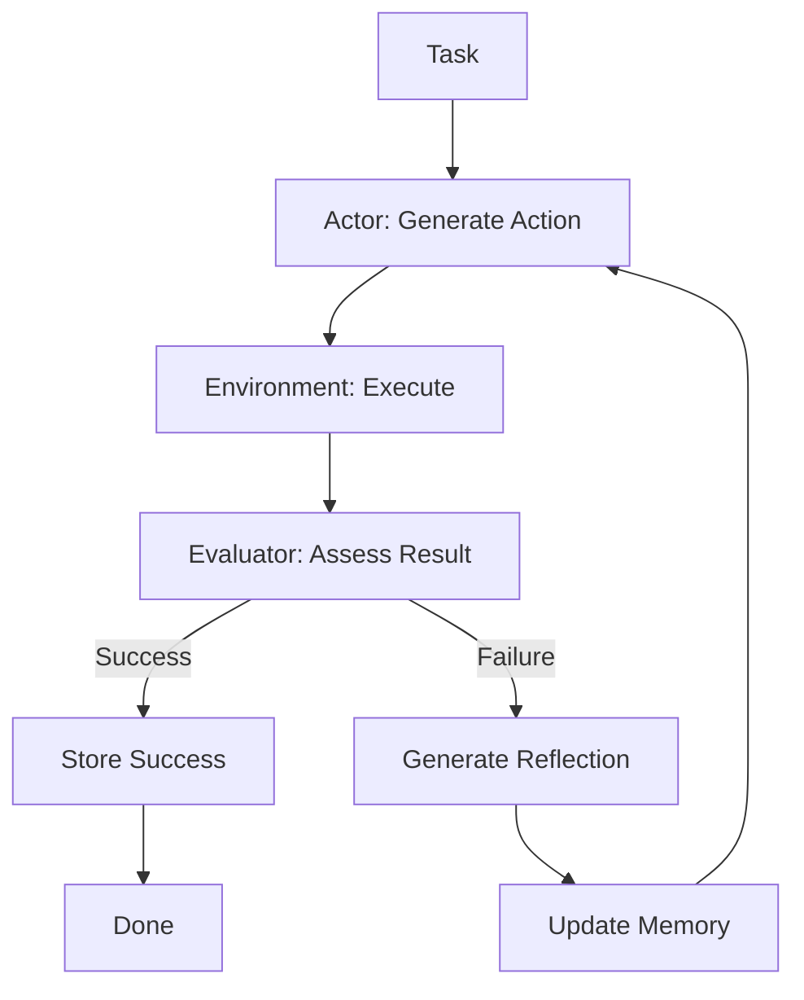
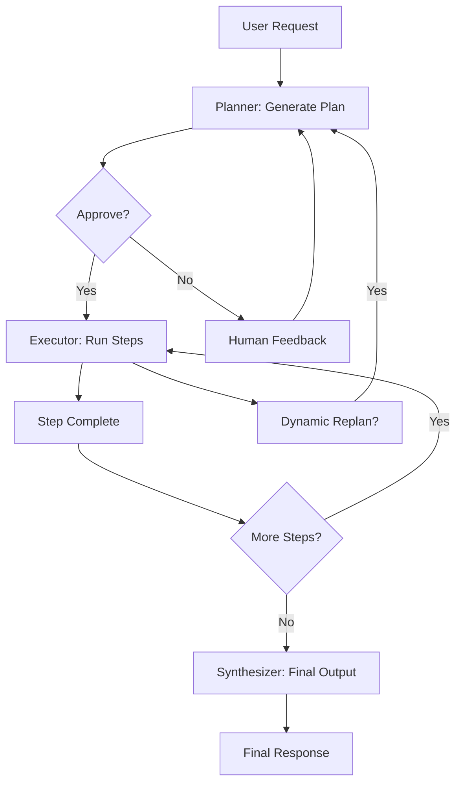
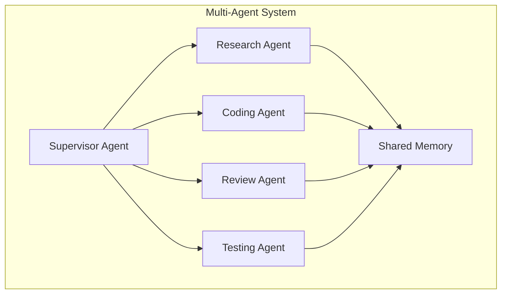
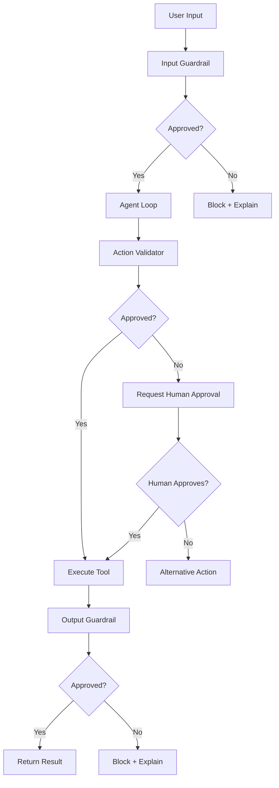
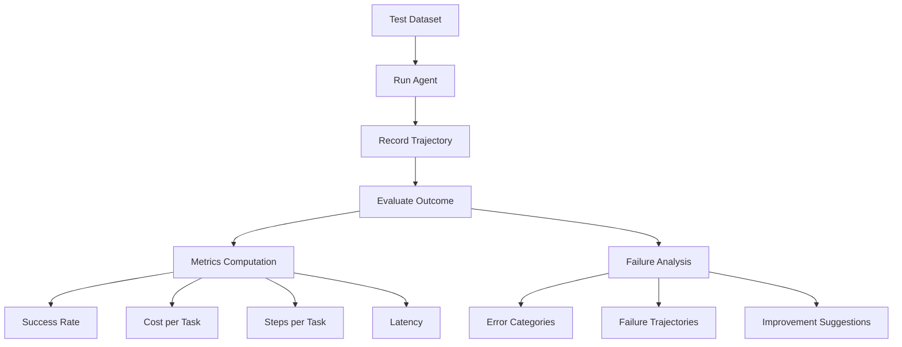

# Chapter 7: Agent Engineering

## 7.1 What Are AI Agents?

An AI agent is a system that uses a large language model (LLM) as its core reasoning engine to autonomously pursue goals by perceiving its environment, thinking about what to do, and taking actions. The fundamental mental model is a loop:

```
Perceive → Think → Act
```

- **Perceive**: The agent receives input — a user message, a tool result, a sensor reading, or a state update.
- **Think**: The LLM reasons about the current situation, considering context, past experiences, and available tools.
- **Act**: The agent executes a decision — calling a function, generating a response, or delegating to another agent.

This loop runs continuously until the agent achieves its goal, hits a stopping condition, or requires human intervention.

### The LLM as the "Brain"

The LLM is the cognitive core of the agent. It performs:
- **Reasoning**: Decomposing complex goals into steps.
- **Decision-making**: Choosing which tool to call or what action to take.
- **Memory retrieval**: Deciding what past information is relevant.
- **Self-evaluation**: Critiquing its own outputs and correcting mistakes.

### Tools as "Hands"

Tools extend the LLM's capabilities beyond text generation. They enable:
- Reading files and databases
- Executing code
- Making API calls
- Searching the web
- Manipulating data
- Controlling external systems

Without tools, an LLM is just a text generator. With tools, it becomes an agent that can change the world.

### Memory as "State"

Memory gives an agent continuity across interactions:
- **Short-term memory**: The context window — what's in the current conversation.
- **Long-term memory**: External storage (vector DBs, key-value stores) that persists across sessions.
- **Episodic memory**: Records of past actions and their outcomes.
- **Semantic memory**: Cached knowledge and learned patterns.

### Planning as "Strategy"

Planning enables multi-step reasoning:
- **ReAct**: Interleaved reasoning and acting (Thought → Action → Observation).
- **Plan-ahead**: Generate a complete plan first, then execute step by step.
- **Hierarchical**: Break high-level goals into sub-tasks, possibly delegated to sub-agents.
- **Re-planning**: Dynamically adjust plans when actions fail or new information arrives.



---

## 7.2 Agent Architecture

A production-ready agent is composed of six core components:



### 7.2.1 LLM (Brain)

The LLM is the reasoning engine. Selection criteria:
- **Reasoning ability**: Strong chain-of-thought and instruction following.
- **Tool use support**: Native function/tool calling API.
- **Context length**: Longer is better for complex agent traces.
- **Cost vs. capability**: Trade-off between quality and expense.

Popular choices: GPT-4o, Claude 3.5 Sonnet, Gemini Ultra, open-source models via vLLM or Ollama.

### 7.2.2 Tools (Hands)

Tools are functions the LLM can invoke. Each tool has:
- **Name**: Unique identifier.
- **Description**: Natural language explanation of what it does.
- **Input schema**: JSON Schema defining parameters.
- **Implementation**: The actual function/API call.
- **Error handling**: How failures are communicated back.

### 7.2.3 Memory (State)

Memory systems store and retrieve information:
- **Conversation history**: Recent turns in the current session.
- **Vector store**: Semantic search over past experiences.
- **Structured storage**: Key-value pairs, databases, files.
- **Working memory**: Scratchpad for current task state.

### 7.2.4 Planner (Strategy)

The planner determines what to do:
- **Zero-shot**: LLM decides action directly from prompt.
- **ReAct**: Interleaves reasoning and actions.
- **Plan-ahead**: Generates entire plan upfront.
- **Hierarchical**: Decomposes goals recursively.

### 7.2.5 Executor (Doer)

The executor runs the plan:
- **Orchestration**: Managing the agent loop.
- **Tool dispatch**: Calling tools with correct parameters.
- **State tracking**: Updating memory with results.
- **Error recovery**: Handling tool failures gracefully.
- **Streaming**: Yielding intermediate results to the user.

### 7.2.6 Evaluator (Critic)

The evaluator assesses outputs:
- **Task completion**: Did we achieve the goal?
- **Quality check**: Is the output correct and well-formed?
- **Safety check**: Does the output violate policies?
- **Self-reflection**: What could we improve next time?

---

## 7.3 Planning

Planning is how an agent decomposes a complex goal into manageable steps.

### 7.3.1 ReAct (Reasoning + Acting)

ReAct, introduced by Yao et al. (2022), interleaves reasoning traces with actions:

```
Thought: I need to find the population of Tokyo.
Action: search("Tokyo population")
Observation: "Tokyo population is 14 million (2023 estimate)"
Thought: I have the answer.
Answer: The population of Tokyo is approximately 14 million as of 2023.
```



The ReAct pattern is powerful because:
- Reasoning traces make the agent's thinking visible and debuggable.
- Actions are grounded in real observations, reducing hallucination.
- The loop is simple and widely supported by LLM frameworks.

### 7.3.2 Plan-Ahead

In plan-ahead mode, the agent generates a complete plan before executing:

```
Plan:
1. Search for "machine learning trends 2025"
2. Read the top 3 results
3. Synthesize findings into a summary
4. Format as a report

Executing step 1...
```



Advantages:
- Clear structure visible to the user upfront.
- Easier to estimate completion time.
- Can parallelize independent steps.

Disadvantages:
- Less flexible when unexpected situations arise.
- May over-commit to a suboptimal plan.

### 7.3.3 Hierarchical Planning

Complex tasks are broken into sub-tasks, each handled by a specialized sub-agent:

```
High-level plan:
  Research phase:
    - Sub-agent: Web search specialist
    - Sub-agent: Data extraction specialist
  Analysis phase:
    - Sub-agent: Data analyst
  Synthesis phase:
    - Sub-agent: Writing specialist
    - Sub-agent: Reviewer
```

This is especially useful for:
- Large codebases where different agents own different modules.
- Research tasks requiring multiple domains of expertise.
- Workflows with parallel independent branches.

### 7.3.4 Re-Planning on Failure

When a step fails, the agent must adapt:

```python
def execute_with_replan(plan, max_retries=3):
    for attempt in range(max_retries):
        result = execute_step(plan.current_step)
        if result.success:
            plan.advance()
        else:
            new_plan = replan(plan, error=result.error)
            if new_plan:
                plan = new_plan
            else:
                raise ExecutionError("Re-planning failed")
    return plan
```

Re-planning strategies:
- **Retry with different approach**: Same goal, different tool/parameters.
- **Substitute tool**: Use a different tool to achieve the same outcome.
- **Simplify goal**: Reduce scope to match available capabilities.
- **Ask for help**: Request human guidance.

---

## 7.4 Memory Systems for Agents

Memory transforms an agent from stateless to stateful. Without memory, every interaction starts from scratch.

### Memory Hierarchy



### 7.4.1 Short-Term Memory

The LLM's context window is the agent's working memory.

**Capacity**: 4K to 200K+ tokens depending on the model.

**Management strategies**:
- **Sliding window**: Keep last N turns, discard oldest.
- **Token budget**: Allocate tokens across conversation history, tool results, and new input.
- **Summarization**: Compress older turns into summaries.
- **Attention sinks**: Recent and first messages get priority.

```python
def manage_context(messages, max_tokens=128000):
    total = count_tokens(messages)
    if total <= max_tokens:
        return messages

    # Strategy: keep system prompt, last N exchanges, summarize middle
    system = messages[0:1]
    recent = messages[-10:]  # Last 10 exchanges
    middle = messages[1:-10]

    summary = summarize_conversation(middle)
    return system + [summary] + recent
```

### 7.4.2 Long-Term Memory

Information persists across sessions in external storage.

**Vector Database** (e.g., Pinecone, Chroma, Weaviate, pgvector):
- Store embeddings of past conversations, documents, or tool results.
- Retrieve semantically similar experiences.
- Essential for RAG-based agents.

**Key-Value Store** (e.g., Redis, SQLite):
- Store preferences, configuration, and state.
- Fast lookups for structured data.

**Relational Database** (e.g., PostgreSQL):
- Store structured records of agent actions, outcomes, and metrics.
- Enables analytics on agent performance.

### 7.4.3 Episodic Memory

Episodic memory stores specific past experiences:

- **Successful trajectories**: What worked in similar situations.
- **Failed attempts**: What didn't work and why.
- **User feedback**: Corrections and preferences from past interactions.

Retrieval is triggered when the agent encounters a similar situation:
```python
def retrieve_relevant_episodes(current_task, memory_store, top_k=3):
    query_embedding = embed(current_task)
    episodes = memory_store.similarity_search(query_embedding, k=top_k)
    return episodes
```

### 7.4.4 Semantic Memory

Semantic memory stores general knowledge and patterns extracted from experience:

```
Patterns extracted:
- "When searching for API docs, prioritize official sources"
- "When writing Python, prefer async patterns for I/O tasks"
- "User prefers concise answers with code examples"
```

These are learned over time and can be explicitly updated or implicitly inferred.

### 7.4.5 Memory Retrieval and Summarization

Effective memory retrieval is critical:

```python
class AgentMemory:
    def __init__(self):
        self.short_term = ConversationBuffer()
        self.long_term = VectorStore()
        self.episodic = VectorStore()
        self.semantic = KnowledgeGraph()

    def retrieve_relevant(self, query, k=5):
        long_term_results = self.long_term.similarity_search(query, k=k)
        episodic_results = self.episodic.similarity_search(query, k=k)
        semantic_results = self.semantic.query(query)

        return {
            "long_term": long_term_results,
            "episodic": episodic_results,
            "semantic": semantic_results,
        }

    def summarize_and_store(self, trajectory):
        summary = summarize_trajectory(trajectory)
        embedding = embed(summary)
        self.episodic.store(embedding, trajectory)
```

---

## 7.5 Tools & Function Calling

Tools are the primary mechanism by which agents interact with the world.

### 7.5.1 Defining Tool Interfaces

Tools are defined as functions with typed parameters and return values:

```python
from typing import Optional
from datetime import datetime

def search_web(
    query: str,
    max_results: int = 5,
    date_filter: Optional[str] = None
) -> list[dict]:
    """
    Search the web for information.

    Args:
        query: The search query string
        max_results: Maximum number of results (default: 5)
        date_filter: Optional date filter (e.g., "past_week", "past_month")

    Returns:
        List of search results with title, url, and snippet
    """
    # Implementation
    pass
```

For LLM function calling, tools are described in JSON Schema:

```json
{
  "type": "function",
  "function": {
    "name": "search_web",
    "description": "Search the web for information",
    "parameters": {
      "type": "object",
      "properties": {
        "query": {
          "type": "string",
          "description": "The search query string"
        },
        "max_results": {
          "type": "integer",
          "description": "Maximum number of results (default: 5)",
          "default": 5
        }
      },
      "required": ["query"]
    }
  }
}
```

### 7.5.2 Tool Descriptions

The quality of tool descriptions directly impacts agent performance:

| Component | Good | Bad |
|-----------|------|-----|
| Name | `search_web` | `func1` |
| Description | "Search the web for current information. Use for news, facts, and recent events." | "Search function" |
| Parameters | Clear names with descriptions | `arg1`, `arg2` |
| Return type | Structured with schema | "Returns results" |

**Best practices for tool descriptions**:
- Tell the LLM **when** to use this tool vs. others.
- Mention **limitations** (e.g., "may return stale data").
- Describe **return format** so the LLM knows what to expect.
- Include **examples** of good queries.

### 7.5.3 Forcing Tool Calls

Sometimes you want to force the LLM to use a specific tool:

```python
# OpenAI-style forced tool call
response = client.chat.completions.create(
    model="gpt-4",
    messages=messages,
    tools=tools,
    tool_choice={"type": "function", "function": {"name": "search_web"}}
)
```

Use cases:
- After an error, force the retry.
- In a specific step of a plan, force the expected action.
- During testing, validate tool behavior.

### 7.5.4 Parallel Tool Calls

Modern LLMs support calling multiple tools in one turn:

```python
# The LLM might return multiple tool calls at once
response = client.chat.completions.create(
    model="gpt-4",
    messages=messages,
    tools=tools,
    parallel_tool_calls=True
)

# Process all calls in parallel
import asyncio

async def execute_parallel(calls):
    tasks = [execute_tool_call(call) for call in calls]
    results = await asyncio.gather(*tasks, return_exceptions=True)
    return results
```

Benefits:
- Reduces latency by executing independent calls concurrently.
- Allows the agent to gather multiple pieces of information simultaneously.
- More natural for tasks like "search for X and Y".

### 7.5.5 Error Handling

Tools can fail in many ways:
- Network timeouts
- API rate limits
- Invalid parameters
- Authentication failures
- Data not found

```python
class ToolResult:
    def __init__(self, success: bool, data=None, error=None):
        self.success = success
        self.data = data
        self.error = error

def safe_tool_call(tool_func, params, max_retries=2):
    for attempt in range(max_retries + 1):
        try:
            result = tool_func(**params)
            return ToolResult(success=True, data=result)
        except RateLimitError as e:
            wait = min(2 ** attempt * 5, 60)
            time.sleep(wait)
        except TimeoutError:
            if attempt == max_retries:
                return ToolResult(success=False, error="Tool timed out")
        except Exception as e:
            return ToolResult(success=False, error=str(e))
    return ToolResult(success=False, error="Max retries exceeded")
```

Error messages returned to the LLM should be informative:
```
Tool 'search_web' failed: Rate limit exceeded (429). Retry after 30 seconds.
```

---

## 7.6 Execution

The execution layer runs the agent loop, manages state, and streams outputs.

### 7.6.1 Running Agent Loops

```python
class AgentLoop:
    def __init__(self, llm, tools, memory, max_steps=25):
        self.llm = llm
        self.tools = {t.name: t for t in tools}
        self.memory = memory
        self.max_steps = max_steps
        self.step_count = 0

    async def run(self, user_input: str) -> str:
        self.memory.add_user_message(user_input)

        for step in range(self.max_steps):
            self.step_count += 1

            # Think: LLM decides next action
            response = await self.llm.generate(
                messages=self.memory.get_messages(),
                tools=list(self.tools.values())
            )

            if response.tool_calls:
                # Act: Execute tool calls
                for call in response.tool_calls:
                    result = await self.execute_tool(call)
                    self.memory.add_tool_result(call, result)

                    # Evaluate: Check if result indicates completion
                    if self.is_goal_achieved(result):
                        return self.finalize_output()

                    # Reflect: Store experience
                    self.memory.store_experience(call, result)
            else:
                # No tool call — this is the final response
                return response.text

        return "Agent reached maximum steps without completing the task."

    async def execute_tool(self, call):
        tool = self.tools.get(call.name)
        if not tool:
            return ToolResult(success=False, error=f"Unknown tool: {call.name}")
        return await safe_tool_call(tool.fn, call.arguments)
```

### 7.6.2 State Management

Agent state must be carefully managed:

```python
@dataclass
class AgentState:
    task: str
    plan: Optional[list[str]] = None
    current_step: int = 0
    completed_steps: list[dict] = field(default_factory=list)
    memory: dict[str, Any] = field(default_factory=dict)
    errors: list[str] = field(default_factory=list)
    metadata: dict[str, Any] = field(default_factory=dict)
```

State is persisted between steps and across sessions:
- **In-memory**: Fast, but lost on crash.
- **Database**: Durable, enables recovery.
- **Checkpointing**: Save state at key points for rollback.

### 7.6.3 Tool Result Processing

Raw tool results often need processing before the LLM can use them:

```python
def process_tool_result(result: ToolResult, max_length: int = 10000) -> str:
    if not result.success:
        return f"Error: {result.error}"

    raw = result.data

    if isinstance(raw, str):
        # Truncate long strings
        if len(raw) > max_length:
            return raw[:max_length] + "\n... [truncated]"
        return raw

    if isinstance(raw, (list, dict)):
        # Serialize structured data
        serialized = json.dumps(raw, indent=2, default=str)
        if len(serialized) > max_length:
            # Summarize instead
            return summarize_structured(raw)
        return serialized

    return str(raw)
```

### 7.6.4 Streaming Agent Outputs

Users expect to see agent progress in real-time:

```python
class StreamingAgentLoop:
    async def run(self, user_input: str):
        # Stream the initial plan
        yield {"type": "status", "content": "Analyzing your request..."}

        # Stream thoughts
        yield {"type": "thought", "content": "I need to search for information first."}

        # Stream tool calls
        yield {
            "type": "tool_call",
            "name": "search_web",
            "params": {"query": "latest AI developments"},
        }

        # Stream tool results
        yield {"type": "tool_result", "name": "search_web", "content": "..."}

        # Stream final response tokens
        async for token in self.llm.stream(messages, tools):
            yield {"type": "token", "content": token}
```

Frontend components can render these events differently:
- Thoughts in a side panel with typewriter effect.
- Tool calls as expandable cards.
- Results as collapsible sections.
- Final answer as the main output.

---

## 7.7 Reflection & Self-Correction

Reflection enables agents to learn from their mistakes and improve their outputs.

### 7.7.1 The Reflexion Pattern (Shinn et al., 2023)

Reflexion is a framework where agents store verbal reflections in episodic memory to improve future decisions:



**Key components**:
1. **Actor**: The agent that generates actions.
2. **Evaluator**: Assesses whether the action succeeded.
3. **Reflection**: A textual analysis of what went wrong and how to improve.
4. **Memory**: Stores reflections for future episodes.

```python
def generate_reflection(task, trajectory, outcome):
    prompt = f"""
    Task: {task}

    What I tried:
    {trajectory}

    Outcome: {outcome}

    Reflect on what went wrong and what you should do differently next time.
    Be specific about which actions were ineffective and why.
    """
    reflection = llm.generate(prompt)
    return reflection
```

### 7.7.2 Self-Evaluation

Agents can critique their own outputs:

```python
def self_evaluate(response, criteria):
    prompt = f"""
    Evaluate the following response on these criteria (1-10):
    - Accuracy: Is all information correct?
    - Completeness: Does it fully answer the question?
    - Clarity: Is it well-structured and understandable?
    - Conciseness: Is it appropriately brief?

    Response: {response}

    Provide scores and specific improvement suggestions.
    """
    evaluation = llm.generate(prompt)
    return evaluation
```

### 7.7.3 Learning from Mistakes

```python
class ReflectiveAgent:
    def __init__(self):
        self.experience_buffer = []

    def reflect_and_improve(self, task, attempts):
        # Analyze what went wrong
        reflection = self.generate_reflection(task, attempts)

        # Extract lessons
        lessons = self.extract_lessons(reflection)

        # Store in semantic memory
        for lesson in lessons:
            self.semantic_memory.store(
                key=f"lesson:{lesson.id}",
                value=lesson.text,
                tags=lesson.tags
            )

        # Retrieve relevant lessons for next task
        def before_next_task(new_task):
            relevant = self.semantic_memory.query(
                new_task, filter={"type": "lesson"}
            )
            return relevant
```

---

## 7.8 Single Agent Patterns

### 7.8.1 Simple ReAct Agent

The simplest agent pattern — a loop of thought, action, observation:

```python
class ReActAgent:
    def __init__(self, llm, tools):
        self.llm = llm
        self.tools = tools

    async def run(self, task):
        messages = [{"role": "system", "content": SYSTEM_PROMPT},
                    {"role": "user", "content": task}]

        for _ in range(20):
            response = await self.llm.generate(messages, tools=self.tools)

            if response.tool_calls:
                for call in response.tool_calls:
                    result = await call.execute()
                    messages.append({"role": "tool", "content": str(result)})
            else:
                return response.content

        return "Max iterations reached."
```

### 7.8.2 Plan-and-Execute Agent

Separates planning from execution:



### 7.8.3 Research Agent

A specialized agent for research tasks (search → read → synthesize):

```python
class ResearchAgent:
    def __init__(self):
        self.search_tool = SearchTool()
        self.read_tool = ReadTool()
        self.synthesizer = Synthesizer()

    async def research(self, topic, depth=3):
        # Search
        query = self.formulate_query(topic)
        results = await self.search_tool.search(query, num_results=5)

        # Read
        documents = []
        for result in results[:depth]:
            content = await self.read_tool.read(result.url)
            documents.append({"url": result.url, "content": content})

        # Synthesize
        report = await self.synthesizer.generate(documents, topic)

        # Verify
        report = await self.fact_check(report)

        return report
```

### 7.8.4 Coding Agent

A coding agent writes, tests, and fixes code:

```python
class CodingAgent:
    async def develop(self, specification):
        # Write code
        code = await self.generate_code(specification)

        # Write tests
        tests = await self.generate_tests(code)

        # Run tests
        test_results = await self.execute_tests(tests)

        # Fix failures
        for _ in range(3):  # Max 3 fix attempts
            if test_results.failed:
                code = await self.fix_code(code, test_results)
                test_results = await self.execute_tests(tests)
            else:
                break

        return code, test_results
```

---

## 7.9 Multi-Agent Systems

Multi-agent systems decompose complex tasks across multiple specialized agents.



### 7.9.1 Supervisor Agent

A supervisor delegates tasks and coordinates results:

```python
class SupervisorAgent:
    def __init__(self):
        self.sub_agents = {
            "researcher": ResearchAgent(),
            "coder": CodingAgent(),
            "reviewer": ReviewAgent(),
            "tester": TestingAgent(),
        }

    async def run(self, task):
        # Decompose task
        subtasks = await self.decompose(task)

        # Assign to sub-agents
        results = {}
        for subtask in subtasks:
            agent = self.select_agent(subtask)
            results[subtask.id] = await agent.run(subtask)

        # Synthesize final result
        return await self.synthesize(results)
```

### 7.9.2 Router Agent

A router directs requests to the appropriate specialist:

```
Input: "Write a Python function to sort a list"
Router → Coding Agent

Input: "What's the latest AI news?"
Router → Research Agent
```

```python
class RouterAgent:
    async def route(self, user_input):
        categories = ["coding", "research", "analysis", "creative"]
        category = await self.classify(user_input, categories)
        agent = self.get_agent_for_category(category)
        return await agent.run(user_input)
```

### 7.9.3 Debate Between Agents

Multiple agents debate to improve answer quality:

```python
class DebateSystem:
    async def debate(self, question, num_agents=3):
        # Generate initial answers
        answers = []
        for i in range(num_agents):
            agent = self.create_agent(persona=f"Expert {i}")
            answers.append(await agent.answer(question))

        # Debate rounds
        for round in range(3):
            for i, agent in enumerate(self.agents):
                others = [a for j, a in enumerate(answers) if j != i]
                answers[i] = await agent.revise(question, answers[i], others)

        # Synthesize final answer
        return await self.synthesize(answers)
```

### 7.9.4 Collaboration Patterns

| Pattern | Description | Use Case |
|---------|-------------|----------|
| **Supervisor** | One agent delegates to others | Complex workflows |
| **Router** | Classify and direct | Customer support |
| **Debate** | Agents critique each other | Fact-checking |
| **Pipeline** | Sequential handoff | Data processing |
| **Marketplace** | Agents bid on tasks | Distributed systems |

### 7.9.5 Shared Memory

Multi-agent systems need shared state:

```python
class SharedMemory:
    def __init__(self):
        self.store = RedisStore()
        self.lock = Lock()

    async def read(self, key):
        return await self.store.get(key)

    async def write(self, key, value, agent_id):
        async with self.lock:
            current = await self.store.get(key)
            # Log who wrote what
            await self.store.set(key, value)
            await self.store.log_write(key, agent_id, timestamp())

    async def get_history(self, key):
        return await self.store.get_log(key)
```

---

## 7.10 Agent Safety

As agents gain autonomy, safety becomes critical.

### Safety Guardrails Architecture



### 7.10.1 Human-in-the-Loop

Critical decisions require human approval:

```python
class HumanInTheLoop:
    def __init__(self, approval_threshold=0.8):
        self.threshold = approval_threshold

    async def should_approve(self, action, context):
        risk_score = self.assess_risk(action, context)
        if risk_score < self.threshold:
            return True  # Auto-approve low-risk actions

        return await self.ask_human(f"Approve this action? {action}")

    def assess_risk(self, action, context):
        # Check for risky patterns
        risk = 0
        if action.type in ("delete", "update", "write"):
            risk += 0.3
        if action.scope in ("production", "database"):
            risk += 0.3
        if action.cost_estimate > 10:  # dollars
            risk += 0.2
        return risk
```

### 7.10.2 Approval Gates

Define mandatory approval points:

```python
APPROVAL_GATES = {
    "modify_file": {"required": True, "reason": "File modification"},
    "execute_code": {"required": True, "reason": "Code execution"},
    "api_call": {"required": False, "budget": 0.01},  # Under $0.01
    "delete_resource": {"required": True, "reason": "Destructive action"},
    "send_email": {"required": True, "reason": "External communication"},
}
```

### 7.10.3 Budget Limits

Prevent runaway costs:

```python
class BudgetController:
    def __init__(self, max_budget=10.0):
        self.max_budget = max_budget
        self.spent = 0.0

    async def check_budget(self, estimated_cost):
        if self.spent + estimated_cost > self.max_budget:
            raise BudgetExceededError(
                f"Would exceed budget. Spent: ${self.spent:.2f}, "
                f"Estimated: ${estimated_cost:.2f}, Max: ${self.max_budget:.2f}"
            )
        return True

    def record_cost(self, cost):
        self.spent += cost
```

### 7.10.4 Action Validation

Validate every action before execution:

```python
def validate_action(action, policies):
    checks = [
        validate_parameters(action.params, action.schema),
        validate_permissions(action.name, action.context),
        validate_rate_limit(action.name),
        validate_content_policy(action.params),
    ]
    return all(check.passed for check in checks), [c for c in checks if not c.passed]
```

### 7.10.5 Sandboxed Execution

Run untrusted code in isolated environments:

```python
class SandboxExecutor:
    def __init__(self):
        self.timeout = 30  # seconds
        self.memory_limit = 512 * 1024 * 1024  # 512 MB

    async def execute(self, code):
        # Use Docker or subprocess with restrictions
        result = await run_in_docker(
            image="sandbox:latest",
            code=code,
            timeout=self.timeout,
            memory_limit=self.memory_limit,
            network_access=False,
            read_only_filesystem=True
        )
        return result
```

---

## 7.11 Production Agents

Deploying agents to production requires reliability, observability, and cost management.

### 7.11.1 Reliability

```python
class ReliableAgent:
    def __init__(self):
        self.max_retries = 3
        self.timeout = 60
        self.circuit_breaker = CircuitBreaker(failure_threshold=5)

    async def run_with_reliability(self, task):
        for attempt in range(self.max_retries):
            try:
                async with self.circuit_breaker:
                    result = await asyncio.wait_for(
                        self.run(task),
                        timeout=self.timeout
                    )
                    return result
            except TimeoutError:
                log.warning(f"Attempt {attempt + 1} timed out")
            except CircuitBreakerOpen:
                await asyncio.sleep(30)
            except Exception as e:
                log.error(f"Attempt {attempt + 1} failed: {e}")
                if attempt == self.max_retries - 1:
                    raise
```

### 7.11.2 Observability

```python
# Structured logging
log = structlog.get_logger()

class ObservableAgent:
    async def run(self, task):
        with tracer.start_as_current_span("agent.run") as span:
            span.set_attribute("task", task)
            log.info("agent.started", task=task)

            try:
                result = await self._run(task)
                span.set_attribute("success", True)
                log.info("agent.completed", task=task, duration=span.duration)
                return result
            except Exception as e:
                span.record_exception(e)
                span.set_attribute("success", False)
                log.error("agent.failed", task=task, error=str(e))
                raise
```

**Metrics to track**:
- `agent.steps.count`: Number of steps per task
- `agent.tool.calls`: Tool usage frequency
- `agent.tool.latency`: Per-tool latency
- `agent.cost.total`: Token + API costs
- `agent.errors.count`: Error rate
- `agent.success.rate`: Task completion rate

### 7.11.3 Error Recovery

```python
class RecoveryManager:
    STATES = {
        "running": RecoveryStrategy.RETRY,
        "tool_failed": RecoveryStrategy.ALTERNATIVE_TOOL,
        "plan_stuck": RecoveryStrategy.REPLAN,
        "context_overflow": RecoveryStrategy.SUMMARIZE,
        "rate_limited": RecoveryStrategy.BACKOFF,
    }

    async def recover(self, state, context):
        strategy = self.STATES.get(state, RecoveryStrategy.ASK_HUMAN)
        return await strategy.execute(context)
```

### 7.11.4 Timeouts

Every step needs a timeout:

```python
STEP_TIMEOUT = 30  # seconds per step
TOTAL_TIMEOUT = 300  # max total execution time

async def execute_with_timeouts(agent, task):
    try:
        result = await asyncio.wait_for(
            agent.run(task),
            timeout=TOTAL_TIMEOUT
        )
        return result
    except asyncio.TimeoutError:
        return {"error": "Agent timed out", "partial_result": agent.get_snapshot()}
```

### 7.11.5 Rate Limiting

```python
class RateLimiter:
    def __init__(self, calls_per_minute=60):
        self.calls_per_minute = calls_per_minute
        self.timestamps = deque()

    async def wait_if_needed(self):
        now = time.time()
        # Remove timestamps older than 1 minute
        while self.timestamps and self.timestamps[0] < now - 60:
            self.timestamps.popleft()

        if len(self.timestamps) >= self.calls_per_minute:
            wait_time = self.timestamps[0] - (now - 60)
            await asyncio.sleep(wait_time)

        self.timestamps.append(now)
```

### 7.11.6 Cost Management

```python
class CostTracker:
    MODEL_COSTS = {
        "gpt-4": {"input": 0.03, "output": 0.06},  # per 1K tokens
        "gpt-3.5-turbo": {"input": 0.001, "output": 0.002},
        "claude-3-sonnet": {"input": 0.003, "output": 0.015},
    }

    def __init__(self, max_cost_per_task=0.50):
        self.max_cost_per_task = max_cost_per_task
        self.total_cost = 0.0

    def estimate_cost(self, model, input_tokens, output_tokens):
        costs = self.MODEL_COSTS.get(model, self.MODEL_COSTS["gpt-4"])
        input_cost = (input_tokens / 1000) * costs["input"]
        output_cost = (output_tokens / 1000) * costs["output"]
        return input_cost + output_cost

    async def check_and_track(self, model, input_tokens, output_tokens):
        cost = self.estimate_cost(model, input_tokens, output_tokens)
        if self.total_cost + cost > self.max_cost_per_task:
            raise CostExceededError(f"Cost limit ${self.max_cost_per_task:.2f}")
        self.total_cost += cost
```

---

## 7.12 Agent Evaluation

Evaluating agents is fundamentally different from evaluating LLMs — you need to assess the entire system.

### Agent Evaluation Pipeline



### 7.12.1 Task Completion Rate

The most important metric: did the agent successfully complete the task?

```python
def evaluate_completion(trajectory, expected_outcome):
    final_output = trajectory[-1]
    evaluation_prompt = f"""
    Task: {trajectory.task}
    Expected: {expected_outcome}
    Actual: {final_output}

    Did the agent successfully complete the task?
    Score 0-1:"""
    score = float(llm.generate(evaluation_prompt))
    return score >= 0.8  # Binary: success or not
```

### 7.12.2 Cost per Task

```python
def cost_per_task(trajectory):
    total_tokens = sum(t.tokens for t in trajectory.steps)
    total_api_calls = sum(1 for t in trajectory.steps if t.type == "tool_call")

    # Each model call has compute + API costs
    model_cost = calculate_model_cost(total_tokens)
    api_cost = total_api_calls * tool_callers.estimate_api_cost()

    return {
        "model_cost": model_cost,
        "api_cost": api_cost,
        "total_cost": model_cost + api_cost,
    }
```

### 7.12.3 Steps per Task

```python
def steps_analysis(trajectories):
    steps = [len(t.steps) for t in trajectories]
    return {
        "mean": statistics.mean(steps),
        "median": statistics.median(steps),
        "min": min(steps),
        "max": max(steps),
        "distribution": Counter(steps),
    }
```

### 7.12.4 Success Rate

```python
def success_rate(trajectories):
    successes = sum(1 for t in trajectories if t.success)
    total = len(trajectories)
    return {
        "rate": successes / total,
        "successes": successes,
        "failures": total - successes,
        "total": total,
    }
```

### 7.12.5 Failure Analysis

```python
def analyze_failures(trajectories):
    failures = [t for t in trajectories if not t.success]
    analysis = {
        "total": len(failures),
        "by_category": Counter(),
        "by_tool": Counter(),
        "by_step": Counter(),
        "trajectories": [],
    }

    for failure in failures:
        category = classify_failure(failure)
        analysis["by_category"][category] += 1
        analysis["by_tool"][failure.failing_tool] += 1
        analysis["by_step"][failure.failing_step] += 1
        analysis["trajectories"].append({
            "task": failure.task,
            "error": failure.error,
            "trajectory": failure.steps,
        })

    return analysis
```

### Evaluation Benchmarks

| Benchmark | Description | Metrics |
|-----------|-------------|---------|
| **GAIA** | General AI assistants | Task completion, steps |
| **SWE-bench** | Software engineering | Patch accuracy |
| **WebArena** | Web tasks | Task success rate |
| **ToolBench** | Tool use | Tool selection accuracy |
| **AgentBench** | Multi-domain | Overall score |

---

## Summary

AI agents represent the most powerful application of LLMs — systems that don't just generate text but **act** in the world. The key principles:

1. **The loop is fundamental**: Perceive → Think → Act is the universal agent pattern.
2. **Tools enable action**: An agent is only as capable as its tools.
3. **Memory provides continuity**: Without memory, agents are stateless and forgetful.
4. **Planning enables complexity**: Multi-step reasoning through structured plans.
5. **Reflection drives improvement**: Agents that learn from mistakes get better over time.
6. **Safety is non-negotiable**: Guardrails, human-in-the-loop, and sandboxing are essential.
7. **Evaluation is different**: You must evaluate the entire system, not just the LLM.
8. **Production requires infrastructure**: Reliability, observability, and cost management are table stakes.

Building agents is an iterative process. Start with a simple ReAct loop, add tools and memory, then layer on planning, reflection, and multi-agent coordination as needed.
