# Chapter 08: AI System Design

> **Learning Philosophy**: Problem → Why → Mental Model → Core Idea → Visual → Example → Common Mistakes → Best Practices

---

## 1. System Design for AI

### The Problem

Building AI applications is not like training models. A working prototype in a notebook is a long way from a production system. The hardest problems are not model accuracy — they are reliability under load, latency budgets, cost control, hallucination management, and graceful degradation when things fail.

### Why This Matters

Teams treat LLMs as the entire system rather than one component. They build monoliths that fail unpredictably. They cannot debug why a response was bad (was it the retrieval? the prompt? the model?). They have no observability. Their costs explode. Understanding system architecture is what separates demos from products.

### Mental Model

AI systems are traditional distributed systems with an LLM as a new compute primitive. All the same design principles apply:

- **Reliability** — The system must work despite failures (LLM timeouts, tool errors, rate limits)
- **Scalability** — The system must handle load (more users, more documents, more queries)
- **Maintainability** — The system must be debuggable, testable, and evolvable
- **Latency** — The system must meet user expectations (stream or die)
- **Cost** — The system must run within budget (each LLM call costs real money)

Plus new considerations unique to LLMs:

- **Hallucination** — The model makes things up. The system must detect and mitigate this.
- **Evaluation** — Unlike traditional software (pass/fail), AI output quality is continuous and subjective.
- **Security** — Prompt injection, data poisoning, and jailbreaks are new attack surfaces.
- **Observability** — You need to trace not just system metrics but reasoning paths.

### Core Idea

Design AI systems as pipelines of components, where the LLM is one component among many:

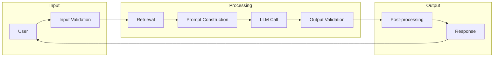

Each component is independently testable, replaceable, and observable.

---

## 2. AI Chatbot Architecture

### Problem

Chatbots are deceptive. A simple `while True: input() → LLM → print()` works for demos. Production chatbots need context management, memory, tool integration, streaming, rate limiting, and multi-modal support.

### Architecture

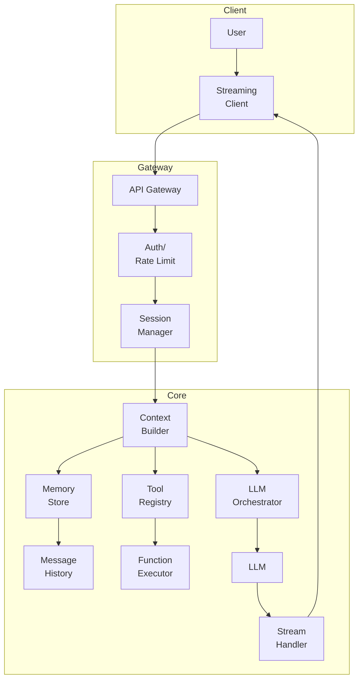

### Key Design Decisions

**Stateless vs Stateful:**

| Aspect | Stateless | Stateful |
|--------|-----------|----------|
| Context | Sent with every request | Stored server-side |
| Scaling | Simple (any server) | Session affinity needed |
| Failure | Any request to any server | Lost session on failure |
| State size | Request grows with history | Server memory grows |
| Use case | Simple Q&A | Long conversations |

Production systems are **hybrid**: the server stores conversation metadata and recent context, while the full history is retrieved on demand.

### Context Management

The context window is a finite resource that must be managed:

```python
# Context window budget
CONTEXT_BUDGET = 128_000  # tokens
ALLOCATIONS = {
    "system_prompt": 500,      # 0.4%
    "conversation_history": 100_000,  # 78%
    "retrieved_docs": 20_000,  # 15.6%
    "current_tools": 5_000,    # 4%
    "output_buffer": 2_500,    # 2%
}

def build_context(session, query):
    budget = ALLOCATIONS.copy()
    
    # System prompt (fixed cost)
    system = load_system_prompt()
    
    # Conversation history with pruning
    history = session.get_recent_history(token_limit=budget["conversation_history"])
    
    # Retrieved documents
    docs = retrieve_relevant(query, token_limit=budget["retrieved_docs"])
    
    return assemble_messages(system, history, docs, query)
```

### Memory Types

| Memory | Scope | Storage | Eviction |
|--------|-------|---------|----------|
| Ephemeral | Current conversation | In-memory | Session end |
| Working | Recent N messages | Redis (TTL) | N messages or TTL |
| Summary | Compressed history | Database | Periodic refresh |
| Long-term | User preferences | Database | Never (explicit) |
| Knowledge | Facts about domain | Vector store | Index refresh |

### Streaming

Streaming is non-negotiable for production chatbots. Without it, users wait 2-10s staring at a spinner.

```python
import asyncio
from sse_starlette.sse import EventSourceResponse

async def chat_stream(request):
    async def event_generator():
        async for chunk in llm.stream(messages):
            yield {"data": chunk}
            await asyncio.sleep(0)
    return EventSourceResponse(event_generator())
```

### Multi-modal Support

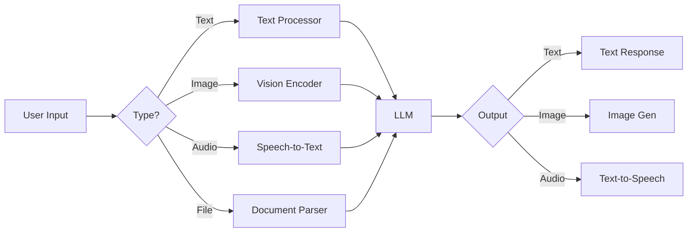

---

## 3. Research Assistant

### Problem

LLMs have knowledge cutoffs and hallucinate facts. A research assistant must produce answers grounded in real sources with verifiable citations.

### Pipeline

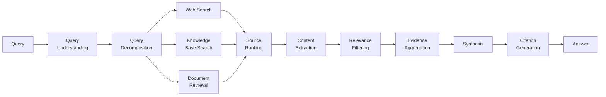

### Query Understanding

```python
def understand_query(query: str) -> dict:
    """Parse user query into structured search intent."""
    analysis = llm.extract({
        "query": query,
        "schema": {
            "intent": "factual | comparative | exploratory | procedural",
            "entities": ["list of key entities"],
            "timeframe": "when is this relevant?",
            "sub_questions": ["decomposed questions"],
            "required_sources": "web | academic | internal",
        }
    })
    return analysis
```

### Source Credibility Ranking

```python
SOURCE_RANKINGS = {
    "peer_reviewed": 1.0,
    "government_domain": 0.95,
    "educational_institution": 0.9,
    "established_media": 0.7,
    "company_blog": 0.5,
    "personal_blog": 0.3,
    "forum": 0.1,
}

def rank_sources(sources: list[dict]) -> list[dict]:
    for source in sources:
        credibility = SOURCE_RANKINGS.get(classify_domain(source["url"]), 0.1)
        recency = compute_recency_score(source["date"])
        relevance = source["embedding_similarity"]
        source["score"] = 0.5 * credibility + 0.3 * recency + 0.2 * relevance
    return sorted(sources, key=lambda x: x["score"], reverse=True)
```

### Synthesis with Citations

```python
def synthesize_with_citations(evidence: list[dict]) -> str:
    prompt = f"""
    Synthesize an answer using ONLY the provided evidence.
    Cite sources inline using [1], [2], etc.
    
    Evidence:
    {format_evidence(evidence)}
    
    Answer format: paragraph with inline citations, 
    followed by a References section.
    """
    return llm.generate(prompt)
```

---

## 4. Coding Agent

### Problem

Coding is not single-turn. An agent must understand a problem, explore codebases, generate multi-file changes, test them, debug failures, and iterate. It needs deep repository context awareness.

### Architecture

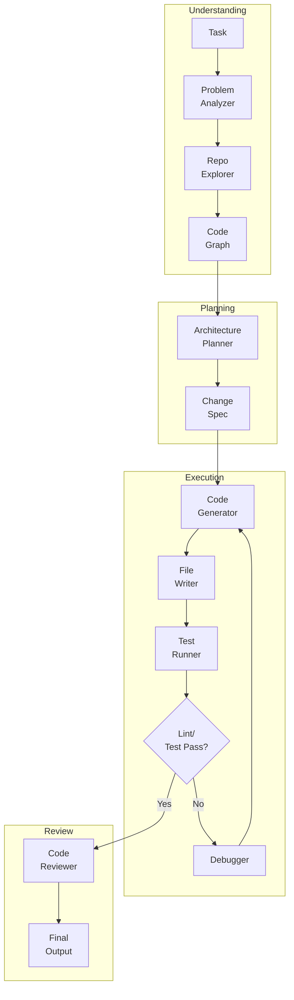

### Repository Context

The agent needs a structured understanding of the codebase:

```python
class RepoContext:
    def __init__(self, repo_path: str):
        self.file_tree = self.build_file_tree(repo_path)
        self.dependency_graph = self.build_dependency_graph(repo_path)
        self.entry_points = self.find_entry_points()
        self.config_files = self.find_config_files()
        self.recent_changes = self.get_git_history()
    
    def get_context_for_task(self, task_description: str) -> dict:
        """Retrieve relevant files for a given task."""
        relevant_files = self.semantic_search(task_description)
        return {
            "file_tree_summary": self.summarize_file_tree(relevant_files),
            "relevant_code": self.read_files(relevant_files),
            "dependencies": self.get_module_dependencies(relevant_files),
        }
```

### Multi-file Editing

```python
class MultiFileEdit:
    def plan_changes(self, specification: str) -> list[EditPlan]:
        edits = llm.extract_structured({
            "spec": specification,
            "repo": self.repo_summary,
            "output_schema": {
                "files_to_create": [{"path": "", "content": ""}],
                "files_to_modify": [{
                    "path": "",
                    "changes": [{"old": "", "new": ""}],
                }],
                "files_to_delete": [""],
            }
        })
        return edits
    
    def apply_with_validation(self, edits: list[EditPlan]):
        for edit in edits:
            self.backup_file(edit.path)
            self.apply_edit(edit)
            if not self.validate_syntax(edit.path):
                self.rollback(edit.path)
```

---

## 5. Customer Support System

### Problem

Support teams are drowned in tickets. AI must classify, retrieve answers, generate responses, and escalate appropriately — without making things worse.

### Architecture

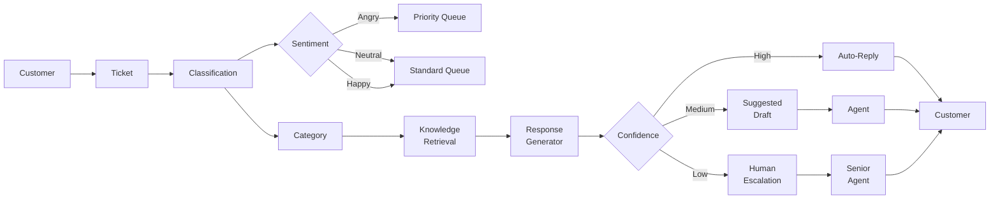

### Sentiment Detection

```python
def analyze_sentiment(text: str) -> dict:
    """Detect sentiment and urgency from support ticket."""
    analysis = llm.extract({
        "ticket": text,
        "schema": {
            "sentiment": "positive | neutral | negative | frustrated | angry",
            "urgency": 1.0,  # 0-1 scale
            "is_escalation": bool,
            "requires_human": bool,
            "summary": "",
        }
    })
    
    # Override with keyword heuristics for safety
    URGENT_KEYWORDS = ["cancel", "refund", "legal", "emergency", "security"]
    for kw in URGENT_KEYWORDS:
        if kw in text.lower():
            analysis["urgency"] = max(analysis["urgency"], 0.9)
            analysis["requires_human"] = True
    
    return analysis
```

### Response Templates with Guardrails

```python
RESPONSE_TEMPLATES = {
    "refund_request": """
    Subject: Refund Request #{ticket_id}
    
    Hi {customer_name},
    
    We've received your refund request for {product}.
    
    {resolution_steps}
    
    If you have any questions, reply to this email.
    
    Best,
    {agent_name}
    """,
    
    "technical_issue": """
    Subject: Technical Support - {issue_category}
    
    Hi {customer_name},
    
    Here are the steps to resolve your issue:
    
    1. {step_1}
    2. {step_2}
    3. {step_3}
    
    If these don't work, we'll escalate to our engineering team.
    
    Best,
    {agent_name}
    """,
}

def generate_response(ticket: dict, knowledge: list[dict]) -> str:
    template = select_template(ticket["category"])
    resolution = llm.generate(
        f"Based on this knowledge:\n{knowledge}\n\n"
        f"Generate resolution steps for: {ticket['issue']}"
    )
    
    response = template.format(
        ticket_id=ticket["id"],
        customer_name=ticket["name"],
        resolution_steps=resolution,
        agent_name="AI Support",
    )
    
    # Safety check
    validate_no_hallucinations(response, knowledge)
    return response
```

### Human Escalation

```python
def should_escalate(ticket: dict, response: dict) -> bool:
    reasons = []
    
    if ticket.get("is_vip"):
        reasons.append("VIP customer")
    if response.get("confidence", 1.0) < CONFIDENCE_THRESHOLD:
        reasons.append("Low confidence response")
    if analyze_sentiment(ticket["text"])["sentiment"] == "angry":
        reasons.append("Customer is angry")
    if ticket["category"] == "legal":
        reasons.append("Legal category")
    if any(kw in ticket["text"].lower() for kw in ESCALATION_KEYWORDS):
        reasons.append("Escalation keyword detected")
    
    return EscalationResult(
        escalate=len(reasons) > 0,
        reasons=reasons,
        priority="high" if reasons else "normal",
    )
```

---

## 6. Document Intelligence

### Problem

Documents come in PDFs, images, scanned pages, tables, and charts. Users want to ask questions and get answers with citations to specific pages and positions in the source.

### Pipeline

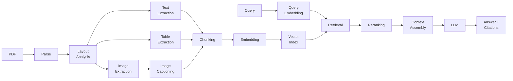

### PDF Parsing Pipeline

```python
from dataclasses import dataclass

@dataclass
class DocumentElement:
    type: str  # text, table, image, heading, list
    content: str
    page_number: int
    bbox: tuple  # bounding box coordinates
    metadata: dict

class DocumentParser:
    def __init__(self, use_ocr=False):
        self.layout_model = load_layout_model()
        self.use_ocr = use_ocr
    
    def parse(self, pdf_path: str) -> list[DocumentElement]:
        elements = []
        
        # Step 1: Extract raw text and layout
        pages = self.extract_pages(pdf_path)
        
        for page in pages:
            # Step 2: Layout analysis
            layout = self.layout_model.analyze(page.image)
            
            for region in layout.regions:
                if region.type == "table":
                    table = self.extract_table(region, page)
                    elements.append(table)
                elif region.type == "image":
                    caption = self.caption_image(region, page)
                    elements.append(caption)
                elif region.type == "text":
                    text = self.extract_text(region)
                    elements.append(text)
        
        return elements
```

### Chunking Strategy

```python
def chunk_document(elements: list[DocumentElement]) -> list[dict]:
    chunks = []
    current_chunk = []
    current_size = 0
    
    for element in elements:
        element_size = estimate_tokens(element.content)
        
        # Respect section boundaries
        if element.type == "heading" and current_size > MIN_CHUNK_SIZE:
            chunks.append(combine_chunk(current_chunk))
            current_chunk = []
            current_size = 0
        
        # Hard cut at max chunk size
        if current_size + element_size > MAX_CHUNK_SIZE:
            chunks.append(combine_chunk(current_chunk))
            current_chunk = [element]
            current_size = element_size
        else:
            current_chunk.append(element)
            current_size += element_size
    
    if current_chunk:
        chunks.append(combine_chunk(current_chunk))
    
    # Add overlap for coherence
    chunks = add_overlap(chunks)
    return chunks
```

### Table Extraction

```python
def extract_table(region, page) -> DocumentElement:
    """Extract table data with structure preservation."""
    # Direct extraction (digital PDF)
    if page.has_text_layer:
        table_data = page.extract_table(region.bbox)
        markdown = convert_table_to_markdown(table_data)
    else:
        # OCR-based extraction
        table_image = page.crop(region.bbox)
        markdown = vision_llm.extract_table(table_image)
    
    return DocumentElement(
        type="table",
        content=markdown,
        page_number=page.number,
        bbox=region.bbox,
        metadata={"rows": 10, "columns": 5},
    )
```

---

## 7. Data Analyst (NL-to-SQL)

### Problem

Business users want to ask questions in English and get charts back. The system must understand the database schema, generate correct SQL, execute it safely, interpret results, and create visualizations.

### Architecture

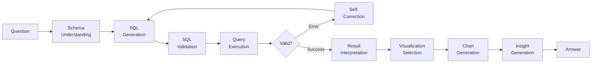

### Schema Understanding

```python
class SchemaUnderstanding:
    def __init__(self, db_connection):
        self.tables = self.load_schema(db_connection)
        self.foreign_keys = self.load_relationships(db_connection)
        self.sample_data = self.load_samples(db_connection)
        self.embeddings = self.build_schema_embeddings()
    
    def get_relevant_schema(self, question: str) -> str:
        """Retrieve only the schema relevant to the question."""
        question_emb = embed(question)
        
        relevant_tables = []
        for table in self.tables:
            similarity = cosine_similarity(question_emb, table.embedding)
            if similarity > SCHEMA_THRESHOLD:
                relevant_tables.append(table)
        
        return format_schema(relevant_tables)
```

### SQL Generation with Safety

```python
def generate_sql(question: str, schema: str) -> str:
    """Generate SQL with safety constraints."""
    prompt = f"""
    Database Schema:
    {schema}
    
    Question: {question}
    
    Generate a SQL query that answers this question.
    Constraints:
    - Use ONLY SELECT statements (no INSERT/UPDATE/DELETE/DROP)
    - Add LIMIT 100 unless aggregation
    - Use parameterized queries for values
    - Return only the SQL, no explanation
    
    SQL:
    """
    
    sql = llm.generate(prompt, temperature=0)
    sql = validate_sql(sql)
    return sql

def validate_sql(sql: str) -> str:
    """Validate SQL against security rules."""
    forbidden = ["INSERT", "UPDATE", "DELETE", "DROP", "ALTER", "CREATE", "EXEC"]
    sql_upper = sql.upper()
    
    for keyword in forbidden:
        if keyword in sql_upper.split():
            raise SecurityError(f"Forbidden SQL operation: {keyword}")
    
    return sql
```

### Self-Correction Loop

```python
def execute_with_retry(sql: str, db_connection, max_retries=3):
    for attempt in range(max_retries):
        try:
            result = db_connection.execute(sql)
            return result
        except SQLSyntaxError as e:
            if attempt == max_retries - 1:
                raise
            sql = correct_sql(sql, str(e))
    return None

def correct_sql(failed_sql: str, error: str) -> str:
    """Ask LLM to fix the SQL based on the error."""
    return llm.generate(
        f"Original SQL:\n{failed_sql}\n\n"
        f"Error:\n{error}\n\n"
        f"Fix the SQL query.",
        temperature=0,
    )
```

### Visualization Selection

```python
def select_visualization(result: pd.DataFrame, question: str) -> str:
    """Select the best chart type for the result."""
    analysis = llm.extract({
        "question": question,
        "result_columns": list(result.columns),
        "result_summary": result.describe().to_dict(),
        "row_count": len(result),
        "schema": {"chart_type": "bar | line | scatter | pie | table | heatmap"}
    })
    
    CHART_MAP = {
        "bar": "Create a bar chart showing {x} vs {y}",
        "line": "Create a line chart showing {x} trend over time",
        "scatter": "Create a scatter plot of {x} vs {y}",
        "pie": "Create a pie chart of {category} distribution",
    }
    
    chart_config = CHART_MAP.get(analysis["chart_type"], "table")
    return llm.generate(
        f"Generate Python code using matplotlib to {chart_config}",
        temperature=0,
    )
```

---

## 8. Content Generation

### Problem

Content needs more than a single LLM call. It needs outlining, drafting, editing, reviewing, and publishing — with consistent brand voice and style.

### Pipeline

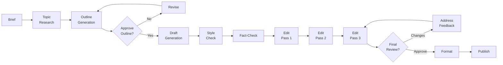

### Multi-Step Refinement

```python
class ContentPipeline:
    def __init__(self, brand_guide: dict):
        self.brand_guide = brand_guide
        self.style_rules = self.load_style_rules()
    
    def outline(self, brief: str) -> str:
        research = self.research_topic(brief)
        return llm.generate(
            f"Research: {research}\n\n"
            f"Brief: {brief}\n\n"
            f"Create a detailed outline with sections, "
            f"subsections, and key points for each.",
            temperature=0.5,
        )
    
    def draft(self, outline: str) -> str:
        return llm.generate(
            f"Outline:\n{outline}\n\n"
            f"Write a complete draft following this outline.\n"
            f"Style guide:\n{self.style_rules}",
            temperature=0.7,
            max_tokens=4000,
        )
    
    def edit(self, draft: str, pass_number: int) -> str:
        edit_focus = {
            1: "Improve clarity, fix grammar, tighten sentences",
            2: f"Apply brand voice: {self.brand_guide['voice']}",
            3: "Final polish: flow, transitions, call-to-action",
        }
        return llm.generate(
            f"Draft:\n{draft}\n\n"
            f"Edit pass {pass_number}: {edit_focus[pass_number]}",
            temperature=0.3,
        )
```

### Style Guide Enforcement

```python
STYLE_RULES = {
    "voice": {
        "tone": "Professional but approachable",
        "perspective": "Second person (you/your)",
        "contractions": "Use sparingly",
        "jargon": "Define on first use",
    },
    "formatting": {
        "max_paragraph_length": 3,  # sentences
        "heading_case": "Sentence case",
        "bullet_style": "Capitalize first word, no period",
    },
    "forbidden": [
        "cliche phrases",
        "passive voice where active is better",
        "weasel words (might, could, possibly)",
    ],
}

def style_check(content: str) -> list[Violation]:
    violations = []
    
    # Check each rule
    for rule, config in STYLE_RULES.items():
        if rule == "forbidden":
            for phrase in config:
                if phrase in content.lower():
                    violations.append(Violation(phrase, "forbidden phrase"))
    
    # LLM-based style check
    style_issues = llm.extract({
        "content": content,
        "style_rules": STYLE_RULES,
        "schema": {
            "violations": [{
                "type": "",
                "location": "",
                "suggestion": "",
            }]
        }
    })
    
    return violations + style_issues["violations"]
```

---

## 9. Voice AI

### Problem

Voice AI demands real-time processing with strict latency budgets. The pipeline (STT → LLM → TTS) introduces multiple delays. Turn-taking, interruptions, and prosody make it harder than text.

### Architecture

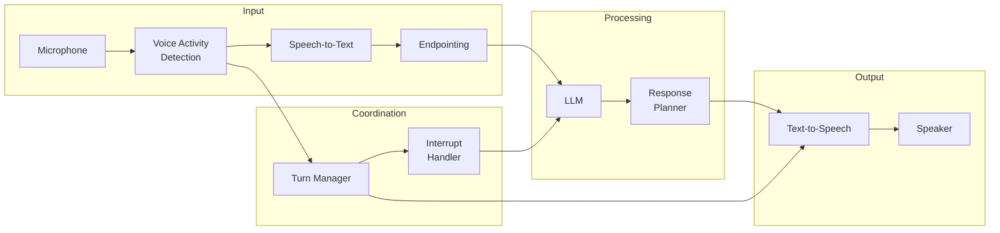

### Low Latency Requirements

```python
LATENCY_BUDGETS = {
    "voice_activity_detection": 200,    # ms
    "speech_to_text": 300,               # ms
    "llm_first_token": 300,              # ms
    "text_to_speech": 200,               # ms
    "network": 100,                       # ms
    "buffer": 100,                        # ms
    "total": 1200,                        # ms (under 2s is acceptable)
}

class VoicePipeline:
    async def process(self, audio_stream):
        async with self.budget_monitor():
            # VAD + STT in parallel
            vad_task = asyncio.create_task(self.detect_voice(audio_stream))
            stt_task = asyncio.create_task(self.transcribe(audio_stream))
            
            speech_done = await asyncio.gather(vad_task, stt_task)
            
            if not speech_done[0]:  # No speech detected
                return
            
            text = speech_done[1]
            
            # LLM with streaming
            async for token in self.llm.stream(text):
                # Send partial response to TTS
                await self.tts.stream(token)
```

### Turn-Taking and Interruption

```python
class TurnManager:
    def __init__(self):
        self.state = "listening"  # listening, processing, speaking
        self.interrupt_threshold = 0.5  # seconds of concurrent speech
    
    async def handle_interruption(self, user_speech_start: float):
        """Handle when user interrupts the AI's response."""
        if self.state == "speaking":
            interrupt_duration = time.time() - user_speech_start
            if interrupt_duration > self.interrupt_threshold:
                await self.stop_tts()
                self.state = "listening"
                await self.update_context_with_interruption()
                return True
        return False
    
    def decide_turn(self, vad_result: VADResult) -> str:
        """Decide who should speak next."""
        if self.state == "speaking" and vad_result.speech_detected:
            if vad_result.confidence > 0.8:
                return "user_interrupted"
            return "continue_ai"
        
        if self.state == "listening" and not vad_result.speech_detected:
            if self.pause_duration > PAUSE_THRESHOLD:
                return "ai_speaks"
        
        return "wait"
```

---

## 10. Architecture Patterns

### The Four Fundamental Patterns

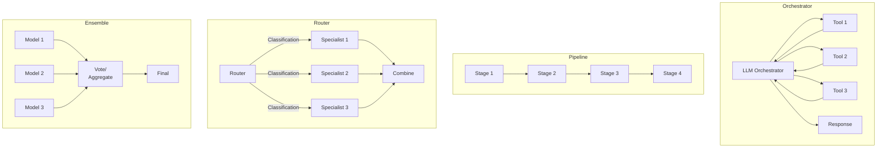

### 10.1 Orchestrator Pattern

The orchestrator is a single LLM that coordinates multiple sub-tasks. It decides what to do, delegates to tools or sub-agents, and synthesizes results.

```
Concept: "One brain, many hands"
Best for: Complex tasks needing flexible reasoning
Example: Coding agent (plan → code → test → debug)
```

```python
class Orchestrator:
    def run(self, task: str):
        plan = self.planner.plan(task)
        results = []
        
        for step in plan.steps:
            if step.type == "tool":
                result = self.tools.execute(step.tool_name, step.args)
            elif step.type == "subtask":
                result = self.run(step.description)
            results.append(result)
        
        return self.synthesizer.synthesize(task, results)
```

### 10.2 Pipeline Pattern

A pipeline processes data through sequential stages. Each stage is a specialized component that transforms input deterministically.

```
Concept: "Assembly line"
Best for: Well-defined data transformation workflows
Example: Document Q&A (parse → chunk → index → retrieve → generate)
```

```python
class Pipeline:
    stages = []
    
    def add_stage(self, stage):
        self.stages.append(stage)
    
    def execute(self, input_data):
        data = input_data
        for stage in self.stages:
            data = stage.process(data)
        return data
```

### 10.3 Router Pattern

A router dispatches requests to specialized handlers based on classification, intent, or content type.

```
Concept: "Switchboard"
Best for: Heterogeneous request types
Example: Customer support (billing → technical → general)
```

```python
class Router:
    def __init__(self):
        self.routes = {}
    
    def add_route(self, condition, handler):
        self.routes[condition] = handler
    
    def route(self, request):
        for condition, handler in self.routes.items():
            if condition.matches(request):
                return handler.handle(request)
        return self.default_handler.handle(request)
```

### 10.4 Ensemble Pattern

Multiple models vote or their outputs are aggregated for better quality.

```
Concept: "Wisdom of the crowds"
Best for: High-stakes decisions needing reliability
Example: Hallucination detection (multiple models cross-validate)
```

```python
class Ensemble:
    def __init__(self, models: list, aggregation: str = "vote"):
        self.models = models
        self.aggregation = aggregation
    
    def predict(self, input_data):
        results = [m.predict(input_data) for m in self.models]
        
        if self.aggregation == "vote":
            return Counter(results).most_common(1)[0][0]
        elif self.aggregation == "confidence":
            return max(results, key=lambda r: r.confidence)
```

### Pattern Selection Guide

| Pattern | Flexibility | Predictability | Cost | Latency | When to Use |
|---------|-------------|----------------|------|---------|-------------|
| Orchestrator | High | Low | High | High | Complex reasoning, novel tasks |
| Pipeline | Low | High | Medium | Medium | Fixed workflows, batch processing |
| Router | Medium | High | Low | Low | Heterogeneous requests, classification |
| Ensemble | Medium | High | Very High | High | High-stakes, need reliability |

---

## 11. Scalability

### Horizontal Scaling of LLM Calls

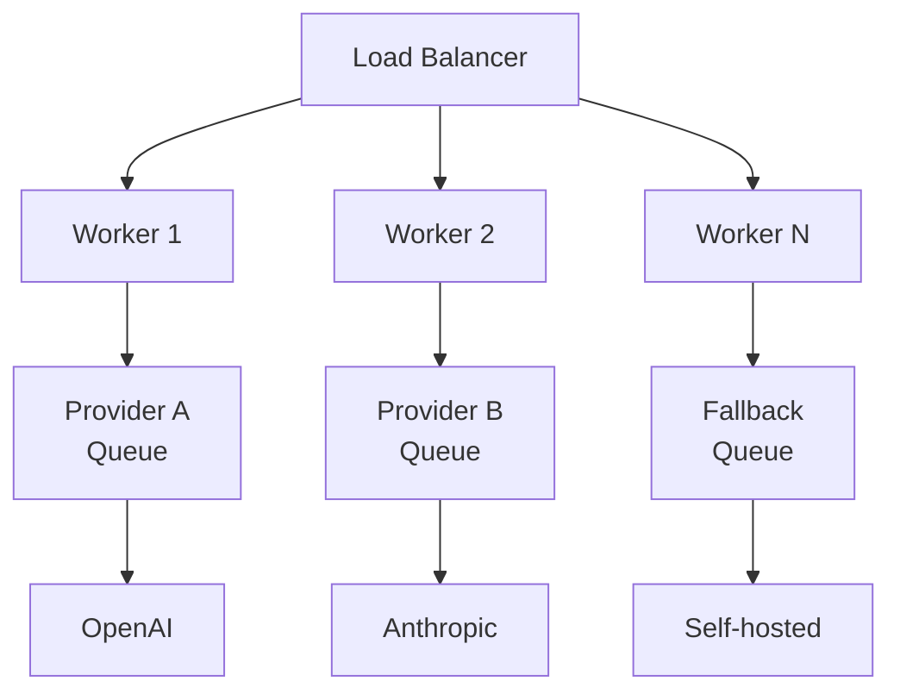

### Queue-Based Processing

```python
class AsyncLLMQueue:
    def __init__(self, max_concurrent=10):
        self.queue = asyncio.Queue()
        self.semaphore = asyncio.Semaphore(max_concurrent)
        self.workers = []
    
    async def worker(self):
        while True:
            request = await self.queue.get()
            async with self.semaphore:
                try:
                    result = await self.call_llm(request)
                    await request.callback(result)
                except Exception as e:
                    await request.error_callback(e)
    
    async def submit(self, request):
        await self.queue.put(request)
```

### Caching Layers

```python
class CacheLayer:
    def __init__(self):
        self.l1 = InMemoryCache(ttl=300)    # 5 min, hot cache
        self.l2 = RedisCache(ttl=3600)      # 1 hour, warm cache
        self.l3 = SemanticCache(threshold=0.95)  # Similar prompts
    
    async def get(self, prompt: str, temperature=0):
        # L1: Exact match (fastest)
        result = await self.l1.get(prompt)
        if result:
            return result
        
        # L2: Exact match across instances
        result = await self.l2.get(prompt)
        if result:
            await self.l1.set(prompt, result)
            return result
        
        # L3: Semantic similarity
        result = await self.l3.get(prompt, temperature)
        if result:
            await self.l1.set(prompt, result.content)
            await self.l2.set(prompt, result.content)
            return result
        
        return None
```

### Load Balancing Across Providers

```python
class ProviderLoadBalancer:
    def __init__(self):
        self.providers = {
            "openai": {"weight": 0.5, "cost_per_token": 0.15},
            "anthropic": {"weight": 0.3, "cost_per_token": 0.25},
            "self_hosted": {"weight": 0.2, "cost_per_token": 0.05},
        }
        self.current_load = {p: 0 for p in self.providers}
        self.latency_history = {p: [] for p in self.providers}
    
    def select_provider(self, request: dict) -> str:
        """Select cheapest provider that meets latency requirements."""
        candidates = []
        for name, config in self.providers.items():
            avg_latency = self.get_avg_latency(name)
            if avg_latency < request["max_latency"]:
                score = config["weight"] / config["cost_per_token"]
                candidates.append((score, name))
        
        if not candidates:
            return min(self.providers.keys(),
                      key=lambda p: self.get_avg_latency(p))
        
        return max(candidates, key=lambda c: c[0])[1]
```

---

## 12. Common Failure Modes

### Hallucination Cascades

When one component hallucinates, downstream components build on those errors:

```
User: "What happened in the Battle of [fictional place]?"
  → Search returns nothing relevant
  → LLM generates plausible-sounding fake history
  → RAG retrieves the fake document on next query
  → LLM cites the fake document as source
  → Cascade propagates
```

**Detection:** Track citation confidence. Cross-validate key claims. Use a separate "fact-checker" LLM call.

**Mitigation:** Always include "I cannot find information about this" as a valid system response. Set a minimum retrieval relevance threshold.

### Context Overflow

When context exceeds the window, the system either truncates (losing information) or fails (crash):

```python
class ContextManager:
    def manage_context(self, messages, max_tokens):
        total = count_tokens(messages)
        
        if total <= max_tokens:
            return messages
        
        # Strategy 1: Summarize oldest messages
        while total > max_tokens and len(messages) > 2:
            oldest = messages.pop(0)
            summary = self.summarize(oldest)
            messages.insert(0, {"role": "system", "content": f"Earlier: {summary}"})
            total = count_tokens(messages)
        
        # Strategy 2: Truncate retrieved documents
        if total > max_tokens:
            for msg in messages:
                if msg["role"] == "system" and len(msg["content"]) > 1000:
                    msg["content"] = msg["content"][:max_tokens // 2]
                    total = count_tokens(messages)
        
        # Strategy 3: Hard truncation (last resort)
        while total > max_tokens:
            messages.pop(0)
            total = count_tokens(messages)
        
        return messages
```

### Tool Errors

The LLM calls a tool that fails (API down, invalid arguments, timeout). The system must detect this and retry or adapt.

```python
class ResilientToolExecutor:
    async def execute_with_fallback(self, tool_call):
        try:
            return await self.execute_tool(tool_call)
        except ToolTimeoutError:
            return await self.retry(tool_call, max_retries=2)
        except ToolInvalidArgsError:
            corrected = await self.llm.correct_args(tool_call)
            return await self.execute_tool(corrected)
        except ToolUnavailableError:
            fallback = await self.find_fallback_tool(tool_call)
            return await self.execute_tool(fallback)
        except Exception as e:
            return ToolResult(
                success=False,
                error=f"Tool failed: {e}",
                fallback_response="I encountered an error. Let me try another approach."
            )
```

### Cost Spikes

Costs can explode due to unexpectedly long outputs, large contexts, or infinite loops:

```python
class CostGuard:
    def __init__(self, max_cost_per_session=1.0):
        self.max_cost = max_cost_per_session
        self.session_costs = {}
    
    async def check_request(self, session_id, estimated_cost):
        session_total = self.session_costs.get(session_id, 0)
        
        if session_total + estimated_cost > self.max_cost:
            return CostDecision(
                allowed=False,
                fallback="switch_to_cheaper_model",
                reason="Budget exceeded"
            )
        
        self.session_costs[session_id] = session_total + estimated_cost
        return CostDecision(allowed=True)
```

### Latency Degradation

Latency increases non-linearly with context length, concurrent requests, and model size:

| Factor | Impact | Mitigation |
|--------|--------|------------|
| Long context | O(n²) attention | Use smaller model for long docs |
| High concurrency | Queue wait times | Async processing, rate limiting |
| Complex reasoning | 5-50x more tokens | Use cheap model for routing |
| Multi-step chains | Additive latency | Pipeline parallelization |
| TTS integration | 200-500ms added | Streaming TTS, cache common phrases |
| Network latency | 50-200ms | Edge deployment, persistent connections |

### Monitoring Checklist

```python
METRICS = {
    "p50_latency": {"target": "< 1s", "alert": "> 2s"},
    "p95_latency": {"target": "< 3s", "alert": "> 5s"},
    "cost_per_request": {"target": "< $0.01", "alert": "> $0.10"},
    "hallucination_rate": {"target": "< 1%", "alert": "> 5%"},
    "tool_error_rate": {"target": "< 1%", "alert": "> 5%"},
    "context_utilization": {"target": "< 80%", "alert": "> 95%"},
    "user_satisfaction": {"target": "> 90%", "alert": "< 70%"},
    "escalation_rate": {"target": "< 10%", "alert": "> 30%"},
}
```

---

## Summary

Building production AI systems is an engineering discipline. The key insights:

1. **LLMs are a new compute primitive** — design systems around them, not with them as monoliths
2. **Separate concerns** — retrieval, reasoning, generation, and validation should be independent components
3. **Plan for failure** — LLMs fail differently than traditional software. Design for hallucination, cost spikes, and latency degradation
4. **Measure everything** — latency, cost, quality, and safety need continuous monitoring
5. **Patterns over prompts** — orchestrator, pipeline, router, and ensemble patterns scale better than clever prompting
6. **Stream or die** — users expect instant feedback. Streaming is non-negotiable
7. **Know your failure modes** — hallucination cascades, context overflow, and cost explosions are unique to AI systems

The next chapter explores production deployment: monitoring, evaluation, safety, and operations.
