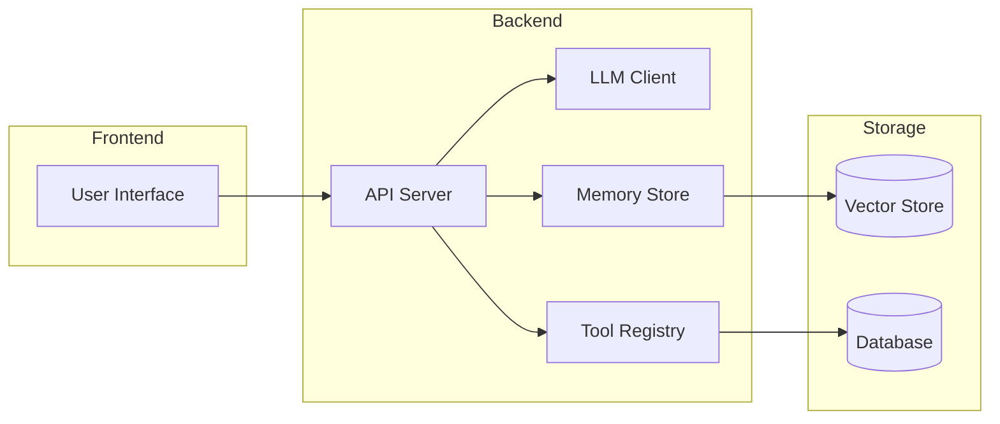

# Cheat Sheet: Project Architecture Patterns & Technology Choices

## Architecture Patterns

### Pattern 1: Simple LLM Wrapper
```
User Input → LLM API → Formatted Output
```
**Used by:** 01 ChatGPT Clone, 13 Writing Assistant  
**Key components:** Prompt template, API client, response parser  
**When to use:** Single-turn or simple multi-turn tasks, no external data needed.

### Pattern 2: RAG Pipeline
```
User Query → Embed → Vector Search → Retrieve Chunks → LLM → Response
```
**Used by:** 06 PDF Chat, 09 Knowledge Base, 14 AI Tutor  
**Key components:** Document loader, chunker, embedding model, vector store, LLM  
**When to use:** Questions require specific knowledge not in model parameters.

### Pattern 3: Agent with Tools
```
User Input → LLM (reason) → Tool Call → Tool Result → LLM (respond) → Output
```
**Used by:** 04 Research Agent, 05 AI Coding Agent, 10 Support Agent, 11 SQL Agent, 12 GitHub Agent, 15 Financial Assistant  
**Key components:** Agent loop, tool registry, tool executor, memory  
**When to use:** Tasks requiring external actions (search, code, API calls, database queries).

### Pattern 4: Memory-Enhanced Agent
```
User Input → Working Memory → Long-term Memory → LLM (context) → Response → Update Memory
```
**Used by:** 03 Memory Agent, 08 Personal AI, 07 Meeting Assistant, 14 AI Tutor  
**Key components:** Short-term buffer, long-term vector store, memory summarizer, retrieval  
**When to use:** Conversations that span sessions, personalization, learning from history.

### Pattern 5: Knowledge Graph + RAG
```
Documents → Entity Extraction → Graph Database → Graph Query → Vector Search → LLM → Response
```
**Used by:** 02 GraphRAG System  
**Key components:** Entity extractor, relation extractor, graph database, vector store, query planner  
**When to use:** Multi-hop reasoning across entities, relationship-aware retrieval.

### Pattern 6: Multi-Agent System
```
Orchestrator → Sub-agents (research, critique, write) → Synthesizer → Output
```
**Used by:** 04 Research Agent, 05 AI Coding Agent (stretch goals)  
**Key components:** Orchestrator, agent pool, message bus, shared memory  
**When to use:** Complex tasks that benefit from specialized sub-agents.

---

## Common Components

| Component | Purpose | Options |
|-----------|---------|---------|
| **LLM Client** | API communication | OpenAI SDK, Anthropic SDK, LangChain, LiteLLM |
| **Vector Store** | Store & query embeddings | ChromaDB (local), Qdrant (self-hosted), Pinecone (cloud), pgvector (Postgres) |
| **Embedding Model** | Convert text to vectors | text-embedding-3-small, text-embedding-3-large, sentence-transformers, voyage-2 |
| **Document Loader** | Parse files | PyMuPDF (PDF), python-docx (Word), Unstructured.IO, LangChain loaders |
| **Text Splitter** | Chunk documents | RecursiveCharacterTextSplitter, SemanticSplitter, TokenTextSplitter |
| **Web Search** | Real-time information | Tavily API, Bing Search API, SerpAPI, DuckDuckGo (free) |
| **Web Scraper** | Extract page content | BeautifulSoup, Trafilatura, FireCrawl, Jina Reader |
| **Speech-to-Text** | Transcribe audio | OpenAI Whisper, Whisper.cpp, Deepgram, Azure Speech |
| **Graph Database** | Store relationships | Neo4j (self-hosted/cloud), NetworkX (in-memory), ArangoDB |
| **SQL Database** | Structured data | SQLite (local), PostgreSQL, SQLAlchemy (ORM) |
| **Cache** | Reduce latency | Redis, in-memory dict, diskcache |
| **Queue** | Async processing | Celery, Redis Queue, in-memory asyncio.Queue |
| **Monitoring** | Observe behavior | LangSmith, Weights & Biases, MLflow, custom logging |
| **Evaluation** | Score outputs | LLM-as-judge (GPT-4o, Claude), RAGAS, BLEU, custom rubric |
| **API Framework** | Serve application | FastAPI, Flask, Streamlit (prototyping), Gradio (demos) |

---

## Technology Decision Matrix

| Requirement | Recommendation | Why |
|-------------|---------------|-----|
| Quick prototyping | Streamlit + ChromaDB | Zero setup, instant UI, embedded vector store |
| Production API | FastAPI + Qdrant | High throughput, proper async, scalable vector store |
| Local-first development | SQLite + ChromaDB | No external services, portable, reproducible |
| Enterprise deployment | FastAPI + PostgreSQL (pgvector) + Redis + Neo4j | ACID compliance, battle-tested, ecosystem support |
| Multi-model support | LiteLLM | Unified interface across 100+ providers |
| Agent framework | Custom loop (not frameworks) | Full control, debuggable, no black box |
| Evaluation at scale | LangSmith + custom metrics | Traceability, comparison, regression detection |

---

## Model Selection Guide

| Task | Recommended Model | Backup Option |
|------|-------------------|---------------|
| General chat | gpt-4o-mini / claude-3-5-haiku | gemini-2.0-flash |
| Complex reasoning | gpt-4o / claude-3-5-sonnet | gemini-2.0-pro |
| Code generation | claude-3-5-sonnet / gpt-4o | codestral / deepseek-coder |
| Structured output | gpt-4o (JSON mode) / claude-3 (tool use) | gemini-2.0 (response schema) |
| Classification | gpt-4o-mini / gpt-4o | claude-3-haiku |
| Summarization | gpt-4o-mini / claude-3-haiku | llama-3.1-8b |
| Embeddings | text-embedding-3-small | voyage-2 / bge-large-en-v1.5 |
| Transcription | whisper-1 | deepgram-nova-2 |

---

## Quick-Start Command Reference

```bash
# Python venv
python -m venv venv
source venv/bin/activate  # Windows: .\venv\Scripts\activate

# Install
pip install -r requirements.txt

# Environment
cp .env.example .env

# Run
python src/main.py
uvicorn src.app:app --reload --port 8080
streamlit run src/app.py

# Test
pytest tests/ -v
pytest tests/ -v --cov=src

# Vector store
chroma run --path ./data/vector_store --port 8000
```

---

## Mermaid Architecture Template (Copy-Paste for Your Project)



---

## Glossary

| Term | Definition |
|------|------------|
| RAG | Retrieval-Augmented Generation — retrieving relevant documents before generation |
| Agent | An LLM-powered system that can use tools and reason about actions |
| Tool | A function the LLM can call (search, calculator, API) |
| Memory | Storage of past interactions for context continuity |
| Embedding | A dense vector representation of text for semantic similarity |
| Chunking | Splitting documents into smaller pieces for retrieval |
| Vector Store | Database optimized for storing and querying embeddings |
| Hallucination | LLM generating false or unsupported information |
| Context Window | Maximum tokens the LLM can process in a single request |
| Streaming | Delivering LLM output token-by-token as it's generated |
| Fine-tuning | Further training a pre-trained model on task-specific data |
| Few-shot | Providing examples in the prompt to guide model behavior |
| System Prompt | Instructions given to the model at the start of a conversation |
| Structured Output | LLM response formatted as JSON or other structured format |
