# Projects — Complete Specifications

---

## 01 — ChatGPT Clone

- **Difficulty:** Beginner
- **Estimated Time:** 4–6 hours
- **Learning Objectives:**
  - Interact with LLM APIs programmatically
  - Implement streaming responses
  - Manage multi-turn conversation history
  - Build a minimal web UI
- **Prerequisites:** Chapters 02 (Prompting), 03 (LLM APIs)

### Problem Statement
Your startup needs a customer-facing chat interface powered by an LLM. The team needs a minimal ChatGPT-style web app where users can send messages and receive streaming responses. The app must maintain conversation context across multiple turns, support multiple models, and allow users to switch between them.

### Architecture
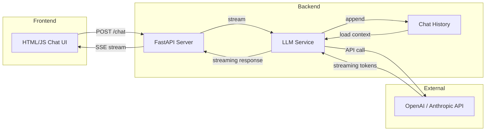

### Tech Stack
- **Backend:** Python, FastAPI, SSE (Server-Sent Events)
- **LLM SDK:** OpenAI Python SDK, Anthropic Python SDK
- **Frontend:** Vanilla HTML/CSS/JS (or Streamlit for faster prototyping)
- **State:** In-memory Python dicts or SQLite for persistence

### Implementation Plan

**Step 1: API Client**
Create a module that wraps the LLM API. Support OpenAI and Anthropic. Implement both non-streaming and streaming modes.

**Step 2: Chat History**
Store messages as a list of `{role, content}` dicts. Implement functions to add, retrieve, and clear history. Support multiple conversations (identified by session ID).

**Step 3: Streaming Endpoint**
Build a FastAPI endpoint `/chat` that accepts `{session_id, message, model}`. Stream the response token by token using Server-Sent Events (`text/event-stream`).

**Checkpoint 1:** A curl command can send a message and see streaming output.

**Step 4: Web UI**
Build a simple chat interface: message input, send button, scrollable message area. Connect to the SSE endpoint. Display tokens as they arrive.

**Step 5: Model Selection**
Add a dropdown to switch between models. Persist the selection per session.

**Step 6: History Panel**
Show previous conversations in a sidebar. Allow users to create new conversations and switch between them.

**Checkpoint 2:** Full chat app with multi-turn conversation, model switching, and history.

### Expected Output
A web application at `http://localhost:8080` where users can:
- Type messages and receive streaming responses
- See the full conversation history in the chat window
- Switch between models mid-conversation
- Start new conversations and revisit old ones

### Evaluation Criteria
- [ ] Streaming works (tokens appear incrementally)
- [ ] Conversation context is maintained across turns
- [ ] Multiple conversations are isolated
- [ ] Model switching works without errors
- [ ] UI is usable (not necessarily beautiful)
- [ ] Error handling (API errors, network failures) is graceful

### Stretch Goals
- [ ] Add temperature and max_tokens controls
- [ ] Implement system prompt customization
- [ ] Add markdown rendering in responses
- [ ] Export conversation as JSON or Markdown
- [ ] Token usage and cost tracking per conversation

### Resources
- OpenAI Chat Completions API: https://platform.openai.com/docs/api-reference/chat
- Anthropic Messages API: https://docs.anthropic.com/en/api/messages
- FastAPI Streaming: https://fastapi.tiangolo.com/advanced/custom-response/#streamingresponse
- SSE (Server-Sent Events): https://developer.mozilla.org/en-US/docs/Web/API/Server-sent_events

---

## 02 — GraphRAG System

- **Difficulty:** Advanced
- **Estimated Time:** 20–30 hours
- **Learning Objectives:**
  - Extract entities and relationships from unstructured text
  - Build and query a knowledge graph
  - Combine graph traversal with vector search
  - Implement multi-hop reasoning over structured knowledge
- **Prerequisites:** Chapters 03 (RAG), 05 (Knowledge Graphs)

### Problem Statement
Your organization has 10,000 internal documents (reports, emails, proposals). Traditional RAG fails on questions that require connecting information across multiple documents: "Which vendors worked on projects with both Company A and Company B?" or "What is the chain of decisions that led to Project X being cancelled?" You need a system that builds a knowledge graph from the documents and uses it to answer multi-hop questions.

### Architecture
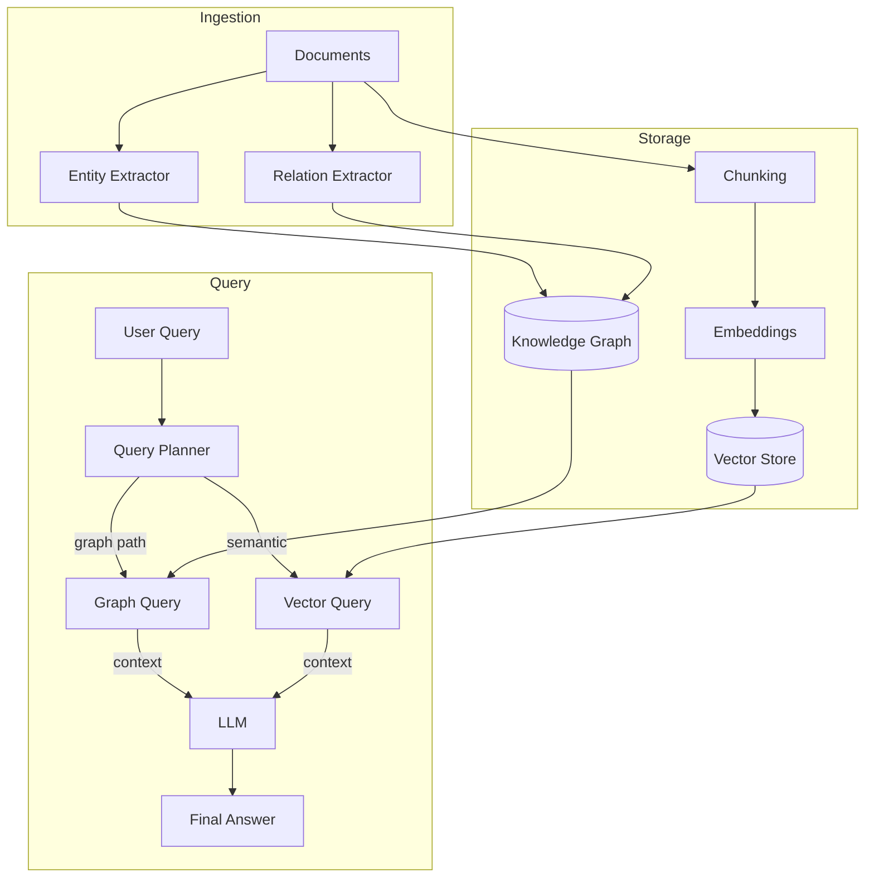

### Tech Stack
- **LLM:** OpenAI GPT-4o or Claude 3.5 Sonnet for extraction
- **Graph DB:** Neo4j (self-hosted or AuraDB) or NetworkX (in-memory for prototypes)
- **Vector Store:** ChromaDB or Qdrant
- **Embeddings:** text-embedding-3-small
- **Framework:** Python, LangChain (optional), custom extraction pipeline

### Implementation Plan

**Step 1: Document Ingestion**
Load documents, split into chunks (500–1000 tokens). Store in both raw and chunked form.

**Step 2: Entity & Relation Extraction**
For each chunk, prompt the LLM to extract entities and relationships. Define a schema: entity types (Person, Organization, Project, Location), relation types (works_for, collaborates_with, leads, located_in).

**Checkpoint 1:** A single document produces a valid set of triples (subject, relation, object).

**Step 3: Graph Construction**
Insert extracted triples into Neo4j. Handle deduplication: the same entity mentioned in multiple documents should be a single node.

**Step 4: Graph-Augmented Retrieval**
Given a query:
1. Extract entities from the query.
2. Walk the graph 2-3 hops from matched entities.
3. Retrieve relevant text chunks from the vector store.
4. Combine graph context + text chunks as context for the LLM.

**Checkpoint 2:** System answers multi-hop questions like "Which vendors worked with both Acme and BetaCorp?"

**Step 5: Query Planning**
For complex queries, generate a query plan: which parts to answer via the graph, which via vector search, and how to combine.

**Step 6: Response Generation**
Feed all context to the LLM with citations to source documents.

### Expected Output
A CLI or API that accepts questions and returns answers with:
- The answer text
- Citations to source documents
- Graph paths showing the reasoning chain

### Evaluation Criteria
- [ ] Extracted entities are accurate (precision > 85%)
- [ ] Multi-hop queries return correct results
- [ ] Graph is queryable and non-redundant
- [ ] System handles ambiguity (multiple entities with same name)
- [ ] Responses include source citations
- [ ] End-to-end latency is under 15s

### Stretch Goals
- [ ] Interactive graph visualization
- [ ] Temporal queries ("before 2023")
- [ ] Incremental document addition (no full rebuild)
- [ ] Confidence scoring per answer
- [ ] Multi-language entity extraction

### Resources
- Microsoft GraphRAG: https://github.com/microsoft/graphrag
- Neo4j Python Driver: https://neo4j.com/docs/python-manual/current/
- Build a Knowledge Graph with LLMs: https://towardsdatascience.com/building-knowledge-graphs-with-llms
- GraphRAG: Unifying LLMs and KGs: https://arxiv.org/abs/2401.06209

---

## 03 — Memory Agent

- **Difficulty:** Intermediate
- **Estimated Time:** 12–18 hours
- **Learning Objectives:**
  - Design and implement multi-tier memory systems
  - Implement short-term, long-term, and working memory
  - Use vector databases for semantic memory retrieval
  - Build memory summarization and consolidation
- **Prerequisites:** Chapters 03 (Context Management), 07 (Memory Systems)

### Problem Statement
You're building a personal AI companion that learns from every interaction. The user wants it to remember preferences, past conversations, personal details, and ongoing tasks — weeks later. The system needs three memory tiers: working memory (current conversation), short-term memory (recent sessions), and long-term memory (persistent knowledge about the user).

### Architecture
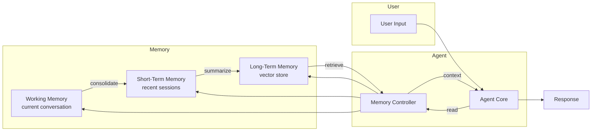

### Tech Stack
- **LLM:** OpenAI GPT-4o-mini or Claude 3.5 Haiku
- **Vector Store:** ChromaDB (local)
- **Storage:** SQLite for metadata, ChromaDB for embeddings
- **Embeddings:** text-embedding-3-small

### Implementation Plan

**Step 1: Memory Schema**
Design data structures:
```python
@dataclass
class Memory:
    id: str
    content: str
    type: str  # "episodic" | "semantic" | "procedural"
    timestamp: datetime
    importance: float  # 0.0 to 1.0
    access_count: int
    embedding: list[float]  # optional
```

**Step 2: Working Memory**
A buffer of the last N messages. Implement sliding window. Track token count.

**Step 3: Short-Term Memory**
Store compressed summaries of recent sessions. Each session summary: topics discussed, decisions made, user mood.

**Step 4: Long-Term Memory**
Store important facts in a vector store. On each interaction:
1. Extract potential long-term memories from the conversation.
2. Score each for importance.
3. Store high-importance (>0.7) memories with embeddings.

**Checkpoint 1:** Agent recalls facts told to it in a previous session.

**Step 5: Memory Retrieval**
Given new input:
1. Retrieve semantically similar long-term memories.
2. Load recent short-term summaries.
3. Compose working memory context.
4. Pass to LLM.

**Step 6: Memory Consolidation**
Periodically (or after N sessions):
- Summarize working memory into short-term.
- Summarize short-term into long-term.
- Prune low-importance, old, or rarely-accessed memories.

**Checkpoint 2:** After 10 sessions over 3 days, the agent remembers user's name, preferences, and ongoing projects.

### Expected Output
A conversational agent that:
- Remembers facts across sessions without being reminded
- Accurately retrieves relevant past conversations
- Summarizes what it knows about the user on request ("What do you know about me?")
- Forgets low-value information automatically

### Evaluation Criteria
- [ ] Fact recalled across sessions with >90% accuracy
- [ ] Memory retrieval is relevant (top-3 memories are useful)
- [ ] No context window overflow (memory is summarized)
- [ ] Manual memory editing works (delete/modify)
- [ ] System explains its memory ("I remember you said X last week")

### Stretch Goals
- [ ] Emotional weighting of memories
- [ ] Collaborative memory (multiple users)
- [ ] Memory decay function
- [ ] Memory visualization
- [ ] User-facing memory management UI

### Resources
- MemGPT Paper: https://arxiv.org/abs/2310.08560
- Letta (MemGPT): https://github.com/letta-ai/letta
- LangChain Memory: https://python.langchain.com/docs/modules/memory
- ChromaDB: https://docs.trychroma.com

---

## 04 — Research Agent

- **Difficulty:** Advanced
- **Estimated Time:** 20–25 hours
- **Learning Objectives:**
  - Build a multi-step agent loop with planning and execution phases
  - Integrate web search and web scraping tools
  - Implement iterative research with reflection
  - Synthesize findings into structured reports
- **Prerequisites:** Chapters 04 (Agents), 07 (Tool Use)

### Problem Statement
Your team needs a research assistant that can investigate complex topics and produce comprehensive reports. Unlike simple Q&A, this requires: planning the research approach, searching multiple sources, reading articles, cross-referencing, and synthesizing findings. The agent must handle open-ended questions like "What are the latest advances in multimodal AI?" and produce a well-structured report.

### Architecture
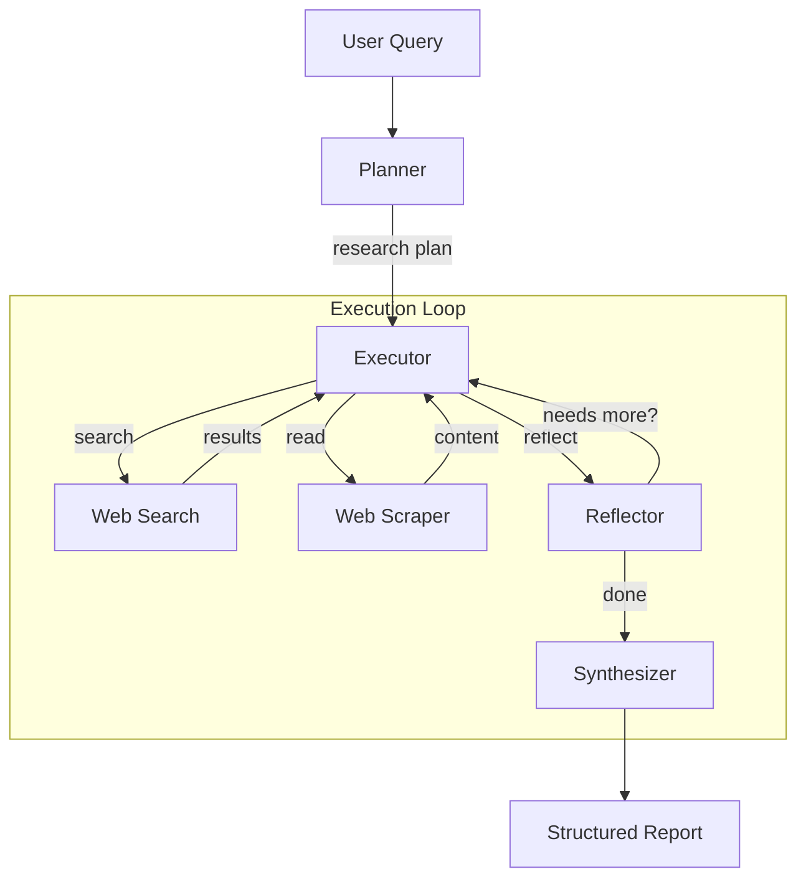

### Tech Stack
- **LLM:** Claude 3.5 Sonnet (planning, synthesis), GPT-4o-mini (scraping, extraction)
- **Search:** Tavily API or SerpAPI
- **Scraping:** BeautifulSoup + requests, or FireCrawl
- **Output:** Markdown, WeasyPrint (PDF generation)

### Implementation Plan

**Step 1: Agent Loop**
Build a basic agent loop: receive input, call LLM, parse action, execute, repeat. Start with a max iteration limit (10).

**Step 2: Planner**
Given a query, generate a research plan: sub-questions to answer, search terms, order of investigation.

**Step 3: Web Search Tool**
Implement `search_web(query)` → list of results (title, snippet, URL). Use Tavily for AI-optimized search or SerpAPI.

**Step 4: Web Scraper Tool**
Implement `read_page(url)` → cleaned text content. Handle paywalls, dynamic content, and very long pages (truncate at 10k chars).

**Checkpoint 1:** Agent can answer "What are the latest developments in GPT-4?" with cited sources.

**Step 5: Reflection**
After collecting information, the agent reflects: "What's missing? What's contradictory? What needs deeper investigation?" If needed, it iterates with refined search queries.

**Step 6: Synthesizer**
Combine all findings into a structured report with: executive summary, key findings, detailed analysis, sources, open questions.

**Checkpoint 2:** Agent produces a 1000+ word report on a complex topic with at least 5 cited sources.

**Step 7: Report Export**
Export the report in Markdown and PDF formats. Include proper citation formatting.

### Expected Output
A CLI tool that:
- Accepts a research question
- Shows its research process (which searches, which sources, thinking)
- Produces a comprehensive report with citations

### Evaluation Criteria
- [ ] Agent plans before executing (doesn't just search randomly)
- [ ] Sources are relevant and credible
- [ ] Report is well-structured with sections
- [ ] Citations are accurate (source supports the claim)
- [ ] Agent handles contradictory information appropriately
- [ ] Agent stops when sufficient information is gathered (doesn't loop endlessly)

### Stretch Goals
- [ ] Source credibility scoring
- [ ] Interactive mode (asks user for direction mid-research)
- [ ] Citation graph
- [ ] Multi-format export (PDF, LaTeX, Notion)
- [ ] Scheduled recurring research briefings

### Resources
- Tavily API: https://tavily.com
- ReAct Paper: https://arxiv.org/abs/2210.03629
- Web scraping guide: https://realpython.com/python-web-scraping-practical-introduction/
- FireCrawl: https://www.firecrawl.dev

---

## 05 — AI Coding Agent

- **Difficulty:** Advanced
- **Estimated Time:** 25–35 hours
- **Learning Objectives:**
  - Build a tool-using agent for code generation and modification
  - Implement file system and shell execution tools safely
  - Build a code sandbox for safe execution
  - Implement iterative debugging with error feedback
- **Prerequisites:** Chapters 04 (Agents), 07 (Tools), 08 (Evaluation)

### Problem Statement
Your team wants an AI assistant that can write, modify, and debug code across a codebase. Unlike a simple code generator, this agent should: read existing files, understand the project structure, write new code, test it, fix errors, and present a pull request. The agent needs to operate in a sandboxed environment for safety.

### Architecture
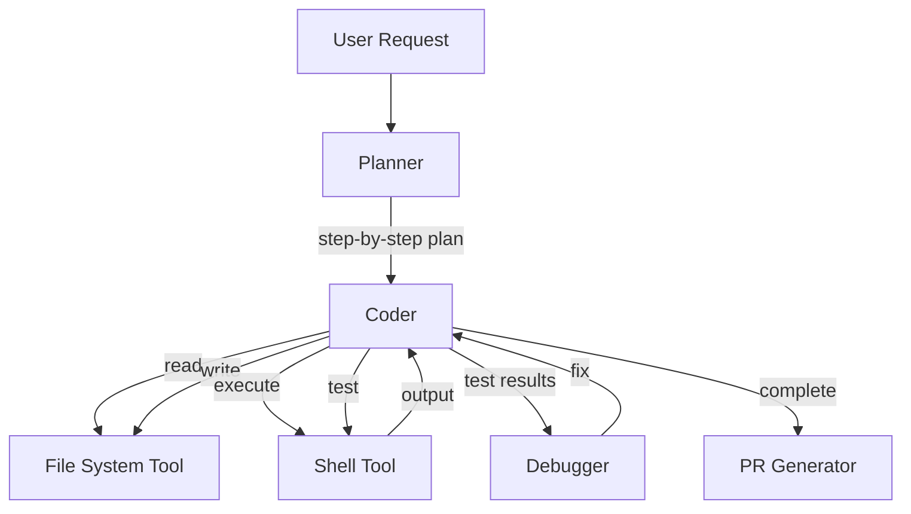

### Tech Stack
- **LLM:** Claude 3.5 Sonnet (best for code), GPT-4o
- **Sandbox:** Docker (for safe execution)
- **File System:** PathLib + custom safety layer
- **Git:** GitPython

### Implementation Plan

**Step 1: File System Tools**
Implement safe wrappers: `read_file(path)`, `write_file(path, content)`, `list_files(path)`, `search_files(pattern)`. Add path restrictions (can only access project directory).

**Step 2: Shell Tool**
Implement `run_command(command)` with:
- Timeout (30s)
- Output capture (stdout, stderr)
- Working directory restriction
- No interactive commands

**Checkpoint 1:** Agent can read a file, modify it, and write it back.

**Step 3: Planner**
Given a request ("Add a /health endpoint to the FastAPI app"), generate a plan:
1. Read the existing app.py
2. Add the endpoint
3. Run tests
4. Fix any issues

**Step 4: Coder**
Implement the coding loop. The agent:
1. Reads relevant files
2. Writes/modifies code
3. Runs tests
4. If tests fail, reads error output and debuggers

**Checkpoint 2:** Agent successfully adds a new endpoint to a FastAPI app and tests pass.

**Step 5: Sandbox**
Set up Docker-based sandbox with a shared project directory. Each agent execution run gets a fresh container. Install dependencies on container start.

**Step 6: PR Generation**
After successful changes, generate a git diff, commit message, and PR description. Create a branch and push.

### Expected Output
A CLI agent that:
- Accepts natural language coding requests
- Shows its thought process and file operations
- Runs tests to verify changes
- Produces a git commit with the changes

### Evaluation Criteria
- [ ] Agent reads existing code before writing (context awareness)
- [ ] Generated code is syntactically correct
- [ ] Tests pass after code changes
- [ ] Agent retries with debugging when tests fail
- [ ] No destructive operations (deletes, irreversible changes)
- [ ] Sandbox contains execution properly

### Stretch Goals
- [ ] Self-healing (auto-fix compilation errors)
- [ ] Multi-file PR generation
- [ ] Dependency-aware code generation
- [ ] Code review mode (review PRs, not write them)
- [ ] REPL mode (interactive execution)

### Resources
- SWE-bench: https://www.swebench.com
- Claude Code: https://docs.anthropic.com/en/docs/claude-code
- Docker SDK for Python: https://docker-py.readthedocs.io
- GitPython: https://gitpython.readthedocs.io

---

## 06 — PDF Chat

- **Difficulty:** Beginner
- **Estimated Time:** 6–8 hours
- **Learning Objectives:**
  - Build a RAG pipeline from scratch
  - Implement document chunking strategies
  - Use embeddings and vector search
  - Build a question-answering system over documents
- **Prerequisites:** Chapter 03 (RAG, Embeddings)

### Problem Statement
Your legal team has hundreds of PDF contracts and needs a way to ask questions about them. "What is the termination clause in the Acme contract?" "Which contracts have non-compete clauses?" "Show me all contracts expiring in 2026." You need a chat interface where users upload PDFs and ask questions about their contents.

### Architecture
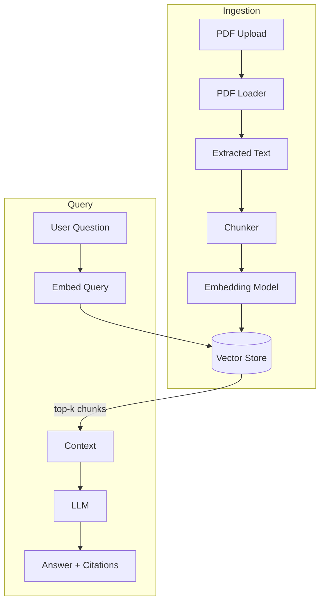

### Tech Stack
- **PDF:** PyMuPDF, PyPDF2
- **Chunking:** RecursiveCharacterTextSplitter (LangChain)
- **Embeddings:** text-embedding-3-small
- **Vector Store:** ChromaDB
- **LLM:** GPT-4o-mini
- **UI:** Streamlit

### Implementation Plan

**Step 1: PDF Loading**
Implement PDF text extraction. Handle multi-page PDFs. Extract metadata (title, page count).

**Step 2: Chunking**
Implement chunking: target chunk size 500 tokens, overlap 100 tokens. Store chunk metadata (source PDF, page number, chunk index).

**Step 3: Embedding & Indexing**
Generate embeddings for each chunk. Store in ChromaDB with metadata.

**Checkpoint 1:** Upload a PDF, the system processes it, and you can query ChromaDB for similar chunks.

**Step 4: Query Pipeline**
Given a question:
1. Embed the question
2. Search top-5 chunks
3. Format as context for LLM
4. Generate answer with citations

**Step 5: UI**
Build a Streamlit app: upload PDF button, chat input, message display. Show source citations (page number, excerpt).

**Checkpoint 2:** Upload a contract, ask "What is the termination clause?" and get an accurate answer with citation.

### Expected Output
A Streamlit app where users can:
- Upload one or more PDFs
- Ask questions about the PDFs
- See answers with highlighted source citations
- See which PDF and page each answer came from

### Evaluation Criteria
- [ ] Answers are accurate and grounded in the PDF
- [ ] Citations point to the correct location in the source
- [ ] Handles multi-page documents
- [ ] Works across multiple uploaded PDFs
- [ ] Handles follow-up questions about the same document
- [ ] Graceful handling of out-of-scope questions ("I can only answer from the uploaded PDFs")

### Stretch Goals
- [ ] Multi-document queries ("Compare the termination clauses in both contracts")
- [ ] Table extraction and querying
- [ ] PDF annotation (highlight cited passages)
- [ ] OCR support for scanned PDFs
- [ ] Document comparison ("What changed between version 1 and version 2?")

### Resources
- PyMuPDF Tutorial: https://pymupdf.readthedocs.io/en/latest/tutorial.html
- ChromaDB Quickstart: https://docs.trychroma.com/getting-started
- LangChain Text Splitters: https://python.langchain.com/docs/how_to/#text-splitters

---

## 07 — Meeting Assistant

- **Difficulty:** Intermediate
- **Estimated Time:** 15–20 hours
- **Learning Objectives:**
  - Integrate speech-to-text for audio transcription
  - Implement multi-stage text processing pipelines
  - Build summarization and action-item extraction
  - Implement meeting memory for cross-meeting context
- **Prerequisites:** Chapters 03 (STT), 07 (Memory, Summarization)

### Problem Statement
Your team has 15+ hours of meetings per week. Nobody remembers decisions, action items are lost, and new members can't catch up. You need a meeting assistant that: transcribes audio in real-time or from recordings, generates concise summaries, extracts action items, and remembers topics across meetings so the team can ask "What did we decide about the migration last week?"

### Architecture
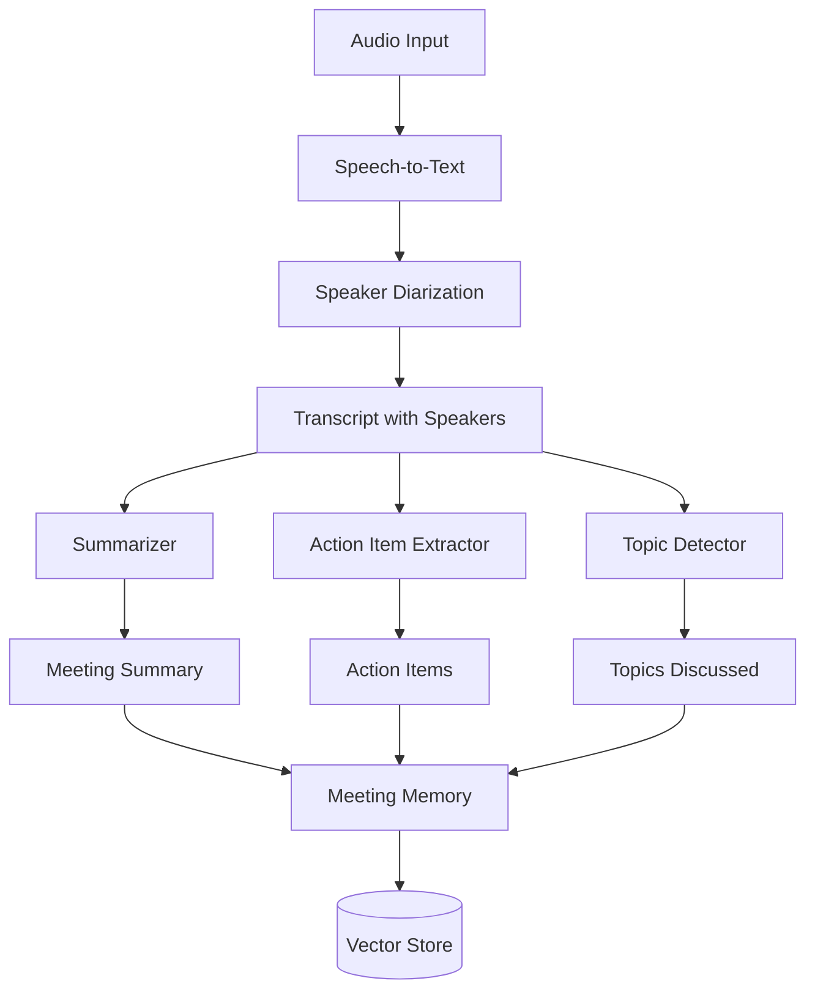

### Tech Stack
- **STT:** OpenAI Whisper API or whisper.cpp
- **Diarization:** pyannote-audio or Deepgram
- **LLM:** GPT-4o-mini for summarization
- **Vector Store:** ChromaDB for cross-meeting memory
- **Framework:** Python, FastAPI

### Implementation Plan

**Step 1: Audio Transcription**
Implement transcription using Whisper API. Support file upload (MP3, WAV, M4A). Return timestamped segments.

**Checkpoint 1:** Upload a meeting recording and get a text transcript.

**Step 2: Summarization**
Process the transcript through the LLM to generate:
- Executive summary (3-5 bullet points)
- Key discussion points
- Decisions made
- Open questions
- Sentiment trends

**Step 3: Action Items**
Extract action items: who, what, by when. Format as structured data.

**Checkpoint 2:** Given a transcript, produce a structured summary with action items.

**Step 4: Topic Detection**
Identify main topics discussed. Group conversation segments by topic.

**Step 5: Cross-Meeting Memory**
Store meeting summaries and action items in a vector store. Enable queries across meetings: "What have we discussed about the database migration?"

**Step 6: UI**
Build a web interface: upload recording, view transcript with speaker labels, view summary, search across meetings.

### Expected Output
A web app where users can:
- Upload meeting recordings
- View full transcript with speaker labels
- See structured summaries (executive, discussion, decisions, actions)
- Search across all past meetings

### Evaluation Criteria
- [ ] Transcription accuracy > 95% (clear audio)
- [ ] Summaries capture key decisions correctly
- [ ] Action items are extracted with correct assignee
- [ ] Cross-meeting queries return relevant results
- [ ] UI is functional and organized

### Stretch Goals
- [ ] Real-time transcription during live meetings
- [ ] Speaker diarization
- [ ] Sentiment timeline
- [ ] Post-meeting Q&A ("What was the reasoning for choosing AWS?")
- [ ] Integration with calendar (auto-join, auto-transcribe)
- [ ] Template-based summaries (executive vs. technical)

### Resources
- OpenAI Whisper: https://platform.openai.com/docs/guides/speech-to-text
- Whisper.cpp: https://github.com/ggerganov/whisper.cpp
- pyannote-audio: https://github.com/pyannote/pyannote-audio
- Deepgram: https://deepgram.com

---

## 08 — Personal AI

- **Difficulty:** Intermediate
- **Estimated Time:** 15–20 hours
- **Learning Objectives:**
  - Build a personalized conversational agent
  - Implement user profiling and preference learning
  - Design episodic and semantic memory systems
  - Build proactive suggestion and reminder capabilities
- **Prerequisites:** Chapters 03 (Context Engineering), 07 (Memory)

### Problem Statement
You're building a personal AI that gets to know you over time. Unlike a generic chatbot, this AI should learn your preferences, remember your projects and relationships, adapt its tone to your communication style, and proactively offer help. The AI should feel like it actually knows you — your goals, habits, and history.

### Architecture
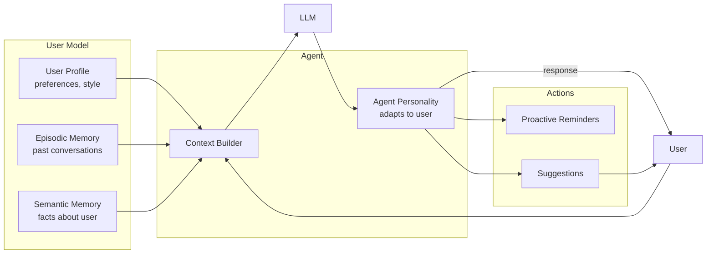

### Tech Stack
- **LLM:** GPT-4o-mini (chat), Claude 3.5 Haiku (personality)
- **Vector Store:** ChromaDB
- **Database:** SQLite for user profile, ChromaDB for memory
- **Framework:** Python, FastAPI

### Implementation Plan

**Step 1: User Profile**
Build a profile schema: name, preferences, communication style, goals, important dates, relationships. Store in SQLite.

**Step 2: Profile Learning**
During conversations, extract profile information. "I prefer short responses" → update communication_style. "My partner's name is Sarah" → update relationships.

**Checkpoint 1:** Agent remembers user's name and preferred response style after one conversation.

**Step 3: Episodic Memory**
Store conversations as episodes. On conversation start, retrieve relevant past episodes. Summarize old episodes for context.

**Step 4: Semantic Memory**
Extract and store factual statements about the user: "User works at Acme Corp", "User enjoys hiking". Score for importance.

**Step 5: Context Builder**
Given new input:
1. Load user profile
2. Retrieve relevant episodes
3. Retrieve relevant semantic facts
4. Build context string for LLM

**Checkpoint 2:** User says "Remind me about my project deadline" and the agent recalls it from a conversation 2 weeks ago.

**Step 6: Proactive Suggestions**
Based on profile and history, offer suggestions: "You mentioned you wanted to start writing. It's been a while. Want to pick up?" Implement a simple trigger system.

### Expected Output
A conversational agent that:
- Addresses you by name with appropriate tone
- Remembers personal details across weeks
- Learns preferences from conversation
- Offers proactive suggestions
- Can summarize what it knows about you

### Evaluation Criteria
- [ ] Profile accuracy > 90% (extracted facts are correct)
- [ ] Personalization is noticeable (tone, style, content)
- [ ] Cross-session recall works reliably
- [ ] Proactive suggestions are well-timed and relevant
- [ ] User can correct the AI's knowledge ("Actually, I don't like that")

### Stretch Goals
- [ ] Multi-session conversation threading
- [ ] Daily briefing generation
- [ ] Relationship graph (people, projects, topics)
- [ ] Habit tracking and coaching
- [ ] Cross-device state synchronization

### Resources
- Building Personal AI Assistants: https://arxiv.org/abs/2312.03842
- MemGPT for Personal Memory: https://github.com/letta-ai/letta
- LangChain Memory: https://python.langchain.com/docs/modules/memory

---

## 09 — Knowledge Base

- **Difficulty:** Intermediate
- **Estimated Time:** 12–18 hours
- **Learning Objectives:**
  - Build a production-ready RAG system
  - Implement hybrid search (semantic + keyword)
  - Design document management with versioning
  - Build query understanding and routing
- **Prerequisites:** Chapters 03 (RAG, Retrieval), 05 (Embeddings)

### Problem Statement
Your company needs an internal knowledge base where teams can upload documents (design specs, architecture decisions, runbooks) and ask questions. The system needs: document upload and indexing, natural language querying with citations, document versioning, and team-based access control.

### Architecture
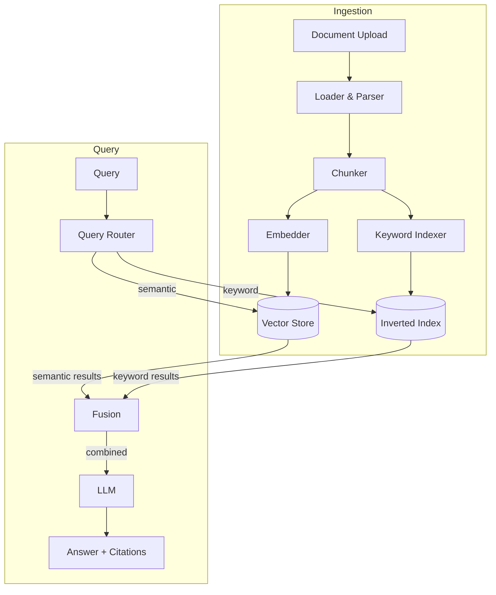

### Tech Stack
- **Backend:** FastAPI
- **Vector Store:** Qdrant or ChromaDB
- **Keyword Search:** BM25 (bm25s library)
- **Embeddings:** text-embedding-3-small or sentence-transformers
- **LLM:** GPT-4o-mini
- **Storage:** PostgreSQL or SQLite for metadata

### Implementation Plan

**Step 1: Document Ingestion Pipeline**
Support uploading Markdown, PDF, and plain text. Parse and extract text. Store original documents.

**Step 2: Chunking & Indexing**
Implement chunking with configurable strategy (fixed size, semantic). Store embeddings + BM25 index.

**Checkpoint 1:** Upload 10 documents and verify they're indexed.

**Step 3: Hybrid Search**
Implement semantic search (vector cosine similarity) and keyword search (BM25). Combine results using Reciprocal Rank Fusion (RRF).

**Step 4: Query Pipeline**
Given a question:
1. Run hybrid search → top-10 chunks
2. De-duplicate and re-rank
3. Format context for LLM
4. Generate answer with citations

**Checkpoint 2:** Query the knowledge base and get correct answers with document citations.

**Step 5: API**
Build FastAPI endpoints: `POST /documents` (upload), `GET /query?q=...` (question), `GET /documents/{id}` (view).

**Step 6: UI**
Build a Streamlit or basic HTML interface: upload documents, search, view results with citations.

### Expected Output
A web application where users can:
- Upload documents (PDF, MD, TXT)
- Ask natural language questions
- Get answers with citations to specific documents and passages
- Browse and manage documents

### Evaluation Criteria
- [ ] Retrieval recall > 90% for known facts
- [ ] Hybrid search outperforms pure vector search (RRF improves results)
- [ ] Citations are accurate and specific
- [ ] Document upload works for multiple formats
- [ ] Query latency < 3 seconds
- [ ] Handles ambiguous queries gracefully

### Stretch Goals
- [ ] Document versioning with diff view
- [ ] RBAC (read/write/admin per team)
- [ ] Auto-tagging on upload
- [ ] Feedback loop (thumbs up/down improves results)
- [ ] Document collections/folders

### Resources
- BM25: https://en.wikipedia.org/wiki/Okapi_BM25
- Reciprocal Rank Fusion: https://plg.uwaterloo.ca/~gvcormack/cormack06.pdf
- Qdrant: https://qdrant.tech/documentation/
- Sentence Transformers: https://www.sbert.net

---

## 10 — Support Agent

- **Difficulty:** Intermediate
- **Estimated Time:** 15–20 hours
- **Learning Objectives:**
  - Build a task-oriented conversational agent
  - Implement intent classification and routing
  - Design tool-based action execution
  - Build escalation logic and human handoff
- **Prerequisites:** Chapters 07 (Agents), 08 (Routing, Classification)

### Problem Statement
Your e-commerce company needs an AI support agent that can handle common customer issues: order status, returns, refunds, account issues, and product questions. The agent should classify the intent, resolve it using internal tools, and escalate to humans when it can't help. The conversation should feel natural, not like a menu tree.

### Architecture
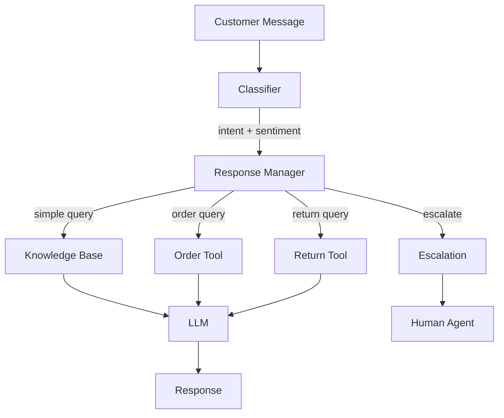

### Tech Stack
- **LLM:** GPT-4o-mini (classification), GPT-4o (response generation)
- **Tools:** Custom Python functions (order lookup, refund, knowledge search)
- **Memory:** Conversation history in SQLite
- **API:** FastAPI

### Implementation Plan

**Step 1: Intent Classification**
Build an intent classifier. Categories: order_status, return_request, refund_request, account_issue, product_question, complaint, other. Also extract entities: order_id, product_name, date.

**Checkpoint 1:** Given "Where is my order #12345?", classify as order_status and extract order_id.

**Step 2: Tool Functions**
Implement:
- `lookup_order(order_id)` → order status, tracking
- `process_refund(order_id, reason)` → refund result
- `search_kb(query)` → knowledge base results
- `create_return(order_id, items, reason)` → return label

**Step 3: Agent Loop**
Given classified intent and extracted entities:
1. Call appropriate tool(s)
2. Format tool results
3. Generate natural language response

**Checkpoint 2:** "I want to return item XYZ from order #12345" → agent creates return and responds with label info.

**Step 4: Sentiment & Escalation**
Detect customer sentiment. If frustration is high (sentiment < 0.3), offer escalation. If the agent can't resolve, create an escalation ticket with full conversation context.

**Step 5: Conversation Memory**
Maintain context across turns. "My order hasn't arrived" → "Let me check order #12345 for you." (Agent remembers the order from the previous turn.)

### Expected Output
A chatbot API that handles customer support conversations:
- Correctly classifies intents
- Uses tools to resolve issues
- Escalates when necessary
- Maintains natural conversation flow

### Evaluation Criteria
- [ ] Intent classification accuracy > 90%
- [ ] Tools execute correctly with valid parameters
- [ ] Responses are helpful, not robotic
- [ ] Escalation happens at appropriate times
- [ ] Context is maintained across turns
- [ ] Handles edge cases (missing order IDs, ambiguous requests)

### Stretch Goals
- [ ] Multi-channel support (email, chat, voice)
- [ ] KB integration (auto-create articles for unknown answers)
- [ ] A/B testing of response strategies
- [ ] Quality assurance dashboard
- [ ] Real-time sentiment monitoring

### Resources
- Customer Support Agent Patterns: https://python.langchain.com/docs/tutorials/agents
- OpenAI Function Calling: https://platform.openai.com/docs/guides/function-calling
- Sentiment Analysis with LLMs: https://docs.anthropic.com/en/docs/build-with-claude/prompt-engineering

---

## 11 — SQL Agent

- **Difficulty:** Intermediate
- **Estimated Time:** 10–15 hours
- **Learning Objectives:**
  - Convert natural language to SQL queries
  - Implement schema-aware prompt engineering
  - Build query validation and safe execution
  - Handle edge cases (ambiguity, schema complexity)
- **Prerequisites:** Chapters 02 (Prompting), 04 (Function Calling), 07 (Tools)

### Problem Statement
Your business team needs to query the company database without knowing SQL. They should be able to ask "Show me total sales by region for last quarter" and get the answer. The system must: understand the database schema, generate correct SQL, validate it for safety, execute it, and present results in natural language.

### Architecture
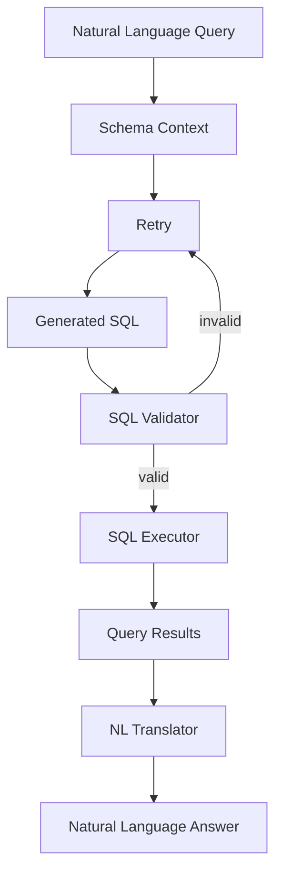

### Tech Stack
- **LLM:** GPT-4o or Claude 3.5 Sonnet
- **Database:** SQLite (development), PostgreSQL (production)
- **Driver:** sqlite3, psycopg2, SQLAlchemy
- **Validation:** sqlparse, custom regex patterns

### Implementation Plan

**Step 1: Schema Extraction**
Write a function that extracts the database schema: tables, columns, types, primary keys, foreign keys, indexes. Format as a schema document for prompting.

**Step 2: Prompt Engineering**
Design a system prompt that includes:
- Full schema definition
- Examples of NL → SQL pairs
- Rules: use only SELECT (no modifications), use specific column names, handle ambiguity

**Checkpoint 1:** Given "Show me all customers who ordered in the last 30 days", generate valid SQL.

**Step 3: SQL Generation**
Call the LLM with the schema and question. Parse the response for SQL. Handle the case where the LLM includes explanation — extract just the SQL.

**Step 4: SQL Validation**
Before execution, validate:
- Only SELECT statements (no INSERT, UPDATE, DELETE, DROP)
- No dangerous functions (xp_cmdshell, etc.)
- Table and column names exist in schema
- Syntax is valid SQL

**Checkpoint 2:** Invalid or dangerous SQL is rejected; valid SQL is executed.

**Step 5: Execution & Results**
Execute the SQL against a read-only database connection or a replica. Format results as a table. Generate a natural language summary.

### Expected Output
A conversational SQL interface:
- Accepts natural language database questions
- Shows the generated SQL (transparency)
- Returns formatted results with a natural language explanation

### Evaluation Criteria
- [ ] SQL generation accuracy > 85% on known schemas
- [ ] No dangerous SQL reaches the database
- [ ] Ambiguous queries are clarified ("Did you mean X or Y?")
- [ ] Complex queries (JOINs, GROUP BY, subqueries) work
- [ ] Error messages are helpful ("Column 'foo' doesn't exist. Did you mean 'bar'?")

### Stretch Goals
- [ ] Query history (browse and re-run)
- [ ] Multi-database routing
- [ ] Automatic visualization (chart from results)
- [ ] Schema explorer ("What tables contain customer data?")
- [ ] Incremental query building ("Add a filter for region = 'West'")

### Resources
- NL2SQL Benchmark (Spider): https://yale-lily.github.io/spider
- SQLAlchemy: https://www.sqlalchemy.org
- sqlparse: https://github.com/andialbrecht/sqlparse
- OpenAI Function Calling: https://platform.openai.com/docs/guides/function-calling

---

## 12 — GitHub Agent

- **Difficulty:** Advanced
- **Estimated Time:** 18–25 hours
- **Learning Objectives:**
  - Build an agent that interacts with external APIs
  - Implement complex multi-step tool workflows
  - Handle API pagination, rate limits, and error recovery
  - Build decision-making for repository management tasks
- **Prerequisites:** Chapter 07 (Tool Calling, API Integration)

### Problem Statement
Your engineering team needs an AI assistant that can manage GitHub repositories autonomously. Tasks include: triaging issues, reviewing PRs, generating changelogs, managing labels and milestones, creating releases, and answering questions about the repository's history and status.

### Architecture
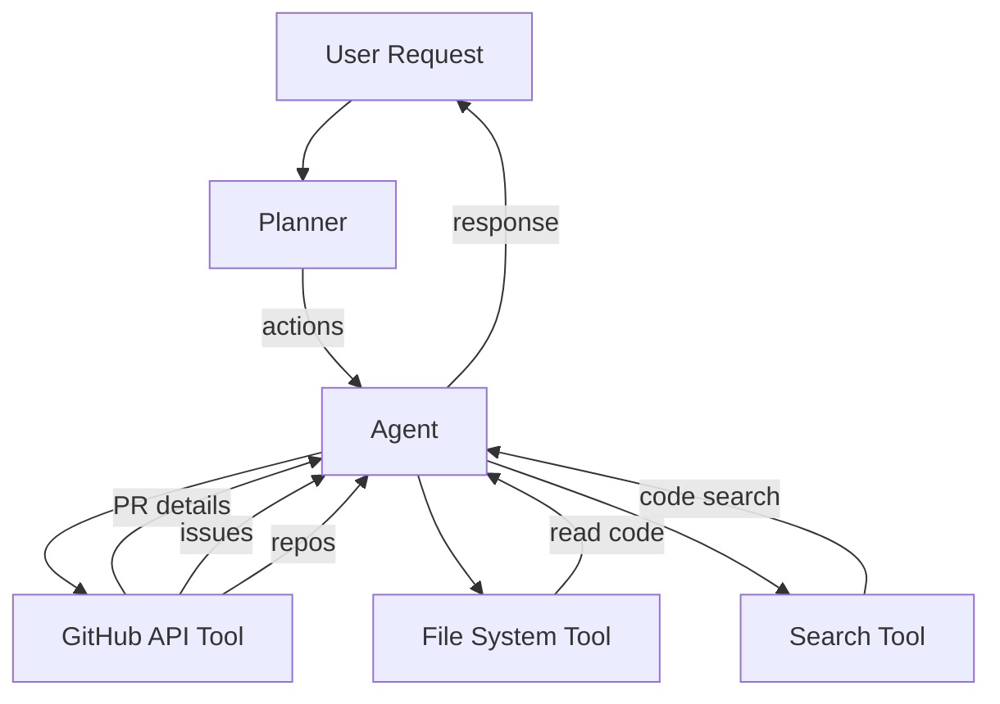

### Tech Stack
- **LLM:** Claude 3.5 Sonnet or GPT-4o
- **GitHub API:** PyGithub or GitHub REST API (httpx)
- **Auth:** GitHub Personal Access Token (fine-grained)

### Implementation Plan

**Step 1: GitHub API Tools**
Implement core tools:
- `get_issue(repo, issue_number)` → issue details
- `list_issues(repo, state, labels)` → filtered issues
- `create_issue(repo, title, body, labels)` → new issue
- `get_pr(repo, pr_number)` → PR details
- `list_prs(repo, state)` → PR list
- `create_comment(repo, issue_number, body)` → comment
- `list_releases(repo)` → release list

**Checkpoint 1:** Agent can list open issues in a repo.

**Step 2: Issue Triage**
Given a new issue, the agent:
1. Reads the issue content
2. Classifies type (bug, feature, question)
3. Assigns priority (P0-P3)
4. Suggests assignee based on expertise
5. Adds appropriate labels
6. Comments with triage summary

**Step 3: PR Review**
Given a PR, the agent:
1. Gets the PR diff
2. Reads changed files
3. Reviews for bugs, style, security, tests
4. Posts inline comments
5. Approves or requests changes

**Checkpoint 2:** Agent triages an issue and reviews a PR autonomously.

**Step 4: Changelog Generation**
Given a milestone or release:
1. List all merged PRs since last release
2. Categorize by type (feat, fix, docs, refactor)
3. Generate changelog markdown
4. Create or update release draft

**Step 5: Q&A**
Answer questions about the repo: "How many open issues?", "What's our release schedule?", "Show me PRs by user X", "What's the most common label?"

### Expected Output
A CLI or API agent that:
- Connects to any GitHub repo (with permissions)
- Triages issues, reviews PRs, generates changelogs
- Answers questions about repository state
- Shows its actions transparently

### Evaluation Criteria
- [ ] Issue triage is accurate (correct labels, priority)
- [ ] PR review catches actual issues (not false positives)
- [ ] Changelogs are correctly categorized
- [ ] Q&A answers are factually correct
- [ ] Rate limits are respected
- [ ] No destructive actions without confirmation

### Stretch Goals
- [ ] CI/CD integration (auto-deploy on merge)
- [ ] Dependency update PRs
- [ ] Code review auto-approve (meets criteria)
- [ ] Multi-repo orchestration
- [ ] GitHub Actions workflow generation

### Resources
- PyGithub: https://pygithub.readthedocs.io
- GitHub REST API: https://docs.github.com/en/rest
- GitHub CLI: https://cli.github.com
- Fine-grained PATs: https://docs.github.com/en/authentication/keeping-your-account-and-data-secure/managing-your-personal-access-tokens

---

## 13 — Writing Assistant

- **Difficulty:** Beginner
- **Estimated Time:** 4–6 hours
- **Learning Objectives:**
  - Implement iterative writing workflow (draft → polish → expand)
  - Use structured outputs for formatted content
  - Build critique and revision features
  - Support multiple writing modes (blog, email, report)
- **Prerequisites:** Chapters 02 (Prompting), 04 (Structured Outputs)

### Problem Statement
Your team wants an AI writing assistant that helps with business communication: drafting emails, writing blog posts, creating proposals, and editing content. The assistant should not generate content from scratch (that's too generic) but should help users improve their writing — suggest better phrasing, fix tone, expand on points, and maintain consistency.

### Architecture
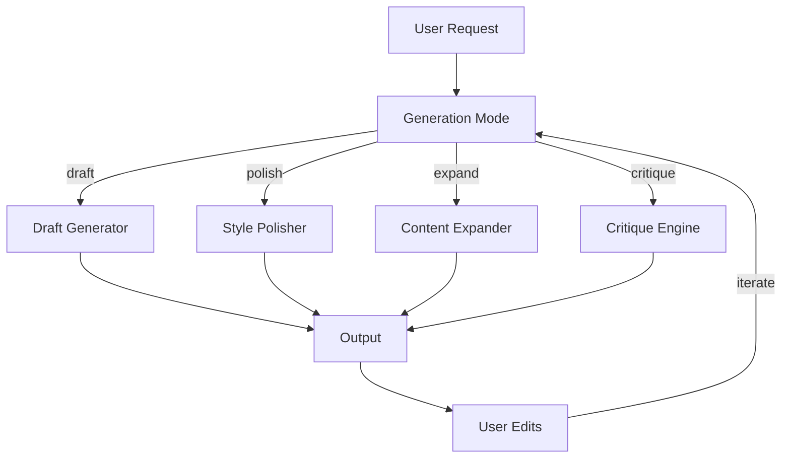

### Tech Stack
- **LLM:** GPT-4o-mini or Claude 3.5 Haiku
- **Structured Output:** OpenAI JSON mode or Claude tool use
- **API:** FastAPI
- **UI:** Streamlit or simple HTML

### Implementation Plan

**Step 1: Draft Mode**
Given a topic, audience, and format, generate a first draft. Use structured output: `{title, sections: [{heading, body}], tone}`.

**Step 2: Polish Mode**
Given existing text, improve it. Options:
- Make it more formal/casual
- Shorten it
- Fix grammar and style
- Adjust reading level

**Checkpoint 1:** Paste a rough email → get a polished version.

**Step 3: Expand Mode**
Given an outline or bullet points, expand into full prose. Maintain the original tone and style.

**Step 4: Critique Mode**
Given a piece of writing, provide constructive feedback:
- Strengths
- Areas for improvement
- Specific suggestions
- Tone analysis

**Checkpoint 2:** User provides an outline → system generates a full draft that the user can then polish.

**Step 5: Iteration Loop**
After each output, the user can request modifications: "Make it more persuasive", "Add a conclusion", "Shorten by 50%". Each iteration preserves the original intent.

### Expected Output
A web interface where users can:
- Choose a mode (draft, polish, expand, critique)
- Input text or topic
- Get AI-generated content
- Iterate with follow-up requests

### Evaluation Criteria
- [ ] Generated content is coherent and on-topic
- [ ] Polished text is measurably better (grammar, clarity)
- [ ] Expansions maintain original meaning
- [ ] Critique provides actionable feedback
- [ ] Iteration preserves user intent
- [ ] Tone adjustments are accurate

### Stretch Goals
- [ ] Custom style guide enforcement
- [ ] Multi-format export (Google Docs, Notion, WordPress)
- [ ] Collaborative editing
- [ ] Plagiarism check
- [ ] Real-time writing coach

### Resources
- OpenAI Structured Outputs: https://platform.openai.com/docs/guides/structured-outputs
- Writing Assistant Patterns: https://docs.anthropic.com/en/docs/build-with-claude/prompt-engineering
- Tone Analysis: https://platform.openai.com/docs/guides/text-generation

---

## 14 — AI Tutor

- **Difficulty:** Intermediate
- **Estimated Time:** 15–20 hours
- **Learning Objectives:**
  - Build a personalized tutoring system
  - Implement student modeling and progress tracking
  - Design curriculum-aware RAG
  - Build adaptive difficulty and quiz generation
- **Prerequisites:** Chapters 03 (RAG), 07 (Memory, Personalization)

### Problem Statement
You're building an AI tutor that helps students learn programming (or any structured subject). The tutor should: assess the student's current knowledge, create a personalized learning path, teach concepts with explanations and examples, ask questions to verify understanding, and adapt difficulty based on performance. The system should maintain a student model that improves over time.

### Architecture
```mermaid
flowchart LR
    subgraph Student Model
        SM[Student Model\nknowledge, gaps, pace]
        Progress[Progress Tracker]
    end
    subgraph Curriculum
        KG[Knowledge Graph\nof subject]
        CB[Content Base\nlessons, examples]
    end
    subgraph Tutor
        PL[Personalized Planner]
        TE[Teacher]\nLLM with RAG
        QZ[Quiz Generator]
        FB[Feedback Engine]
    end
    SM --> PL
    PL -->|lesson plan| TE
    KG --> TE
    CB --> TE
    TE -->|teach| U[Student]
    U -->|answer| QZ
    QZ -->|result| FB
    FB -->|update| SM
```

### Tech Stack
- **LLM:** GPT-4o-mini (teaching), GPT-4o (assessment)
- **Vector Store:** ChromaDB for curriculum content
- **Database:** SQLite for student model
- **Content:** Markdown files (lessons, exercises)

### Implementation Plan

**Step 1: Curriculum Content**
Structure the subject as a knowledge graph: topics, subtopics, prerequisites, learning objectives. Store lessons as Markdown files with metadata.

**Step 2: Student Model**
Track:
- Topics mastered (score > 80%)
- Topics in progress
- Topics not started
- Learning pace (fast, medium, slow)
- Common mistakes
- Preferred learning style (examples-first vs. theory-first)

**Checkpoint 1:** Student model persists across sessions and tracks progress.

**Step 3: Personalized Planner**
Given the student model, generate a learning path. Start with prerequisites, then move to current topic. Adapt based on performance.

**Step 4: Teaching Loop**
For each topic:
1. Retrieve relevant lesson + examples from vector store
2. LLM explains the concept
3. LLM asks comprehension questions
4. Student answers
5. Evaluate answer, provide feedback
6. Update student model

**Checkpoint 2:** Complete a full teaching session on one topic: teach, quiz, feedback, update.

**Step 5: Quiz Generation**
Given a topic and difficulty level, automatically generate multiple-choice and short-answer questions. Grade answers automatically.

**Step 6: Adaptive Difficulty**
If student scores > 80% on quizzes, increase difficulty. If < 50%, revisit prerequisites or provide simpler explanations.

### Expected Output
A conversational tutor that:
- Assesses current knowledge
- Creates personalized learning paths
- Teaches concepts with examples
- Generates quizzes and grades answers
- Adapts difficulty dynamically

### Evaluation Criteria
- [ ] Student model accurately reflects knowledge
- [ ] Teaching explanations are clear and accurate
- [ ] Quiz questions are relevant and correctly graded
- [ ] Difficulty adaptation is appropriate
- [ ] Progress is tracked across sessions
- [ ] System handles corrections ("That's not quite right, let me clarify")

### Stretch Goals
- [ ] Socratic method (guided questions, not direct answers)
- [ ] Peer comparison (anonymized)
- [ ] Spaced repetition scheduling
- [ ] Code execution environment (for programming topics)
- [ ] Parent/teacher dashboard

### Resources
- Bloom's Taxonomy: https://en.wikipedia.org/wiki/Bloom%27s_taxonomy
- Khan Academy Style: https://www.khanacademy.org
- Spaced Repetition: https://en.wikipedia.org/wiki/Spaced_repetition
- Intelligent Tutoring Systems: https://doi.org/10.1007/978-1-4615-1083-5

---

## 15 — Financial Assistant

- **Difficulty:** Advanced
- **Estimated Time:** 20–30 hours
- **Learning Objectives:**
  - Build a multi-tool agent for financial analysis
  - Integrate real-time market data APIs
  - Implement portfolio analysis and risk assessment
  - Build report generation with data visualization
- **Prerequisites:** Chapters 07 (Agents, APIs), 08 (Data Analysis)

### Problem Statement
Your personal finance dashboard needs an AI assistant that can: answer questions about portfolio performance, analyze market trends, calculate risk metrics, suggest rebalancing strategies, and generate financial reports. The assistant must handle complex quantitative questions ("What's the Sharpe ratio of my portfolio?"), use real market data, and present results with clear visualizations.

### Architecture
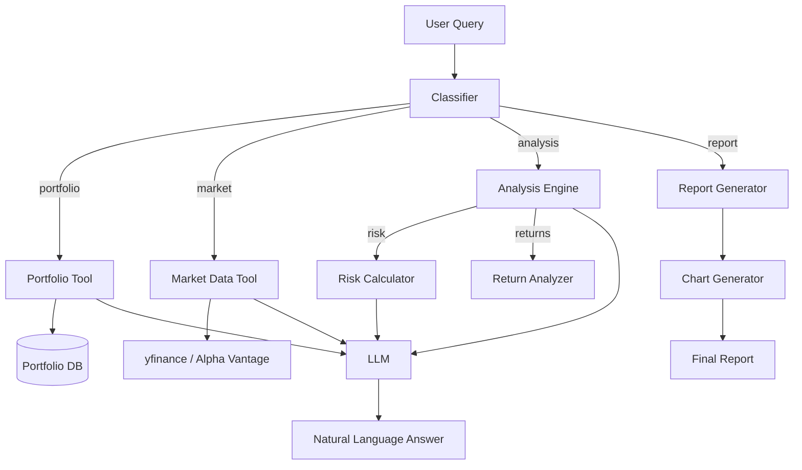

### Tech Stack
- **Market Data:** yfinance, Alpha Vantage, or Polygon.io
- **Analysis:** pandas, numpy, scipy
- **Visualization:** matplotlib, plotly
- **LLM:** GPT-4o or Claude 3.5 Sonnet
- **Storage:** SQLite for portfolio data

### Implementation Plan

**Step 1: Market Data Tool**
Implement `get_stock_price(ticker)` → current price + history. `get_company_info(ticker)` → profile, financials. `get_market_news()` → headlines.

**Checkpoint 1:** "What's the current price of AAPL?" returns accurate data.

**Step 2: Portfolio Manager**
Store portfolio holdings: ticker, shares, purchase price, purchase date.
Implement: `get_portfolio_summary()`, `add_holding()`, `remove_holding()`.

**Step 3: Analysis Tools**
Implement:
- `calculate_portfolio_value(holdings)` → total value, allocation
- `calculate_returns(holdings, period)` → absolute, percentage
- `calculate_volatility(ticker, period)` → daily, annualized
- `calculate_sharpe_ratio(ticker, risk_free_rate)` → Sharpe
- `calculate_beta(ticker, benchmark)` → beta to S&P 500

**Checkpoint 2:** "What's the return on my portfolio this year?" works with real data.

**Step 4: Agent Integration**
Build the agent loop. Given a query, classify intent (portfolio, market, analysis, report), call appropriate tools, synthesize results with LLM.

**Step 5: Report Generation**
Generate PDF reports: portfolio summary, performance charts, allocation pie charts, risk metrics. Use matplotlib for charts, WeasyPrint or reportlab for PDF.

**Step 6: Natural Language Explanations**
For every analysis result, generate a plain-English explanation. "Your portfolio has a Sharpe ratio of 1.2, which means the risk-adjusted return is above average."

### Expected Output
A conversational financial assistant that:
- Answers portfolio questions with real data
- Calculates financial metrics (returns, volatility, Sharpe, beta)
- Generates visual charts and PDF reports
- Explains financial concepts in plain language

### Evaluation Criteria
- [ ] Market data is accurate and timely
- [ ] Portfolio calculations match manual verification
- [ ] Financial metrics are correctly computed
- [ ] Charts are clear and properly labeled
- [ ] Explanations are accurate and understandable
- [ ] Agent handles multi-step queries ("Show me my best and worst performing stocks this year")

### Stretch Goals
- [ ] Portfolio rebalancing suggestions
- [ ] Custom price alerts
- [ ] Tax-loss harvesting identification
- [ ] Monte Carlo simulation for retirement planning
- [ ] Multi-currency portfolio support

### Resources
- yfinance: https://github.com/ranaroussi/yfinance
- Investopedia Financial Ratios: https://www.investopedia.com/financial-ratios-4689817
- Modern Portfolio Theory: https://en.wikipedia.org/wiki/Modern_portfolio_theory
- Matplotlib: https://matplotlib.org
- Plotly: https://plotly.com/python
