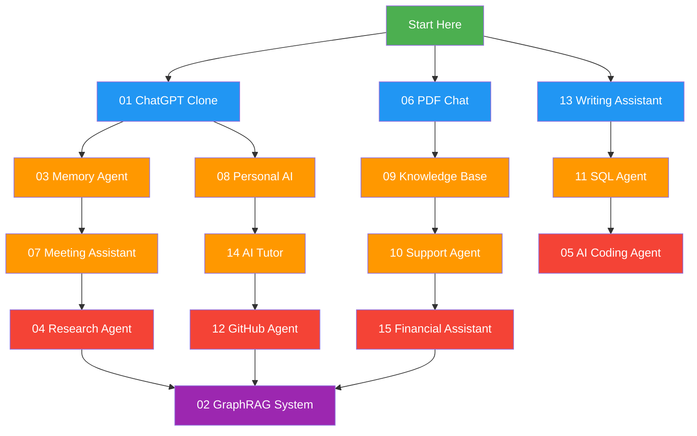

# Chapter 10: Projects — The AI Engineering Capstone

> *"You don't learn to build by reading. You learn by building."*

This chapter is the culmination of everything you've studied in Chapters 1–9. Theory, patterns, and best practices mean nothing until you ship. Here you'll find 15 complete project specifications — ranging from a beginner-friendly ChatGPT clone to an advanced multi-agent financial assistant.

Each project is a self-contained specification you can implement in a weekend or a sprint. They are designed to be built iteratively: start with a minimum viable product, then layer on stretch goals as your confidence grows.

---

## How to Approach These Projects

### The Build Cycle

1. **Read the spec** — Understand what you're building and why.
2. **Review prerequisites** — Revisit the referenced chapters if you're fuzzy on concepts.
3. **Set up the skeleton** — Create the directory structure, install dependencies, write config files.
4. **Build the core loop** — Get the happy path working first. No fancy features.
5. **Test the core** — Verify inputs and outputs at every stage.
6. **Iterate** — Add error handling, edge cases, logging, and one stretch goal.
7. **Refactor** — Clean up. Extract reusable components. Document decisions.
8. **Ship** — Deploy, share, or just celebrate.

### Difficulty Levels

| Level | Description | Expected Prior Experience |
|-------|-------------|---------------------------|
| **Beginner** | Builds on basic prompting, simple APIs, single-file implementations. | Chapters 1–3 |
| **Intermediate** | Involves multiple components, databases, memory systems, agent orchestration. | Chapters 1–7 |
| **Advanced** | Multi-agent systems, complex tooling, production considerations, performance optimization. | All chapters |

---

## Prerequisites by Project

| # | Project | Prerequisite Chapters |
|---|---------|----------------------|
| 01 | ChatGPT Clone | 02 (Prompting), 03 (LLM APIs) |
| 02 | GraphRAG System | 03 (RAG), 05 (Knowledge Graphs) |
| 03 | Memory Agent | 03 (Context), 07 (Memory Systems) |
| 04 | Research Agent | 04 (Agents), 07 (Tool Use) |
| 05 | AI Coding Agent | 04 (Agents), 07 (Tools), 08 (Evaluation) |
| 06 | PDF Chat | 03 (RAG, Embeddings) |
| 07 | Meeting Assistant | 03 (STT), 07 (Memory, Summarization) |
| 08 | Personal AI | 03 (Context Engineering), 07 (Memory) |
| 09 | Knowledge Base | 03 (RAG, Retrieval), 05 (Embeddings) |
| 10 | Support Agent | 07 (Agents), 08 (Routing, Classification) |
| 11 | SQL Agent | 02 (Prompting), 04 (Function Calling), 07 (Tools) |
| 12 | GitHub Agent | 07 (Tool Calling, API Integration) |
| 13 | Writing Assistant | 02 (Prompting), 04 (Structured Outputs) |
| 14 | AI Tutor | 03 (RAG), 07 (Memory, Personalization) |
| 15 | Financial Assistant | 07 (Agents, APIs), 08 (Data Analysis) |

---

## Project Overview

| # | Project | Difficulty | Concepts | Chapter References |
|---|---------|-----------|----------|-------------------|
| 01 | ChatGPT Clone | Beginner | Prompting, streaming, chat history | 02, 03 |
| 02 | GraphRAG System | Advanced | Knowledge graphs, RAG, entity extraction | 03, 05 |
| 03 | Memory Agent | Intermediate | Context management, memory systems | 03, 07 |
| 04 | Research Agent | Advanced | Agents, RAG, web search, loops | 04, 07 |
| 05 | AI Coding Agent | Advanced | Agents, tools, loops, multi-step | 04, 07, 08 |
| 06 | PDF Chat | Beginner | RAG, chunking, embeddings | 03 |
| 07 | Meeting Assistant | Intermediate | STT, summarization, memory | 03, 07 |
| 08 | Personal AI | Intermediate | Memory, agents, context engineering | 03, 07 |
| 09 | Knowledge Base | Intermediate | RAG, embeddings, retrieval | 03, 05 |
| 10 | Support Agent | Intermediate | Agents, tools, classification, routing | 07, 08 |
| 11 | SQL Agent | Intermediate | NL-to-SQL, tools, function calling | 02, 04, 07 |
| 12 | GitHub Agent | Advanced | Tool calling, API integration, agents | 07 |
| 13 | Writing Assistant | Beginner | Prompting, iteration, structured outputs | 02, 04 |
| 14 | AI Tutor | Intermediate | Memory, personalization, RAG | 03, 07 |
| 15 | Financial Assistant | Advanced | Agents, API tools, data analysis | 07, 08 |

---

## Suggested Learning Path

**Beginner Track (Blue):** Start with basic chatbot, RAG, and writing projects to build confidence with LLM APIs.

**Intermediate Track (Orange):** Add memory, personalization, multi-turn capabilities, and tool use.

**Advanced Track (Red):** Build complex agents with tool integration, multi-step reasoning, and production patterns.

**Capstone (Purple):** The GraphRAG system ties together knowledge graphs, RAG, and entity extraction — the most technically ambitious project.

---

## Cross-References by Chapter

Each project references specific concepts taught in earlier chapters. Here's the reverse map:

| Chapter | Projects That Use It |
|---------|---------------------|
| 02 — Prompt Engineering | 01, 11, 13 |
| 03 — LLM APIs & RAG | 01, 02, 03, 06, 07, 08, 09, 14 |
| 04 — Agent Architectures | 04, 05, 11, 13 |
| 05 — Knowledge Graphs | 02, 09 |
| 07 — Memory & State | 03, 04, 07, 08, 10, 11, 12, 14, 15 |
| 08 — Evaluation | 05, 10, 15 |

---

## Tips for Success

1. **Start small.** Each project begins with a minimal core. Don't try to build the stretch goals on day one.
2. **Use your terminal.** These projects are designed to be built with Python, CLI tools, and lightweight frameworks. Avoid over-engineering with heavy infrastructure.
3. **Log everything.** Every project should include structured logging. You can't debug what you can't see.
4. **Version control from commit one.** Initialize a git repo before you write a single line of code.
5. **Document decisions.** Keep a `DECISIONS.md` in each project folder. Write down why you chose each library, parameter, or architecture choice.
6. **Test incrementally.** Don't wait until the end to test. Test each component as you build it.
7. **Compare before and after.** When you make a change, run the same input through both versions and compare outputs.
8. **Ship something.** A working v0.1 is better than a perfect v1.0 that never ships.

---

## Evaluation Rubric

Each project in this chapter includes specific evaluation criteria. In general, implementations are assessed on:

| Criterion | Weight | Description |
|-----------|--------|-------------|
| Correctness | 30% | Does the system produce correct, expected outputs? |
| Robustness | 20% | Does it handle errors, edge cases, and unexpected inputs gracefully? |
| Code Quality | 15% | Is the code clean, modular, and well-structured? |
| Documentation | 10% | Are decisions documented? Is the README clear? |
| Architecture | 15% | Is the system designed thoughtfully for its use case? |
| Stretch Goals | 10% | How many extras were implemented successfully? |

---

## How to Use This Chapter

- **Self-study:** Pick the beginner project that interests you most. Build it. Then pick an intermediate project. Work your way up.
- **Bootcamp curriculum:** Assign projects 01, 06, and 13 as week 1–2 deliverables. Assign 03, 08, 09 as week 3–4. Assign 04, 05, 15 as the final capstone.
- **Interview prep:** Implement projects 11 (SQL Agent) and 12 (GitHub Agent). These test the tool-calling and API integration patterns most commonly asked in AI engineering interviews.
- **Portfolio building:** Complete projects 02 (GraphRAG) and 05 (Coding Agent) with stretch goals. These are the most impressive on a resume.

---

Let's build.
