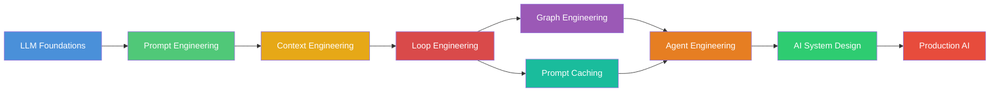

<div align="center">

# AI Engineering Handbook

### The Definitive Guide to Building With LLMs

[]()
[]()
[]()
[]()

> **From tokens to production systems.**
> Everything you need to master modern AI engineering.

</div>

---

## What Is This?

This is a free, open-source handbook for developers who want to master AI engineering. Not just prompt engineering. Everything.

You will learn:

- How LLMs actually work under the hood
- How to engineer prompts that reliably produce correct outputs
- How to manage context across thousands of tokens
- How to build feedback loops that iteratively improve outputs
- How to use knowledge graphs for retrieval-augmented generation
- How to cache intelligently to reduce cost and latency
- How to design, build, and deploy AI agents
- How to architect production AI systems
- How to evaluate, monitor, and debug AI in production

**No fluff. No hype. Just engineering.**

---

## Who Is This For?

| Role | What You'll Get |
|---|---|
| Software Engineers | System architecture, APIs, production patterns |
| AI Engineers | Deep technical foundations, best practices |
| Students | Complete curriculum from basics to advanced |
| Researchers | Structured knowledge, paper references |
| Startup Founders | Practical system design, cost optimization |
| Product Engineers | User-facing AI patterns, evaluation |
| Prompt Engineers | Systematic engineering approach to prompting |
| Agent Engineers | Complete agent architecture guide |
| AI Consultants | Architectural patterns, case studies |

---

## Learning Roadmap



---

## Repository Map

```
AI-Engineering-Handbook/
├── 01_LLM_Foundations/         # How LLMs work under the hood
├── 02_Prompt_Engineering/      # Systematic prompt engineering
├── 03_Context_Engineering/     # Managing context windows
├── 04_Loop_Engineering/        # Feedback loops and iteration
├── 05_Graph_Engineering/      # Knowledge graphs and GraphRAG
├── 06_Prompt_Caching/         # Caching strategies
├── 07_Agent_Engineering/      # Building AI agents
├── 08_AI_System_Design/       # Production system architecture
├── 09_Production_AI/          # Monitoring, evaluation, safety
├── 10_Projects/               # Complete hands-on projects
├── assets/                    # Images, diagrams, templates
├── cheatsheets/               # Quick reference guides
├── resources/                 # Curated reading list
└── papers/                    # Key research papers
```

---

## How to Read This Handbook

### For Beginners

Start at **01_LLM_Foundations** and work through sequentially. Each chapter builds on the previous one.

### For Intermediate Developers

Start at **03_Context_Engineering** or **04_Loop_Engineering**, then follow the roadmap. Refer back to foundations as needed.

### For Advanced Developers

Jump directly to **07_Agent_Engineering**, **08_AI_System_Design**, or **09_Production_AI**. Use earlier chapters for reference.

### For Project Builders

Start at **10_Projects**, pick a project, and use the earlier chapters as reference material when you get stuck.

---

## Prerequisites

- Basic programming knowledge (Python or TypeScript)
- Familiarity with REST APIs
- A GitHub account
- (Optional) API keys for OpenAI, Anthropic, or other LLM providers

That's it. Everything else is taught here.

---

## Difficulty Levels

| Level | Label | Description |
|---|---|---|
| 🟢 | Beginner | Core concepts, no prior AI knowledge needed |
| 🟡 | Intermediate | Requires basic understanding of LLMs |
| 🔴 | Advanced | Production systems, optimization, architecture |

---

## Chapter Overview

### 01 — LLM Foundations 🟢

What every engineer needs to know about how LLMs work.

- Tokenization: how text becomes numbers
- Embeddings: meaning as vectors
- Attention: how models understand relationships
- Transformers: the architecture that changed everything
- Inference: how models generate text
- Training: how models learn
- Fine-tuning: adapting models to specific tasks
- Reasoning models: chain-of-thought, o1, and beyond
- Model comparison: choosing the right model

### 02 — Prompt Engineering 🟢

Systematic techniques for getting LLMs to produce reliable outputs.

- Zero-shot, one-shot, few-shot prompting
- Chain of Thought and reasoning techniques
- Structured outputs: JSON, XML, Markdown
- Function calling and tool use
- Prompt optimization and testing
- Anti-patterns and common mistakes

### 03 — Context Engineering 🟢🟡

How to manage the information you give to LLMs.

- Context windows and their limits
- Retrieval strategies
- Chunking techniques
- Memory systems
- Context compression
- The lost-in-the-middle problem

### 04 — Loop Engineering 🟡🔴

One of the most powerful concepts in modern AI engineering.

- Iterative refinement loops
- Feedback and reflection loops
- Planning and execution loops
- Self-correction systems
- Production loop patterns
- Cost and latency optimization

### 05 — Graph Engineering 🟡🔴

Using graphs to represent knowledge and orchestrate AI systems.

- Knowledge graph fundamentals
- GraphRAG architecture
- Agent orchestration graphs
- Reasoning over graphs
- Production GraphRAG systems

### 06 — Prompt Caching 🟡

Reducing cost and latency through intelligent caching.

- KV caching fundamentals
- Semantic caching
- Production caching strategies
- Cache invalidation
- Cost reduction patterns

### 07 — Agent Engineering 🔴

Building autonomous AI systems.

- Agent architecture patterns
- Planning and reasoning
- Memory and state
- Tool use and function calling
- Multi-agent systems
- Safety and reliability

### 08 — AI System Design 🔴

Architecting production AI systems.

- Chatbot architecture
- Research assistant systems
- Coding agent design
- Customer support systems
- Scalability patterns

### 09 — Production AI 🔴

Running AI systems in production.

- Monitoring and observability
- Evaluation and testing
- Safety and guardrails
- Deployment and scaling
- Cost management

### 10 — Projects 🟢🟡🔴

Complete hands-on projects with source code.

- ChatGPT Clone
- GraphRAG System
- Memory Agent
- Research Agent
- AI Coding Agent
- PDF Chat
- Meeting Assistant
- Personal AI Assistant
- Knowledge Base
- Support Agent
- SQL Agent
- GitHub Agent
- Writing Assistant
- AI Tutor
- Financial Assistant

---

## Progress Tracker

```markdown
- [ ] 01 — LLM Foundations
- [ ] 02 — Prompt Engineering
- [ ] 03 — Context Engineering
- [ ] 04 — Loop Engineering
- [ ] 05 — Graph Engineering
- [ ] 06 — Prompt Caching
- [ ] 07 — Agent Engineering
- [ ] 08 — AI System Design
- [ ] 09 — Production AI
- [ ] 10 — Projects
```

---

## How Each Chapter Is Structured

Every chapter follows the same structure:

```
01_Topic/
├── README.md             # Main content (everything)
├── Exercises.md          # Practice problems with solutions
├── Examples.md           # Code examples in Python and TypeScript
├── InterviewQuestions.md # Common interview questions
├── BestPractices.md      # Production best practices
├── CheatSheet.md         # Quick reference
├── Resources.md          # Curated links and papers
└── Project.md            # Hands-on project assignment
```

---

## Technical Stack

This handbook uses examples in:

- **Python 3.10+** — primary language
- **TypeScript** — secondary language
- **OpenAI SDK** — GPT-4, GPT-4o, o1, o3
- **Anthropic SDK** — Claude 3.5 Sonnet, Claude 4
- **Gemini API** — Gemini 1.5, Gemini 2.0
- **LangChain / LangGraph** — framework examples
- **LlamaIndex** — RAG examples
- **Neo4j / Kuzu** — graph database examples
- **Redis** — caching examples
- **DSPy** — prompt optimization examples

---

## Philosophy

**Understand, don't memorize.**

This is not a collection of prompts to copy-paste. This is a framework for thinking about AI systems.

Every concept follows the same pattern:

1. **Problem** — What are we trying to solve?
2. **Why it matters** — Why should you care?
3. **Mental model** — A simple way to think about it
4. **Core idea** — The fundamental concept
5. **Visual explanation** — A diagram or illustration
6. **Example** — Concrete code or scenario
7. **Wrong example** — What not to do
8. **Correct example** — The right way
9. **Advanced version** — Production-grade approach
10. **Common mistakes** — Pitfalls to avoid
11. **Best practices** — Rules of thumb
12. **Exercises** — Practice what you learned

---

## Original Sources

Every chapter cites original sources:

- Research papers (with links to arXiv or proceedings)
- Official documentation
- Engineering blogs
- Conference talks

We separate stable concepts from fast-moving implementation details. Core ideas last; SDK APIs change.

---

## How to Contribute

This handbook is open source and community-driven.

1. Fork the repository
2. Create a feature branch
3. Make your changes
4. Submit a pull request

### Contribution Guidelines

- Maintain consistent formatting
- Use Mermaid for diagrams
- Include code examples in both Python and TypeScript where relevant
- Cite original sources
- Follow the chapter structure
- Test all code examples
- Keep explanations clear and jargon-free

### What We Need Help With

- Code examples in additional languages
- Translations
- Additional case studies
- Exercise solutions
- Bug fixes and corrections
- New projects

---

## FAQ

**Q: Do I need to know machine learning?**
A: No. This handbook starts from fundamentals and builds up.

**Q: Do I need expensive API keys?**
A: Many examples work with free tiers or local models. We note which examples require paid APIs.

**Q: Is this just prompt engineering?**
A: No. Prompt engineering is one chapter. This covers the full stack of AI engineering.

**Q: How often is this updated?**
A: The field moves fast. We aim for quarterly updates and continuous improvements.

**Q: Can I use this to teach a course?**
A: Yes. This is designed as curriculum material. Attribution appreciated.

**Q: Are there video companions?**
A: Not yet. This is text-first. Video companions may come later.

---

## License

MIT License. Free to use, share, and adapt.

---

## Star History

[Star history chart placeholder]

---

## Sponsors

[Sponsor section placeholder]

---

## Community

- GitHub Discussions
- Discord (coming soon)
- Twitter/X (coming soon)

---

<div align="center">

**Built with ❤️ for the AI engineering community**

If this handbook helps you, star the repo, share it, and contribute back.

</div>
