# Cheatsheets

Master reference for the AI Engineering Handbook. Use these as quick lookup guides when building LLM-powered applications.

---

## Contents

1. [Quick-Start Cheatsheet](#1-quick-start-cheatsheet-10-essential-concepts)
2. [Model Comparison Table](#2-model-comparison-table)
3. [Sampling Parameters Reference](#3-sampling-parameters-reference)
4. [Token Cost Estimation Formulas](#4-token-cost-estimation-formulas)
5. [Common Prompt Patterns](#5-common-prompt-patterns)
6. [Common Context Management Patterns](#6-common-context-management-patterns)
7. [Common Loop Patterns](#7-common-loop-patterns)
8. [Common Agent Patterns](#8-common-agent-patterns)
9. [Choosing the Right Approach](#9-choosing-the-right-approach)

---

## 1. Quick-Start Cheatsheet (10 Essential Concepts)

| # | Concept | What It Means | Why It Matters |
|---|---------|---------------|----------------|
| 1 | **Token** | Unit of text (word ~1.3 tokens). LLMs read/write in tokens. | Controls cost, latency, and context limits. |
| 2 | **Context Window** | Max tokens a model can process at once. | Determines how much text you can feed in. |
| 3 | **Temperature** | Controls randomness (0 = deterministic, 1+ = creative). | Low for facts, high for brainstorming. |
| 4 | **Top-p (Nucleus Sampling)** | Cumulative probability cutoff for token selection. | Alternative to temperature for controlled randomness. |
| 5 | **System Prompt** | Initial instruction that sets model behavior. | The primary tool for steering outputs. |
| 6 | **Few-Shot Prompting** | Providing examples in the prompt to guide output format. | Cheap alternative to fine-tuning. |
| 7 | **RAG (Retrieval-Augmented Generation)** | Inject retrieved documents into context. | Grounds answers in external knowledge. |
| 8 | **Chain-of-Thought (CoT)** | Ask model to reason step-by-step. | Dramatically improves complex reasoning. |
| 9 | **Tool Calling** | Model requests function execution; you run it and return results. | Enables agents to interact with the world. |
| 10 | **Streaming** | Receive tokens one-by-one instead of waiting for full response. | Critical for responsive UX. |

---

## 2. Model Comparison Table

### Frontier Models

| Model | Provider | Context Window | Approx. Cost (Input/1M tokens) | Approx. Cost (Output/1M tokens) | Strengths | Weaknesses |
|-------|----------|---------------|-------------------------------|--------------------------------|-----------|------------|
| GPT-4o | OpenAI | 128K | $2.50 | $10.00 | Best-in-class vision, multilingual, tool use | Expensive, rate-limited |
| GPT-4o-mini | OpenAI | 128K | $0.15 | $0.60 | Cheap, fast, good for simple tasks | Less capable at reasoning |
| o1 / o3 | OpenAI | 200K | $15.00 | $60.00 | Strong reasoning, STEM, coding | Very expensive, slow |
| Claude 3.5 Sonnet | Anthropic | 200K | $3.00 | $15.00 | Excellent coding, safety, long context | Slightly slower than GPT-4o |
| Claude 3 Haiku | Anthropic | 200K | $0.25 | $1.25 | Fast, cheap, good vision | Weaker at complex reasoning |
| Gemini 1.5 Pro | Google | 2M | $1.25–$2.50 | $5.00–$10.00 | Massive context, multimodal, video | Quality varies by task |
| Gemini 1.5 Flash | Google | 1M | $0.075 | $0.30 | Very cheap, fast, good for RAG | Lower quality outputs |
| Llama 3.1 405B | Meta (open) | 128K | ~$2.00–$3.00 (API) | ~$2.00–$3.00 (API) | Competitive with frontier, open-weight | Requires high-end infra to self-host |
| Llama 3.1 70B | Meta (open) | 128K | ~$0.50–$1.00 (API) | ~$0.50–$1.00 (API) | Best open model for its size | Weaker than 405B or GPT-4o |
| Command R+ | Cohere | 128K | $2.50 | $10.00 | Strong RAG, multilingual | Smaller ecosystem |
| DeepSeek-V2 | DeepSeek | 128K | $0.14 | $0.28 | Extremely cheap, MoE architecture | Less known, fewer integrations |
| Mistral Large | Mistral | 128K | $2.00 | $6.00 | Strong multilingual, native function calling | Smaller context than Gemini |
| Qwen2.5 72B | Alibaba (open) | 128K | ~$0.90 (API) | ~$0.90 (API) | Strong coding/math, open-weight | Less tested in Western workflows |

### Small / Local Models

| Model | Size | Context | Use Case |
|-------|------|---------|----------|
| Llama 3.2 3B | 3B | 128K | Fast local inference, simple tasks |
| Llama 3.2 1B | 1B | 128K | Mobile/edge, classification |
| Phi-3.5-mini | 3.8B | 128K | Strong for size, good reasoning |
| Gemma 2 2B | 2B | 8K | Lightweight, good performance |
| Qwen2.5 7B | 7B | 128K | Best-in-class 7B, coding/math |
| DeepSeek-Coder-V2 Lite | 16B | 128K | Code completion, FIM |
| Whisper (speech) | varies | N/A | Speech-to-text, robust |

### Embedding Models

| Model | Dimensions | Max Tokens | Use Case |
|-------|-----------|------------|----------|
| text-embedding-3-small | 1536 | 8191 | Default choice, cheap |
| text-embedding-3-large | 3072 | 8191 | Higher accuracy, more expensive |
| Cohere Embed v3 | 1024 | 512 | Multilingual,分类 |
| Voyage-2 | 1024 | 4000 | Strong retrieval performance |
| BGE-M3 | 1024 | 8192 | Open-source, multilingual, dense+sparse |
| Jina Embeddings v2 | 768 | 8192 | Open-source, long context |
| E5-mistral-7b-instruct | 4096 | 4096 | High quality, self-hostable |

---

## 3. Sampling Parameters Reference

### Core Parameters

| Parameter | Range | Default | What It Does | When to Tweak |
|-----------|-------|---------|--------------|---------------|
| **temperature** | 0–2 (practical: 0–1) | 1.0 | Scales logits before softmax. Higher = more random, lower = more deterministic. | 0.0–0.3 for factual; 0.7–1.0 for creative. |
| **top_p** | 0–1 | 1.0 | Nucleus sampling: only tokens whose cumulative probability reaches top_p are considered. | Lower (0.1–0.3) when you want tighter, higher quality distributions. |
| **top_k** | 0–inf | 0 (off) | Only sample from the top K tokens by probability. | Small values (10–40) reduce repetition but can make output stale. |
| **frequency_penalty** | -2–2 | 0 | Penalizes tokens that have already appeared, proportional to frequency. | Positive (0.1–0.5) reduces repetition of exact phrases. |
| **presence_penalty** | -2–2 | 0 | Penalizes tokens that have appeared at all, regardless of frequency. | Positive (0.1–0.5) encourages topic diversity. |

### Common Configurations

| Use Case | Temperature | top_p | top_k | frequency_penalty | presence_penalty |
|----------|-------------|-------|-------|-------------------|------------------|
| Factual Q&A | 0.0–0.2 | 1.0 | 0 | 0 | 0 |
| Code generation | 0.0–0.2 | 0.9 | 0 | 0 | 0 |
| Creative writing | 0.8–1.0 | 1.0 | 0 | 0.1–0.3 | 0.1–0.3 |
| Summarization | 0.3–0.5 | 0.9 | 0 | 0.1 | 0 |
| Chat / conversation | 0.7–0.9 | 1.0 | 0 | 0.1 | 0.1 |
| Brainstorming | 1.0–1.2 | 1.0 | 0 | 0 | 0.5 |
| Classification | 0.0 | 1.0 | 0 | 0 | 0 |
| Translation | 0.3–0.5 | 0.9 | 0 | 0 | 0 |

### Non-Standard / Extended Parameters

| Parameter | What It Does | Supported By |
|-----------|--------------|--------------|
| **logit_bias** | Add bias to specific token IDs (range -100 to +100). | OpenAI, Anthropic |
| **stop** | Stop generation when these strings are encountered. | Most providers |
| **seed** | Set a deterministic seed for reproducible outputs. | OpenAI, Anthropic, Google |
| **max_tokens** | Maximum number of tokens to generate. | All |
| **n** | Number of completions to generate per prompt. | OpenAI |
| **logprobs** | Return log probabilities of output tokens. | OpenAI |
| **response_format** | Enforce JSON or text mode. | OpenAI, Anthropic |
| **modalities** | Request text and/or image generation. | OpenAI |
| **tool_choice** | Force or disable tool calling. | OpenAI, Anthropic, Google |

---

## 4. Token Cost Estimation Formulas

### Counting Tokens

```
# OpenAI (tiktoken)
import tiktoken
enc = tiktoken.encoding_for_model("gpt-4o")
tokens = len(enc.encode("your text"))

# Anthropic (claude-tokenizer-js or vertex)
# ~3.5 characters per token for English text

# General heuristic
# English: 1 token ≈ 0.75 words (4 chars)
# Code: 1 token ≈ 1.5–2 chars
# Non-English: varies significantly (CJK ≈ 1–2 chars/token)
```

### Cost Calculation

```
# Single call
cost = (input_tokens × input_price) + (output_tokens × output_price)

# Conversation
cost_per_turn = sum of all input_tokens × input_price + sum of all output_tokens × output_price

# RAG pipeline
cost = (query_tokens + sum(document_tokens)) × input_price + expected_output_tokens × output_price

# Fine-tuning (one epoch)
cost = dataset_tokens × training_price_per_token

# Embedding
cost = total_input_tokens × embedding_price_per_token
```

### Example Cost Estimates

| Task | Input Tokens | Output Tokens | Model | Approx. Cost |
|------|-------------|---------------|-------|--------------|
| Simple classification | 500 | 10 | GPT-4o-mini | $0.00008 |
| RAG answer (5 docs @ 500 tokens each) | 3000 | 500 | GPT-4o | $0.0125 |
| Summarize 10-page doc (≈30K tokens) | 30K | 1000 | Claude 3.5 Sonnet | $0.105 |
| Full analysis of 100-page report (≈300K tokens) | 300K | 2000 | Gemini 1.5 Pro | $0.385 |
| Chat session (100 turns, 1K in / 500 out each) | 100K | 50K | Claude 3 Haiku | $0.088 |
| Daily 10K users × 10 simple calls | 50M tokens input | 10M output | GPT-4o-mini | ~$13.50/day |

### Budget Planning

```
Monthly cost ≈ (monthly_input_tokens × input_price + monthly_output_tokens × output_price) × calls_per_month

Caching savings (OpenAI Prompt Caching):
  - Cache hit: 50% discount on input tokens
  - Cache length: last ~1024 system + user tokens for auto-cache
  - Manual cache_prefix: longer prompts can be cached

Batch API:
  - OpenAI: 50% discount on batch (24h turnaround)
  - Anthropic: 50% discount on batch (24h turnaround)
```

---

## 5. Common Prompt Patterns

### Zero-Shot

```
System: You are a helpful assistant.
User: {query}
```

### Few-Shot

```
System: Classify the sentiment of the following reviews.

Examples:
Review: "This product is amazing!" -> Positive
Review: "I hate this, it broke immediately." -> Negative
Review: "It's okay, nothing special." -> Neutral

User: {review}
```

### Chain-of-Thought (CoT)

```
User: {problem}

Let's think step by step.
```

### Structured Output (JSON Mode)

```
System: You are a data extraction assistant. Always respond in valid JSON.

User: Extract: {text}

The JSON must follow this schema:
{
  "name": "string",
  "price": "number",
  "category": "string"
}
```

### Role / Persona

```
System: You are {role} with the following traits:
- {trait 1}
- {trait 2}
- {trait 3}

Speak in {style}.

User: {query}
```

### Step-by-Step Instructions

```
System: You are a task executor. Follow these steps in order:
1. Understand the user's request.
2. Break it down into subtasks.
3. Execute each subtask, showing your reasoning.
4. Provide the final answer with confidence level.

User: {query}
```

### Template-Based

```
System: Fill in the following template accurately.

Template:
---
Title: {title}
Author: {author}
Date: {date}
Summary: {summary}
Tags: [{tag1}, {tag2}]
---

User: Input: {input}
```

### RAG Prompt

```
System: Answer the question based ONLY on the provided context. If the context does not contain enough information to answer, say "I don't have enough information."

Context:
{retrieved_documents}

User: {question}
```

### Multi-Turn Conversation

```
System: {system_prompt}

User: {query_1}
Assistant: {response_1}
User: {query_2}
Assistant: {response_2}
User: {query_3}
```

### Self-Critique / Reflection

```
User: Solve the following problem: {problem}

{model_answer}

Now review your solution. Identify any errors or improvements:
```

### Prompt Chaining (Input from Previous Output)

```
Step 1:
System: Summarize the following text: {input}

Step 2:
System: Based on the summary: {summary}
Extract the key action items:
```

### Dynamic Prompt Assembly

```python
def build_prompt(query, context, examples, persona=None):
    parts = []
    if persona:
        parts.append(f"System: You are {persona}.")
    parts.append("Context:\n" + "\n".join(context))
    parts.append("Examples:\n" + "\n".join(examples))
    parts.append(f"User: {query}")
    return "\n\n".join(parts)
```

---

## 6. Common Context Management Patterns

### Sliding Window

```python
def sliding_window(messages, max_tokens=128000, token_counter=len):
    """Keep the system prompt + most recent messages within max_tokens."""
    window = [messages[0]]  # system prompt
    for msg in reversed(messages[1:]):
        candidate = [msg] + window[1:]
        if sum(token_counter(m) for m in candidate) > max_tokens:
            break
        window.insert(1, msg)
    return window
```

### Summarization Compression

```python
def compress_history(messages, summarize_fn, max_turns=20):
    """Summarize older messages when conversation exceeds max turns."""
    if len(messages) <= max_turns + 1:
        return messages
    system = messages[0]
    recent = messages[-max_turns:]
    old = messages[1:-max_turns]
    summary = summarize_fn(old)
    return [system, {"role": "user", "content": f"[Previous conversation summary: {summary}]"}] + recent
```

### Token Budget Allocation

```python
BUDGET = {
    "system": 0.10,      # 10% of context
    "tools": 0.05,       # 5% for tool descriptions
    "conversation": 0.45, # 45% for recent conversation
    "rag_docs": 0.30,    # 30% for retrieved documents
    "output": 0.10,      # 10% reserved for generation
}

def allocate_budget(total_tokens):
    return {k: int(total_tokens * v) for k, v in BUDGET.items()}
```

### Multi-Turn State Tracking

```python
class Conversation:
    def __init__(self, system_prompt, max_tokens=128000):
        self.system = {"role": "system", "content": system_prompt}
        self.history = []
        self.max_tokens = max_tokens

    def add(self, role, content):
        self.history.append({"role": role, "content": content})
        self.prune()

    def prune(self):
        """Prune earliest non-system messages while keeping recent turns."""
        tokens_used = count_tokens(self.system) + count_tokens(self.history)
        while tokens_used > self.max_tokens * 0.9 and len(self.history) > 1:
            removed = self.history.pop(0)
            tokens_used -= count_tokens(removed)

    def get_messages(self):
        return [self.system] + self.history
```

### Document Chunking for RAG

| Strategy | Chunk Size | Overlap | Best For |
|----------|-----------|---------|----------|
| Fixed-size | 256–512 tokens | 10–20% | General text, simple retrieval |
| Sentence-level | 1–5 sentences | 0–1 sentences | Semantic coherence |
| Paragraph-level | Full paragraphs | None | Well-structured documents |
| Semantic splitting | Variable | Variable | Complex documents with topic shifts |
| Recursive character | 1000 chars | 200 chars | LangChain default, works well |
| Code-aware | Function/class boundaries | None | Code repositories |

```python
# Semantic chunking example
def semantic_chunks(text, max_chars=1000):
    paragraphs = text.split("\n\n")
    chunks = []
    current = []
    current_len = 0
    for para in paragraphs:
        if current_len + len(para) > max_chars and current:
            chunks.append("\n\n".join(current))
            current = [para]
            current_len = len(para)
        else:
            current.append(para)
            current_len += len(para)
    if current:
        chunks.append("\n\n".join(current))
    return chunks
```

---

## 7. Common Loop Patterns

### Basic Generation

```python
response = client.chat.completions.create(
    model="gpt-4o",
    messages=[{"role": "user", "content": prompt}]
)
return response.choices[0].message.content
```

### Retry with Exponential Backoff

```python
import time
import random

def generate_with_retry(client, messages, retries=3, base_delay=1):
    for attempt in range(retries):
        try:
            return client.chat.completions.create(model="gpt-4o", messages=messages)
        except (RateLimitError, APITimeoutError) as e:
            if attempt == retries - 1:
                raise
            delay = base_delay * (2 ** attempt) + random.uniform(0, 1)
            time.sleep(delay)
```

### Streaming

```python
stream = client.chat.completions.create(
    model="gpt-4o",
    messages=[{"role": "user", "content": prompt}],
    stream=True
)
for chunk in stream:
    token = chunk.choices[0].delta.content or ""
    yield token
```

### Batch Processing

```python
from concurrent.futures import ThreadPoolExecutor, as_completed

def batch_generate(prompts, max_workers=10):
    results = [None] * len(prompts)
    with ThreadPoolExecutor(max_workers=max_workers) as pool:
        futures = {pool.submit(generate, p): i for i, p in enumerate(prompts)}
        for future in as_completed(futures):
            idx = futures[future]
            results[idx] = future.result()
    return results
```

### Tool-Calling Loop

```python
def tool_loop(client, messages, tools, max_steps=10):
    for step in range(max_steps):
        response = client.chat.completions.create(
            model="gpt-4o",
            messages=messages,
            tools=tools,
            tool_choice="auto"
        )
        msg = response.choices[0].message
        messages.append(msg)

        if not msg.tool_calls:
            return msg.content

        for tc in msg.tool_calls:
            result = execute_tool(tc.function.name, tc.function.arguments)
            messages.append({
                "role": "tool",
                "tool_call_id": tc.id,
                "content": str(result)
            })
    return messages[-1].content
```

### Self-Consistency (Multi-Path Sampling)

```python
def self_consistency(client, prompt, n=5, temperature=0.7):
    responses = []
    for _ in range(n):
        response = client.chat.completions.create(
            model="gpt-4o",
            messages=[{"role": "user", "content": prompt}],
            temperature=temperature,
        )
        responses.append(response.choices[0].message.content)
    return aggregate_by_vote(responses)
```

### Reflection / Critique Loop

```python
def reflect_and_refine(client, prompt, max_iterations=3):
    current = generate(client, prompt)
    for i in range(max_iterations):
        critique = generate(client, [
            {"role": "user", "content": f"Critique this answer:\n{current}\n\nHow could it be improved?"}
        ])
        current = generate(client, [
            {"role": "user", "content": f"Original question: {prompt}\n\nPrevious attempt: {current}\n\nCritique: {critique}\n\nRevised answer:"}
        ])
    return current
```

### Agent Loop (ReAct-style)

```python
def react_loop(client, tools, max_steps=10):
    messages = [{"role": "system", "content": SYSTEM_PROMPT}]
    for step in range(max_steps):
        response = client.chat.completions.create(
            model="gpt-4o",
            messages=messages,
            tools=tools,
        )
        msg = response.choices[0].message
        messages.append(msg)

        if "FINAL ANSWER:" in (msg.content or ""):
            return extract_final_answer(msg.content)

        if msg.tool_calls:
            for tc in msg.tool_calls:
                result = execute_tool(tc.function.name, tc.function.arguments)
                messages.append({
                    "role": "tool",
                    "tool_call_id": tc.id,
                    "content": json.dumps(result)
                })
    return messages[-1].content
```

---

## 8. Common Agent Patterns

### ReAct (Reasoning + Acting)

```
Loop:
  1. Thought: Analyze current state and decide what to do.
  2. Action: Call a tool (search, calculator, etc.).
  3. Observation: Tool result.
  4. (Repeat until sufficient information is gathered.)
  5. Final Answer: Produce the output.
```

```python
SYSTEM_PROMPT = """You are a helpful assistant with access to tools.
For each step, output:
Thought: <your reasoning>
Action: <tool_name>
Action Input: <arguments>
Observation: <result>
... (repeat)
Final Answer: <answer to user>"""
```

### Plan-and-Execute

```
1. Plan: Decompose the request into a sequence of steps.
2. Execute: Run each step sequentially or in parallel.
3. Verify: Check each step's output.
4. Adapt: If a step fails, revise the plan.
5. Finalize: Combine results.
```

```python
def plan_and_execute(client, query, tools):
    plan = generate(client, f"Create a step-by-step plan for: {query}")
    steps = parse_plan(plan)
    results = {}
    for step in steps:
        result = execute_step(client, step, tools, results)
        results[step.id] = result
        verify = generate(client, f"Did step '{step.description}' succeed? Result: {result}")
        if "FAIL" in verify:
            plan = generate(client, f"Revise the remaining plan. Original plan: {plan}\nStep failed: {step.description}")
            steps = parse_plan(plan)
    return combine_results(results)
```

### Multi-Agent Systems

| Pattern | Structure | Use Case |
|---------|-----------|----------|
| Supervisor | One agent delegates to specialist agents | Complex tasks with clear subtasks |
| Debate | Multiple agents argue, then converge | Fact-checking, decision-making |
| Voting | Multiple agents produce answers, majority wins | Reducing bias, self-consistency |
| Pipeline | Agent A → Agent B → Agent C | Sequential processing (e.g., extract → summarize → format) |
| Swarm | Many lightweight agents explore in parallel | Ideation, search, data collection |
| Reflection | One generates, another critiques | Quality improvement, self-correction |

```python
# Supervisor pattern
def supervisor(supervisor_client, worker_clients, task):
    plan = supervisor_client(f"Create subtasks for: {task}")
    subtasks = parse_subtasks(plan)
    results = {}
    for subtask in subtasks:
        worker = match_worker(subtask, worker_clients)
        results[subtask.id] = worker(subtask.description)
    return supervisor_client(f"Combine results: {results}\n\nFinal output:")
```

### Memory-Augmented Agent

```python
class MemoryAgent:
    def __init__(self, client, tools, memory_store):
        self.client = client
        self.tools = tools
        self.memory = memory_store  # vector store

    def run(self, query):
        memories = self.memory.search(query, k=5)
        context = "\n".join([m.text for m in memories])
        response = self.client.chat.completions.create(
            model="gpt-4o",
            messages=[
                {"role": "system", "content": "Use your memory to improve responses."},
                {"role": "user", "content": f"Context from past interactions:\n{context}\n\nQuery: {query}"}
            ]
        )
        self.memory.store(query, response.choices[0].message.content)
        return response.choices[0].message.content
```

---

## 9. Choosing the Right Approach

```mermaid
flowchart TD
    Start["What are you building?"]

    Start --> QA["Question answering system"]
    Start --> Gen["Content generation"]
    Start --> Chat["Conversational chatbot"]
    Start --> Code["Code assistant"]
    Start --> Agent["Autonomous agent"]
    Start --> Extract["Extraction / Classification"]

    QA --> QAStatic["Static knowledge?"]
    QAStatic -->|Yes| QAPrompt["Zero-shot + system prompt"]
    QAStatic -->|No| RAG["RAG pipeline"]
    QA --> QAComplex["Complex reasoning?"]
    QAComplex -->|Yes| CoT["Chain-of-Thought prompting"]
    QAComplex -->|No| QAPrompt

    Gen --> GenType["What type?"]
    GenType -->|Creative| HighTemp["Higher temperature (0.8-1.0)"]
    GenType -->|Factual| LowTemp["Lower temperature (0.0-0.3)"]
    GenType -->|Structured| JsonMode["JSON mode / structured output"]

    Chat --> ChatSimple["Simple FAQ?"]
    ChatSimple -->|Yes| PromptSys["System prompt + history"]
    ChatSimple -->|No| RAGChat["RAG + conversation memory"]
    Chat --> ChatComplex["Needs tools?"]
    ChatComplex -->|Yes| ToolAgent["Tool-calling agent"]
    ChatComplex -->|No| PromptSys

    Code --> CodeSimple["Code completion?"]
    CodeSimple -->|Yes| FIM["Fill-in-the-middle (FIM) model"]
    CodeSimple -->|No| CodeAgent["Code agent with interpreter tool"]
    Code --> CodeReview["Code review?"]
    CodeReview -->|Yes| Critique["System prompt + diff analysis"]

    Agent --> AgentSimple["Single step?"]
    AgentSimple -->|Yes| ToolCall["Tool calling"]
    AgentSimple -->|No| React["ReAct loop"]
    Agent --> AgentMulti["Multiple agents?"]
    AgentMulti -->|Yes| Supervisor["Supervisor pattern"]
    AgentMulti -->|No| React

    Extract --> ExtractStructured["Structured data?"]
    ExtractStructured -->|Yes| JsonMode2["JSON mode + schema"]
    ExtractStructured -->|No| Classify["Classification prompt"]
    Extract --> ExtractComplex["Complex extraction?"]
    ExtractComplex -->|Yes| FewShot["Few-shot examples"]
    ExtractComplex -->|No| JsonMode2
```



---

## Chapter-Level Cheatsheets

Each chapter has its own detailed cheatsheet:

| Chapter | Cheatsheet |
|---------|-----------|
| 1. Foundations | [Chapter 1 Cheatsheet](./chapter-1-foundations.md) |
| 2. Prompt Engineering | [Chapter 2 Cheatsheet](./chapter-2-prompt-engineering.md) |
| 3. Context Management | [Chapter 3 Cheatsheet](./chapter-3-context-management.md) |
| 4. RAG | [Chapter 4 Cheatsheet](./chapter-4-rag.md) |
| 5. Agents | [Chapter 5 Cheatsheet](./chapter-5-agents.md) |
| 6. Evaluation | [Chapter 6 Cheatsheet](./chapter-6-evaluation.md) |
| 7. Production | [Chapter 7 Cheatsheet](./chapter-7-production.md) |
| 8. Advanced Topics | [Chapter 8 Cheatsheet](./chapter-8-advanced.md) |
| 9. Appendix | [Chapter 9 Cheatsheet](./chapter-9-appendix.md) |

---

See the [contribution guide](../.github/CONTRIBUTING.md) for how to add or update cheatsheets.
